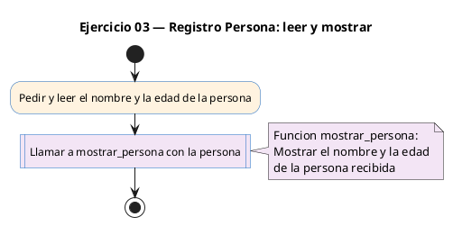
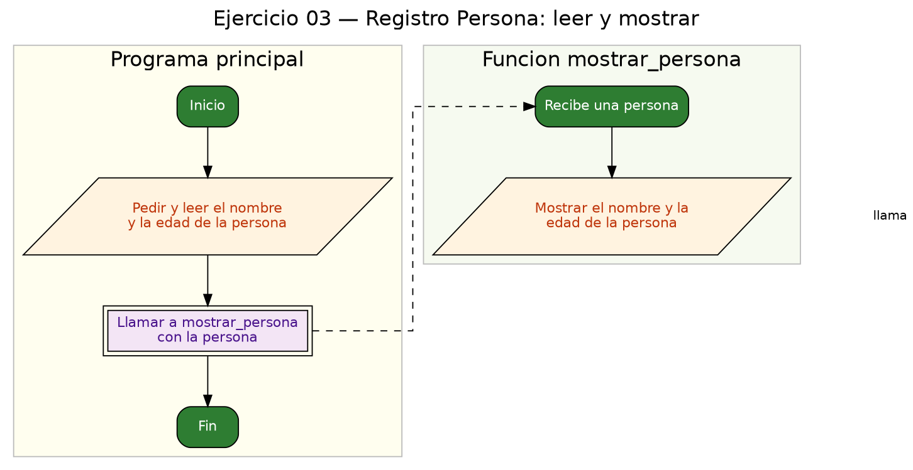

<!-- FICHERO GENERADO — NO EDITAR. Fuente de verdad: curso-c/practica/08-structs/ej03.md (se regenera con gen_course.py). -->

# Ejercicio 03 — Define Persona {nombre[50], edad}, lee datos del usuario e imprímelos…

Dificultad: verde · Módulo 08 (Structs)

## Enunciado

Define Persona {nombre[50], edad}, lee datos del usuario e imprímelos con una función.

## Diagramas de flujo





## Cómo se resuelve

<!-- EXPLICACION -->
Aquí el struct mezcla tipos distintos: un texto y un número. `Persona` tiene `char nombre[50]` (un array de caracteres para la cadena) y `int edad`. Esa es la gracia de los structs frente a los arrays: un array guarda muchos valores del mismo tipo, un struct junta campos de tipos diferentes.

La función `void mostrar_persona(Persona p)` recibe la persona por valor y solo la imprime con `printf("Nombre: %s, Edad: %d\n", p.nombre, p.edad)`. `%s` para la cadena, `%d` para el entero.

La clave está en el `scanf`:

```c
scanf("%49s %d", p.nombre, &p.edad);
```

- `p.nombre` es un **array**, y el nombre de un array ya es su dirección en memoria, así que **NO lleva `&`**.
- `p.edad` es un `int` normal, así que **sí lleva `&`**.
- El `49` en `%49s` limita la lectura a 49 caracteres para dejar sitio al terminador `'\0'` y no desbordar el array de 50.

Trampa habitual: poner `&` delante del array (`&p.nombre`). Es el error más típico con strings dentro de structs. Regla: array sin `&`, campo simple (`int`, `float`, `double`) con `&`. Y recuerda que a un campo `char[]` no puedes asignarle texto con `=` (`p.nombre = "Ana"` no compila); se rellena leyéndolo o con `strcpy`.

## Para practicar — cópialo y complétalo

Pega este esqueleto y completa los `TODO`. Es la mejor forma de aprender: inténtalo antes de mirar la solución.

```c
/*
 * Curso de C — Modulo 08: Structs
 * Ejercicio 03 — PRACTICA (rellena los TODO)
 * Enunciado: Define Persona {nombre[50], edad}, lee datos del usuario e imprímelos con una función.
 * Dificultad: verde
 * Compilar: gcc -std=c11 -Wall ej03_practica.c -o ej03 && ./ej03
 */

#include <stdio.h>

// TODO 1: Define typedef struct Persona con:
//         - campo char nombre[50]
//         - campo int  edad

// TODO 2: Escribe la funcion void mostrar_persona(Persona p) que imprime:
//         "Nombre: <nombre>, Edad: <edad>\n"

int main(void) {
    // TODO 3: Declara una variable p de tipo Persona.

    // TODO 4: Pide al usuario "Introduce nombre y edad: " y lee con scanf.
    //         CUIDADO: nombre es un array, no lleva & en scanf.
    //         edad si es un int, necesita &.

    // TODO 5: Llama a mostrar_persona(p).

    return 0;
}
```

## Solución — cópiala y ejecútala

```c
/*
 * Curso de C — Modulo 08: Structs
 * Ejercicio 03 — MODELO (resuelto)
 * Enunciado: Define Persona {nombre[50], edad}, lee datos del usuario e imprímelos con una función.
 * Dificultad: verde
 * Compilar: gcc -std=c11 -Wall ej03_modelo.c -o ej03 && ./ej03
 */

#include <stdio.h>

typedef struct {
    char nombre[50];
    int  edad;
} Persona;

// Recibe Persona por valor; solo la muestra, no la modifica
void mostrar_persona(Persona p) {
    printf("Nombre: %s, Edad: %d\n", p.nombre, p.edad);
}

int main(void) {
    Persona p;

    printf("Introduce nombre y edad (ej: Ana 28): ");
    // nombre es un array: NO lleva & en scanf
    scanf("%49s %d", p.nombre, &p.edad);

    mostrar_persona(p);

    return 0;
}
```

## Cómo usarlo

Pega el código en un fichero y ejecútalo con tu toolchain habitual (o el botón de Ejecutar de tu editor). Antes de mirar la solución, intenta completar tú el esqueleto: es la mejor forma de aprender.

## Conexiones

- [[Curso_C/modelo/08-structs|Teoría del módulo]]
- [[Curso_C/practica/00_README|Índice del curso]]
