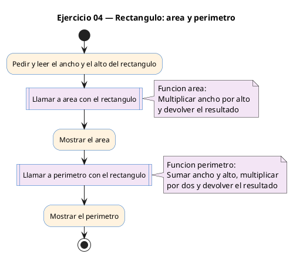
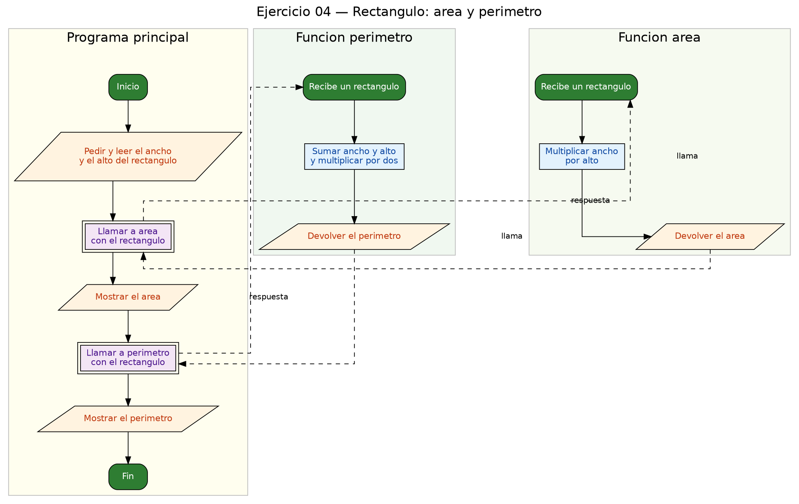

<!-- FICHERO GENERADO — NO EDITAR. Fuente de verdad: curso-c/practica/08-structs/ej04.md (se regenera con gen_course.py). -->

# Ejercicio 04 — Define Rectangulo {ancho, alto}, calcula área y perímetro con…

Dificultad: amarillo · Módulo 08 (Structs)

## Enunciado

Define Rectangulo {ancho, alto}, calcula área y perímetro con funciones separadas.

## Diagramas de flujo





## Cómo se resuelve

<!-- EXPLICACION -->
`Rectangulo` es un struct con dos campos `double`: `ancho` y `alto`. La idea nueva es tener **dos funciones separadas** que operan sobre el mismo tipo, cada una con su responsabilidad:

```c
double area(Rectangulo r)      { return r.ancho * r.alto; }
double perimetro(Rectangulo r) { return 2.0 * (r.ancho + r.alto); }
```

Ambas reciben el rectángulo por valor (una copia) y devuelven un `double`. Dentro acceden a los campos con el punto (`r.ancho`, `r.alto`). Separar el cálculo en funciones hace el `main` más limpio: solo lee los datos y llama a `area(rect)` y `perimetro(rect)`.

En `main` se leen los dos campos con `scanf("%lf %lf", &rect.ancho, &rect.alto)` (con `&` porque son campos que rellenamos, y `%lf` por ser `double`), y se imprimen los resultados con `%.2f`.

Trampa habitual: mezclar los formatos de `double`. Al **leer** con `scanf` se usa `%lf`; al **imprimir** con `printf` se usa `%f` (o `%.2f`). Confundirlos es un fallo silencioso que da números erróneos sin avisar.

## Para practicar — cópialo y complétalo

Pega este esqueleto y completa los `TODO`. Es la mejor forma de aprender: inténtalo antes de mirar la solución.

```c
/*
 * Curso de C — Modulo 08: Structs
 * Ejercicio 04 — PRACTICA (rellena los TODO)
 * Enunciado: Define Rectangulo {ancho, alto}, calcula área y perímetro con funciones separadas.
 * Dificultad: amarillo
 * Compilar: gcc -std=c11 -Wall ej04_practica.c -o ej04 && ./ej04
 */

#include <stdio.h>

// TODO 1: Define typedef struct Rectangulo con campos double ancho y double alto.

// TODO 2: Escribe la funcion double area(Rectangulo r).
//         Devuelve ancho * alto.

// TODO 3: Escribe la funcion double perimetro(Rectangulo r).
//         Devuelve 2 * (ancho + alto).

int main(void) {
    // TODO 4: Declara una variable rect de tipo Rectangulo.
    //         Lee ancho y alto del usuario con scanf (%lf para double).

    // TODO 5: Imprime el area con formato "Area: xx.xx\n".
    //         Imprime el perimetro con formato "Perimetro: xx.xx\n".

    return 0;
}
```

## Solución — cópiala y ejecútala

```c
/*
 * Curso de C — Modulo 08: Structs
 * Ejercicio 04 — MODELO (resuelto)
 * Enunciado: Define Rectangulo {ancho, alto}, calcula área y perímetro con funciones separadas.
 * Dificultad: amarillo
 * Compilar: gcc -std=c11 -Wall ej04_modelo.c -o ej04 && ./ej04
 */

#include <stdio.h>

typedef struct {
    double ancho;
    double alto;
} Rectangulo;

double area(Rectangulo r) {
    return r.ancho * r.alto;
}

double perimetro(Rectangulo r) {
    return 2.0 * (r.ancho + r.alto);
}

int main(void) {
    Rectangulo rect;

    printf("Introduce ancho y alto: ");
    scanf("%lf %lf", &rect.ancho, &rect.alto);

    printf("Area: %.2f\n", area(rect));
    printf("Perimetro: %.2f\n", perimetro(rect));

    return 0;
}
```

## Cómo usarlo

Pega el código en un fichero y ejecútalo con tu toolchain habitual (o el botón de Ejecutar de tu editor). Antes de mirar la solución, intenta completar tú el esqueleto: es la mejor forma de aprender.

## Conexiones

- [[Curso_C/modelo/08-structs|Teoría del módulo]]
- [[Curso_C/practica/00_README|Índice del curso]]
