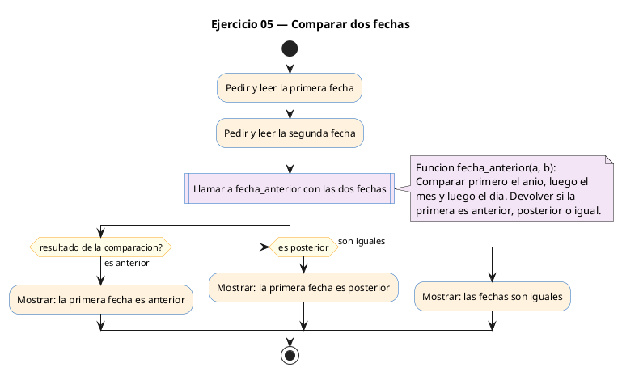
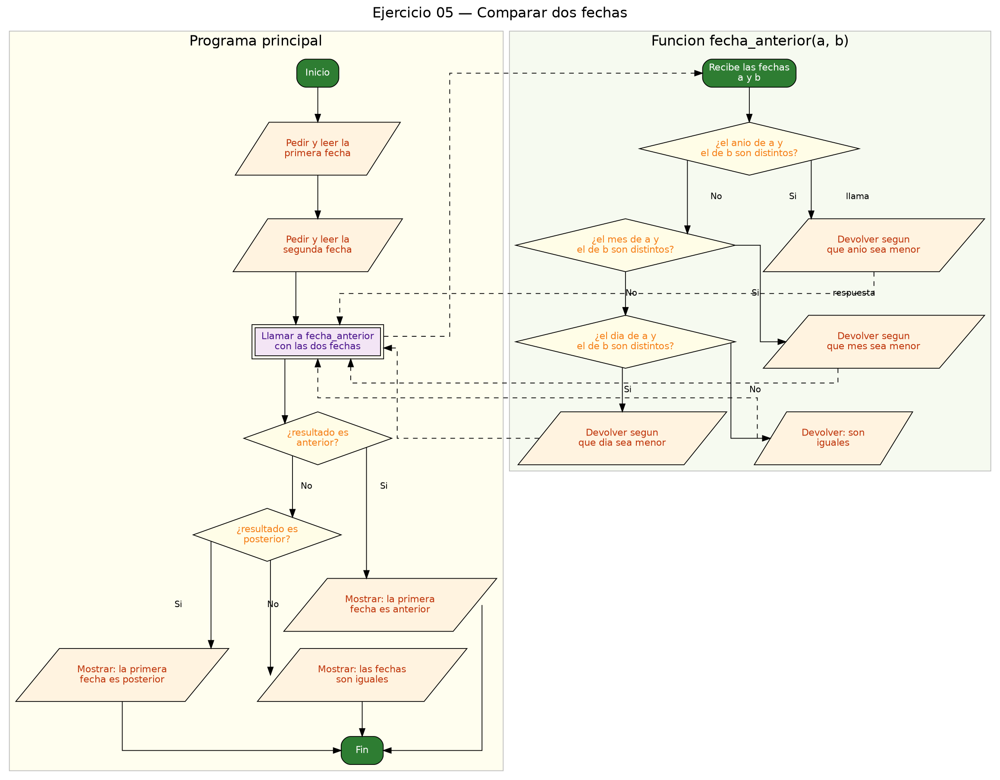

<!-- FICHERO GENERADO — NO EDITAR. Fuente de verdad: curso-c/practica/08-structs/ej05.md (se regenera con gen_course.py). -->

# Ejercicio 05 — Define Fecha {dia, mes, anio} y compara dos fechas indicando cuál es…

Dificultad: amarillo · Módulo 08 (Structs)

## Enunciado

Define Fecha {dia, mes, anio} y compara dos fechas indicando cuál es anterior.

## Diagramas de flujo





## Cómo se resuelve

<!-- EXPLICACION -->
`Fecha` agrupa tres enteros: `dia`, `mes`, `anio`. Lo interesante es cómo se comparan dos fechas, porque no basta con mirar un campo: hay que ir del más significativo al menos significativo.

La función `int fecha_anterior(Fecha a, Fecha b)` compara **primero el año, luego el mes, y solo si empatan, el día**, y devuelve un código: `-1` si `a` es anterior, `1` si es posterior, `0` si son iguales.

```c
if (a.anio != b.anio) return (a.anio < b.anio) ? -1 : 1;
if (a.mes  != b.mes)  return (a.mes  < b.mes)  ? -1 : 1;
if (a.dia  != b.dia)  return (a.dia  < b.dia)  ? -1 : 1;
return 0;
```

El operador ternario `condicion ? valor_si : valor_no` es un `if/else` compacto que devuelve un valor. En cuanto un campo difiere, se decide y se sale con `return`; si nunca difieren, las fechas son iguales. En `main` se traduce ese `-1/0/1` a un mensaje con `if/else if/else`.

Trampa habitual: intentar comparar los structs directamente con `if (a == b)`. En C eso no compila (o no hace lo que crees): el `==` no compara struct campo a campo. Siempre necesitas una función que recorra los campos uno a uno, como esta.

## Para practicar — cópialo y complétalo

Pega este esqueleto y completa los `TODO`. Es la mejor forma de aprender: inténtalo antes de mirar la solución.

```c
/*
 * Curso de C — Modulo 08: Structs
 * Ejercicio 05 — PRACTICA (rellena los TODO)
 * Enunciado: Define Fecha {dia, mes, anio} y compara dos fechas indicando cuál es anterior.
 * Dificultad: amarillo
 * Stdin: 15 6 2024\n1 1 2025
 * Compilar: gcc -std=c11 -Wall ej05_practica.c -o ej05 && ./ej05
 */

#include <stdio.h>

// TODO 1: Define typedef struct Fecha con tres campos int: dia, mes, anio.

// TODO 2: Escribe int fecha_anterior(Fecha a, Fecha b).
//         Logica: compara anio primero. Si son iguales, compara mes. Si son iguales, compara dia.
//         Devuelve -1 si a es anterior, 1 si a es posterior, 0 si son iguales.
//         Pista: usa if anidados o el operador ternario (condicion ? valor_si : valor_no).

int main(void) {
    // TODO 3: Declara f1 y f2 de tipo Fecha.
    //         Leelas con scanf("%d %d %d", &f1.dia, &f1.mes, &f1.anio).

    // TODO 4: Llama a fecha_anterior(f1, f2) y guarda el resultado en una variable int.

    // TODO 5: Con if/else if/else imprime:
    //         -1 -> "La primera fecha es anterior.\n"
    //          1 -> "La primera fecha es posterior.\n"
    //          0 -> "Las fechas son iguales.\n"

    return 0;
}
```

## Solución — cópiala y ejecútala

```c
/*
 * Curso de C — Modulo 08: Structs
 * Ejercicio 05 — MODELO (resuelto)
 * Enunciado: Define Fecha {dia, mes, anio} y compara dos fechas indicando cuál es anterior.
 * Dificultad: amarillo
 * Stdin: 15 6 2024\n1 1 2025
 * Compilar: gcc -std=c11 -Wall ej05_modelo.c -o ej05 && ./ej05
 */

#include <stdio.h>

typedef struct {
    int dia;
    int mes;
    int anio;
} Fecha;

/*
 * Devuelve:
 *  -1 si a es anterior a b
 *   0 si son iguales
 *   1 si a es posterior a b
 */
int fecha_anterior(Fecha a, Fecha b) {
    // Comparar anio primero, luego mes, luego dia
    if (a.anio != b.anio) return (a.anio < b.anio) ? -1 : 1;
    if (a.mes  != b.mes)  return (a.mes  < b.mes)  ? -1 : 1;
    if (a.dia  != b.dia)  return (a.dia  < b.dia)  ? -1 : 1;
    return 0;
}

int main(void) {
    Fecha f1, f2;

    printf("Introduce fecha 1 (dia mes anio): ");
    scanf("%d %d %d", &f1.dia, &f1.mes, &f1.anio);

    printf("Introduce fecha 2 (dia mes anio): ");
    scanf("%d %d %d", &f2.dia, &f2.mes, &f2.anio);

    int resultado = fecha_anterior(f1, f2);

    if (resultado == -1) {
        printf("La primera fecha es anterior.\n");
    } else if (resultado == 1) {
        printf("La primera fecha es posterior.\n");
    } else {
        printf("Las fechas son iguales.\n");
    }

    return 0;
}
```

## Ejecútalo en el navegador

[▶ Abrir y ejecutar en Compiler Explorer](https://godbolt.org/clientstate/eyJzZXNzaW9ucyI6W3siaWQiOjEsImxhbmd1YWdlIjoiYyIsInNvdXJjZSI6Ii8qXG4gKiBDdXJzbyBkZSBDIFx1MjAxNCBNb2R1bG8gMDg6IFN0cnVjdHNcbiAqIEVqZXJjaWNpbyAwNSBcdTIwMTQgTU9ERUxPIChyZXN1ZWx0bylcbiAqIEVudW5jaWFkbzogRGVmaW5lIEZlY2hhIHtkaWEsIG1lcywgYW5pb30geSBjb21wYXJhIGRvcyBmZWNoYXMgaW5kaWNhbmRvIGN1XHUwMGUxbCBlcyBhbnRlcmlvci5cbiAqIERpZmljdWx0YWQ6IGFtYXJpbGxvXG4gKiBTdGRpbjogMTUgNiAyMDI0XFxuMSAxIDIwMjVcbiAqIENvbXBpbGFyOiBnY2MgLXN0ZD1jMTEgLVdhbGwgZWowNV9tb2RlbG8uYyAtbyBlajA1ICYmIC4vZWowNVxuICovXG5cbiNpbmNsdWRlIDxzdGRpby5oPlxuXG50eXBlZGVmIHN0cnVjdCB7XG4gICAgaW50IGRpYTtcbiAgICBpbnQgbWVzO1xuICAgIGludCBhbmlvO1xufSBGZWNoYTtcblxuLypcbiAqIERldnVlbHZlOlxuICogIC0xIHNpIGEgZXMgYW50ZXJpb3IgYSBiXG4gKiAgIDAgc2kgc29uIGlndWFsZXNcbiAqICAgMSBzaSBhIGVzIHBvc3RlcmlvciBhIGJcbiAqL1xuaW50IGZlY2hhX2FudGVyaW9yKEZlY2hhIGEsIEZlY2hhIGIpIHtcbiAgICAvLyBDb21wYXJhciBhbmlvIHByaW1lcm8sIGx1ZWdvIG1lcywgbHVlZ28gZGlhXG4gICAgaWYgKGEuYW5pbyAhPSBiLmFuaW8pIHJldHVybiAoYS5hbmlvIDwgYi5hbmlvKSA%2FIC0xIDogMTtcbiAgICBpZiAoYS5tZXMgICE9IGIubWVzKSAgcmV0dXJuIChhLm1lcyAgPCBiLm1lcykgID8gLTEgOiAxO1xuICAgIGlmIChhLmRpYSAgIT0gYi5kaWEpICByZXR1cm4gKGEuZGlhICA8IGIuZGlhKSAgPyAtMSA6IDE7XG4gICAgcmV0dXJuIDA7XG59XG5cbmludCBtYWluKHZvaWQpIHtcbiAgICBGZWNoYSBmMSwgZjI7XG5cbiAgICBwcmludGYoXCJJbnRyb2R1Y2UgZmVjaGEgMSAoZGlhIG1lcyBhbmlvKTogXCIpO1xuICAgIHNjYW5mKFwiJWQgJWQgJWRcIiwgJmYxLmRpYSwgJmYxLm1lcywgJmYxLmFuaW8pO1xuXG4gICAgcHJpbnRmKFwiSW50cm9kdWNlIGZlY2hhIDIgKGRpYSBtZXMgYW5pbyk6IFwiKTtcbiAgICBzY2FuZihcIiVkICVkICVkXCIsICZmMi5kaWEsICZmMi5tZXMsICZmMi5hbmlvKTtcblxuICAgIGludCByZXN1bHRhZG8gPSBmZWNoYV9hbnRlcmlvcihmMSwgZjIpO1xuXG4gICAgaWYgKHJlc3VsdGFkbyA9PSAtMSkge1xuICAgICAgICBwcmludGYoXCJMYSBwcmltZXJhIGZlY2hhIGVzIGFudGVyaW9yLlxcblwiKTtcbiAgICB9IGVsc2UgaWYgKHJlc3VsdGFkbyA9PSAxKSB7XG4gICAgICAgIHByaW50ZihcIkxhIHByaW1lcmEgZmVjaGEgZXMgcG9zdGVyaW9yLlxcblwiKTtcbiAgICB9IGVsc2Uge1xuICAgICAgICBwcmludGYoXCJMYXMgZmVjaGFzIHNvbiBpZ3VhbGVzLlxcblwiKTtcbiAgICB9XG5cbiAgICByZXR1cm4gMDtcbn1cbiIsImNvbXBpbGVycyI6W10sImV4ZWN1dG9ycyI6W3siYXJndW1lbnRzIjoiIiwiY29tcGlsZXIiOnsiaWQiOiJjZzE0MyIsImxpYnMiOltdLCJvcHRpb25zIjoiLXN0ZD1jMTEgLWxtIn0sInN0ZGluIjoiMTUgNiAyMDI0XG4xIDEgMjAyNSIsIndyYXAiOmZhbHNlfV19XX0%3D)

Se abre con la solución ya cargada; pulsa el botón de ejecutar (Run) para ver la salida. No hay que instalar nada.

## Cómo usarlo

Pega el código en un fichero y ejecútalo con tu toolchain habitual (o el botón de Ejecutar de tu editor). Antes de mirar la solución, intenta completar tú el esqueleto: es la mejor forma de aprender.

## Conexiones

- [[Curso_C/modelo/08-structs|Teoría del módulo]]
- [[Curso_C/practica/00_README|Índice del curso]]
