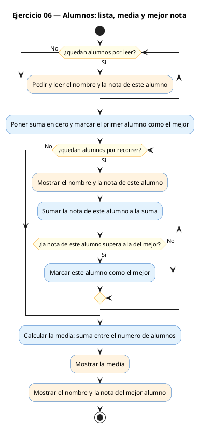
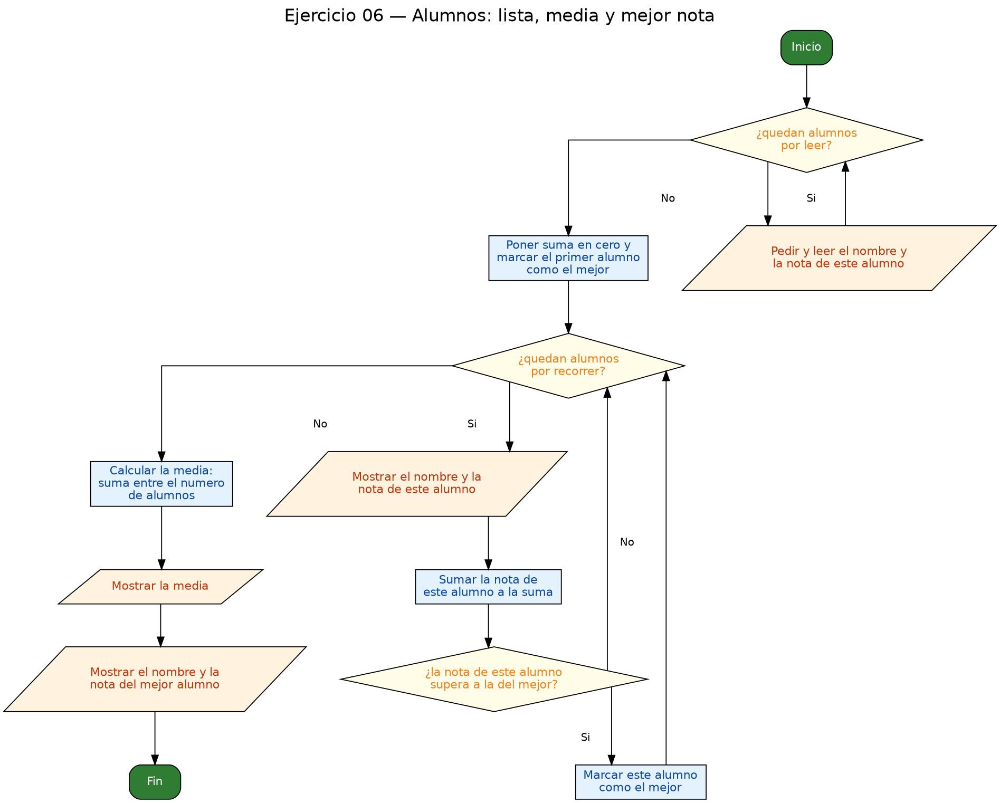

<!-- FICHERO GENERADO — NO EDITAR. Fuente de verdad: curso-c/practica/08-structs/ej06.md (se regenera con gen_course.py). -->

# Ejercicio 06 — Array de 4 Alumno {nombre, nota}, muestra lista, calcula media e…

Dificultad: amarillo · Módulo 08 (Structs)

## Enunciado

Array de 4 Alumno {nombre, nota}, muestra lista, calcula media e indica el mejor.

## Diagramas de flujo





## Cómo se resuelve

<!-- EXPLICACION -->
Aquí combinamos structs con arrays: `Alumno grupo[N]` es un **array de structs**, una tabla donde cada fila tiene `nombre` y `nota`. Para acceder a un campo de un elemento se pone primero el índice y luego el punto: `grupo[i].nota`, `grupo[i].nombre`.

El programa hace dos recorridos con `for`:

1. **Leer** los N alumnos. Dentro del bucle: `scanf("%49s %f", grupo[i].nombre, &grupo[i].nota)`. Fíjate en el patrón de siempre: `nombre` es array (sin `&`), `nota` es `float` (con `&`).
2. **Mostrar y calcular** a la vez. En la misma pasada se imprime cada alumno, se acumula la suma de notas y se guarda el índice del mejor:

```c
suma += grupo[i].nota;
if (grupo[i].nota > grupo[mejor].nota) {
    mejor = i;
}
```

La técnica del "mejor" es un clásico: empiezas suponiendo que el mejor es el `0` y, cada vez que encuentras uno con nota más alta, actualizas el índice. Al final `grupo[mejor]` es el alumno con más nota. La media es `suma / N`. En el `printf` de la lista, `%-8s` alinea el nombre a la izquierda en 8 columnas para que la tabla quede ordenada.

Trampa habitual: guardar el struct entero del mejor en una variable aparte en vez de solo su índice. Guardar el índice `mejor` es más simple y evita copias; con él llegas a cualquier campo (`grupo[mejor].nombre`, `grupo[mejor].nota`).

## Para practicar — cópialo y complétalo

Pega este esqueleto y completa los `TODO`. Es la mejor forma de aprender: inténtalo antes de mirar la solución.

```c
/*
 * Curso de C — Modulo 08: Structs
 * Ejercicio 06 — PRACTICA (rellena los TODO)
 * Enunciado: Array de 4 Alumno {nombre, nota}, muestra lista, calcula media e indica el mejor.
 * Dificultad: amarillo
 * Stdin: Ana 8.5\nLuis 6.0\nMar 9.2\nPau 7.4
 * Compilar: gcc -std=c11 -Wall ej06_practica.c -o ej06 && ./ej06
 */

#include <stdio.h>

#define N 4

// TODO 1: Define typedef struct Alumno con char nombre[50] y float nota.

int main(void) {
    // TODO 2: Declara un array grupo de N elementos de tipo Alumno.

    // TODO 3: Bucle for de 0 a N-1.
    //         En cada iteracion, pide "Alumno i (nombre nota): " y lee con scanf.
    //         CUIDADO: nombre es array (sin &), nota es float (con &, usa %f).

    // TODO 4: Imprime el encabezado "Lista de alumnos:\n".
    //         Bucle para mostrar cada alumno con formato "  %-8s: %.2f\n".
    //         A la vez, acumula la suma de notas en una variable float.
    //         Y lleva un indice 'mejor' del alumno con nota mas alta (inicia en 0,
    //         actualiza si grupo[i].nota > grupo[mejor].nota).

    // TODO 5: Imprime la media: suma / N (con formato "Media: %.2f\n").

    // TODO 6: Imprime "Mejor nota: <nombre> (<nota>)\n" usando el indice 'mejor'.

    return 0;
}
```

## Solución — cópiala y ejecútala

```c
/*
 * Curso de C — Modulo 08: Structs
 * Ejercicio 06 — MODELO (resuelto)
 * Enunciado: Array de 4 Alumno {nombre, nota}, muestra lista, calcula media e indica el mejor.
 * Dificultad: amarillo
 * Stdin: Ana 8.5\nLuis 6.0\nMar 9.2\nPau 7.4
 * Compilar: gcc -std=c11 -Wall ej06_modelo.c -o ej06 && ./ej06
 */

#include <stdio.h>

#define N 4

typedef struct {
    char  nombre[50];
    float nota;
} Alumno;

int main(void) {
    Alumno grupo[N];

    // Leer los N alumnos
    for (int i = 0; i < N; i++) {
        printf("Alumno %d (nombre nota): ", i + 1);
        scanf("%49s %f", grupo[i].nombre, &grupo[i].nota);
    }

    // Mostrar lista y calcular media
    printf("\nLista de alumnos:\n");
    float suma = 0.0f;
    int   mejor = 0;

    for (int i = 0; i < N; i++) {
        printf("  %-8s: %.2f\n", grupo[i].nombre, grupo[i].nota);
        suma += grupo[i].nota;
        if (grupo[i].nota > grupo[mejor].nota) {
            mejor = i;
        }
    }

    printf("Media: %.2f\n", suma / N);
    printf("Mejor nota: %s (%.2f)\n", grupo[mejor].nombre, grupo[mejor].nota);

    return 0;
}
```

## Ejecútalo en el navegador

[▶ Abrir y ejecutar en Compiler Explorer](https://godbolt.org/clientstate/eyJzZXNzaW9ucyI6W3siaWQiOjEsImxhbmd1YWdlIjoiYyIsInNvdXJjZSI6Ii8qXG4gKiBDdXJzbyBkZSBDIFx1MjAxNCBNb2R1bG8gMDg6IFN0cnVjdHNcbiAqIEVqZXJjaWNpbyAwNiBcdTIwMTQgTU9ERUxPIChyZXN1ZWx0bylcbiAqIEVudW5jaWFkbzogQXJyYXkgZGUgNCBBbHVtbm8ge25vbWJyZSwgbm90YX0sIG11ZXN0cmEgbGlzdGEsIGNhbGN1bGEgbWVkaWEgZSBpbmRpY2EgZWwgbWVqb3IuXG4gKiBEaWZpY3VsdGFkOiBhbWFyaWxsb1xuICogU3RkaW46IEFuYSA4LjVcXG5MdWlzIDYuMFxcbk1hciA5LjJcXG5QYXUgNy40XG4gKiBDb21waWxhcjogZ2NjIC1zdGQ9YzExIC1XYWxsIGVqMDZfbW9kZWxvLmMgLW8gZWowNiAmJiAuL2VqMDZcbiAqL1xuXG4jaW5jbHVkZSA8c3RkaW8uaD5cblxuI2RlZmluZSBOIDRcblxudHlwZWRlZiBzdHJ1Y3Qge1xuICAgIGNoYXIgIG5vbWJyZVs1MF07XG4gICAgZmxvYXQgbm90YTtcbn0gQWx1bW5vO1xuXG5pbnQgbWFpbih2b2lkKSB7XG4gICAgQWx1bW5vIGdydXBvW05dO1xuXG4gICAgLy8gTGVlciBsb3MgTiBhbHVtbm9zXG4gICAgZm9yIChpbnQgaSA9IDA7IGkgPCBOOyBpKyspIHtcbiAgICAgICAgcHJpbnRmKFwiQWx1bW5vICVkIChub21icmUgbm90YSk6IFwiLCBpICsgMSk7XG4gICAgICAgIHNjYW5mKFwiJTQ5cyAlZlwiLCBncnVwb1tpXS5ub21icmUsICZncnVwb1tpXS5ub3RhKTtcbiAgICB9XG5cbiAgICAvLyBNb3N0cmFyIGxpc3RhIHkgY2FsY3VsYXIgbWVkaWFcbiAgICBwcmludGYoXCJcXG5MaXN0YSBkZSBhbHVtbm9zOlxcblwiKTtcbiAgICBmbG9hdCBzdW1hID0gMC4wZjtcbiAgICBpbnQgICBtZWpvciA9IDA7XG5cbiAgICBmb3IgKGludCBpID0gMDsgaSA8IE47IGkrKykge1xuICAgICAgICBwcmludGYoXCIgICUtOHM6ICUuMmZcXG5cIiwgZ3J1cG9baV0ubm9tYnJlLCBncnVwb1tpXS5ub3RhKTtcbiAgICAgICAgc3VtYSArPSBncnVwb1tpXS5ub3RhO1xuICAgICAgICBpZiAoZ3J1cG9baV0ubm90YSA%2BIGdydXBvW21lam9yXS5ub3RhKSB7XG4gICAgICAgICAgICBtZWpvciA9IGk7XG4gICAgICAgIH1cbiAgICB9XG5cbiAgICBwcmludGYoXCJNZWRpYTogJS4yZlxcblwiLCBzdW1hIC8gTik7XG4gICAgcHJpbnRmKFwiTWVqb3Igbm90YTogJXMgKCUuMmYpXFxuXCIsIGdydXBvW21lam9yXS5ub21icmUsIGdydXBvW21lam9yXS5ub3RhKTtcblxuICAgIHJldHVybiAwO1xufVxuIiwiY29tcGlsZXJzIjpbXSwiZXhlY3V0b3JzIjpbeyJhcmd1bWVudHMiOiIiLCJjb21waWxlciI6eyJpZCI6ImNnMTQzIiwibGlicyI6W10sIm9wdGlvbnMiOiItc3RkPWMxMSAtbG0ifSwic3RkaW4iOiJBbmEgOC41XG5MdWlzIDYuMFxuTWFyIDkuMlxuUGF1IDcuNCIsIndyYXAiOmZhbHNlfV19XX0%3D)

Se abre con la solución ya cargada; pulsa el botón de ejecutar (Run) para ver la salida. No hay que instalar nada.

## Cómo usarlo

Pega el código en un fichero y ejecútalo con tu toolchain habitual (o el botón de Ejecutar de tu editor). Antes de mirar la solución, intenta completar tú el esqueleto: es la mejor forma de aprender.

## Conexiones

- [[Curso_C/modelo/08-structs|Teoría del módulo]]
- [[Curso_C/practica/00_README|Índice del curso]]
