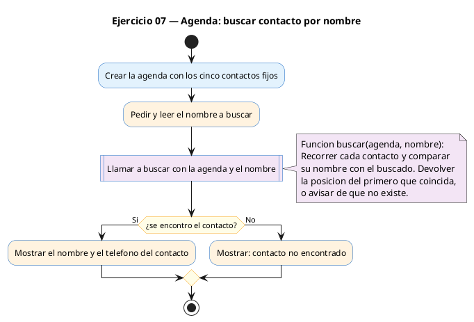

# Ejercicio 07 — Agenda de 5 contactos hardcodeados

Dificultad: rojo · Módulo 08 (Structs)

## Enunciado

Agenda de 5 contactos hardcodeados; funcion de busqueda por nombre.

## Diagrama de flujo



## Cómo se resuelve

<!-- EXPLICACION -->
Una agenda es un array de structs `Contacto`, cada uno con dos cadenas: `nombre[50]` y `telefono[20]`. Aquí los datos no se piden al usuario, sino que se **hardcodean** con un inicializador de llaves anidado, un par de llaves por contacto:

```c
Contacto agenda[N] = {
    {"Ana",    "600111222"},
    {"Carlos", "611333444"},
    ...
};
```

La función de búsqueda es el corazón del ejercicio:

```c
int buscar(Contacto agenda[], int n, char *nombre) {
    for (int i = 0; i < n; i++) {
        if (strcmp(agenda[i].nombre, nombre) == 0) {
            return i;
        }
    }
    return -1;
}
```

Recorre el array y, en cada vuelta, compara el nombre del contacto con el buscado usando `strcmp` de `<string.h>`. `strcmp` devuelve `0` cuando las dos cadenas son **iguales**, así que la condición correcta es `== 0`. Si encuentra coincidencia devuelve el índice; si el bucle termina sin éxito, devuelve `-1` como señal de "no encontrado". Ese `-1` es un patrón muy común en C para indicar ausencia. En `main` se comprueba con `if (idx != -1)` para decidir qué imprimir.

Trampa habitual: comparar cadenas con `==` (`agenda[i].nombre == nombre`). Eso compara **direcciones de memoria**, no el texto, y casi nunca da lo que esperas. Para comparar el contenido de dos strings en C **siempre** se usa `strcmp`.

## Para practicar — cópialo en Dev-C++

Pega este esqueleto y completa los `TODO`. Es la mejor forma de aprender: inténtalo antes de mirar la solución.

```c
/*
 * Curso de C — Modulo 08: Structs
 * Ejercicio 07 — PRACTICA (rellena los TODO)
 * Enunciado: Agenda de 5 contactos hardcodeados; funcion de busqueda por nombre.
 * Dificultad: rojo
 * Compilar: gcc -std=c11 -Wall ej07_practica.c -o ej07 && ./ej07
 */

#include <stdio.h>
#include <string.h>   // para strcmp

#define N 5

// TODO 1: Define typedef struct Contacto con char nombre[50] y char telefono[20].

// TODO 2: Escribe int buscar(Contacto agenda[], int n, char *nombre).
//         Recorre el array con un for.
//         En cada iteracion usa strcmp(agenda[i].nombre, nombre) == 0 para comparar.
//         Si encuentra coincidencia, devuelve i.
//         Si el bucle termina sin encontrar, devuelve -1.

int main(void) {
    // TODO 3: Declara Contacto agenda[N] e inicializa con 5 contactos usando llaves:
    //         { {"Ana","600111222"}, {"Carlos","611333444"}, ... }
    //         Incluye "Elena" con telefono "612345678" para poder probar la busqueda.

    char busqueda[50];

    // TODO 4: Pide al usuario un nombre y leelo con scanf.

    // TODO 5: Llama a buscar(agenda, N, busqueda) y guarda el resultado en int idx.

    // TODO 6: Si idx != -1, imprime nombre y telefono del contacto encontrado.
    //         Si idx == -1, imprime "Contacto no encontrado.\n".

    return 0;
}
```

## Solución — cópiala y ejecútala

```c
/*
 * Curso de C — Modulo 08: Structs
 * Ejercicio 07 — MODELO (resuelto)
 * Enunciado: Agenda de 5 contactos hardcodeados; funcion de busqueda por nombre.
 * Dificultad: rojo
 * Compilar: gcc -std=c11 -Wall ej07_modelo.c -o ej07 && ./ej07
 */

#include <stdio.h>
#include <string.h>

#define N 5

typedef struct {
    char nombre[50];
    char telefono[20];
} Contacto;

/*
 * Busca en agenda[] de taman~o n el contacto con ese nombre.
 * Devuelve el indice si lo encuentra, -1 si no existe.
 */
int buscar(Contacto agenda[], int n, char *nombre) {
    for (int i = 0; i < n; i++) {
        // strcmp devuelve 0 si las cadenas son iguales
        if (strcmp(agenda[i].nombre, nombre) == 0) {
            return i;
        }
    }
    return -1;
}

int main(void) {
    // Inicializacion con inicializadores de llaves anidados
    Contacto agenda[N] = {
        {"Ana",    "600111222"},
        {"Carlos", "611333444"},
        {"Elena",  "612345678"},
        {"Marta",  "633555666"},
        {"Pedro",  "644777888"}
    };

    char busqueda[50];
    printf("Introduce un nombre a buscar: ");
    scanf("%49s", busqueda);

    int idx = buscar(agenda, N, busqueda);

    if (idx != -1) {
        printf("Nombre: %s\n", agenda[idx].nombre);
        printf("Telefono: %s\n", agenda[idx].telefono);
    } else {
        printf("Contacto no encontrado.\n");
    }

    return 0;
}
```

## Cómo usarlo

Dev-C++ (Windows): Archivo → Nuevo → Código fuente, pega el código y pulsa F11 (compilar y ejecutar). Si ves los acentos raros en la consola, escribe `chcp 65001` y vuelve a ejecutar.

## Conexiones

- [[Curso_C/modelo/08-structs|Teoría del módulo]]
- [[Curso_C/00_README|Índice del curso]]
