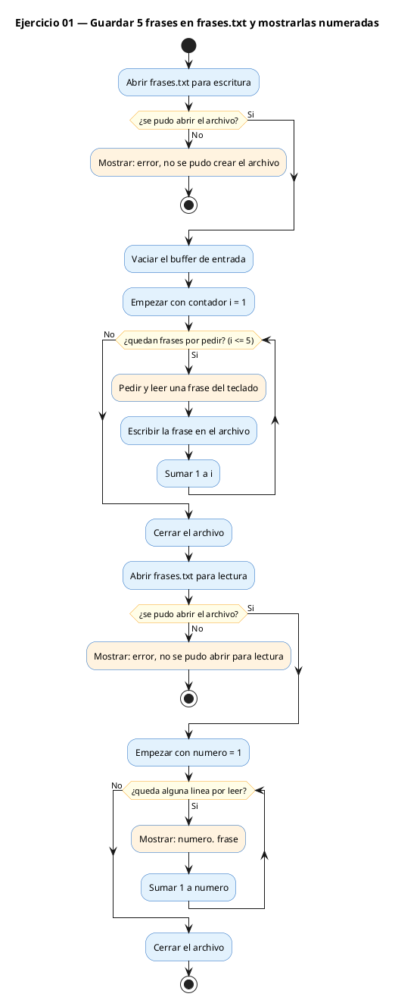
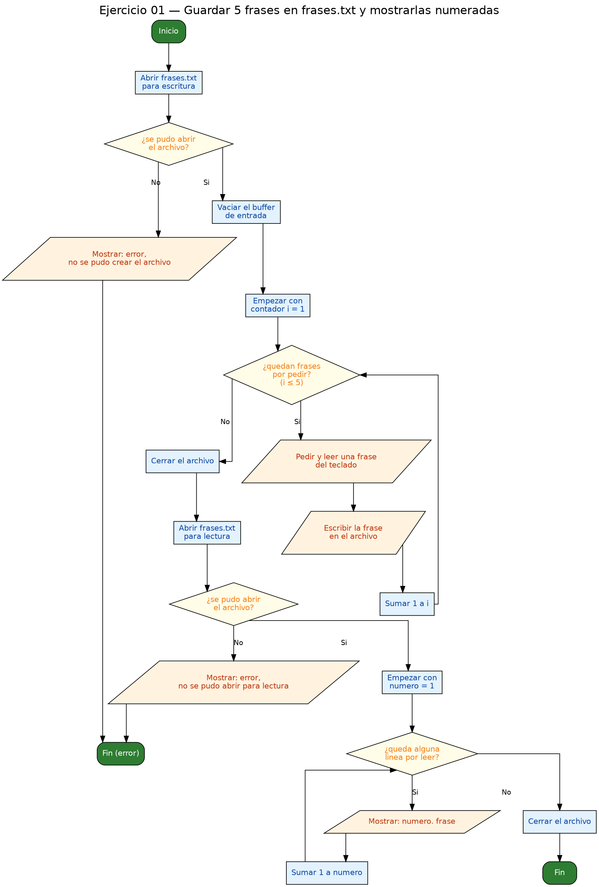

<!-- FICHERO GENERADO — NO EDITAR. Fuente de verdad: curso-c/practica/09-archivos/ej01.md (se regenera con gen_course.py). -->

# Ejercicio 01 — Pide 5 frases al usuario, guárdalas en frases.txt y muéstralas…

Dificultad: verde · Módulo 09 (Archivos)

## Enunciado

Pide 5 frases al usuario, guárdalas en frases.txt y muéstralas numeradas.

## Diagramas de flujo





## Cómo se resuelve

<!-- EXPLICACION -->
Este ejercicio hace el ciclo completo de un archivo: primero **escribe** y luego **lee** el mismo fichero. El patrón siempre es el mismo: abrir con `fopen`, comprobar, operar y cerrar con `fclose`.

1. `FILE *fw = fopen(ARCHIVO, "w")` abre `frases.txt` en modo `"w"` (write). Ese modo **crea el archivo si no existe y lo vacía si ya existía**, así que empiezas con la hoja en blanco. `fopen` devuelve un puntero `FILE *`, que es tu "mango" para operar sobre el fichero.
2. `if (fw == NULL)` es el paso que **nunca** debes saltarte. Si el disco está lleno o no tienes permisos, `fopen` devuelve `NULL`; si sigues usando ese puntero el programa revienta. Aquí, si falla, se avisa y se hace `return 1`.
3. Dentro del bucle, `fgets(frase, sizeof(frase), stdin)` lee una línea completa del teclado (a diferencia de `scanf("%s")`, sí admite espacios). Luego `fprintf(fw, "%s", frase)` la vuelca al archivo: es como `printf`, pero el primer argumento es el `FILE *` en vez de la pantalla. Como `fgets` conserva el `\n`, cada frase queda en su propia línea.
4. `fclose(fw)` es **obligatorio antes de releer**: cierra el archivo y vuelca a disco lo que estaba en el buffer. Sin este `fclose`, al abrirlo para leer podrías encontrarlo vacío.
5. Después se reabre en modo `"r"` (read) y con `while (fgets(...) != NULL)` se recorre línea a línea hasta el final (EOF, cuando `fgets` devuelve `NULL`). `frase[strcspn(frase, "\n")] = '\0'` borra el salto de línea para imprimir limpio y numerado.

Trampa típica: no comprobar el `NULL` de `fopen` y, sobre todo, **olvidar el `fclose` del archivo de escritura antes de abrirlo para leer**. Los datos se quedan en el buffer y parece que "no se ha guardado nada".

## Para practicar — cópialo y complétalo

Pega este esqueleto y completa los `TODO`. Es la mejor forma de aprender: inténtalo antes de mirar la solución.

```c
/*
  Curso de C — Modulo 09: Lectura y escritura de archivos
  Ejercicio 01 — PRACTICA (rellena los TODO)
  Enunciado: Pide 5 frases al usuario, guárdalas en frases.txt y muéstralas numeradas.
  Dificultad: verde
  Stdin: \nHola mundo\nAprendo C\nPunteros en C\nArchivos de texto\nHasta pronto
  Compilar: gcc -std=c11 -Wall ej01_practica.c -o ej01 && ./ej01
*/

#include <stdio.h>
#include <string.h>

#define NUM_FRASES 5
#define MAX_LEN    128
#define ARCHIVO    "frases.txt"

int main(void) {
    // TODO 1: Declara un puntero FILE * para escritura y abrelo con fopen en modo "w"
    //         Comprueba que no es NULL; si lo es, imprime un error y haz return 1

    char frase[MAX_LEN];
    printf("Escribe %d frases (Enter tras cada una):\n", NUM_FRASES);

    // TODO 2: Limpia el buffer de stdin antes de usar fgets
    //         (un bucle getchar hasta '\n' o EOF sirve)

    for (int i = 0; i < NUM_FRASES; i++) {
        printf("Frase %d: ", i + 1);
        // TODO 3: Lee la frase con fgets (guarda en 'frase', maximo MAX_LEN, desde stdin)
        // TODO 4: Escribe la frase en el archivo con fprintf (frase ya tiene el '\n')
    }

    // TODO 5: Cierra el archivo de escritura con fclose

    // TODO 6: Abre el mismo archivo en modo "r" para lectura
    //         Comprueba NULL de nuevo

    printf("\n--- Contenido de %s ---\n", ARCHIVO);
    int num = 1;
    // TODO 7: Bucle con fgets hasta EOF
    //         Dentro del bucle:
    //           a) Elimina el '\n' del final: frase[strcspn(frase, "\n")] = '\0';
    //           b) Imprime con numero de linea

    // TODO 8: Cierra el archivo de lectura

    return 0;
}
```

## Solución — cópiala y ejecútala

```c
/*
  Curso de C — Modulo 09: Lectura y escritura de archivos
  Ejercicio 01 — MODELO (resuelto)
  Enunciado: Pide 5 frases al usuario, guárdalas en frases.txt y muéstralas numeradas.
  Dificultad: verde
  Stdin: \nHola mundo\nAprendo C\nPunteros en C\nArchivos de texto\nHasta pronto
  Compilar: gcc -std=c11 -Wall ej01_modelo.c -o ej01 && ./ej01
*/

#include <stdio.h>
#include <string.h>

#define NUM_FRASES 5
#define MAX_LEN    128
#define ARCHIVO    "frases.txt"

int main(void) {
    // --- ESCRITURA ---
    FILE *fw = fopen(ARCHIVO, "w");
    if (fw == NULL) {
        printf("Error: no se pudo crear %s\n", ARCHIVO);
        return 1;
    }

    char frase[MAX_LEN];
    printf("Escribe %d frases (Enter tras cada una):\n", NUM_FRASES);
    // Limpiar el buffer de entrada antes de usar fgets
    int c;
    while ((c = getchar()) != '\n' && c != EOF); // vaciar stdin si hay residuos

    for (int i = 0; i < NUM_FRASES; i++) {
        printf("Frase %d: ", i + 1);
        fgets(frase, sizeof(frase), stdin);
        // fgets incluye '\n'; lo escribimos tal cual (ya tiene el salto)
        fprintf(fw, "%s", frase);
    }
    fclose(fw); // obligatorio antes de releer

    // --- LECTURA Y MUESTRA NUMERADA ---
    FILE *fr = fopen(ARCHIVO, "r");
    if (fr == NULL) {
        printf("Error: no se pudo abrir %s para lectura\n", ARCHIVO);
        return 1;
    }

    printf("\n--- Contenido de %s ---\n", ARCHIVO);
    int num = 1;
    while (fgets(frase, sizeof(frase), fr) != NULL) {
        // Quitar el '\n' final para mostrar limpio
        frase[strcspn(frase, "\n")] = '\0';
        printf("%d. %s\n", num++, frase);
    }
    fclose(fr);
    return 0;
}
```

## Ejecútalo en el navegador

[▶ Abrir y ejecutar en Compiler Explorer](https://godbolt.org/clientstate/eyJzZXNzaW9ucyI6W3siaWQiOjEsImxhbmd1YWdlIjoiYyIsInNvdXJjZSI6Ii8qXG4gIEN1cnNvIGRlIEMgXHUyMDE0IE1vZHVsbyAwOTogTGVjdHVyYSB5IGVzY3JpdHVyYSBkZSBhcmNoaXZvc1xuICBFamVyY2ljaW8gMDEgXHUyMDE0IE1PREVMTyAocmVzdWVsdG8pXG4gIEVudW5jaWFkbzogUGlkZSA1IGZyYXNlcyBhbCB1c3VhcmlvLCBndVx1MDBlMXJkYWxhcyBlbiBmcmFzZXMudHh0IHkgbXVcdTAwZTlzdHJhbGFzIG51bWVyYWRhcy5cbiAgRGlmaWN1bHRhZDogdmVyZGVcbiAgU3RkaW46IFxcbkhvbGEgbXVuZG9cXG5BcHJlbmRvIENcXG5QdW50ZXJvcyBlbiBDXFxuQXJjaGl2b3MgZGUgdGV4dG9cXG5IYXN0YSBwcm9udG9cbiAgQ29tcGlsYXI6IGdjYyAtc3RkPWMxMSAtV2FsbCBlajAxX21vZGVsby5jIC1vIGVqMDEgJiYgLi9lajAxXG4qL1xuXG4jaW5jbHVkZSA8c3RkaW8uaD5cbiNpbmNsdWRlIDxzdHJpbmcuaD5cblxuI2RlZmluZSBOVU1fRlJBU0VTIDVcbiNkZWZpbmUgTUFYX0xFTiAgICAxMjhcbiNkZWZpbmUgQVJDSElWTyAgICBcImZyYXNlcy50eHRcIlxuXG5pbnQgbWFpbih2b2lkKSB7XG4gICAgLy8gLS0tIEVTQ1JJVFVSQSAtLS1cbiAgICBGSUxFICpmdyA9IGZvcGVuKEFSQ0hJVk8sIFwid1wiKTtcbiAgICBpZiAoZncgPT0gTlVMTCkge1xuICAgICAgICBwcmludGYoXCJFcnJvcjogbm8gc2UgcHVkbyBjcmVhciAlc1xcblwiLCBBUkNISVZPKTtcbiAgICAgICAgcmV0dXJuIDE7XG4gICAgfVxuXG4gICAgY2hhciBmcmFzZVtNQVhfTEVOXTtcbiAgICBwcmludGYoXCJFc2NyaWJlICVkIGZyYXNlcyAoRW50ZXIgdHJhcyBjYWRhIHVuYSk6XFxuXCIsIE5VTV9GUkFTRVMpO1xuICAgIC8vIExpbXBpYXIgZWwgYnVmZmVyIGRlIGVudHJhZGEgYW50ZXMgZGUgdXNhciBmZ2V0c1xuICAgIGludCBjO1xuICAgIHdoaWxlICgoYyA9IGdldGNoYXIoKSkgIT0gJ1xcbicgJiYgYyAhPSBFT0YpOyAvLyB2YWNpYXIgc3RkaW4gc2kgaGF5IHJlc2lkdW9zXG5cbiAgICBmb3IgKGludCBpID0gMDsgaSA8IE5VTV9GUkFTRVM7IGkrKykge1xuICAgICAgICBwcmludGYoXCJGcmFzZSAlZDogXCIsIGkgKyAxKTtcbiAgICAgICAgZmdldHMoZnJhc2UsIHNpemVvZihmcmFzZSksIHN0ZGluKTtcbiAgICAgICAgLy8gZmdldHMgaW5jbHV5ZSAnXFxuJzsgbG8gZXNjcmliaW1vcyB0YWwgY3VhbCAoeWEgdGllbmUgZWwgc2FsdG8pXG4gICAgICAgIGZwcmludGYoZncsIFwiJXNcIiwgZnJhc2UpO1xuICAgIH1cbiAgICBmY2xvc2UoZncpOyAvLyBvYmxpZ2F0b3JpbyBhbnRlcyBkZSByZWxlZXJcblxuICAgIC8vIC0tLSBMRUNUVVJBIFkgTVVFU1RSQSBOVU1FUkFEQSAtLS1cbiAgICBGSUxFICpmciA9IGZvcGVuKEFSQ0hJVk8sIFwiclwiKTtcbiAgICBpZiAoZnIgPT0gTlVMTCkge1xuICAgICAgICBwcmludGYoXCJFcnJvcjogbm8gc2UgcHVkbyBhYnJpciAlcyBwYXJhIGxlY3R1cmFcXG5cIiwgQVJDSElWTyk7XG4gICAgICAgIHJldHVybiAxO1xuICAgIH1cblxuICAgIHByaW50ZihcIlxcbi0tLSBDb250ZW5pZG8gZGUgJXMgLS0tXFxuXCIsIEFSQ0hJVk8pO1xuICAgIGludCBudW0gPSAxO1xuICAgIHdoaWxlIChmZ2V0cyhmcmFzZSwgc2l6ZW9mKGZyYXNlKSwgZnIpICE9IE5VTEwpIHtcbiAgICAgICAgLy8gUXVpdGFyIGVsICdcXG4nIGZpbmFsIHBhcmEgbW9zdHJhciBsaW1waW9cbiAgICAgICAgZnJhc2Vbc3RyY3NwbihmcmFzZSwgXCJcXG5cIildID0gJ1xcMCc7XG4gICAgICAgIHByaW50ZihcIiVkLiAlc1xcblwiLCBudW0rKywgZnJhc2UpO1xuICAgIH1cbiAgICBmY2xvc2UoZnIpO1xuICAgIHJldHVybiAwO1xufVxuIiwiY29tcGlsZXJzIjpbXSwiZXhlY3V0b3JzIjpbeyJhcmd1bWVudHMiOiIiLCJjb21waWxlciI6eyJpZCI6ImNnMTQzIiwibGlicyI6W10sIm9wdGlvbnMiOiItc3RkPWMxMSAtbG0ifSwic3RkaW4iOiJcbkhvbGEgbXVuZG9cbkFwcmVuZG8gQ1xuUHVudGVyb3MgZW4gQ1xuQXJjaGl2b3MgZGUgdGV4dG9cbkhhc3RhIHByb250byIsIndyYXAiOmZhbHNlfV19XX0%3D)

Se abre con la solución ya cargada; pulsa el botón de ejecutar (Run) para ver la salida. No hay que instalar nada.

## Cómo usarlo

Pega el código en un fichero y ejecútalo con tu toolchain habitual (o el botón de Ejecutar de tu editor). Antes de mirar la solución, intenta completar tú el esqueleto: es la mejor forma de aprender.

## Conexiones

- [[Curso_C/modelo/09-archivos|Teoría del módulo]]
- [[Curso_C/practica/00_README|Índice del curso]]
