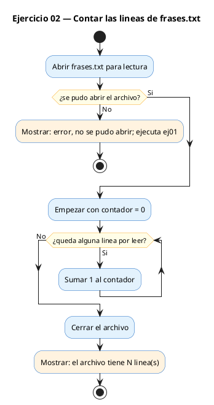
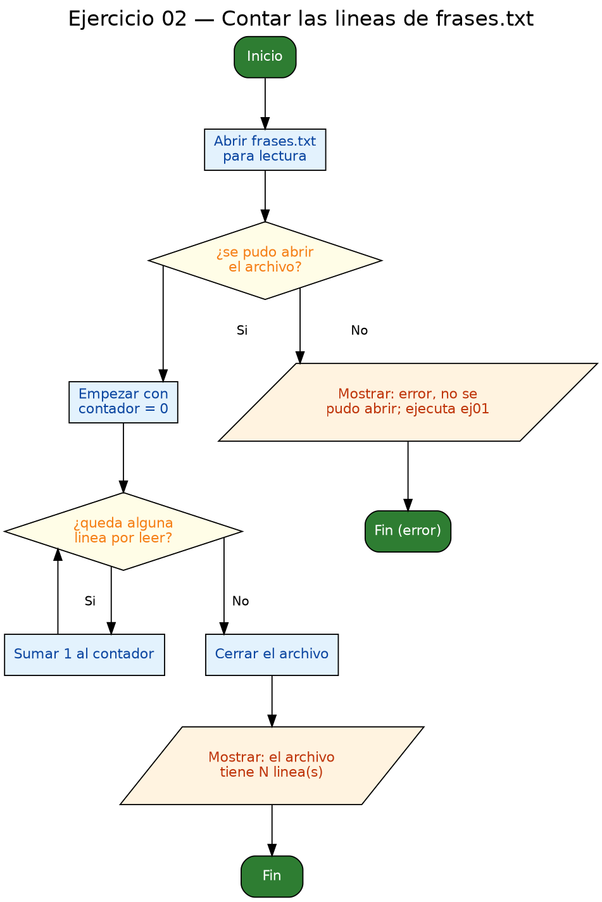

<!-- FICHERO GENERADO — NO EDITAR. Fuente de verdad: curso-c/practica/09-archivos/ej02.md (se regenera con gen_course.py). -->

# Ejercicio 02 — Lee frases.txt y cuenta cuántas líneas tiene

Dificultad: verde · Módulo 09 (Archivos)

## Enunciado

Lee frases.txt y cuenta cuántas líneas tiene. Imprime el total.

## Diagramas de flujo





## Cómo se resuelve

<!-- EXPLICACION -->
Aquí solo **lees**, no escribes. La idea es abrir `frases.txt`, recorrerlo línea a línea y llevar la cuenta.

1. `FILE *fp = fopen(ARCHIVO, "r")` abre en modo `"r"` (read). Este modo **no crea el archivo**: si no existe, `fopen` devuelve `NULL`. Por eso la comprobación `if (fp == NULL)` no es opcional; además el mensaje sugiere ejecutar antes `ej01`, que es quien crea el fichero.
2. El truco del recuento está en el bucle `while (fgets(linea, sizeof(linea), fp) != NULL) { contador++; }`. `fgets` lee **una línea por llamada** y devuelve `NULL` al llegar al final del archivo, así que cada vuelta del bucle equivale exactamente a una línea leída. No necesitas ni mirar el contenido, solo contar las vueltas.
3. `fclose(fp)` cierra el archivo cuando terminas.

Trampa típica: dar por hecho que el archivo existe y **no comprobar el `NULL`**. Si `frases.txt` no está, sin esa comprobación el programa peta al usar `fp`. La otra es olvidar `fclose`; al ser solo lectura no pierdes datos, pero es buena costumbre cerrar siempre lo que abres.

## Para practicar — cópialo y complétalo

Pega este esqueleto y completa los `TODO`. Es la mejor forma de aprender: inténtalo antes de mirar la solución.

```c
/*
  Curso de C — Modulo 09: Lectura y escritura de archivos
  Ejercicio 02 — PRACTICA (rellena los TODO)
  Enunciado: Lee frases.txt y cuenta cuántas líneas tiene. Imprime el total.
  Dificultad: verde
  Compilar: gcc -std=c11 -Wall ej02_practica.c -o ej02 && ./ej02
*/

#include <stdio.h>

#define ARCHIVO "frases.txt"
#define MAX_LEN 256

int main(void) {
    // TODO 1: Abre ARCHIVO en modo lectura ("r") y guarda en FILE *fp
    //         Si fp == NULL, imprime error y haz return 1

    int contador = 0;
    char linea[MAX_LEN];

    // TODO 2: Bucle con fgets para leer linea a linea hasta EOF
    //         Por cada linea leida, incrementa 'contador'

    // TODO 3: Cierra el archivo

    // TODO 4: Imprime el resultado:
    //         "El archivo 'frases.txt' tiene X linea(s)."

    return 0;
}
```

## Solución — cópiala y ejecútala

```c
/*
  Curso de C — Modulo 09: Lectura y escritura de archivos
  Ejercicio 02 — MODELO (resuelto)
  Enunciado: Lee frases.txt y cuenta cuántas líneas tiene. Imprime el total.
  Dificultad: verde
  Compilar: gcc -std=c11 -Wall ej02_modelo.c -o ej02 && ./ej02
*/

#include <stdio.h>

#define ARCHIVO "frases.txt"
#define MAX_LEN 256

int main(void) {
    FILE *fp = fopen(ARCHIVO, "r");
    if (fp == NULL) {
        printf("Error: no se pudo abrir %s\n", ARCHIVO);
        printf("Crea el archivo primero ejecutando ej01.\n");
        return 1;
    }

    int contador = 0;
    char linea[MAX_LEN];

    // Cada vez que fgets lee algo, es una linea
    while (fgets(linea, sizeof(linea), fp) != NULL) {
        contador++;
    }

    fclose(fp);
    printf("El archivo '%s' tiene %d linea(s).\n", ARCHIVO, contador);
    return 0;
}
```

## Ejecútalo en el navegador

[▶ Abrir y ejecutar en Compiler Explorer](https://godbolt.org/clientstate/eyJzZXNzaW9ucyI6W3siaWQiOjEsImxhbmd1YWdlIjoiYyIsInNvdXJjZSI6Ii8qXG4gIEN1cnNvIGRlIEMgXHUyMDE0IE1vZHVsbyAwOTogTGVjdHVyYSB5IGVzY3JpdHVyYSBkZSBhcmNoaXZvc1xuICBFamVyY2ljaW8gMDIgXHUyMDE0IE1PREVMTyAocmVzdWVsdG8pXG4gIEVudW5jaWFkbzogTGVlIGZyYXNlcy50eHQgeSBjdWVudGEgY3VcdTAwZTFudGFzIGxcdTAwZWRuZWFzIHRpZW5lLiBJbXByaW1lIGVsIHRvdGFsLlxuICBEaWZpY3VsdGFkOiB2ZXJkZVxuICBDb21waWxhcjogZ2NjIC1zdGQ9YzExIC1XYWxsIGVqMDJfbW9kZWxvLmMgLW8gZWowMiAmJiAuL2VqMDJcbiovXG5cbiNpbmNsdWRlIDxzdGRpby5oPlxuXG4jZGVmaW5lIEFSQ0hJVk8gXCJmcmFzZXMudHh0XCJcbiNkZWZpbmUgTUFYX0xFTiAyNTZcblxuaW50IG1haW4odm9pZCkge1xuICAgIEZJTEUgKmZwID0gZm9wZW4oQVJDSElWTywgXCJyXCIpO1xuICAgIGlmIChmcCA9PSBOVUxMKSB7XG4gICAgICAgIHByaW50ZihcIkVycm9yOiBubyBzZSBwdWRvIGFicmlyICVzXFxuXCIsIEFSQ0hJVk8pO1xuICAgICAgICBwcmludGYoXCJDcmVhIGVsIGFyY2hpdm8gcHJpbWVybyBlamVjdXRhbmRvIGVqMDEuXFxuXCIpO1xuICAgICAgICByZXR1cm4gMTtcbiAgICB9XG5cbiAgICBpbnQgY29udGFkb3IgPSAwO1xuICAgIGNoYXIgbGluZWFbTUFYX0xFTl07XG5cbiAgICAvLyBDYWRhIHZleiBxdWUgZmdldHMgbGVlIGFsZ28sIGVzIHVuYSBsaW5lYVxuICAgIHdoaWxlIChmZ2V0cyhsaW5lYSwgc2l6ZW9mKGxpbmVhKSwgZnApICE9IE5VTEwpIHtcbiAgICAgICAgY29udGFkb3IrKztcbiAgICB9XG5cbiAgICBmY2xvc2UoZnApO1xuICAgIHByaW50ZihcIkVsIGFyY2hpdm8gJyVzJyB0aWVuZSAlZCBsaW5lYShzKS5cXG5cIiwgQVJDSElWTywgY29udGFkb3IpO1xuICAgIHJldHVybiAwO1xufVxuIiwiY29tcGlsZXJzIjpbXSwiZXhlY3V0b3JzIjpbeyJhcmd1bWVudHMiOiIiLCJjb21waWxlciI6eyJpZCI6ImNnMTQzIiwibGlicyI6W10sIm9wdGlvbnMiOiItc3RkPWMxMSAtbG0ifSwic3RkaW4iOiIiLCJ3cmFwIjpmYWxzZX1dfV19)

Se abre con la solución ya cargada; pulsa el botón de ejecutar (Run) para ver la salida. No hay que instalar nada.

## Cómo usarlo

Pega el código en un fichero y ejecútalo con tu toolchain habitual (o el botón de Ejecutar de tu editor). Antes de mirar la solución, intenta completar tú el esqueleto: es la mejor forma de aprender.

## Conexiones

- [[Curso_C/modelo/09-archivos|Teoría del módulo]]
- [[Curso_C/practica/00_README|Índice del curso]]
