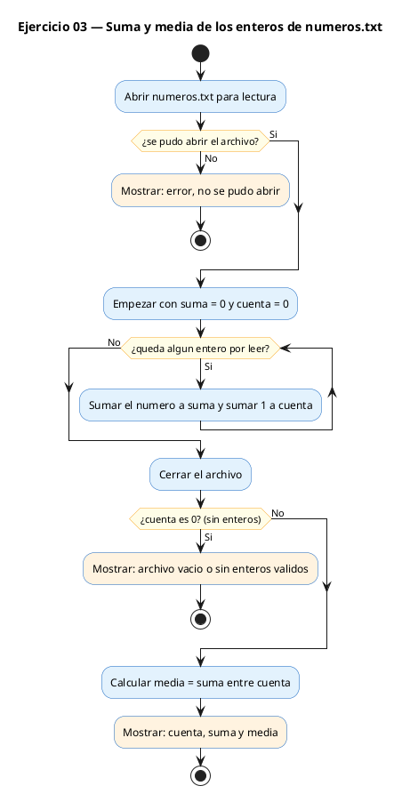
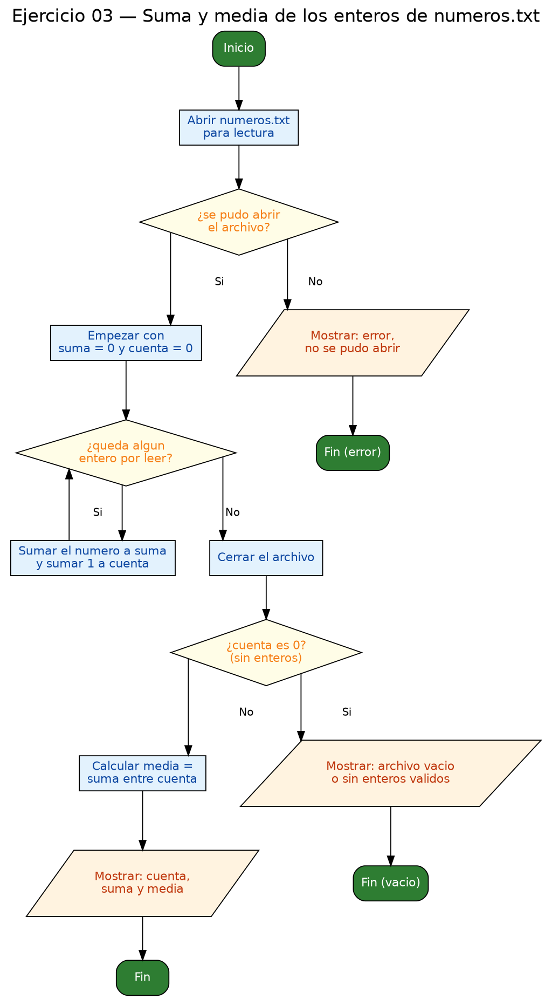

<!-- FICHERO GENERADO — NO EDITAR. Fuente de verdad: curso-c/practica/09-archivos/ej03.md (se regenera con gen_course.py). -->

# Ejercicio 03 — Lee numeros.txt (enteros, uno por línea) y muestra su suma y media

Dificultad: amarillo · Módulo 09 (Archivos)

## Enunciado

Lee numeros.txt (enteros, uno por línea) y muestra su suma y media.

## Diagramas de flujo





## Cómo se resuelve

<!-- EXPLICACION -->
Este ejercicio lee **números**, no líneas de texto, así que la herramienta cambia de `fgets` a `fscanf`.

1. Se abre `numeros.txt` en modo `"r"` y se comprueba `NULL` como siempre.
2. El corazón es `while (fscanf(fp, "%d", &n) == 1)`. `fscanf` intenta leer un entero y **devuelve cuántos valores ha leído con éxito**: `1` si consiguió un número, y algo distinto (`EOF`) al llegar al final. Comparar `== 1` es la forma correcta de saber "sí, he leído un número válido, sigo". Fíjate en el `&n`: al ser una variable escalar, `fscanf` necesita su **dirección** para poder rellenarla.
3. Dentro del bucle se acumula `suma += n` y se cuenta `count++`. Después se cierra el archivo.
4. Antes de dividir se comprueba `if (count == 0)`: si el archivo estaba vacío, dividir entre cero sería un error.
5. La media se calcula con `(double)suma / count`. Ese **cast a `double` es clave**: si dividieras dos enteros, C haría división entera y perderías los decimales (`12 / 5` daría `2` en lugar de `2.40`).

Trampa típica: además del `fopen` sin comprobar, aquí lo fácil es olvidar el `&` en `fscanf` (comportamiento indefinido) y **caer en la división entera** al calcular la media.

## Para practicar — cópialo y complétalo

Pega este esqueleto y completa los `TODO`. Es la mejor forma de aprender: inténtalo antes de mirar la solución.

```c
/*
  Curso de C — Modulo 09: Lectura y escritura de archivos
  Ejercicio 03 — PRACTICA (rellena los TODO)
  Enunciado: Lee numeros.txt (enteros, uno por línea) y muestra su suma y media.
  Dificultad: amarillo
  Compilar: gcc -std=c11 -Wall ej03_practica.c -o ej03 && ./ej03

  Nota: crea numeros.txt con enteros, uno por linea. Ejemplo:
        3
        7
        2
        10
*/

#include <stdio.h>

#define ARCHIVO "numeros.txt"

int main(void) {
    // TODO 1: Abre ARCHIVO en modo "r"; comprueba NULL

    int n;
    long suma = 0;
    int count = 0;

    // TODO 2: Bucle con fscanf(fp, "%d", &n) mientras devuelva 1
    //         Dentro: acumula suma y cuenta los numeros

    // TODO 3: Cierra el archivo

    // TODO 4: Si count == 0, avisa de archivo vacio y haz return 1

    // TODO 5: Calcula la media como double (cuidado con la division entera)
    //         Imprime: numeros leidos, suma, media con 2 decimales

    return 0;
}
```

## Solución — cópiala y ejecútala

```c
/*
  Curso de C — Modulo 09: Lectura y escritura de archivos
  Ejercicio 03 — MODELO (resuelto)
  Enunciado: Lee numeros.txt (enteros, uno por línea) y muestra su suma y media.
  Dificultad: amarillo
  Compilar: gcc -std=c11 -Wall ej03_modelo.c -o ej03 && ./ej03

  Nota: crea numeros.txt con contenido como:
        3
        7
        2
        10
*/

#include <stdio.h>

#define ARCHIVO "numeros.txt"

int main(void) {
    FILE *fp = fopen(ARCHIVO, "r");
    if (fp == NULL) {
        printf("Error: no se pudo abrir %s\n", ARCHIVO);
        printf("Crea el archivo con enteros (uno por linea).\n");
        return 1;
    }

    int n;
    long suma = 0;
    int count = 0;

    // fscanf devuelve el numero de items leidos; 1 = exito, EOF = fin o error
    while (fscanf(fp, "%d", &n) == 1) {
        suma += n;
        count++;
    }
    fclose(fp);

    if (count == 0) {
        printf("El archivo esta vacio o no contiene enteros validos.\n");
        return 1;
    }

    double media = (double)suma / count;
    printf("Numeros leidos: %d\n", count);
    printf("Suma:  %ld\n", suma);
    printf("Media: %.2f\n", media);
    return 0;
}
```

## Cómo usarlo

Pega el código en un fichero y ejecútalo con tu toolchain habitual (o el botón de Ejecutar de tu editor). Antes de mirar la solución, intenta completar tú el esqueleto: es la mejor forma de aprender.

## Conexiones

- [[Curso_C/modelo/09-archivos|Teoría del módulo]]
- [[Curso_C/practica/00_README|Índice del curso]]
