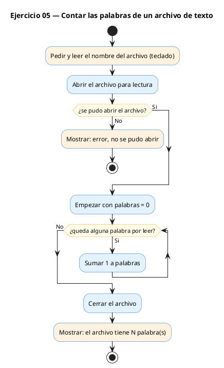
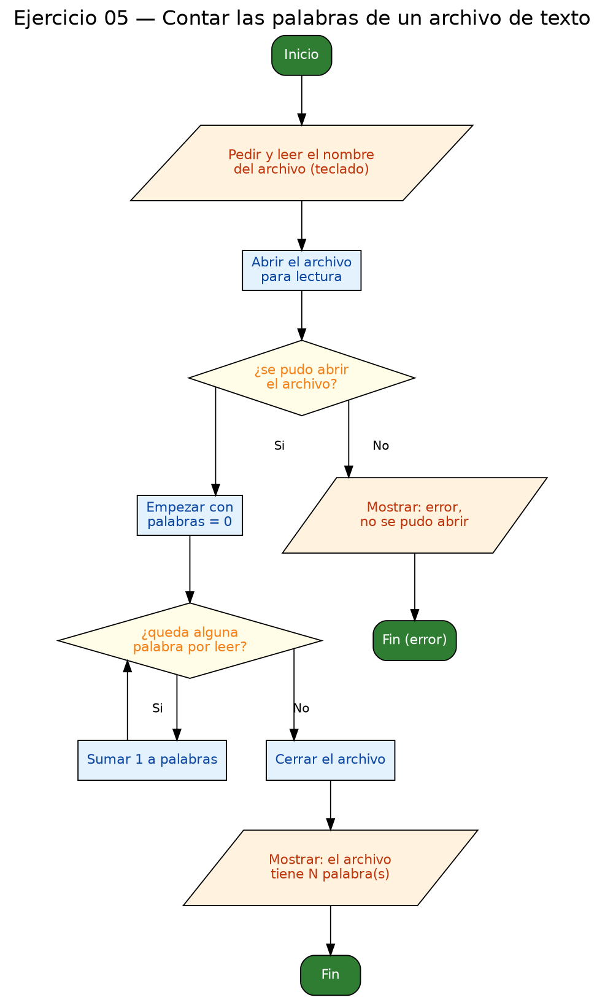

<!-- FICHERO GENERADO — NO EDITAR. Fuente de verdad: curso-c/practica/09-archivos/ej05.md (se regenera con gen_course.py). -->

# Ejercicio 05 — Lee un archivo de texto y cuenta el número total de palabras

Dificultad: amarillo · Módulo 09 (Archivos)

## Enunciado

Lee un archivo de texto y cuenta el número total de palabras.

## Diagramas de flujo





## Cómo se resuelve

<!-- EXPLICACION -->
Contar palabras se apoya en una propiedad muy cómoda de `fscanf` con `%s`: **lee "una palabra" por llamada**, saltando automáticamente los espacios, tabuladores y saltos de línea que haya en medio.

1. Primero el programa pregunta el nombre del archivo con `scanf("%255s", nombre)` y lo abre en modo `"r"`. Como el nombre lo teclea el usuario, es muy probable que falle (por eso la comprobación `if (fp == NULL)` es aún más necesaria de lo normal).
2. El bucle `while (fscanf(fp, "%511s", token) == 1)` es idéntico en espíritu al de los números: `fscanf` devuelve `1` cada vez que consigue leer una palabra y algo distinto (`EOF`) al terminar. Cada vuelta = una palabra, así que solo hay que hacer `palabras++`. No hace falta guardar ni analizar el `token`, solo contar.
3. El `%511s` (y antes el `%255s`) **acota el tamaño** para no desbordar el array: `token` tiene 512 casillas y se leen como mucho 511 caracteres más el `'\0'` final.
4. `fclose(fp)` al terminar.

Trampa típica: no comprobar el `NULL` (aquí casi seguro tarde o temprano el usuario escribe un nombre que no existe) y escribir `%s` sin límite de tamaño, que es la puerta clásica a un desbordamiento de buffer.

## Para practicar — cópialo y complétalo

Pega este esqueleto y completa los `TODO`. Es la mejor forma de aprender: inténtalo antes de mirar la solución.

```c
/*
  Curso de C — Modulo 09: Lectura y escritura de archivos
  Ejercicio 05 — PRACTICA (rellena los TODO)
  Enunciado: Lee un archivo de texto y cuenta el número total de palabras.
  Dificultad: amarillo
  Compilar: gcc -std=c11 -Wall ej05_practica.c -o ej05 && ./ej05

  Pista: fscanf con "%s" lee una "palabra" cada vez (salta espacios/saltos).
         Devuelve 1 si leyo algo, EOF al terminar el archivo.
*/

#include <stdio.h>

#define MAX_NOMBRE  256
#define MAX_PALABRA 512

int main(void) {
    char nombre[MAX_NOMBRE];
    printf("Nombre del archivo: ");
    scanf("%255s", nombre);

    // TODO 1: Abre el archivo 'nombre' en modo "r"
    //         Comprueba NULL

    int palabras = 0;
    char token[MAX_PALABRA];

    // TODO 2: Bucle con fscanf(fp, "%511s", token) mientras devuelva 1
    //         Incrementa 'palabras' por cada token leido

    // TODO 3: Cierra el archivo

    // TODO 4: Imprime: "El archivo 'X' tiene N palabra(s)."

    return 0;
}
```

## Solución — cópiala y ejecútala

```c
/*
  Curso de C — Modulo 09: Lectura y escritura de archivos
  Ejercicio 05 — MODELO (resuelto)
  Enunciado: Lee un archivo de texto y cuenta el número total de palabras.
  Dificultad: amarillo
  Compilar: gcc -std=c11 -Wall ej05_modelo.c -o ej05 && ./ej05

  Nota: el programa pide el nombre del archivo al arrancar.
        Una "palabra" es cualquier secuencia de caracteres separada por
        espacios, tabuladores o saltos de linea (lo que fscanf trata como token).
*/

#include <stdio.h>

#define MAX_NOMBRE 256
#define MAX_PALABRA 512

int main(void) {
    char nombre[MAX_NOMBRE];
    printf("Nombre del archivo: ");
    scanf("%255s", nombre);

    FILE *fp = fopen(nombre, "r");
    if (fp == NULL) {
        printf("Error: no se pudo abrir '%s'\n", nombre);
        return 1;
    }

    int palabras = 0;
    char token[MAX_PALABRA];

    // fscanf con %s salta espacios y lee hasta el siguiente espacio/salto
    // Devuelve 1 si leyo una palabra, EOF al terminar
    while (fscanf(fp, "%511s", token) == 1) {
        palabras++;
    }

    fclose(fp);
    printf("El archivo '%s' tiene %d palabra(s).\n", nombre, palabras);
    return 0;
}
```

## Cómo usarlo

Pega el código en un fichero y ejecútalo con tu toolchain habitual (o el botón de Ejecutar de tu editor). Antes de mirar la solución, intenta completar tú el esqueleto: es la mejor forma de aprender.

## Conexiones

- [[Curso_C/modelo/09-archivos|Teoría del módulo]]
- [[Curso_C/practica/00_README|Índice del curso]]
