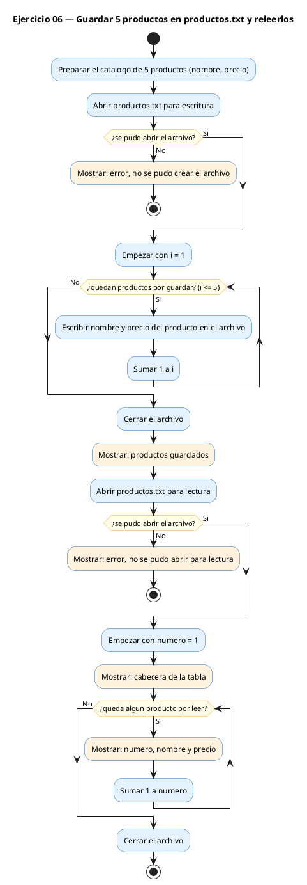
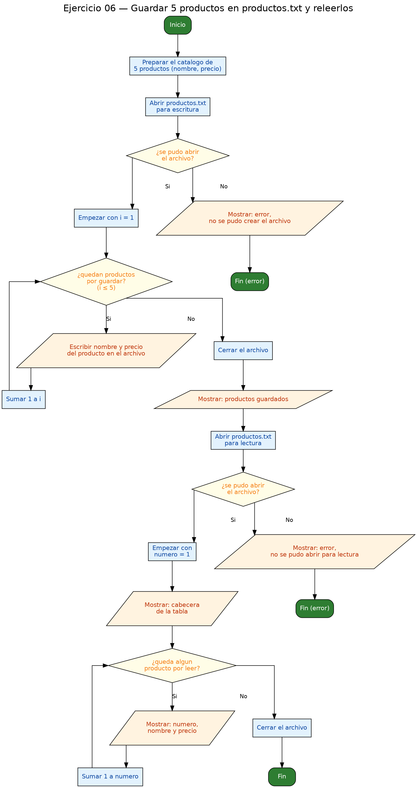

<!-- FICHERO GENERADO — NO EDITAR. Fuente de verdad: curso-c/practica/09-archivos/ej06.md (se regenera con gen_course.py). -->

# Ejercicio 06 — Guarda un array de 5 structs Producto {nombre, precio} en…

Dificultad: rojo · Módulo 09 (Archivos)

## Enunciado

Guarda un array de 5 structs Producto {nombre, precio} en productos.txt con fprintf, luego leelos con fscanf y muestralos.

## Diagramas de flujo





## Cómo se resuelve

<!-- EXPLICACION -->
Aquí unes lo del módulo de structs con los archivos: **persistir en disco** un array de structs y luego reconstruirlo leyéndolo. La clave es elegir un formato de texto que puedas volver a leer sin ambigüedad.

1. Se define `typedef struct { char nombre[32]; float precio; } Producto;` y se inicializa un `catalogo` de 5 productos de prueba.
2. **Escritura**: se abre `productos.txt` en `"w"`, se comprueba `NULL`, y en un bucle se escribe cada producto con `fprintf(fw, "%s %.2f\n", ...)`. Cada línea queda como `Manzana 1.20`: nombre, un espacio, precio y salto. Luego `fclose(fw)` vuelca a disco.
3. **Lectura**: se reabre en `"r"` y con `while (fscanf(fr, "%31s %f", p.nombre, &p.precio) == 2)` se leen los dos campos de golpe. Comparar `== 2` significa "he leído correctamente **los dos** valores de la línea (cadena y float)"; si solo lograra uno, el bucle pararía. Fíjate en que `p.nombre` es un array y **no lleva `&`**, mientras que `&p.precio` sí, porque es un escalar.
4. El detalle que hace que todo encaje: **el nombre no puede tener espacios**. Como `%s` corta en el primer espacio, si un producto se llamara "Zumo de Naranja", al releer solo recuperarías "Zumo" y el `fscanf` se desincronizaría. Por eso se guardan nombres de una sola palabra.

Trampa típica: elegir un formato que no puedes volver a parsear (nombres con espacios rompiendo el `%s`), olvidar el `\n` al escribir (todo quedaría en una línea), o el clásico `fopen` sin comprobar y sin `fclose`.

## Para practicar — cópialo y complétalo

Pega este esqueleto y completa los `TODO`. Es la mejor forma de aprender: inténtalo antes de mirar la solución.

```c
/*
  Curso de C — Modulo 09: Lectura y escritura de archivos
  Ejercicio 06 — PRACTICA (rellena los TODO)
  Enunciado: Guarda un array de 5 structs Producto {nombre, precio} en productos.txt
             con fprintf, luego leelos con fscanf y muestralos.
  Dificultad: rojo
  Compilar: gcc -std=c11 -Wall ej06_practica.c -o ej06 && ./ej06

  Pista clave: el nombre NO debe tener espacios para poder leerlo de vuelta con %s.
               El formato de cada linea es: "NombreProducto 1.20\n"
*/

#include <stdio.h>

#define N_PRODUCTOS 5
#define ARCHIVO     "productos.txt"

// TODO 1: Define el struct Producto con campos:
//         char nombre[32]  y  float precio
// typedef struct { ... } Producto;

int main(void) {
    // TODO 2: Declara e inicializa un array 'catalogo' de 5 Producto con datos de prueba
    //         (nombres sin espacios, precios a tu eleccion)

    // TODO 3: Abre ARCHIVO en modo "w"; comprueba NULL

    // TODO 4: Bucle for: escribe cada producto con fprintf
    //         Formato sugerido: "%s %.2f\n"  (nombre y precio)

    // TODO 5: Cierra el archivo de escritura y confirma con un printf

    // TODO 6: Abre ARCHIVO en modo "r"; comprueba NULL

    // TODO 7: Bucle con fscanf(fr, "%31s %f", p.nombre, &p.precio) == 2
    //         Imprime cada producto numerado

    // TODO 8: Cierra el archivo de lectura

    return 0;
}
```

## Solución — cópiala y ejecútala

```c
/*
  Curso de C — Modulo 09: Lectura y escritura de archivos
  Ejercicio 06 — MODELO (resuelto)
  Enunciado: Guarda un array de 5 structs Producto {nombre, precio} en productos.txt
             con fprintf, luego leelos con fscanf y muestralos.
  Dificultad: rojo
  Compilar: gcc -std=c11 -Wall ej06_modelo.c -o ej06 && ./ej06
*/

#include <stdio.h>

#define N_PRODUCTOS 5
#define ARCHIVO     "productos.txt"

typedef struct {
    char  nombre[32];
    float precio;
} Producto;

int main(void) {
    // Datos de prueba (sin espacios en el nombre para facilitar fscanf)
    Producto catalogo[N_PRODUCTOS] = {
        {"Manzana",  1.20f},
        {"Leche",    0.85f},
        {"Pan",      1.10f},
        {"Huevos",   2.50f},
        {"Naranja",  0.95f}
    };

    // --- ESCRITURA ---
    FILE *fw = fopen(ARCHIVO, "w");
    if (fw == NULL) {
        printf("Error: no se pudo crear %s\n", ARCHIVO);
        return 1;
    }

    for (int i = 0; i < N_PRODUCTOS; i++) {
        // Formato: "nombre precio\n"  — nombre SIN espacios para poder releerlo con %s
        fprintf(fw, "%s %.2f\n", catalogo[i].nombre, catalogo[i].precio);
    }
    fclose(fw);
    printf("Productos guardados en '%s'.\n\n", ARCHIVO);

    // --- LECTURA ---
    FILE *fr = fopen(ARCHIVO, "r");
    if (fr == NULL) {
        printf("Error: no se pudo abrir %s para lectura\n", ARCHIVO);
        return 1;
    }

    Producto p;
    int idx = 1;
    printf("%-5s %-20s %s\n", "Num", "Producto", "Precio");
    printf("--------------------------------\n");

    // fscanf lee: cadena (%31s) y float (%f)
    while (fscanf(fr, "%31s %f", p.nombre, &p.precio) == 2) {
        printf("%-5d %-20s %.2f EUR\n", idx++, p.nombre, p.precio);
    }
    fclose(fr);
    return 0;
}
```

## Ejecútalo en el navegador

[▶ Abrir y ejecutar en Compiler Explorer](https://godbolt.org/clientstate/eyJzZXNzaW9ucyI6W3siaWQiOjEsImxhbmd1YWdlIjoiYyIsInNvdXJjZSI6Ii8qXG4gIEN1cnNvIGRlIEMgXHUyMDE0IE1vZHVsbyAwOTogTGVjdHVyYSB5IGVzY3JpdHVyYSBkZSBhcmNoaXZvc1xuICBFamVyY2ljaW8gMDYgXHUyMDE0IE1PREVMTyAocmVzdWVsdG8pXG4gIEVudW5jaWFkbzogR3VhcmRhIHVuIGFycmF5IGRlIDUgc3RydWN0cyBQcm9kdWN0byB7bm9tYnJlLCBwcmVjaW99IGVuIHByb2R1Y3Rvcy50eHRcbiAgICAgICAgICAgICBjb24gZnByaW50ZiwgbHVlZ28gbGVlbG9zIGNvbiBmc2NhbmYgeSBtdWVzdHJhbG9zLlxuICBEaWZpY3VsdGFkOiByb2pvXG4gIENvbXBpbGFyOiBnY2MgLXN0ZD1jMTEgLVdhbGwgZWowNl9tb2RlbG8uYyAtbyBlajA2ICYmIC4vZWowNlxuKi9cblxuI2luY2x1ZGUgPHN0ZGlvLmg%2BXG5cbiNkZWZpbmUgTl9QUk9EVUNUT1MgNVxuI2RlZmluZSBBUkNISVZPICAgICBcInByb2R1Y3Rvcy50eHRcIlxuXG50eXBlZGVmIHN0cnVjdCB7XG4gICAgY2hhciAgbm9tYnJlWzMyXTtcbiAgICBmbG9hdCBwcmVjaW87XG59IFByb2R1Y3RvO1xuXG5pbnQgbWFpbih2b2lkKSB7XG4gICAgLy8gRGF0b3MgZGUgcHJ1ZWJhIChzaW4gZXNwYWNpb3MgZW4gZWwgbm9tYnJlIHBhcmEgZmFjaWxpdGFyIGZzY2FuZilcbiAgICBQcm9kdWN0byBjYXRhbG9nb1tOX1BST0RVQ1RPU10gPSB7XG4gICAgICAgIHtcIk1hbnphbmFcIiwgIDEuMjBmfSxcbiAgICAgICAge1wiTGVjaGVcIiwgICAgMC44NWZ9LFxuICAgICAgICB7XCJQYW5cIiwgICAgICAxLjEwZn0sXG4gICAgICAgIHtcIkh1ZXZvc1wiLCAgIDIuNTBmfSxcbiAgICAgICAge1wiTmFyYW5qYVwiLCAgMC45NWZ9XG4gICAgfTtcblxuICAgIC8vIC0tLSBFU0NSSVRVUkEgLS0tXG4gICAgRklMRSAqZncgPSBmb3BlbihBUkNISVZPLCBcIndcIik7XG4gICAgaWYgKGZ3ID09IE5VTEwpIHtcbiAgICAgICAgcHJpbnRmKFwiRXJyb3I6IG5vIHNlIHB1ZG8gY3JlYXIgJXNcXG5cIiwgQVJDSElWTyk7XG4gICAgICAgIHJldHVybiAxO1xuICAgIH1cblxuICAgIGZvciAoaW50IGkgPSAwOyBpIDwgTl9QUk9EVUNUT1M7IGkrKykge1xuICAgICAgICAvLyBGb3JtYXRvOiBcIm5vbWJyZSBwcmVjaW9cXG5cIiAgXHUyMDE0IG5vbWJyZSBTSU4gZXNwYWNpb3MgcGFyYSBwb2RlciByZWxlZXJsbyBjb24gJXNcbiAgICAgICAgZnByaW50ZihmdywgXCIlcyAlLjJmXFxuXCIsIGNhdGFsb2dvW2ldLm5vbWJyZSwgY2F0YWxvZ29baV0ucHJlY2lvKTtcbiAgICB9XG4gICAgZmNsb3NlKGZ3KTtcbiAgICBwcmludGYoXCJQcm9kdWN0b3MgZ3VhcmRhZG9zIGVuICclcycuXFxuXFxuXCIsIEFSQ0hJVk8pO1xuXG4gICAgLy8gLS0tIExFQ1RVUkEgLS0tXG4gICAgRklMRSAqZnIgPSBmb3BlbihBUkNISVZPLCBcInJcIik7XG4gICAgaWYgKGZyID09IE5VTEwpIHtcbiAgICAgICAgcHJpbnRmKFwiRXJyb3I6IG5vIHNlIHB1ZG8gYWJyaXIgJXMgcGFyYSBsZWN0dXJhXFxuXCIsIEFSQ0hJVk8pO1xuICAgICAgICByZXR1cm4gMTtcbiAgICB9XG5cbiAgICBQcm9kdWN0byBwO1xuICAgIGludCBpZHggPSAxO1xuICAgIHByaW50ZihcIiUtNXMgJS0yMHMgJXNcXG5cIiwgXCJOdW1cIiwgXCJQcm9kdWN0b1wiLCBcIlByZWNpb1wiKTtcbiAgICBwcmludGYoXCItLS0tLS0tLS0tLS0tLS0tLS0tLS0tLS0tLS0tLS0tLVxcblwiKTtcblxuICAgIC8vIGZzY2FuZiBsZWU6IGNhZGVuYSAoJTMxcykgeSBmbG9hdCAoJWYpXG4gICAgd2hpbGUgKGZzY2FuZihmciwgXCIlMzFzICVmXCIsIHAubm9tYnJlLCAmcC5wcmVjaW8pID09IDIpIHtcbiAgICAgICAgcHJpbnRmKFwiJS01ZCAlLTIwcyAlLjJmIEVVUlxcblwiLCBpZHgrKywgcC5ub21icmUsIHAucHJlY2lvKTtcbiAgICB9XG4gICAgZmNsb3NlKGZyKTtcbiAgICByZXR1cm4gMDtcbn1cbiIsImNvbXBpbGVycyI6W10sImV4ZWN1dG9ycyI6W3siYXJndW1lbnRzIjoiIiwiY29tcGlsZXIiOnsiaWQiOiJjZzE0MyIsImxpYnMiOltdLCJvcHRpb25zIjoiLXN0ZD1jMTEgLWxtIn0sInN0ZGluIjoiIiwid3JhcCI6ZmFsc2V9XX1dfQ%3D%3D)

Se abre con la solución ya cargada; pulsa el botón de ejecutar (Run) para ver la salida. No hay que instalar nada.

## Cómo usarlo

Pega el código en un fichero y ejecútalo con tu toolchain habitual (o el botón de Ejecutar de tu editor). Antes de mirar la solución, intenta completar tú el esqueleto: es la mejor forma de aprender.

## Conexiones

- [[Curso_C/modelo/09-archivos|Teoría del módulo]]
- [[Curso_C/practica/00_README|Índice del curso]]
