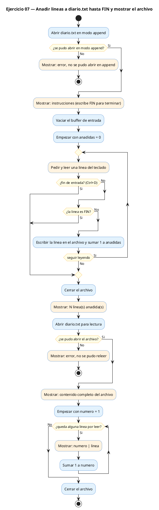
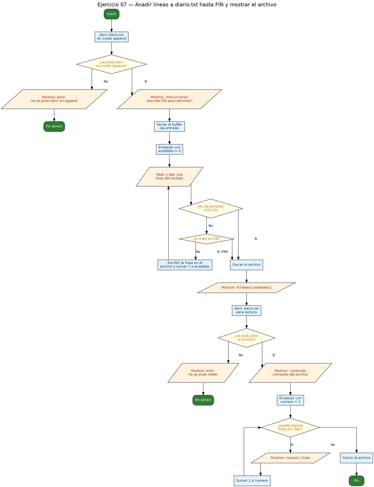

<!-- FICHERO GENERADO — NO EDITAR. Fuente de verdad: curso-c/practica/09-archivos/ej07.md (se regenera con gen_course.py). -->

# Ejercicio 07 — Abre un archivo en modo append y permite añadir líneas hasta escribir…

Dificultad: rojo · Módulo 09 (Archivos)

## Enunciado

Abre un archivo en modo append y permite añadir líneas hasta escribir "FIN". Al terminar, muestra todo el archivo.

## Diagramas de flujo





## Cómo se resuelve

<!-- EXPLICACION -->
Este ejercicio estrena el tercer modo de apertura, `"a"` (append), y lo combina con una lectura final. Es el más completo del módulo.

1. `FILE *fa = fopen(ARCHIVO, "a")` abre `diario.txt` en modo **append**: a diferencia de `"w"`, **no borra lo que ya había**; siempre escribe al final. Así, cada vez que ejecutas el programa, las líneas nuevas se suman a las de veces anteriores. Se comprueba `NULL` como siempre.
2. Antes de leer del teclado se vacía `stdin` con un bucle `getchar`, para que no queden residuos de una entrada previa.
3. El bucle `while (1)` va pidiendo líneas con `fgets`. Por cada una: se le quita el `\n` con `buf[strcspn(buf, "\n")] = '\0'`, se compara con `strcmp(buf, "FIN") == 0` para decidir si parar, y si no es el fin se guarda con `fprintf(fa, "%s\n", buf)` reponiendo el salto de línea. `strcmp` devuelve `0` cuando las dos cadenas son iguales (en C no puedes comparar cadenas con `==`).
4. `fclose(fa)` cierra la fase de escritura. Este cierre es **imprescindible** antes de la siguiente fase: si no vaciaras el buffer a disco, al reabrir para leer podrías no ver las líneas que acabas de añadir.
5. Se reabre en `"r"` y se recorre todo el archivo con `fgets`, imprimiendo cada línea numerada. Así ves el histórico completo, no solo lo de esta sesión.

Trampa típica: usar `"w"` en vez de `"a"` (borrarías el diario entero en cada ejecución), intentar comparar cadenas con `==` en lugar de `strcmp`, y no cerrar el archivo de append antes de releerlo.

## Para practicar — cópialo y complétalo

Pega este esqueleto y completa los `TODO`. Es la mejor forma de aprender: inténtalo antes de mirar la solución.

```c
/*
  Curso de C — Modulo 09: Lectura y escritura de archivos
  Ejercicio 07 — PRACTICA (rellena los TODO)
  Enunciado: Abre un archivo en modo append y permite añadir líneas hasta escribir "FIN".
             Al terminar, muestra todo el archivo.
  Dificultad: rojo
  Stdin: \nPrimera entrada\nSegunda entrada\nFIN
  Compilar: gcc -std=c11 -Wall ej07_practica.c -o ej07 && ./ej07

  Pistas:
  - Modo "a" (append): abre el archivo sin borrar lo que ya habia, escribe al final.
  - strcmp(a, b) == 0 compara cadenas (incluye <string.h>).
  - strcspn(buf, "\n") devuelve el indice del '\n'; ponlo a '\0' para eliminarlo.
*/

#include <stdio.h>
#include <string.h>

#define ARCHIVO "diario.txt"
#define MAX_LEN 256

int main(void) {
    // TODO 1: Abre ARCHIVO en modo "a" (append)
    //         Comprueba NULL

    printf("Escribe lineas para anadir a '%s'.\n", ARCHIVO);
    printf("Escribe FIN (en mayusculas) para terminar.\n\n");

    char buf[MAX_LEN];
    int anadidas = 0;

    // TODO 2: Vacia stdin antes de usar fgets
    //         (bucle getchar hasta '\n' o EOF)

    // TODO 3: Bucle infinito (while(1)):
    //         a) Imprime "> " como prompt
    //         b) Lee con fgets; si devuelve NULL, sal del bucle (EOF)
    //         c) Elimina el '\n' del buffer con strcspn
    //         d) Si el buffer es "FIN", sal del bucle (break)
    //         e) Escribe la linea en el archivo con fprintf (repon el '\n')
    //         f) Incrementa 'anadidas'

    // TODO 4: Cierra el archivo de append
    //         Imprime cuantas lineas anadiste

    // TODO 5: Abre ARCHIVO en modo "r" para mostrar todo su contenido
    //         Comprueba NULL

    // TODO 6: Bucle con fgets hasta EOF
    //         Imprime cada linea numerada (quita el '\n' primero)

    // TODO 7: Cierra el archivo de lectura

    return 0;
}
```

## Solución — cópiala y ejecútala

```c
/*
  Curso de C — Modulo 09: Lectura y escritura de archivos
  Ejercicio 07 — MODELO (resuelto)
  Enunciado: Abre un archivo en modo append y permite añadir líneas hasta escribir "FIN".
             Al terminar, muestra todo el archivo.
  Dificultad: rojo
  Stdin: \nPrimera entrada\nSegunda entrada\nFIN
  Compilar: gcc -std=c11 -Wall ej07_modelo.c -o ej07 && ./ej07
*/

#include <stdio.h>
#include <string.h>

#define ARCHIVO "diario.txt"
#define MAX_LEN 256

int main(void) {
    // --- FASE APPEND: anadir nuevas lineas ---
    FILE *fa = fopen(ARCHIVO, "a");
    if (fa == NULL) {
        printf("Error: no se pudo abrir '%s' en modo append\n", ARCHIVO);
        return 1;
    }

    printf("Escribe lineas para anadir a '%s'.\n", ARCHIVO);
    printf("Escribe FIN (en mayusculas) para terminar.\n\n");

    char buf[MAX_LEN];
    int anadidas = 0;

    // Vaciar stdin antes de fgets
    int c;
    while ((c = getchar()) != '\n' && c != EOF);

    while (1) {
        printf("> ");
        if (fgets(buf, sizeof(buf), stdin) == NULL) break; // EOF (Ctrl+D)

        // Quitar el '\n' para comparar con "FIN"
        buf[strcspn(buf, "\n")] = '\0';

        if (strcmp(buf, "FIN") == 0) break;

        // Volver a poner el '\n' para guardar correctamente
        fprintf(fa, "%s\n", buf);
        anadidas++;
    }
    fclose(fa);
    printf("\n%d linea(s) anadida(s).\n\n", anadidas);

    // --- FASE LECTURA: mostrar todo el archivo ---
    FILE *fr = fopen(ARCHIVO, "r");
    if (fr == NULL) {
        printf("Error: no se pudo releer '%s'\n", ARCHIVO);
        return 1;
    }

    printf("--- Contenido completo de '%s' ---\n", ARCHIVO);
    int num = 1;
    while (fgets(buf, sizeof(buf), fr) != NULL) {
        buf[strcspn(buf, "\n")] = '\0';
        printf("%3d | %s\n", num++, buf);
    }
    fclose(fr);
    return 0;
}
```

## Ejecútalo en el navegador

[▶ Abrir y ejecutar en Compiler Explorer](https://godbolt.org/clientstate/eyJzZXNzaW9ucyI6W3siaWQiOjEsImxhbmd1YWdlIjoiYyIsInNvdXJjZSI6Ii8qXG4gIEN1cnNvIGRlIEMgXHUyMDE0IE1vZHVsbyAwOTogTGVjdHVyYSB5IGVzY3JpdHVyYSBkZSBhcmNoaXZvc1xuICBFamVyY2ljaW8gMDcgXHUyMDE0IE1PREVMTyAocmVzdWVsdG8pXG4gIEVudW5jaWFkbzogQWJyZSB1biBhcmNoaXZvIGVuIG1vZG8gYXBwZW5kIHkgcGVybWl0ZSBhXHUwMGYxYWRpciBsXHUwMGVkbmVhcyBoYXN0YSBlc2NyaWJpciBcIkZJTlwiLlxuICAgICAgICAgICAgIEFsIHRlcm1pbmFyLCBtdWVzdHJhIHRvZG8gZWwgYXJjaGl2by5cbiAgRGlmaWN1bHRhZDogcm9qb1xuICBTdGRpbjogXFxuUHJpbWVyYSBlbnRyYWRhXFxuU2VndW5kYSBlbnRyYWRhXFxuRklOXG4gIENvbXBpbGFyOiBnY2MgLXN0ZD1jMTEgLVdhbGwgZWowN19tb2RlbG8uYyAtbyBlajA3ICYmIC4vZWowN1xuKi9cblxuI2luY2x1ZGUgPHN0ZGlvLmg%2BXG4jaW5jbHVkZSA8c3RyaW5nLmg%2BXG5cbiNkZWZpbmUgQVJDSElWTyBcImRpYXJpby50eHRcIlxuI2RlZmluZSBNQVhfTEVOIDI1NlxuXG5pbnQgbWFpbih2b2lkKSB7XG4gICAgLy8gLS0tIEZBU0UgQVBQRU5EOiBhbmFkaXIgbnVldmFzIGxpbmVhcyAtLS1cbiAgICBGSUxFICpmYSA9IGZvcGVuKEFSQ0hJVk8sIFwiYVwiKTtcbiAgICBpZiAoZmEgPT0gTlVMTCkge1xuICAgICAgICBwcmludGYoXCJFcnJvcjogbm8gc2UgcHVkbyBhYnJpciAnJXMnIGVuIG1vZG8gYXBwZW5kXFxuXCIsIEFSQ0hJVk8pO1xuICAgICAgICByZXR1cm4gMTtcbiAgICB9XG5cbiAgICBwcmludGYoXCJFc2NyaWJlIGxpbmVhcyBwYXJhIGFuYWRpciBhICclcycuXFxuXCIsIEFSQ0hJVk8pO1xuICAgIHByaW50ZihcIkVzY3JpYmUgRklOIChlbiBtYXl1c2N1bGFzKSBwYXJhIHRlcm1pbmFyLlxcblxcblwiKTtcblxuICAgIGNoYXIgYnVmW01BWF9MRU5dO1xuICAgIGludCBhbmFkaWRhcyA9IDA7XG5cbiAgICAvLyBWYWNpYXIgc3RkaW4gYW50ZXMgZGUgZmdldHNcbiAgICBpbnQgYztcbiAgICB3aGlsZSAoKGMgPSBnZXRjaGFyKCkpICE9ICdcXG4nICYmIGMgIT0gRU9GKTtcblxuICAgIHdoaWxlICgxKSB7XG4gICAgICAgIHByaW50ZihcIj4gXCIpO1xuICAgICAgICBpZiAoZmdldHMoYnVmLCBzaXplb2YoYnVmKSwgc3RkaW4pID09IE5VTEwpIGJyZWFrOyAvLyBFT0YgKEN0cmwrRClcblxuICAgICAgICAvLyBRdWl0YXIgZWwgJ1xcbicgcGFyYSBjb21wYXJhciBjb24gXCJGSU5cIlxuICAgICAgICBidWZbc3RyY3NwbihidWYsIFwiXFxuXCIpXSA9ICdcXDAnO1xuXG4gICAgICAgIGlmIChzdHJjbXAoYnVmLCBcIkZJTlwiKSA9PSAwKSBicmVhaztcblxuICAgICAgICAvLyBWb2x2ZXIgYSBwb25lciBlbCAnXFxuJyBwYXJhIGd1YXJkYXIgY29ycmVjdGFtZW50ZVxuICAgICAgICBmcHJpbnRmKGZhLCBcIiVzXFxuXCIsIGJ1Zik7XG4gICAgICAgIGFuYWRpZGFzKys7XG4gICAgfVxuICAgIGZjbG9zZShmYSk7XG4gICAgcHJpbnRmKFwiXFxuJWQgbGluZWEocykgYW5hZGlkYShzKS5cXG5cXG5cIiwgYW5hZGlkYXMpO1xuXG4gICAgLy8gLS0tIEZBU0UgTEVDVFVSQTogbW9zdHJhciB0b2RvIGVsIGFyY2hpdm8gLS0tXG4gICAgRklMRSAqZnIgPSBmb3BlbihBUkNISVZPLCBcInJcIik7XG4gICAgaWYgKGZyID09IE5VTEwpIHtcbiAgICAgICAgcHJpbnRmKFwiRXJyb3I6IG5vIHNlIHB1ZG8gcmVsZWVyICclcydcXG5cIiwgQVJDSElWTyk7XG4gICAgICAgIHJldHVybiAxO1xuICAgIH1cblxuICAgIHByaW50ZihcIi0tLSBDb250ZW5pZG8gY29tcGxldG8gZGUgJyVzJyAtLS1cXG5cIiwgQVJDSElWTyk7XG4gICAgaW50IG51bSA9IDE7XG4gICAgd2hpbGUgKGZnZXRzKGJ1Ziwgc2l6ZW9mKGJ1ZiksIGZyKSAhPSBOVUxMKSB7XG4gICAgICAgIGJ1ZltzdHJjc3BuKGJ1ZiwgXCJcXG5cIildID0gJ1xcMCc7XG4gICAgICAgIHByaW50ZihcIiUzZCB8ICVzXFxuXCIsIG51bSsrLCBidWYpO1xuICAgIH1cbiAgICBmY2xvc2UoZnIpO1xuICAgIHJldHVybiAwO1xufVxuIiwiY29tcGlsZXJzIjpbXSwiZXhlY3V0b3JzIjpbeyJhcmd1bWVudHMiOiIiLCJjb21waWxlciI6eyJpZCI6ImNnMTQzIiwibGlicyI6W10sIm9wdGlvbnMiOiItc3RkPWMxMSAtbG0ifSwic3RkaW4iOiJcblByaW1lcmEgZW50cmFkYVxuU2VndW5kYSBlbnRyYWRhXG5GSU4iLCJ3cmFwIjpmYWxzZX1dfV19)

Se abre con la solución ya cargada; pulsa el botón de ejecutar (Run) para ver la salida. No hay que instalar nada.

## Cómo usarlo

Pega el código en un fichero y ejecútalo con tu toolchain habitual (o el botón de Ejecutar de tu editor). Antes de mirar la solución, intenta completar tú el esqueleto: es la mejor forma de aprender.

## Conexiones

- [[Curso_C/modelo/09-archivos|Teoría del módulo]]
- [[Curso_C/practica/00_README|Índice del curso]]
