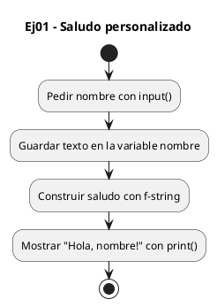
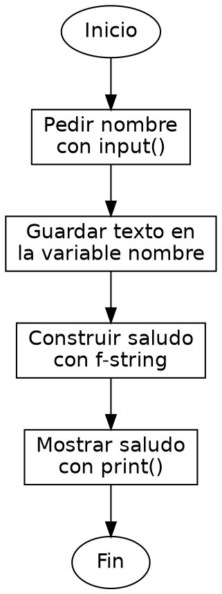

<!-- FICHERO GENERADO — NO EDITAR. Fuente de verdad: curso-python/practica/01-variables/ej01.md (se regenera con gen_course.py). -->

# Ejercicio 01 — Pide el nombre del usuario y muestra un saludo personalizado

Dificultad: verde · Módulo 01 (Variables, tipos y entrada/salida)

## Enunciado

Pide el nombre del usuario y muestra un saludo personalizado

## Diagramas de flujo





## Cómo se resuelve

<!-- EXPLICACION -->
Leer texto del teclado y devolverlo dentro de un mensaje: el "hola mundo" de la entrada y salida en Python.

1. `nombre = input("Escribe tu nombre: ")` — `input()` muestra el texto que le pasas (la pregunta) y espera a que el usuario escriba y pulse Enter. Lo que teclea se guarda en `nombre`. A diferencia de C, no declaras el tipo ni reservas tamaño: la variable nace al asignarle el valor.
2. Lo que devuelve `input()` es siempre un `str` (una cadena de texto). Aquí nos vale tal cual, porque solo queremos mostrarlo, no operar con él.
3. `print(f"Hola, {nombre}! Bienvenida al curso.")` — la `f` antes de las comillas convierte el texto en una f-string: todo lo que pongas entre llaves `{}` se sustituye por el valor de esa variable. Así insertas `nombre` en medio de la frase sin concatenar con `+`.

Trampa habitual: olvidar la `f` inicial. Sin ella, `print("Hola, {nombre}!")` imprime literalmente las llaves y la palabra "nombre", no su contenido.

## Para practicar — cópialo y complétalo

Pega este esqueleto y completa los `TODO`. Es la mejor forma de aprender: inténtalo antes de mirar la solución.

```python
# Curso de Python — Modulo 01: Variables, tipos y E/S
# Ejercicio 01 — PRACTICA (rellena los TODO)
# Enunciado: Pide el nombre del usuario y muestra un saludo personalizado
# Dificultad: verde
# Ejecutar: python3 ej01_practica.py

# TODO: usa input() para pedir el nombre y guarda el resultado en una variable
nombre = ...

# TODO: usa print() con una f-string para mostrar "Hola, <nombre>! Bienvenida al curso."
...
```

## Solución — cópiala y ejecútala

```python
# Curso de Python — Modulo 01: Variables, tipos y E/S
# Ejercicio 01 — MODELO (resuelto)
# Enunciado: Pide el nombre del usuario y muestra un saludo personalizado
# Dificultad: verde
# Ejecutar: python3 ej01_modelo.py

nombre = input("Escribe tu nombre: ")
print(f"Hola, {nombre}! Bienvenida al curso.")
```

## Ejecútalo en el navegador

[▶ Visualízalo paso a paso en Python Tutor](https://pythontutor.com/visualize.html#code=%23+Curso+de+Python+%E2%80%94+Modulo+01%3A+Variables%2C+tipos+y+E%2FS%0A%23+Ejercicio+01+%E2%80%94+MODELO+%28resuelto%29%0A%23+Enunciado%3A+Pide+el+nombre+del+usuario+y+muestra+un+saludo+personalizado%0A%23+Dificultad%3A+verde%0A%23+Ejecutar%3A+python3+ej01_modelo.py%0A%0Anombre+%3D+input%28%22Escribe+tu+nombre%3A+%22%29%0Aprint%28f%22Hola%2C+%7Bnombre%7D%21+Bienvenida+al+curso.%22%29%0A&cumulative=false&curInstr=0&py=3&rawInputLstJSON=%5B%5D) — ve cómo cambian las variables línea a línea.

## Cómo usarlo

Pega el código en un fichero y ejecútalo con tu toolchain habitual (o el botón de Ejecutar de tu editor). Antes de mirar la solución, intenta completar tú el esqueleto: es la mejor forma de aprender.

## Conexiones

- [[Curso_Python/modelo/01-variables|Teoría del módulo]]
- [[Curso_Python/practica/00_README|Índice del curso]]
