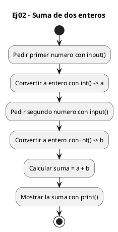
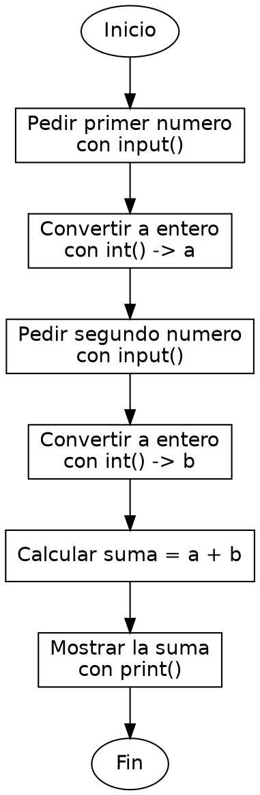

<!-- FICHERO GENERADO — NO EDITAR. Fuente de verdad: curso-python/practica/01-variables/ej02.md (se regenera con gen_course.py). -->

# Ejercicio 02 — Pide dos enteros y muestra su suma

Dificultad: verde · Módulo 01 (Variables, tipos y entrada/salida)

## Enunciado

Pide dos enteros y muestra su suma

## Diagramas de flujo





## Cómo se resuelve

<!-- EXPLICACION -->
Sumar dos números pedidos por teclado obliga a convertir el texto a entero antes de operar: es la lección central del ejercicio.

1. `input("Primer numero: ")` — lee lo que teclea el usuario, pero lo devuelve como `str`. Si sumaras dos cadenas con `+`, Python las pegaría ("2" + "3" daría "23"), no las sumaría.
2. `int(...)` — envuelve al `input()` para convertir esa cadena a un entero de verdad. Por eso escribimos `a = int(input("Primer numero: "))`: primero se lee el texto, luego `int` lo transforma en número.
3. Con `a` y `b` ya como enteros, `suma = a + b` hace la suma aritmética real.
4. `print(f"Suma: {suma}")` — la f-string inserta el resultado en el mensaje.

Trampa habitual: si el usuario escribe algo que no es un número (por ejemplo "hola"), `int()` lanza un `ValueError` y el programa se corta. De momento asumimos que introduce números válidos.

## Para practicar — cópialo y complétalo

Pega este esqueleto y completa los `TODO`. Es la mejor forma de aprender: inténtalo antes de mirar la solución.

```python
# Curso de Python — Modulo 01: Variables, tipos y E/S
# Ejercicio 02 — PRACTICA (rellena los TODO)
# Enunciado: Pide dos enteros y muestra su suma
# Dificultad: verde
# Ejecutar: python3 ej02_practica.py

# TODO: pide el primer numero con input() y convierte a int
a = ...

# TODO: pide el segundo numero con input() y convierte a int
b = ...

# TODO: calcula la suma
suma = ...

# TODO: imprime "Suma: <resultado>" usando una f-string
...
```

## Solución — cópiala y ejecútala

```python
# Curso de Python — Modulo 01: Variables, tipos y E/S
# Ejercicio 02 — MODELO (resuelto)
# Enunciado: Pide dos enteros y muestra su suma
# Dificultad: verde
# Ejecutar: python3 ej02_modelo.py

# input() devuelve str; int() convierte a entero para poder operar
a = int(input("Primer numero: "))
b = int(input("Segundo numero: "))

suma = a + b
print(f"Suma: {suma}")
```

## Ejecútalo en el navegador

[▶ Visualízalo paso a paso en Python Tutor](https://pythontutor.com/visualize.html#code=%23+Curso+de+Python+%E2%80%94+Modulo+01%3A+Variables%2C+tipos+y+E%2FS%0A%23+Ejercicio+02+%E2%80%94+MODELO+%28resuelto%29%0A%23+Enunciado%3A+Pide+dos+enteros+y+muestra+su+suma%0A%23+Dificultad%3A+verde%0A%23+Ejecutar%3A+python3+ej02_modelo.py%0A%0A%23+input%28%29+devuelve+str%3B+int%28%29+convierte+a+entero+para+poder+operar%0Aa+%3D+int%28input%28%22Primer+numero%3A+%22%29%29%0Ab+%3D+int%28input%28%22Segundo+numero%3A+%22%29%29%0A%0Asuma+%3D+a+%2B+b%0Aprint%28f%22Suma%3A+%7Bsuma%7D%22%29%0A&cumulative=false&curInstr=0&py=3&rawInputLstJSON=%5B%5D) — ve cómo cambian las variables línea a línea.

## Cómo usarlo

Pega el código en un fichero y ejecútalo con tu toolchain habitual (o el botón de Ejecutar de tu editor). Antes de mirar la solución, intenta completar tú el esqueleto: es la mejor forma de aprender.

## Conexiones

- [[Curso_Python/modelo/01-variables|Teoría del módulo]]
- [[Curso_Python/practica/00_README|Índice del curso]]
