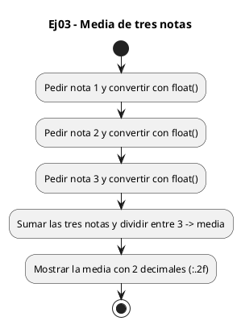
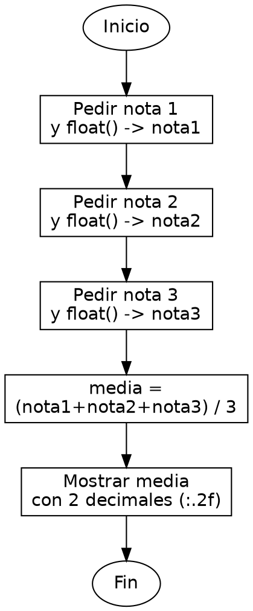

<!-- FICHERO GENERADO — NO EDITAR. Fuente de verdad: curso-python/practica/01-variables/ej03.md (se regenera con gen_course.py). -->

# Ejercicio 03 — Pide tres notas (float) y muestra la media con 2 decimales

Dificultad: verde · Módulo 01 (Variables, tipos y entrada/salida)

## Enunciado

Pide tres notas (float) y muestra la media con 2 decimales

## Diagramas de flujo





## Cómo se resuelve

<!-- EXPLICACION -->
Calcular la media de tres notas introduce dos ideas: convertir a decimal con `float()` y controlar cuántos decimales se muestran.

1. `float(input("Nota 1: "))` — como las notas pueden llevar decimales (7.5), usamos `float()` en vez de `int()` para convertir el texto del `input()` en un número decimal. Con `int()` perderías la parte fraccionaria.
2. `media = (nota1 + nota2 + nota3) / 3` — los paréntesis son imprescindibles: primero se suman las tres notas y luego se divide entre 3. Sin ellos, por la precedencia de operadores, solo se dividiría `nota3`.
3. En Python el operador `/` siempre da un resultado decimal (`float`), aunque las cifras sean redondas, así que la media sale bien sin trucos.
4. `print(f"Media: {media:.2f}")` — dentro de la f-string, el sufijo `:.2f` formatea el número con exactamente dos decimales. Es solo presentación: `media` sigue guardando el valor completo por dentro.

Trampa habitual: confundir `:.2f` (dos decimales) con redondear el valor. Solo cambia cómo se muestra, no lo que vale la variable.

## Para practicar — cópialo y complétalo

Pega este esqueleto y completa los `TODO`. Es la mejor forma de aprender: inténtalo antes de mirar la solución.

```python
# Curso de Python — Modulo 01: Variables, tipos y E/S
# Ejercicio 03 — PRACTICA (rellena los TODO)
# Enunciado: Pide tres notas (float) y muestra la media con 2 decimales
# Dificultad: verde
# Ejecutar: python3 ej03_practica.py

# TODO: pide la nota 1 con input() y convierte a float
nota1 = ...

# TODO: pide la nota 2 con input() y convierte a float
nota2 = ...

# TODO: pide la nota 3 con input() y convierte a float
nota3 = ...

# TODO: calcula la media de las tres notas
media = ...

# TODO: imprime "Media: X.XX" usando :.2f en la f-string para 2 decimales
...
```

## Solución — cópiala y ejecútala

```python
# Curso de Python — Modulo 01: Variables, tipos y E/S
# Ejercicio 03 — MODELO (resuelto)
# Enunciado: Pide tres notas (float) y muestra la media con 2 decimales
# Dificultad: verde
# Ejecutar: python3 ej03_modelo.py

# float() convierte el str de input() a numero decimal
nota1 = float(input("Nota 1: "))
nota2 = float(input("Nota 2: "))
nota3 = float(input("Nota 3: "))

media = (nota1 + nota2 + nota3) / 3

# :.2f dentro de la f-string formatea con exactamente 2 decimales
print(f"Media: {media:.2f}")
```

## Ejecútalo en el navegador

<div class="pyodide-run" data-code="IyBDdXJzbyBkZSBQeXRob24g4oCUIE1vZHVsbyAwMTogVmFyaWFibGVzLCB0aXBvcyB5IEUvUwojIEVqZXJjaWNpbyAwMyDigJQgTU9ERUxPIChyZXN1ZWx0bykKIyBFbnVuY2lhZG86IFBpZGUgdHJlcyBub3RhcyAoZmxvYXQpIHkgbXVlc3RyYSBsYSBtZWRpYSBjb24gMiBkZWNpbWFsZXMKIyBEaWZpY3VsdGFkOiB2ZXJkZQojIEVqZWN1dGFyOiBweXRob24zIGVqMDNfbW9kZWxvLnB5CgojIGZsb2F0KCkgY29udmllcnRlIGVsIHN0ciBkZSBpbnB1dCgpIGEgbnVtZXJvIGRlY2ltYWwKbm90YTEgPSBmbG9hdChpbnB1dCgiTm90YSAxOiAiKSkKbm90YTIgPSBmbG9hdChpbnB1dCgiTm90YSAyOiAiKSkKbm90YTMgPSBmbG9hdChpbnB1dCgiTm90YSAzOiAiKSkKCm1lZGlhID0gKG5vdGExICsgbm90YTIgKyBub3RhMykgLyAzCgojIDouMmYgZGVudHJvIGRlIGxhIGYtc3RyaW5nIGZvcm1hdGVhIGNvbiBleGFjdGFtZW50ZSAyIGRlY2ltYWxlcwpwcmludChmIk1lZGlhOiB7bWVkaWE6LjJmfSIpCg==">
<button class="pyodide-btn" type="button">▶ Ejecutar aquí (Python en el navegador)</button>
<textarea class="pyodide-stdin" rows="2" placeholder="Si el programa pide datos por teclado, escríbelos aquí, uno por línea"></textarea>
<pre class="pyodide-out" hidden></pre>
</div>

[▶ Visualízalo paso a paso en Python Tutor](https://pythontutor.com/visualize.html#code=%23+Curso+de+Python+%E2%80%94+Modulo+01%3A+Variables%2C+tipos+y+E%2FS%0A%23+Ejercicio+03+%E2%80%94+MODELO+%28resuelto%29%0A%23+Enunciado%3A+Pide+tres+notas+%28float%29+y+muestra+la+media+con+2+decimales%0A%23+Dificultad%3A+verde%0A%23+Ejecutar%3A+python3+ej03_modelo.py%0A%0A%23+float%28%29+convierte+el+str+de+input%28%29+a+numero+decimal%0Anota1+%3D+float%28input%28%22Nota+1%3A+%22%29%29%0Anota2+%3D+float%28input%28%22Nota+2%3A+%22%29%29%0Anota3+%3D+float%28input%28%22Nota+3%3A+%22%29%29%0A%0Amedia+%3D+%28nota1+%2B+nota2+%2B+nota3%29+%2F+3%0A%0A%23+%3A.2f+dentro+de+la+f-string+formatea+con+exactamente+2+decimales%0Aprint%28f%22Media%3A+%7Bmedia%3A.2f%7D%22%29%0A&cumulative=false&curInstr=0&py=3&rawInputLstJSON=%5B%5D) — ve cómo cambian las variables línea a línea.

## Cómo usarlo

Pega el código en un fichero y ejecútalo con tu toolchain habitual (o el botón de Ejecutar de tu editor). Antes de mirar la solución, intenta completar tú el esqueleto: es la mejor forma de aprender.

## Conexiones

- [[Curso_Python/modelo/01-variables|Teoría del módulo]]
- [[Curso_Python/practica/00_README|Índice del curso]]
