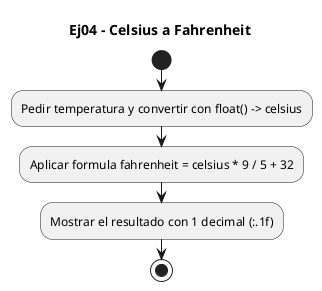
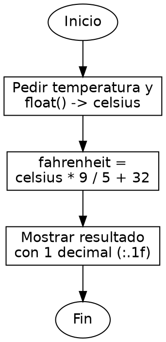

<!-- FICHERO GENERADO — NO EDITAR. Fuente de verdad: curso-python/practica/01-variables/ej04.md (se regenera con gen_course.py). -->

# Ejercicio 04 — Pide temperatura en Celsius y convierte a Fahrenheit

Dificultad: verde · Módulo 01 (Variables, tipos y entrada/salida)

## Enunciado

Pide temperatura en Celsius y convierte a Fahrenheit

## Diagramas de flujo





## Cómo se resuelve

<!-- EXPLICACION -->
Convertir grados Celsius a Fahrenheit es aplicar una fórmula, pero esconde una diferencia importante entre Python y C al dividir.

1. `celsius = float(input("Temperatura en Celsius: "))` — leemos la temperatura como decimal, porque puede ser 36.6, no solo enteros.
2. `fahrenheit = celsius * 9 / 5 + 32` — la fórmula es F = C * 9/5 + 32. En Python `9 / 5` da `1.8` aunque ambos sean enteros, porque `/` siempre produce un `float`. En C, `9/5` entre enteros daría `1` y la conversión saldría mal: aquí no hace falta escribir `9.0/5.0`.
3. El orden respeta la precedencia normal: primero `*` y `/`, luego `+`. No hacen falta paréntesis.
4. `print(f"{celsius} C = {fahrenheit:.1f} F")` — una sola f-string coloca las dos variables; `:.1f` muestra los Fahrenheit con un decimal.

Trampa habitual: venir de C y "proteger" la división escribiendo enteros, o creer que `9/5` se trunca. En Python no pasa; el que trunca es `//`.

## Para practicar — cópialo y complétalo

Pega este esqueleto y completa los `TODO`. Es la mejor forma de aprender: inténtalo antes de mirar la solución.

```python
# Curso de Python — Modulo 01: Variables, tipos y E/S
# Ejercicio 04 — PRACTICA (rellena los TODO)
# Enunciado: Pide temperatura en Celsius y convierte a Fahrenheit
# Dificultad: verde
# Ejecutar: python3 ej04_practica.py

# TODO: pide la temperatura en Celsius con input() y convierte a float
celsius = ...

# TODO: aplica la formula F = C * 9/5 + 32
# Pista: en Python 9/5 ya es 1.8, no hace falta cast como en C
fahrenheit = ...

# TODO: imprime "<celsius> C = <fahrenheit> F" con 1 decimal para fahrenheit
...
```

## Solución — cópiala y ejecútala

```python
# Curso de Python — Modulo 01: Variables, tipos y E/S
# Ejercicio 04 — MODELO (resuelto)
# Enunciado: Pide temperatura en Celsius y convierte a Fahrenheit
# Dificultad: verde
# Ejecutar: python3 ej04_modelo.py

celsius = float(input("Temperatura en Celsius: "))

# Formula: F = C * 9/5 + 32
# En Python 9/5 es 1.8 (float), no 1 como en C con enteros
fahrenheit = celsius * 9 / 5 + 32

print(f"{celsius} C = {fahrenheit:.1f} F")
```

## Ejecútalo en el navegador

<div class="pyodide-run" data-code="IyBDdXJzbyBkZSBQeXRob24g4oCUIE1vZHVsbyAwMTogVmFyaWFibGVzLCB0aXBvcyB5IEUvUwojIEVqZXJjaWNpbyAwNCDigJQgTU9ERUxPIChyZXN1ZWx0bykKIyBFbnVuY2lhZG86IFBpZGUgdGVtcGVyYXR1cmEgZW4gQ2Vsc2l1cyB5IGNvbnZpZXJ0ZSBhIEZhaHJlbmhlaXQKIyBEaWZpY3VsdGFkOiB2ZXJkZQojIEVqZWN1dGFyOiBweXRob24zIGVqMDRfbW9kZWxvLnB5CgpjZWxzaXVzID0gZmxvYXQoaW5wdXQoIlRlbXBlcmF0dXJhIGVuIENlbHNpdXM6ICIpKQoKIyBGb3JtdWxhOiBGID0gQyAqIDkvNSArIDMyCiMgRW4gUHl0aG9uIDkvNSBlcyAxLjggKGZsb2F0KSwgbm8gMSBjb21vIGVuIEMgY29uIGVudGVyb3MKZmFocmVuaGVpdCA9IGNlbHNpdXMgKiA5IC8gNSArIDMyCgpwcmludChmIntjZWxzaXVzfSBDID0ge2ZhaHJlbmhlaXQ6LjFmfSBGIikK">
<button class="pyodide-btn" type="button">▶ Ejecutar aquí (Python en el navegador)</button>
<textarea class="pyodide-stdin" rows="2" placeholder="Si el programa pide datos por teclado, escríbelos aquí, uno por línea"></textarea>
<pre class="pyodide-out" hidden></pre>
</div>

[▶ Visualízalo paso a paso en Python Tutor](https://pythontutor.com/visualize.html#code=%23+Curso+de+Python+%E2%80%94+Modulo+01%3A+Variables%2C+tipos+y+E%2FS%0A%23+Ejercicio+04+%E2%80%94+MODELO+%28resuelto%29%0A%23+Enunciado%3A+Pide+temperatura+en+Celsius+y+convierte+a+Fahrenheit%0A%23+Dificultad%3A+verde%0A%23+Ejecutar%3A+python3+ej04_modelo.py%0A%0Acelsius+%3D+float%28input%28%22Temperatura+en+Celsius%3A+%22%29%29%0A%0A%23+Formula%3A+F+%3D+C+%2A+9%2F5+%2B+32%0A%23+En+Python+9%2F5+es+1.8+%28float%29%2C+no+1+como+en+C+con+enteros%0Afahrenheit+%3D+celsius+%2A+9+%2F+5+%2B+32%0A%0Aprint%28f%22%7Bcelsius%7D+C+%3D+%7Bfahrenheit%3A.1f%7D+F%22%29%0A&cumulative=false&curInstr=0&py=3&rawInputLstJSON=%5B%5D) — ve cómo cambian las variables línea a línea.

## Cómo usarlo

Pega el código en un fichero y ejecútalo con tu toolchain habitual (o el botón de Ejecutar de tu editor). Antes de mirar la solución, intenta completar tú el esqueleto: es la mejor forma de aprender.

## Conexiones

- [[Curso_Python/modelo/01-variables|Teoría del módulo]]
- [[Curso_Python/practica/00_README|Índice del curso]]
