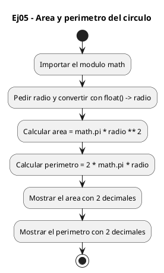
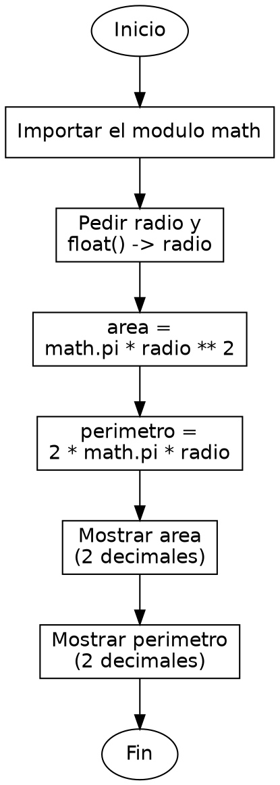

<!-- FICHERO GENERADO — NO EDITAR. Fuente de verdad: curso-python/practica/01-variables/ej05.md (se regenera con gen_course.py). -->

# Ejercicio 05 — Pide radio (float) y muestra area y perimetro del circulo

Dificultad: amarillo · Módulo 01 (Variables, tipos y entrada/salida)

## Enunciado

Pide radio (float) y muestra area y perimetro del circulo

## Diagramas de flujo





## Cómo se resuelve

<!-- EXPLICACION -->
Área y perímetro de un círculo: se necesita el valor de pi (que no viene "de serie" en el lenguaje) y el operador de potencia.

1. `import math` — pi no es una palabra reservada de Python; vive en el módulo `math` de la librería estándar. Con `import math` al principio del fichero lo dejamos disponible y accedemos a la constante con `math.pi`.
2. `radio = float(input("Radio del circulo: "))` — el radio se lee como decimal porque casi nunca es un entero exacto.
3. `area = math.pi * radio ** 2` — `**` es el operador de potencia, así que `radio ** 2` es el radio al cuadrado (r^2). Además `**` tiene más prioridad que `*`, por lo que primero se calcula el cuadrado y luego se multiplica por pi, sin necesidad de paréntesis.
4. `perimetro = 2 * math.pi * radio` — aplicación directa de 2·pi·r.
5. Los dos `print` con `:.2f` muestran cada resultado con dos decimales.

Trampa habitual: escribir `radio ^ 2` pensando en potencia. En Python `^` es un operador de bits (XOR), no elevar; la potencia es `**`.

## Para practicar — cópialo y complétalo

Pega este esqueleto y completa los `TODO`. Es la mejor forma de aprender: inténtalo antes de mirar la solución.

```python
# Curso de Python — Modulo 01: Variables, tipos y E/S
# Ejercicio 05 — PRACTICA (rellena los TODO)
# Enunciado: Pide radio (float) y muestra area y perimetro del circulo
# Dificultad: amarillo
# Ejecutar: python3 ej05_practica.py

# TODO: importa el modulo math para tener acceso a math.pi
...

# TODO: pide el radio con input() y convierte a float
radio = ...

# TODO: calcula el area (pi * r^2). Pista: usa ** para la potencia
area = ...

# TODO: calcula el perimetro (2 * pi * r)
perimetro = ...

# TODO: imprime "Area: X.XX" con 2 decimales
...

# TODO: imprime "Perimetro: X.XX" con 2 decimales
...
```

## Solución — cópiala y ejecútala

```python
# Curso de Python — Modulo 01: Variables, tipos y E/S
# Ejercicio 05 — MODELO (resuelto)
# Enunciado: Pide radio (float) y muestra area y perimetro del circulo
# Dificultad: amarillo
# Ejecutar: python3 ej05_modelo.py

# math.pi es la constante pi de la libreria estandar
import math

radio = float(input("Radio del circulo: "))

area = math.pi * radio ** 2         # pi * r^2
perimetro = 2 * math.pi * radio     # 2 * pi * r

print(f"Area: {area:.2f}")
print(f"Perimetro: {perimetro:.2f}")
```

## Ejecútalo en el navegador

<div class="pyodide-run" data-code="IyBDdXJzbyBkZSBQeXRob24g4oCUIE1vZHVsbyAwMTogVmFyaWFibGVzLCB0aXBvcyB5IEUvUwojIEVqZXJjaWNpbyAwNSDigJQgTU9ERUxPIChyZXN1ZWx0bykKIyBFbnVuY2lhZG86IFBpZGUgcmFkaW8gKGZsb2F0KSB5IG11ZXN0cmEgYXJlYSB5IHBlcmltZXRybyBkZWwgY2lyY3VsbwojIERpZmljdWx0YWQ6IGFtYXJpbGxvCiMgRWplY3V0YXI6IHB5dGhvbjMgZWowNV9tb2RlbG8ucHkKCiMgbWF0aC5waSBlcyBsYSBjb25zdGFudGUgcGkgZGUgbGEgbGlicmVyaWEgZXN0YW5kYXIKaW1wb3J0IG1hdGgKCnJhZGlvID0gZmxvYXQoaW5wdXQoIlJhZGlvIGRlbCBjaXJjdWxvOiAiKSkKCmFyZWEgPSBtYXRoLnBpICogcmFkaW8gKiogMiAgICAgICAgICMgcGkgKiByXjIKcGVyaW1ldHJvID0gMiAqIG1hdGgucGkgKiByYWRpbyAgICAgIyAyICogcGkgKiByCgpwcmludChmIkFyZWE6IHthcmVhOi4yZn0iKQpwcmludChmIlBlcmltZXRybzoge3BlcmltZXRybzouMmZ9IikK">
<button class="pyodide-btn" type="button">▶ Ejecutar aquí (Python en el navegador)</button>
<textarea class="pyodide-stdin" rows="2" placeholder="Si el programa pide datos por teclado, escríbelos aquí, uno por línea"></textarea>
<pre class="pyodide-out" hidden></pre>
</div>

[▶ Visualízalo paso a paso en Python Tutor](https://pythontutor.com/visualize.html#code=%23+Curso+de+Python+%E2%80%94+Modulo+01%3A+Variables%2C+tipos+y+E%2FS%0A%23+Ejercicio+05+%E2%80%94+MODELO+%28resuelto%29%0A%23+Enunciado%3A+Pide+radio+%28float%29+y+muestra+area+y+perimetro+del+circulo%0A%23+Dificultad%3A+amarillo%0A%23+Ejecutar%3A+python3+ej05_modelo.py%0A%0A%23+math.pi+es+la+constante+pi+de+la+libreria+estandar%0Aimport+math%0A%0Aradio+%3D+float%28input%28%22Radio+del+circulo%3A+%22%29%29%0A%0Aarea+%3D+math.pi+%2A+radio+%2A%2A+2+++++++++%23+pi+%2A+r%5E2%0Aperimetro+%3D+2+%2A+math.pi+%2A+radio+++++%23+2+%2A+pi+%2A+r%0A%0Aprint%28f%22Area%3A+%7Barea%3A.2f%7D%22%29%0Aprint%28f%22Perimetro%3A+%7Bperimetro%3A.2f%7D%22%29%0A&cumulative=false&curInstr=0&py=3&rawInputLstJSON=%5B%5D) — ve cómo cambian las variables línea a línea.

## Cómo usarlo

Pega el código en un fichero y ejecútalo con tu toolchain habitual (o el botón de Ejecutar de tu editor). Antes de mirar la solución, intenta completar tú el esqueleto: es la mejor forma de aprender.

## Conexiones

- [[Curso_Python/modelo/01-variables|Teoría del módulo]]
- [[Curso_Python/practica/00_README|Índice del curso]]
