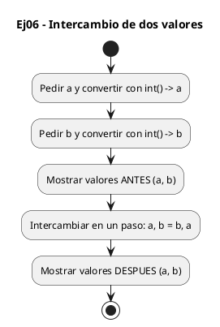
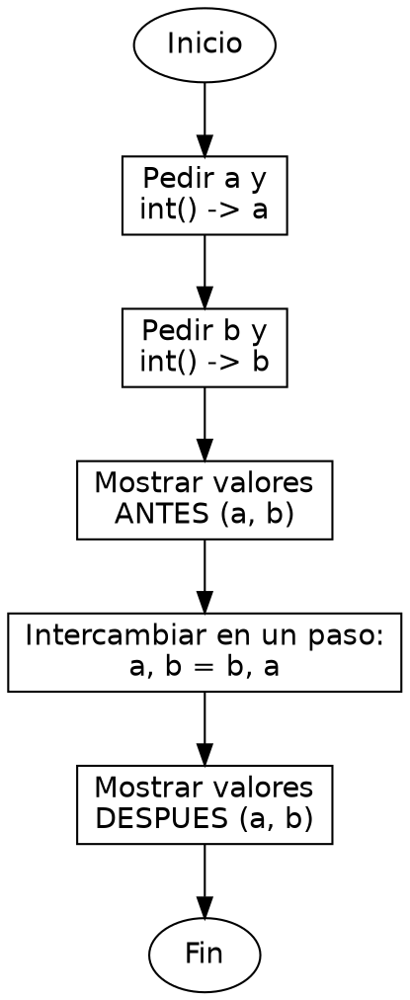

<!-- FICHERO GENERADO — NO EDITAR. Fuente de verdad: curso-python/practica/01-variables/ej06.md (se regenera con gen_course.py). -->

# Ejercicio 06 — Pide dos enteros, los intercambia e imprime valores antes y después

Dificultad: amarillo · Módulo 01 (Variables, tipos y entrada/salida)

## Enunciado

Pide dos enteros, los intercambia e imprime valores antes y después

## Diagramas de flujo





## Cómo se resuelve

<!-- EXPLICACION -->
Intercambiar el valor de dos variables es donde Python enseña un truco que en C exige una variable temporal.

1. `a = int(input("Valor de a: "))` y su gemelo para `b` — leemos los dos enteros convirtiendo el texto con `int()`.
2. `print(f"Antes:  a={a}  b={b}")` — mostramos el estado inicial para poder comparar. Dentro de la f-string cada `{a}` y `{b}` se sustituye por su valor.
3. `a, b = b, a` — esta es la clave. Python evalúa primero todo el lado derecho (`b, a`) formando una pareja de valores en memoria, y solo después la reparte sobre el lado izquierdo. Por eso `a` recibe el antiguo `b` y `b` el antiguo `a` de golpe, sin pisarse.
4. En C tendrías que hacer `tmp = a; a = b; b = tmp;` porque la asignación es de uno en uno; aquí la asignación múltiple lo resuelve en una línea.
5. El segundo `print` muestra los valores ya intercambiados.

Trampa habitual: creer que `a = b` seguido de `b = a` sirve. No: tras `a = b` el valor original de `a` ya se ha perdido, y `b` acabaría con el valor de `b`. La asignación simultánea `a, b = b, a` es lo que lo evita.

## Para practicar — cópialo y complétalo

Pega este esqueleto y completa los `TODO`. Es la mejor forma de aprender: inténtalo antes de mirar la solución.

```python
# Curso de Python — Modulo 01: Variables, tipos y E/S
# Ejercicio 06 — PRACTICA (rellena los TODO)
# Enunciado: Pide dos enteros, los intercambia e imprime valores antes y después
# Dificultad: amarillo
# Ejecutar: python3 ej06_practica.py

# TODO: pide el valor de a con input() y convierte a int
a = ...

# TODO: pide el valor de b con input() y convierte a int
b = ...

# TODO: imprime "Antes: a=<a>  b=<b>"
...

# TODO: intercambia a y b en UNA sola linea (sin variable auxiliar)
# Pista: Python permite  a, b = b, a
...

# TODO: imprime "Despues: a=<a>  b=<b>"
...
```

## Solución — cópiala y ejecútala

```python
# Curso de Python — Modulo 01: Variables, tipos y E/S
# Ejercicio 06 — MODELO (resuelto)
# Enunciado: Pide dos enteros, los intercambia e imprime valores antes y después
# Dificultad: amarillo
# Ejecutar: python3 ej06_modelo.py

a = int(input("Valor de a: "))
b = int(input("Valor de b: "))

print(f"Antes:  a={a}  b={b}")

# Python evalua el lado derecho completo antes de asignar:
# no necesita variable temporal como en C (tmp = a; a = b; b = tmp;)
a, b = b, a

print(f"Despues: a={a}  b={b}")
```

## Ejecútalo en el navegador

[▶ Visualízalo paso a paso en Python Tutor](https://pythontutor.com/visualize.html#code=%23+Curso+de+Python+%E2%80%94+Modulo+01%3A+Variables%2C+tipos+y+E%2FS%0A%23+Ejercicio+06+%E2%80%94+MODELO+%28resuelto%29%0A%23+Enunciado%3A+Pide+dos+enteros%2C+los+intercambia+e+imprime+valores+antes+y+despu%C3%A9s%0A%23+Dificultad%3A+amarillo%0A%23+Ejecutar%3A+python3+ej06_modelo.py%0A%0Aa+%3D+int%28input%28%22Valor+de+a%3A+%22%29%29%0Ab+%3D+int%28input%28%22Valor+de+b%3A+%22%29%29%0A%0Aprint%28f%22Antes%3A++a%3D%7Ba%7D++b%3D%7Bb%7D%22%29%0A%0A%23+Python+evalua+el+lado+derecho+completo+antes+de+asignar%3A%0A%23+no+necesita+variable+temporal+como+en+C+%28tmp+%3D+a%3B+a+%3D+b%3B+b+%3D+tmp%3B%29%0Aa%2C+b+%3D+b%2C+a%0A%0Aprint%28f%22Despues%3A+a%3D%7Ba%7D++b%3D%7Bb%7D%22%29%0A&cumulative=false&curInstr=0&py=3&rawInputLstJSON=%5B%5D) — ve cómo cambian las variables línea a línea.

## Cómo usarlo

Pega el código en un fichero y ejecútalo con tu toolchain habitual (o el botón de Ejecutar de tu editor). Antes de mirar la solución, intenta completar tú el esqueleto: es la mejor forma de aprender.

## Conexiones

- [[Curso_Python/modelo/01-variables|Teoría del módulo]]
- [[Curso_Python/practica/00_README|Índice del curso]]
