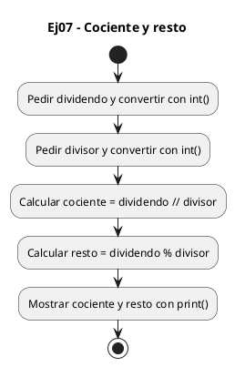
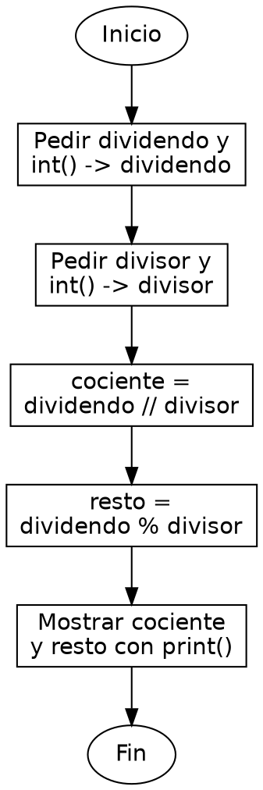

<!-- FICHERO GENERADO — NO EDITAR. Fuente de verdad: curso-python/practica/01-variables/ej07.md (se regenera con gen_course.py). -->

# Ejercicio 07 — Pide dividendo y divisor, muestra cociente entero y resto

Dificultad: amarillo · Módulo 01 (Variables, tipos y entrada/salida)

## Enunciado

Pide dividendo y divisor, muestra cociente entero y resto

## Diagramas de flujo





## Cómo se resuelve

<!-- EXPLICACION -->
Sacar cociente y resto de una división entera distingue dos operadores que es fácil confundir: `//` y `%`.

1. `dividendo = int(input("Dividendo: "))` y `divisor = int(input("Divisor: "))` — leemos ambos como enteros, porque la división entera solo tiene sentido con números enteros.
2. `cociente = dividendo // divisor` — `//` es la división entera: descarta la parte decimal y da cuántas veces cabe el divisor. Por ejemplo `17 // 5` es `3`. Ojo, no es lo mismo que `/`, que daría `3.4`.
3. `resto = dividendo % divisor` — `%` es el módulo, lo que sobra tras esa división. `17 % 5` es `2`. Se cumple siempre que `divisor * cociente + resto` reconstruye el dividendo.
4. `print(f"{dividendo} // {divisor} = {cociente}, resto {resto}")` — la f-string monta el mensaje. Fíjate en que aquí `//` va como texto literal dentro de las comillas, no como operación; lo que se calcula ya está en las variables.

Trampa habitual: usar `/` cuando quieres el cociente entero. `/` siempre devuelve un `float` en Python, aunque la división sea exacta; para quedarte con el entero necesitas `//`.

## Para practicar — cópialo y complétalo

Pega este esqueleto y completa los `TODO`. Es la mejor forma de aprender: inténtalo antes de mirar la solución.

```python
# Curso de Python — Modulo 01: Variables, tipos y E/S
# Ejercicio 07 — PRACTICA (rellena los TODO)
# Enunciado: Pide dividendo y divisor, muestra cociente entero y resto
# Dificultad: amarillo
# Ejecutar: python3 ej07_practica.py

# TODO: pide el dividendo con input() y convierte a int
dividendo = ...

# TODO: pide el divisor con input() y convierte a int
divisor = ...

# TODO: calcula el cociente entero usando //  (NO uses /, que da float)
cociente = ...

# TODO: calcula el resto usando %
resto = ...

# TODO: imprime "<dividendo> // <divisor> = <cociente>, resto <resto>"
...
```

## Solución — cópiala y ejecútala

```python
# Curso de Python — Modulo 01: Variables, tipos y E/S
# Ejercicio 07 — MODELO (resuelto)
# Enunciado: Pide dividendo y divisor, muestra cociente entero y resto
# Dificultad: amarillo
# Ejecutar: python3 ej07_modelo.py

dividendo = int(input("Dividendo: "))
divisor = int(input("Divisor: "))

# // es division entera (equivalente a int/int de C)
# %  es el resto (igual que en C)
cociente = dividendo // divisor
resto = dividendo % divisor

print(f"{dividendo} // {divisor} = {cociente}, resto {resto}")
```

## Ejecútalo en el navegador

<div class="pyodide-run" data-code="IyBDdXJzbyBkZSBQeXRob24g4oCUIE1vZHVsbyAwMTogVmFyaWFibGVzLCB0aXBvcyB5IEUvUwojIEVqZXJjaWNpbyAwNyDigJQgTU9ERUxPIChyZXN1ZWx0bykKIyBFbnVuY2lhZG86IFBpZGUgZGl2aWRlbmRvIHkgZGl2aXNvciwgbXVlc3RyYSBjb2NpZW50ZSBlbnRlcm8geSByZXN0bwojIERpZmljdWx0YWQ6IGFtYXJpbGxvCiMgRWplY3V0YXI6IHB5dGhvbjMgZWowN19tb2RlbG8ucHkKCmRpdmlkZW5kbyA9IGludChpbnB1dCgiRGl2aWRlbmRvOiAiKSkKZGl2aXNvciA9IGludChpbnB1dCgiRGl2aXNvcjogIikpCgojIC8vIGVzIGRpdmlzaW9uIGVudGVyYSAoZXF1aXZhbGVudGUgYSBpbnQvaW50IGRlIEMpCiMgJSAgZXMgZWwgcmVzdG8gKGlndWFsIHF1ZSBlbiBDKQpjb2NpZW50ZSA9IGRpdmlkZW5kbyAvLyBkaXZpc29yCnJlc3RvID0gZGl2aWRlbmRvICUgZGl2aXNvcgoKcHJpbnQoZiJ7ZGl2aWRlbmRvfSAvLyB7ZGl2aXNvcn0gPSB7Y29jaWVudGV9LCByZXN0byB7cmVzdG99IikK">
<button class="pyodide-btn" type="button">▶ Ejecutar aquí (Python en el navegador)</button>
<textarea class="pyodide-stdin" rows="2" placeholder="Si el programa pide datos por teclado, escríbelos aquí, uno por línea"></textarea>
<pre class="pyodide-out" hidden></pre>
</div>

[▶ Visualízalo paso a paso en Python Tutor](https://pythontutor.com/visualize.html#code=%23+Curso+de+Python+%E2%80%94+Modulo+01%3A+Variables%2C+tipos+y+E%2FS%0A%23+Ejercicio+07+%E2%80%94+MODELO+%28resuelto%29%0A%23+Enunciado%3A+Pide+dividendo+y+divisor%2C+muestra+cociente+entero+y+resto%0A%23+Dificultad%3A+amarillo%0A%23+Ejecutar%3A+python3+ej07_modelo.py%0A%0Adividendo+%3D+int%28input%28%22Dividendo%3A+%22%29%29%0Adivisor+%3D+int%28input%28%22Divisor%3A+%22%29%29%0A%0A%23+%2F%2F+es+division+entera+%28equivalente+a+int%2Fint+de+C%29%0A%23+%25++es+el+resto+%28igual+que+en+C%29%0Acociente+%3D+dividendo+%2F%2F+divisor%0Aresto+%3D+dividendo+%25+divisor%0A%0Aprint%28f%22%7Bdividendo%7D+%2F%2F+%7Bdivisor%7D+%3D+%7Bcociente%7D%2C+resto+%7Bresto%7D%22%29%0A&cumulative=false&curInstr=0&py=3&rawInputLstJSON=%5B%5D) — ve cómo cambian las variables línea a línea.

## Cómo usarlo

Pega el código en un fichero y ejecútalo con tu toolchain habitual (o el botón de Ejecutar de tu editor). Antes de mirar la solución, intenta completar tú el esqueleto: es la mejor forma de aprender.

## Conexiones

- [[Curso_Python/modelo/01-variables|Teoría del módulo]]
- [[Curso_Python/practica/00_README|Índice del curso]]
