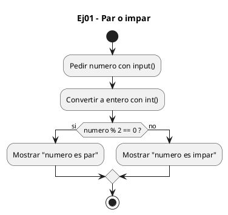
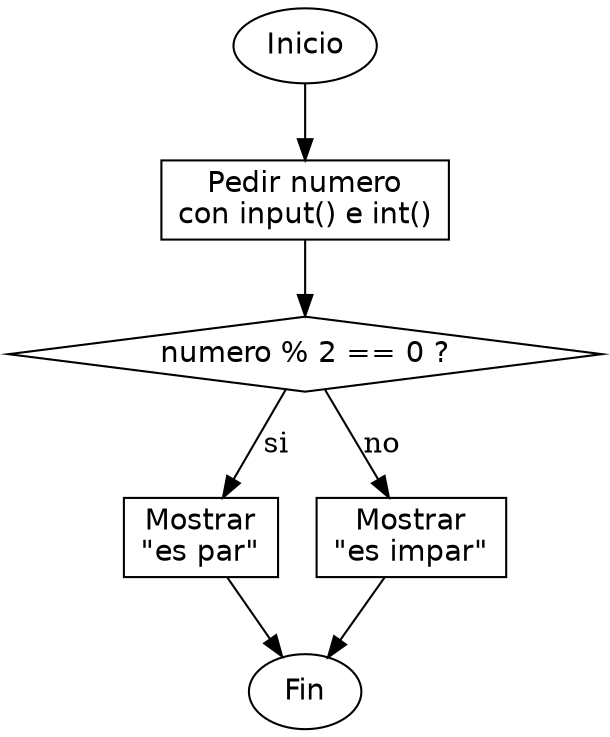

<!-- FICHERO GENERADO — NO EDITAR. Fuente de verdad: curso-python/practica/02-condicionales/ej01.md (se regenera con gen_course.py). -->

# Ejercicio 01 — Pide un entero e indica si es par o impar

Dificultad: verde · Módulo 02 (Condicionales)

## Enunciado

Pide un entero e indica si es par o impar

## Diagramas de flujo





## Cómo se resuelve

<!-- EXPLICACION -->
Decidir si un número es par o impar se reduce a mirar el resto de dividir entre 2: esa es la lección central del ejercicio.

1. `numero = int(input("Introduce un numero: "))` — leemos el texto y lo convertimos a entero con `int()`, porque el operador que viene solo tiene sentido sobre números.
2. `numero % 2` — el operador módulo `%` da el resto de la división entera. Un número es par exactamente cuando ese resto es cero, así que `numero % 2 == 0` es la pregunta "¿es par?". Fíjate en que `==` compara (devuelve True o False) mientras que `=` asignaría.
3. `if ... : ... else: ...` — si la condición es verdadera se ejecuta la primera rama; en cualquier otro caso (resto 1), la del `else`. No hacen falta más ramas porque el resto de dividir entre 2 solo puede ser 0 o 1.
4. Igual que en C, `%` y `if/else` funcionan idéntico; la diferencia es que en Python el bloque se marca con la indentación y los dos puntos, no con llaves `{ }`.

Trampa habitual: escribir `if numero % 2 = 0` con un solo `=`. Eso es una asignación, no una comparación, y Python lanza un `SyntaxError`. Para comparar siempre `==`.

## Para practicar — cópialo y complétalo

Pega este esqueleto y completa los `TODO`. Es la mejor forma de aprender: inténtalo antes de mirar la solución.

```python
# Curso de Python — Modulo 02: Condicionales
# Ejercicio 01 — PRACTICA (rellena los TODO)
# Enunciado: Pide un entero e indica si es par o impar
# Dificultad: verde
# Ejecutar: python3 ej01_practica.py

# TODO: pide un numero al usuario y convierte la cadena a entero
numero = None  # reemplaza None con la llamada correcta

# TODO: si el resto de dividir numero entre 2 es 0, es par; si no, impar
#       imprime: "<numero> es par"  o  "<numero> es impar"
```

## Solución — cópiala y ejecútala

```python
# Curso de Python — Modulo 02: Condicionales
# Ejercicio 01 — MODELO (resuelto)
# Enunciado: Pide un entero e indica si es par o impar
# Dificultad: verde
# Ejecutar: python3 ej01_modelo.py

numero = int(input("Introduce un numero: "))

if numero % 2 == 0:
    print(f"{numero} es par")
else:
    print(f"{numero} es impar")
```

## Ejecútalo en el navegador

<div class="pyodide-run" data-code="IyBDdXJzbyBkZSBQeXRob24g4oCUIE1vZHVsbyAwMjogQ29uZGljaW9uYWxlcwojIEVqZXJjaWNpbyAwMSDigJQgTU9ERUxPIChyZXN1ZWx0bykKIyBFbnVuY2lhZG86IFBpZGUgdW4gZW50ZXJvIGUgaW5kaWNhIHNpIGVzIHBhciBvIGltcGFyCiMgRGlmaWN1bHRhZDogdmVyZGUKIyBFamVjdXRhcjogcHl0aG9uMyBlajAxX21vZGVsby5weQoKbnVtZXJvID0gaW50KGlucHV0KCJJbnRyb2R1Y2UgdW4gbnVtZXJvOiAiKSkKCmlmIG51bWVybyAlIDIgPT0gMDoKICAgIHByaW50KGYie251bWVyb30gZXMgcGFyIikKZWxzZToKICAgIHByaW50KGYie251bWVyb30gZXMgaW1wYXIiKQo=">
<button class="pyodide-btn" type="button">▶ Ejecutar aquí (Python en el navegador)</button>
<textarea class="pyodide-stdin" rows="2" placeholder="Si el programa pide datos por teclado, escríbelos aquí, uno por línea"></textarea>
<pre class="pyodide-out" hidden></pre>
</div>

[▶ Visualízalo paso a paso en Python Tutor](https://pythontutor.com/visualize.html#code=%23+Curso+de+Python+%E2%80%94+Modulo+02%3A+Condicionales%0A%23+Ejercicio+01+%E2%80%94+MODELO+%28resuelto%29%0A%23+Enunciado%3A+Pide+un+entero+e+indica+si+es+par+o+impar%0A%23+Dificultad%3A+verde%0A%23+Ejecutar%3A+python3+ej01_modelo.py%0A%0Anumero+%3D+int%28input%28%22Introduce+un+numero%3A+%22%29%29%0A%0Aif+numero+%25+2+%3D%3D+0%3A%0A++++print%28f%22%7Bnumero%7D+es+par%22%29%0Aelse%3A%0A++++print%28f%22%7Bnumero%7D+es+impar%22%29%0A&cumulative=false&curInstr=0&py=3&rawInputLstJSON=%5B%5D) — ve cómo cambian las variables línea a línea.

## Cómo usarlo

Pega el código en un fichero y ejecútalo con tu toolchain habitual (o el botón de Ejecutar de tu editor). Antes de mirar la solución, intenta completar tú el esqueleto: es la mejor forma de aprender.

## Conexiones

- [[Curso_Python/modelo/02-condicionales|Teoría del módulo]]
- [[Curso_Python/practica/00_README|Índice del curso]]
