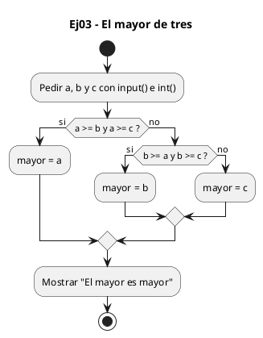
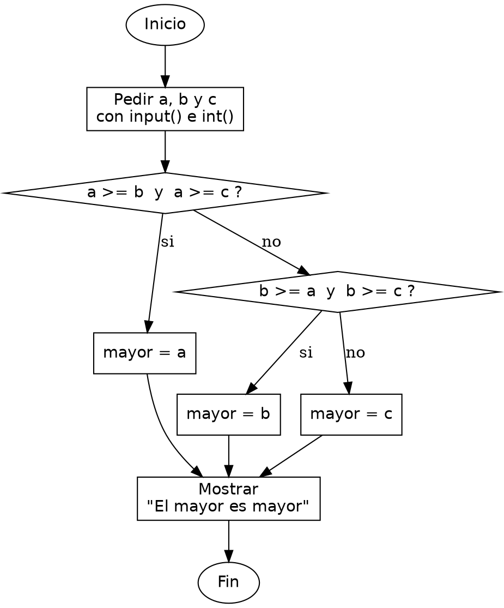

<!-- FICHERO GENERADO — NO EDITAR. Fuente de verdad: curso-python/practica/02-condicionales/ej03.md (se regenera con gen_course.py). -->

# Ejercicio 03 — Pide tres enteros e imprime el mayor de los tres

Dificultad: amarillo · Módulo 02 (Condicionales)

## Enunciado

Pide tres enteros e imprime el mayor de los tres

## Diagramas de flujo





## Cómo se resuelve

<!-- EXPLICACION -->
Encontrar el mayor de tres números obliga a combinar varias comparaciones en una sola condición con el operador `and`.

1. Leemos `a`, `b` y `c` como enteros con `int(input(...))`.
2. `if a >= b and a >= c:` — `a` es el mayor solo si es mayor o igual que los otros dos a la vez. `and` es verdadero únicamente cuando sus dos lados lo son; por eso encadenamos las dos comparaciones. Usamos `>=` (no `>`) para que un empate no deje el problema sin solución.
3. `elif b >= a and b >= c:` — si `a` no ganó, repetimos la misma idea con `b` frente a los otros dos.
4. `else: mayor = c` — si ni `a` ni `b` son el máximo, forzosamente lo es `c`, así que no necesita condición. Guardar el resultado en `mayor` y hacer un único `print` al final evita repetir el mensaje en cada rama.

Trampa habitual: creer que en Python puedes escribir `a >= b, c`. No: cada comparación es completa (`a >= b and a >= c`). Sí existe el encadenado `b <= a >= c` en algunos casos, pero mezclar sentidos confunde; con `and` explícito la intención queda clara.

## Para practicar — cópialo y complétalo

Pega este esqueleto y completa los `TODO`. Es la mejor forma de aprender: inténtalo antes de mirar la solución.

```python
# Curso de Python — Modulo 02: Condicionales
# Ejercicio 03 — PRACTICA (rellena los TODO)
# Enunciado: Pide tres enteros e imprime el mayor de los tres
# Dificultad: amarillo
# Ejecutar: python3 ej03_practica.py

# TODO: lee tres enteros: a, b, c
a = None
b = None
c = None

# TODO: determina el mayor usando if / elif / else y el operador 'and'
#       Pista: "a es el mayor si a >= b Y a >= c"
mayor = None

# TODO: imprime "El mayor es <mayor>"
```

## Solución — cópiala y ejecútala

```python
# Curso de Python — Modulo 02: Condicionales
# Ejercicio 03 — MODELO (resuelto)
# Enunciado: Pide tres enteros e imprime el mayor de los tres
# Dificultad: amarillo
# Ejecutar: python3 ej03_modelo.py

a = int(input("Introduce a: "))
b = int(input("Introduce b: "))
c = int(input("Introduce c: "))

# Estrategia: comparar a contra los otros dos; luego b contra c
if a >= b and a >= c:
    mayor = a
elif b >= a and b >= c:
    mayor = b
else:
    mayor = c

print(f"El mayor es {mayor}")
```

## Ejecútalo en el navegador

<div class="pyodide-run" data-code="IyBDdXJzbyBkZSBQeXRob24g4oCUIE1vZHVsbyAwMjogQ29uZGljaW9uYWxlcwojIEVqZXJjaWNpbyAwMyDigJQgTU9ERUxPIChyZXN1ZWx0bykKIyBFbnVuY2lhZG86IFBpZGUgdHJlcyBlbnRlcm9zIGUgaW1wcmltZSBlbCBtYXlvciBkZSBsb3MgdHJlcwojIERpZmljdWx0YWQ6IGFtYXJpbGxvCiMgRWplY3V0YXI6IHB5dGhvbjMgZWowM19tb2RlbG8ucHkKCmEgPSBpbnQoaW5wdXQoIkludHJvZHVjZSBhOiAiKSkKYiA9IGludChpbnB1dCgiSW50cm9kdWNlIGI6ICIpKQpjID0gaW50KGlucHV0KCJJbnRyb2R1Y2UgYzogIikpCgojIEVzdHJhdGVnaWE6IGNvbXBhcmFyIGEgY29udHJhIGxvcyBvdHJvcyBkb3M7IGx1ZWdvIGIgY29udHJhIGMKaWYgYSA+PSBiIGFuZCBhID49IGM6CiAgICBtYXlvciA9IGEKZWxpZiBiID49IGEgYW5kIGIgPj0gYzoKICAgIG1heW9yID0gYgplbHNlOgogICAgbWF5b3IgPSBjCgpwcmludChmIkVsIG1heW9yIGVzIHttYXlvcn0iKQo=">
<button class="pyodide-btn" type="button">▶ Ejecutar aquí (Python en el navegador)</button>
<textarea class="pyodide-stdin" rows="2" placeholder="Si el programa pide datos por teclado, escríbelos aquí, uno por línea"></textarea>
<pre class="pyodide-out" hidden></pre>
</div>

[▶ Visualízalo paso a paso en Python Tutor](https://pythontutor.com/visualize.html#code=%23+Curso+de+Python+%E2%80%94+Modulo+02%3A+Condicionales%0A%23+Ejercicio+03+%E2%80%94+MODELO+%28resuelto%29%0A%23+Enunciado%3A+Pide+tres+enteros+e+imprime+el+mayor+de+los+tres%0A%23+Dificultad%3A+amarillo%0A%23+Ejecutar%3A+python3+ej03_modelo.py%0A%0Aa+%3D+int%28input%28%22Introduce+a%3A+%22%29%29%0Ab+%3D+int%28input%28%22Introduce+b%3A+%22%29%29%0Ac+%3D+int%28input%28%22Introduce+c%3A+%22%29%29%0A%0A%23+Estrategia%3A+comparar+a+contra+los+otros+dos%3B+luego+b+contra+c%0Aif+a+%3E%3D+b+and+a+%3E%3D+c%3A%0A++++mayor+%3D+a%0Aelif+b+%3E%3D+a+and+b+%3E%3D+c%3A%0A++++mayor+%3D+b%0Aelse%3A%0A++++mayor+%3D+c%0A%0Aprint%28f%22El+mayor+es+%7Bmayor%7D%22%29%0A&cumulative=false&curInstr=0&py=3&rawInputLstJSON=%5B%5D) — ve cómo cambian las variables línea a línea.

## Cómo usarlo

Pega el código en un fichero y ejecútalo con tu toolchain habitual (o el botón de Ejecutar de tu editor). Antes de mirar la solución, intenta completar tú el esqueleto: es la mejor forma de aprender.

## Conexiones

- [[Curso_Python/modelo/02-condicionales|Teoría del módulo]]
- [[Curso_Python/practica/00_README|Índice del curso]]
