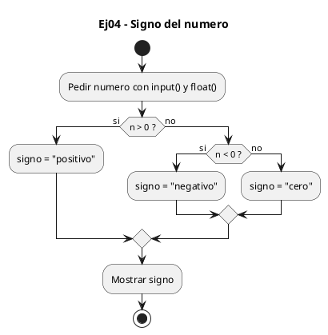
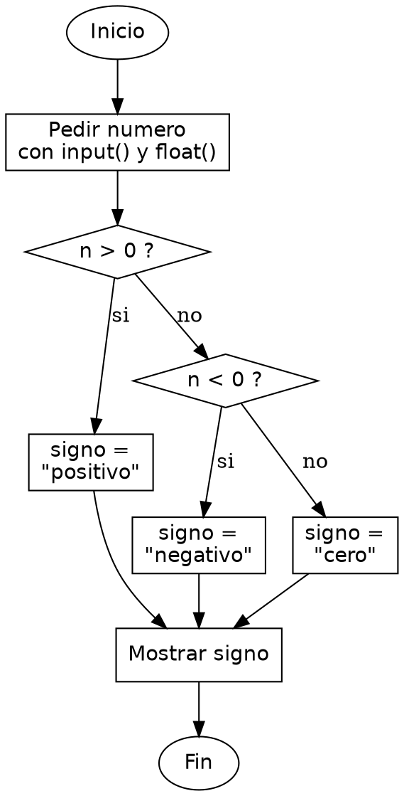

<!-- FICHERO GENERADO — NO EDITAR. Fuente de verdad: curso-python/practica/02-condicionales/ej04.md (se regenera con gen_course.py). -->

# Ejercicio 04 — Pide un flotante e imprime su signo

Dificultad: verde · Módulo 02 (Condicionales)

## Enunciado

Pide un flotante e imprime su signo (positivo, negativo o cero)

## Diagramas de flujo





## Cómo se resuelve

<!-- EXPLICACION -->
Averiguar el signo de un número es el caso de libro para tres ramas: positivo, negativo y el borde exacto del cero.

1. `n = float(input("Introduce un numero: "))` — usamos `float()`, no `int()`, porque el enunciado pide un decimal y queremos aceptar valores como 3.5 o -0.2.
2. `if n > 0:` — estrictamente mayor que cero es "positivo". El cero no entra aquí porque `>` es estricto.
3. `elif n < 0:` — solo se evalúa si no era positivo; estrictamente menor que cero es "negativo".
4. `else: signo = "cero"` — descartados el positivo y el negativo, lo único que queda es exactamente cero, así que no hace falta condición. Guardamos la palabra en `signo` y la imprimimos una sola vez fuera del if.

Trampa habitual: colar el cero por usar `>=` o `<=`. Si escribieras `if n >= 0`, el cero se clasificaría como positivo y nunca alcanzarías la rama del cero. Para separar los tres casos, las comparaciones de los extremos deben ser estrictas.

## Para practicar — cópialo y complétalo

Pega este esqueleto y completa los `TODO`. Es la mejor forma de aprender: inténtalo antes de mirar la solución.

```python
# Curso de Python — Modulo 02: Condicionales
# Ejercicio 04 — PRACTICA (rellena los TODO)
# Enunciado: Pide un flotante e imprime su signo (positivo, negativo o cero)
# Dificultad: verde
# Ejecutar: python3 ej04_practica.py

# TODO: lee un numero flotante del usuario (usa float(), no int())
n = None

# TODO: clasifica n en tres casos: > 0, < 0, == 0
#       guarda el texto del signo en una variable 'signo'
signo = ""

# TODO: imprime signo
```

## Solución — cópiala y ejecútala

```python
# Curso de Python — Modulo 02: Condicionales
# Ejercicio 04 — MODELO (resuelto)
# Enunciado: Pide un flotante e imprime su signo (positivo, negativo o cero)
# Dificultad: verde
# Ejecutar: python3 ej04_modelo.py

n = float(input("Introduce un numero: "))

if n > 0:
    signo = "positivo"
elif n < 0:
    signo = "negativo"
else:
    signo = "cero"

print(signo)
```

## Ejecútalo en el navegador

[▶ Visualízalo paso a paso en Python Tutor](https://pythontutor.com/visualize.html#code=%23+Curso+de+Python+%E2%80%94+Modulo+02%3A+Condicionales%0A%23+Ejercicio+04+%E2%80%94+MODELO+%28resuelto%29%0A%23+Enunciado%3A+Pide+un+flotante+e+imprime+su+signo+%28positivo%2C+negativo+o+cero%29%0A%23+Dificultad%3A+verde%0A%23+Ejecutar%3A+python3+ej04_modelo.py%0A%0An+%3D+float%28input%28%22Introduce+un+numero%3A+%22%29%29%0A%0Aif+n+%3E+0%3A%0A++++signo+%3D+%22positivo%22%0Aelif+n+%3C+0%3A%0A++++signo+%3D+%22negativo%22%0Aelse%3A%0A++++signo+%3D+%22cero%22%0A%0Aprint%28signo%29%0A&cumulative=false&curInstr=0&py=3&rawInputLstJSON=%5B%5D) — ve cómo cambian las variables línea a línea.

## Cómo usarlo

Pega el código en un fichero y ejecútalo con tu toolchain habitual (o el botón de Ejecutar de tu editor). Antes de mirar la solución, intenta completar tú el esqueleto: es la mejor forma de aprender.

## Conexiones

- [[Curso_Python/modelo/02-condicionales|Teoría del módulo]]
- [[Curso_Python/practica/00_README|Índice del curso]]
