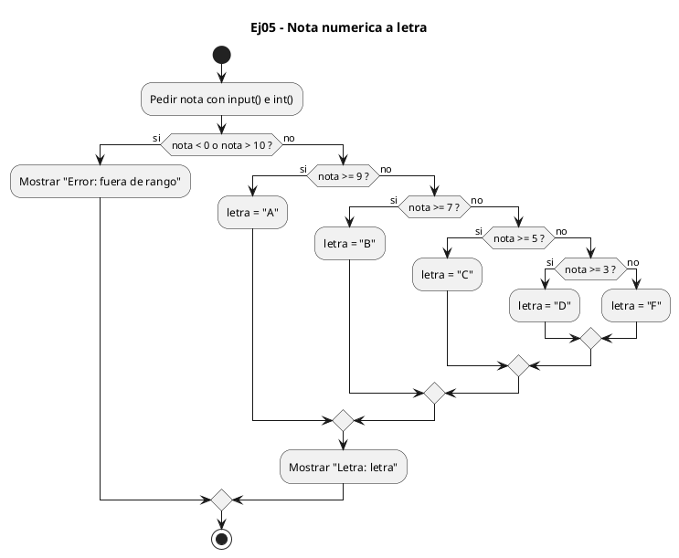
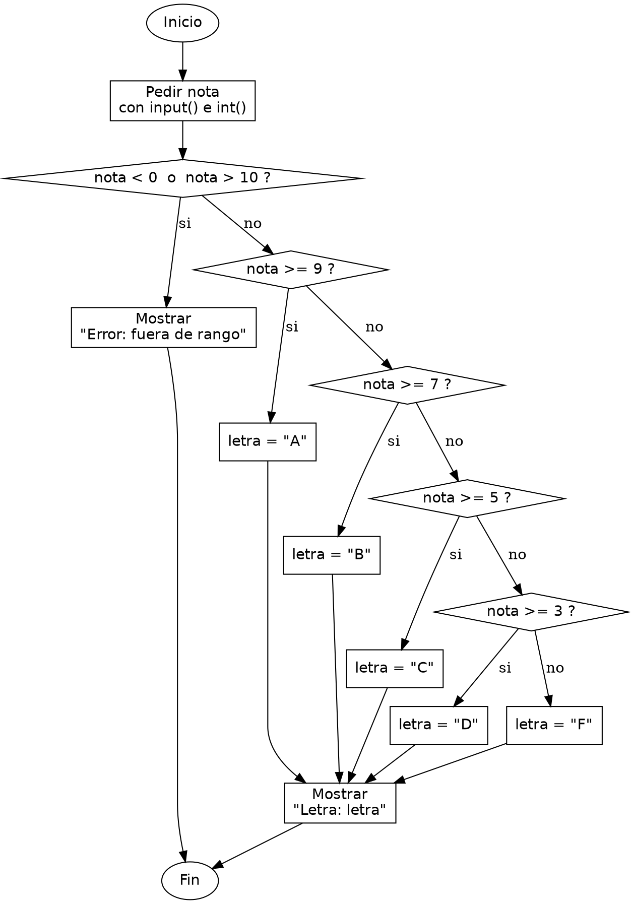

<!-- FICHERO GENERADO — NO EDITAR. Fuente de verdad: curso-python/practica/02-condicionales/ej05.md (se regenera con gen_course.py). -->

# Ejercicio 05 — Convierte una nota numerica (0-10) a letra A/B/C/D/F

Dificultad: amarillo · Módulo 02 (Condicionales)

## Enunciado

Convierte una nota numerica (0-10) a letra A/B/C/D/F; fuera de rango avisa

## Diagramas de flujo





## Cómo se resuelve

<!-- EXPLICACION -->
Traducir una nota numérica a letra combina dos ideas: validar primero que el dato es correcto y luego ordenar los tramos de mayor a menor para no repetir comprobaciones.

1. `nota = int(input("Nota (0-10): "))` — leemos la nota como entero.
2. `if nota < 0 or nota > 10:` — antes de clasificar, comprobamos que está en rango. `or` es verdadero si al menos uno de los lados lo es, así que esta condición detecta tanto las notas por debajo de 0 como las por encima de 10. Si algo falla, avisamos y no seguimos.
3. Dentro del `else` (nota válida), la cadena `if nota >= 9 ... elif nota >= 7 ...` va de mayor a menor. La clave es el orden: al llegar a `elif nota >= 7` ya sabemos que la nota es menor que 9, así que basta con el límite inferior de cada tramo; no hace falta escribir `7 <= nota < 9`.
4. `else: letra = "F"` — todo lo que no alcanzó el 3 cae aquí. Guardamos la letra y la imprimimos una vez.

Trampa habitual: desordenar los tramos o usar `>` en lugar de `>=`. Si pusieras primero `nota >= 5`, un 9 se clasificaría como "C" porque esa condición se cumple antes. Con `elif` gana siempre el primero que encaja, de ahí que haya que empezar por el tramo más alto.

## Para practicar — cópialo y complétalo

Pega este esqueleto y completa los `TODO`. Es la mejor forma de aprender: inténtalo antes de mirar la solución.

```python
# Curso de Python — Modulo 02: Condicionales
# Ejercicio 05 — PRACTICA (rellena los TODO)
# Enunciado: Convierte una nota numerica (0-10) a letra A/B/C/D/F; fuera de rango avisa
# Dificultad: amarillo
# Ejecutar: python3 ej05_practica.py

# TODO: lee la nota como entero
nota = None

# TODO: valida primero que este en el rango 0-10
#       Si no lo esta, imprime un mensaje de error y no sigas

# TODO: si la nota es valida, clasifica con elif encadenado:
#       >= 9 → "A", >= 7 → "B", >= 5 → "C", >= 3 → "D", resto → "F"
#       Pista: ordena de mayor a menor para no necesitar condiciones dobles

# TODO: imprime "Letra: <letra>"
```

## Solución — cópiala y ejecútala

```python
# Curso de Python — Modulo 02: Condicionales
# Ejercicio 05 — MODELO (resuelto)
# Enunciado: Convierte una nota numerica (0-10) a letra A/B/C/D/F; fuera de rango avisa
# Dificultad: amarillo
# Ejecutar: python3 ej05_modelo.py

nota = int(input("Nota (0-10): "))

if nota < 0 or nota > 10:
    print("Error: nota fuera de rango (debe ser 0-10)")
else:
    # Ordenar de mayor a menor evita condiciones dobles
    if nota >= 9:
        letra = "A"
    elif nota >= 7:
        letra = "B"
    elif nota >= 5:
        letra = "C"
    elif nota >= 3:
        letra = "D"
    else:
        letra = "F"
    print(f"Letra: {letra}")
```

## Ejecútalo en el navegador

<div class="pyodide-run" data-code="IyBDdXJzbyBkZSBQeXRob24g4oCUIE1vZHVsbyAwMjogQ29uZGljaW9uYWxlcwojIEVqZXJjaWNpbyAwNSDigJQgTU9ERUxPIChyZXN1ZWx0bykKIyBFbnVuY2lhZG86IENvbnZpZXJ0ZSB1bmEgbm90YSBudW1lcmljYSAoMC0xMCkgYSBsZXRyYSBBL0IvQy9EL0Y7IGZ1ZXJhIGRlIHJhbmdvIGF2aXNhCiMgRGlmaWN1bHRhZDogYW1hcmlsbG8KIyBFamVjdXRhcjogcHl0aG9uMyBlajA1X21vZGVsby5weQoKbm90YSA9IGludChpbnB1dCgiTm90YSAoMC0xMCk6ICIpKQoKaWYgbm90YSA8IDAgb3Igbm90YSA+IDEwOgogICAgcHJpbnQoIkVycm9yOiBub3RhIGZ1ZXJhIGRlIHJhbmdvIChkZWJlIHNlciAwLTEwKSIpCmVsc2U6CiAgICAjIE9yZGVuYXIgZGUgbWF5b3IgYSBtZW5vciBldml0YSBjb25kaWNpb25lcyBkb2JsZXMKICAgIGlmIG5vdGEgPj0gOToKICAgICAgICBsZXRyYSA9ICJBIgogICAgZWxpZiBub3RhID49IDc6CiAgICAgICAgbGV0cmEgPSAiQiIKICAgIGVsaWYgbm90YSA+PSA1OgogICAgICAgIGxldHJhID0gIkMiCiAgICBlbGlmIG5vdGEgPj0gMzoKICAgICAgICBsZXRyYSA9ICJEIgogICAgZWxzZToKICAgICAgICBsZXRyYSA9ICJGIgogICAgcHJpbnQoZiJMZXRyYToge2xldHJhfSIpCg==">
<button class="pyodide-btn" type="button">▶ Ejecutar aquí (Python en el navegador)</button>
<textarea class="pyodide-stdin" rows="2" placeholder="Si el programa pide datos por teclado, escríbelos aquí, uno por línea"></textarea>
<pre class="pyodide-out" hidden></pre>
</div>

[▶ Visualízalo paso a paso en Python Tutor](https://pythontutor.com/visualize.html#code=%23+Curso+de+Python+%E2%80%94+Modulo+02%3A+Condicionales%0A%23+Ejercicio+05+%E2%80%94+MODELO+%28resuelto%29%0A%23+Enunciado%3A+Convierte+una+nota+numerica+%280-10%29+a+letra+A%2FB%2FC%2FD%2FF%3B+fuera+de+rango+avisa%0A%23+Dificultad%3A+amarillo%0A%23+Ejecutar%3A+python3+ej05_modelo.py%0A%0Anota+%3D+int%28input%28%22Nota+%280-10%29%3A+%22%29%29%0A%0Aif+nota+%3C+0+or+nota+%3E+10%3A%0A++++print%28%22Error%3A+nota+fuera+de+rango+%28debe+ser+0-10%29%22%29%0Aelse%3A%0A++++%23+Ordenar+de+mayor+a+menor+evita+condiciones+dobles%0A++++if+nota+%3E%3D+9%3A%0A++++++++letra+%3D+%22A%22%0A++++elif+nota+%3E%3D+7%3A%0A++++++++letra+%3D+%22B%22%0A++++elif+nota+%3E%3D+5%3A%0A++++++++letra+%3D+%22C%22%0A++++elif+nota+%3E%3D+3%3A%0A++++++++letra+%3D+%22D%22%0A++++else%3A%0A++++++++letra+%3D+%22F%22%0A++++print%28f%22Letra%3A+%7Bletra%7D%22%29%0A&cumulative=false&curInstr=0&py=3&rawInputLstJSON=%5B%5D) — ve cómo cambian las variables línea a línea.

## Cómo usarlo

Pega el código en un fichero y ejecútalo con tu toolchain habitual (o el botón de Ejecutar de tu editor). Antes de mirar la solución, intenta completar tú el esqueleto: es la mejor forma de aprender.

## Conexiones

- [[Curso_Python/modelo/02-condicionales|Teoría del módulo]]
- [[Curso_Python/practica/00_README|Índice del curso]]
