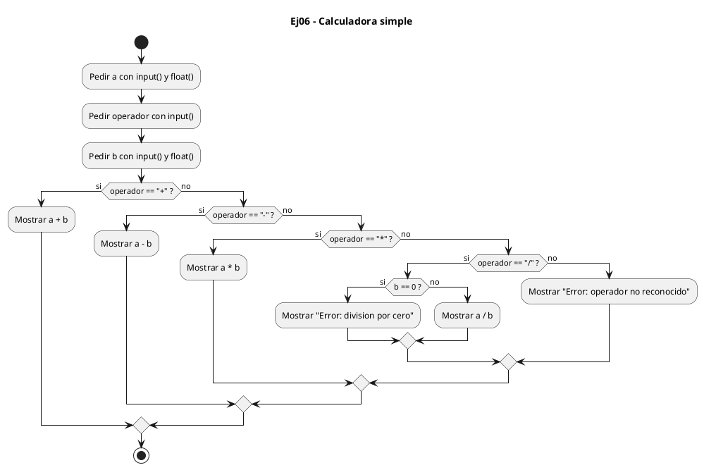
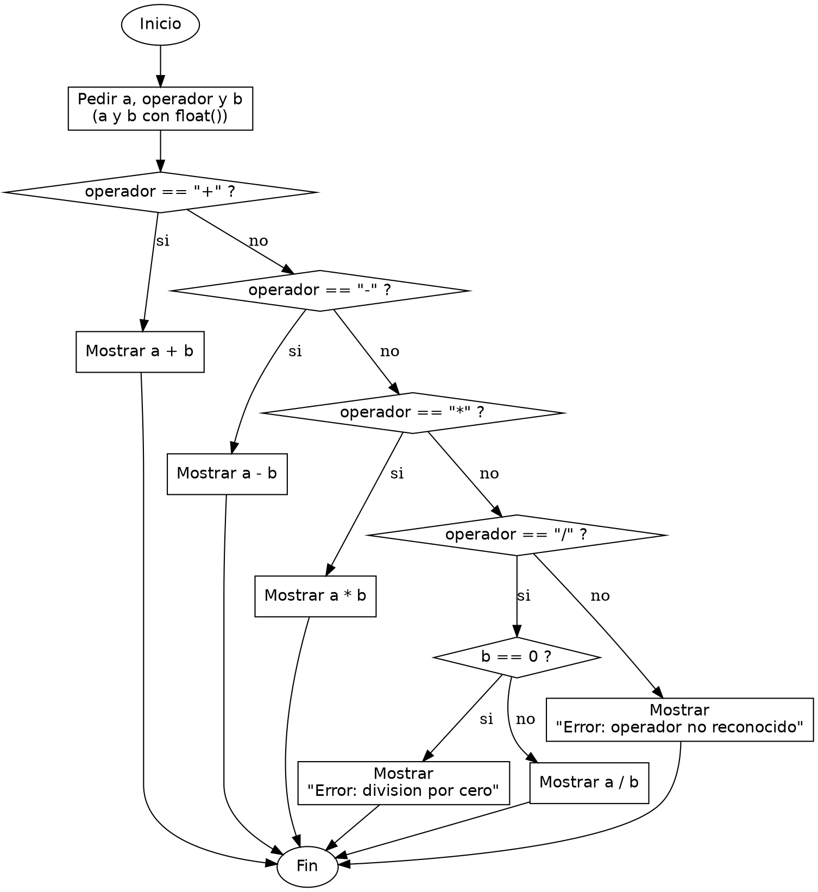

<!-- FICHERO GENERADO — NO EDITAR. Fuente de verdad: curso-python/practica/02-condicionales/ej06.md (se regenera con gen_course.py). -->

# Ejercicio 06 — Calculadora simple

Dificultad: amarillo · Módulo 02 (Condicionales)

## Enunciado

Calculadora simple: dos números y un operador (+,-,*,/); maneja división por cero

## Diagramas de flujo





## Cómo se resuelve

<!-- EXPLICACION -->
Una calculadora que elige operación según un símbolo es el ejemplo natural para ramificar por igualdad de cadenas y para anidar un caso especial dentro de una rama.

1. Leemos `a` y `b` como `float()` y el `operador` como texto. `input(...).strip()` recorta los espacios sobrantes que el usuario pueda teclear antes o después, de modo que " + " se compare bien.
2. `if operador == "+": ... elif operador == "-": ...` — comparamos la cadena con cada símbolo. En Python `==` compara el contenido de los strings directamente, sin funciones auxiliares.
3. `elif operador == "/":` con un `if b == 0:` dentro — la división necesita un control extra. Anidamos un segundo `if` porque dividir entre cero es un error aparte que solo tiene sentido comprobar cuando la operación ya es una división.
4. `else: print(f"Error: operador '{operador}' no reconocido")` — cualquier símbolo que no sea uno de los cuatro cae aquí. Tener un `else` final evita que el programa quede en silencio ante una entrada rara.

Trampa habitual: comparar el operador con `is` en vez de `==`. `is` pregunta si son el mismo objeto en memoria, no si tienen el mismo texto, y puede fallar de forma impredecible. Para comparar el valor de dos cadenas siempre `==`. En C, además, no podrías hacer esto con `==` sobre cadenas: allí compararías `char` sueltos o usarías `strcmp`.

## Para practicar — cópialo y complétalo

Pega este esqueleto y completa los `TODO`. Es la mejor forma de aprender: inténtalo antes de mirar la solución.

```python
# Curso de Python — Modulo 02: Condicionales
# Ejercicio 06 — PRACTICA (rellena los TODO)
# Enunciado: Calculadora simple: dos números y un operador (+,-,*,/); maneja división por cero
# Dificultad: amarillo
# Ejecutar: python3 ej06_practica.py

# TODO: lee el primer numero como flotante
a = None

# TODO: lee el operador como cadena (usa .strip() para quitar espacios accidentales)
operador = None

# TODO: lee el segundo numero como flotante
b = None

# TODO: usa if / elif para cada operador (+, -, *, /)
#       Para la division, anida un if extra que compruebe si b == 0
#       Si el operador no es ninguno de los cuatro, imprime un mensaje de error

# TODO: imprime "Resultado: <valor>" en cada rama valida
```

## Solución — cópiala y ejecútala

```python
# Curso de Python — Modulo 02: Condicionales
# Ejercicio 06 — MODELO (resuelto)
# Enunciado: Calculadora simple: dos números y un operador (+,-,*,/); maneja división por cero
# Dificultad: amarillo
# Ejecutar: python3 ej06_modelo.py

a = float(input("Primer numero: "))
operador = input("Operador (+, -, *, /): ").strip()
b = float(input("Segundo numero: "))

if operador == "+":
    resultado = a + b
    print(f"Resultado: {resultado}")
elif operador == "-":
    resultado = a - b
    print(f"Resultado: {resultado}")
elif operador == "*":
    resultado = a * b
    print(f"Resultado: {resultado}")
elif operador == "/":
    if b == 0:
        print("Error: division por cero")
    else:
        resultado = a / b
        print(f"Resultado: {resultado}")
else:
    print(f"Error: operador '{operador}' no reconocido")
```

## Ejecútalo en el navegador

<div class="pyodide-run" data-code="IyBDdXJzbyBkZSBQeXRob24g4oCUIE1vZHVsbyAwMjogQ29uZGljaW9uYWxlcwojIEVqZXJjaWNpbyAwNiDigJQgTU9ERUxPIChyZXN1ZWx0bykKIyBFbnVuY2lhZG86IENhbGN1bGFkb3JhIHNpbXBsZTogZG9zIG7Dum1lcm9zIHkgdW4gb3BlcmFkb3IgKCssLSwqLC8pOyBtYW5lamEgZGl2aXNpw7NuIHBvciBjZXJvCiMgRGlmaWN1bHRhZDogYW1hcmlsbG8KIyBFamVjdXRhcjogcHl0aG9uMyBlajA2X21vZGVsby5weQoKYSA9IGZsb2F0KGlucHV0KCJQcmltZXIgbnVtZXJvOiAiKSkKb3BlcmFkb3IgPSBpbnB1dCgiT3BlcmFkb3IgKCssIC0sICosIC8pOiAiKS5zdHJpcCgpCmIgPSBmbG9hdChpbnB1dCgiU2VndW5kbyBudW1lcm86ICIpKQoKaWYgb3BlcmFkb3IgPT0gIisiOgogICAgcmVzdWx0YWRvID0gYSArIGIKICAgIHByaW50KGYiUmVzdWx0YWRvOiB7cmVzdWx0YWRvfSIpCmVsaWYgb3BlcmFkb3IgPT0gIi0iOgogICAgcmVzdWx0YWRvID0gYSAtIGIKICAgIHByaW50KGYiUmVzdWx0YWRvOiB7cmVzdWx0YWRvfSIpCmVsaWYgb3BlcmFkb3IgPT0gIioiOgogICAgcmVzdWx0YWRvID0gYSAqIGIKICAgIHByaW50KGYiUmVzdWx0YWRvOiB7cmVzdWx0YWRvfSIpCmVsaWYgb3BlcmFkb3IgPT0gIi8iOgogICAgaWYgYiA9PSAwOgogICAgICAgIHByaW50KCJFcnJvcjogZGl2aXNpb24gcG9yIGNlcm8iKQogICAgZWxzZToKICAgICAgICByZXN1bHRhZG8gPSBhIC8gYgogICAgICAgIHByaW50KGYiUmVzdWx0YWRvOiB7cmVzdWx0YWRvfSIpCmVsc2U6CiAgICBwcmludChmIkVycm9yOiBvcGVyYWRvciAne29wZXJhZG9yfScgbm8gcmVjb25vY2lkbyIpCg==">
<button class="pyodide-btn" type="button">▶ Ejecutar aquí (Python en el navegador)</button>
<textarea class="pyodide-stdin" rows="2" placeholder="Si el programa pide datos por teclado, escríbelos aquí, uno por línea"></textarea>
<pre class="pyodide-out" hidden></pre>
</div>

[▶ Visualízalo paso a paso en Python Tutor](https://pythontutor.com/visualize.html#code=%23+Curso+de+Python+%E2%80%94+Modulo+02%3A+Condicionales%0A%23+Ejercicio+06+%E2%80%94+MODELO+%28resuelto%29%0A%23+Enunciado%3A+Calculadora+simple%3A+dos+n%C3%BAmeros+y+un+operador+%28%2B%2C-%2C%2A%2C%2F%29%3B+maneja+divisi%C3%B3n+por+cero%0A%23+Dificultad%3A+amarillo%0A%23+Ejecutar%3A+python3+ej06_modelo.py%0A%0Aa+%3D+float%28input%28%22Primer+numero%3A+%22%29%29%0Aoperador+%3D+input%28%22Operador+%28%2B%2C+-%2C+%2A%2C+%2F%29%3A+%22%29.strip%28%29%0Ab+%3D+float%28input%28%22Segundo+numero%3A+%22%29%29%0A%0Aif+operador+%3D%3D+%22%2B%22%3A%0A++++resultado+%3D+a+%2B+b%0A++++print%28f%22Resultado%3A+%7Bresultado%7D%22%29%0Aelif+operador+%3D%3D+%22-%22%3A%0A++++resultado+%3D+a+-+b%0A++++print%28f%22Resultado%3A+%7Bresultado%7D%22%29%0Aelif+operador+%3D%3D+%22%2A%22%3A%0A++++resultado+%3D+a+%2A+b%0A++++print%28f%22Resultado%3A+%7Bresultado%7D%22%29%0Aelif+operador+%3D%3D+%22%2F%22%3A%0A++++if+b+%3D%3D+0%3A%0A++++++++print%28%22Error%3A+division+por+cero%22%29%0A++++else%3A%0A++++++++resultado+%3D+a+%2F+b%0A++++++++print%28f%22Resultado%3A+%7Bresultado%7D%22%29%0Aelse%3A%0A++++print%28f%22Error%3A+operador+%27%7Boperador%7D%27+no+reconocido%22%29%0A&cumulative=false&curInstr=0&py=3&rawInputLstJSON=%5B%5D) — ve cómo cambian las variables línea a línea.

## Cómo usarlo

Pega el código en un fichero y ejecútalo con tu toolchain habitual (o el botón de Ejecutar de tu editor). Antes de mirar la solución, intenta completar tú el esqueleto: es la mejor forma de aprender.

## Conexiones

- [[Curso_Python/modelo/02-condicionales|Teoría del módulo]]
- [[Curso_Python/practica/00_README|Índice del curso]]
