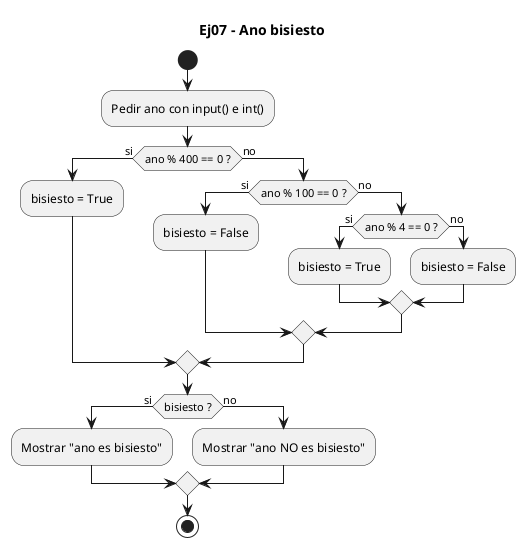
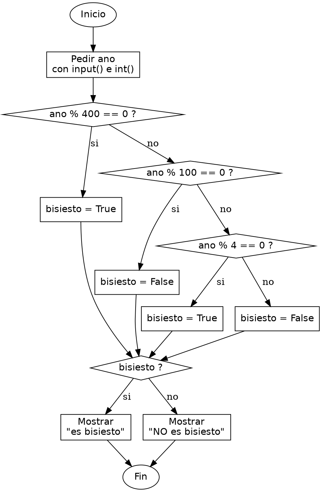

<!-- FICHERO GENERADO — NO EDITAR. Fuente de verdad: curso-python/practica/02-condicionales/ej07.md (se regenera con gen_course.py). -->

# Ejercicio 07 — Determina si un ano es bisiesto

Dificultad: rojo · Módulo 02 (Condicionales)

## Enunciado

Determina si un ano es bisiesto (div. por 4, excepto siglos no div. por 400)

## Diagramas de flujo





## Cómo se resuelve

<!-- EXPLICACION -->
Saber si un año es bisiesto es un problema con una regla enredada, y el truco es traducirla a una cadena de condiciones ordenada de la más exigente a la más general.

1. La regla real es: bisiesto si es divisible por 4, salvo los años de siglo (divisibles por 100) que no lo sean también por 400. En vez de una sola condición gigante con `and`, `or` y `not`, la desplegamos en tramos que se comprueban en orden.
2. `if ano % 400 == 0:` — lo primero es el caso más fuerte. Todo divisible por 400 es bisiesto sí o sí (por ejemplo 2000), así que lo resolvemos antes que nada.
3. `elif ano % 100 == 0:` — llegar aquí significa que NO era divisible por 400. Un año divisible por 100 pero no por 400 (como 1900) es la excepción: no es bisiesto.
4. `elif ano % 4 == 0:` — descartados los siglos, cualquier otro múltiplo de 4 (como 2024) sí es bisiesto. El `else` final cubre el resto de años, que no lo son.
5. Guardamos el veredicto en `bisiesto` (un booleano `True`/`False`) y luego un segundo `if bisiesto:` decide el mensaje. Separar el cálculo de la impresión hace la lógica más legible que meter los `print` en cada rama.

Trampa habitual: comprobar `ano % 4 == 0` antes que el caso del 100. Si preguntas por el 4 primero, años como 1900 (múltiplo de 4 y de 100 pero no de 400) se colarían como bisiestos. El orden de los `elif` no es decorativo: las excepciones más específicas van arriba.

## Para practicar — cópialo y complétalo

Pega este esqueleto y completa los `TODO`. Es la mejor forma de aprender: inténtalo antes de mirar la solución.

```python
# Curso de Python — Modulo 02: Condicionales
# Ejercicio 07 — PRACTICA (rellena los TODO)
# Enunciado: Determina si un ano es bisiesto (div. por 4, excepto siglos no div. por 400)
# Dificultad: rojo
# Ejecutar: python3 ej07_practica.py

# Regla (leela despacio):
#   Un ano es bisiesto si:
#     - Es divisible por 400  (ej: 2000 → SI)
#     - O es divisible por 4 pero NO por 100  (ej: 2024 → SI; 1900 → NO)

# TODO: lee el ano como entero
ano = None

# TODO: determina si es bisiesto con if / elif / else
#       Pista: comprueba primero % 400, luego % 100, luego % 4
#       Guarda el resultado en una variable booleana 'bisiesto'
bisiesto = False

# TODO: imprime "<ano> es bisiesto"  o  "<ano> NO es bisiesto"
```

## Solución — cópiala y ejecútala

```python
# Curso de Python — Modulo 02: Condicionales
# Ejercicio 07 — MODELO (resuelto)
# Enunciado: Determina si un ano es bisiesto (div. por 4, excepto siglos no div. por 400)
# Dificultad: rojo
# Ejecutar: python3 ej07_modelo.py

# Regla completa:
#   bisiesto si (divisible por 4) AND NOT (divisible por 100 pero NO por 400)
#   Equivalente: div. por 400  OR  (div. por 4 AND NOT div. por 100)

ano = int(input("Introduce un ano: "))

if ano % 400 == 0:
    bisiesto = True
elif ano % 100 == 0:
    # divisible por 100 pero no por 400 → NO es bisiesto
    bisiesto = False
elif ano % 4 == 0:
    bisiesto = True
else:
    bisiesto = False

if bisiesto:
    print(f"{ano} es bisiesto")
else:
    print(f"{ano} NO es bisiesto")
```

## Ejecútalo en el navegador

<div class="pyodide-run" data-code="IyBDdXJzbyBkZSBQeXRob24g4oCUIE1vZHVsbyAwMjogQ29uZGljaW9uYWxlcwojIEVqZXJjaWNpbyAwNyDigJQgTU9ERUxPIChyZXN1ZWx0bykKIyBFbnVuY2lhZG86IERldGVybWluYSBzaSB1biBhbm8gZXMgYmlzaWVzdG8gKGRpdi4gcG9yIDQsIGV4Y2VwdG8gc2lnbG9zIG5vIGRpdi4gcG9yIDQwMCkKIyBEaWZpY3VsdGFkOiByb2pvCiMgRWplY3V0YXI6IHB5dGhvbjMgZWowN19tb2RlbG8ucHkKCiMgUmVnbGEgY29tcGxldGE6CiMgICBiaXNpZXN0byBzaSAoZGl2aXNpYmxlIHBvciA0KSBBTkQgTk9UIChkaXZpc2libGUgcG9yIDEwMCBwZXJvIE5PIHBvciA0MDApCiMgICBFcXVpdmFsZW50ZTogZGl2LiBwb3IgNDAwICBPUiAgKGRpdi4gcG9yIDQgQU5EIE5PVCBkaXYuIHBvciAxMDApCgphbm8gPSBpbnQoaW5wdXQoIkludHJvZHVjZSB1biBhbm86ICIpKQoKaWYgYW5vICUgNDAwID09IDA6CiAgICBiaXNpZXN0byA9IFRydWUKZWxpZiBhbm8gJSAxMDAgPT0gMDoKICAgICMgZGl2aXNpYmxlIHBvciAxMDAgcGVybyBubyBwb3IgNDAwIOKGkiBOTyBlcyBiaXNpZXN0bwogICAgYmlzaWVzdG8gPSBGYWxzZQplbGlmIGFubyAlIDQgPT0gMDoKICAgIGJpc2llc3RvID0gVHJ1ZQplbHNlOgogICAgYmlzaWVzdG8gPSBGYWxzZQoKaWYgYmlzaWVzdG86CiAgICBwcmludChmInthbm99IGVzIGJpc2llc3RvIikKZWxzZToKICAgIHByaW50KGYie2Fub30gTk8gZXMgYmlzaWVzdG8iKQo=">
<button class="pyodide-btn" type="button">▶ Ejecutar aquí (Python en el navegador)</button>
<textarea class="pyodide-stdin" rows="2" placeholder="Si el programa pide datos por teclado, escríbelos aquí, uno por línea"></textarea>
<pre class="pyodide-out" hidden></pre>
</div>

[▶ Visualízalo paso a paso en Python Tutor](https://pythontutor.com/visualize.html#code=%23+Curso+de+Python+%E2%80%94+Modulo+02%3A+Condicionales%0A%23+Ejercicio+07+%E2%80%94+MODELO+%28resuelto%29%0A%23+Enunciado%3A+Determina+si+un+ano+es+bisiesto+%28div.+por+4%2C+excepto+siglos+no+div.+por+400%29%0A%23+Dificultad%3A+rojo%0A%23+Ejecutar%3A+python3+ej07_modelo.py%0A%0A%23+Regla+completa%3A%0A%23+++bisiesto+si+%28divisible+por+4%29+AND+NOT+%28divisible+por+100+pero+NO+por+400%29%0A%23+++Equivalente%3A+div.+por+400++OR++%28div.+por+4+AND+NOT+div.+por+100%29%0A%0Aano+%3D+int%28input%28%22Introduce+un+ano%3A+%22%29%29%0A%0Aif+ano+%25+400+%3D%3D+0%3A%0A++++bisiesto+%3D+True%0Aelif+ano+%25+100+%3D%3D+0%3A%0A++++%23+divisible+por+100+pero+no+por+400+%E2%86%92+NO+es+bisiesto%0A++++bisiesto+%3D+False%0Aelif+ano+%25+4+%3D%3D+0%3A%0A++++bisiesto+%3D+True%0Aelse%3A%0A++++bisiesto+%3D+False%0A%0Aif+bisiesto%3A%0A++++print%28f%22%7Bano%7D+es+bisiesto%22%29%0Aelse%3A%0A++++print%28f%22%7Bano%7D+NO+es+bisiesto%22%29%0A&cumulative=false&curInstr=0&py=3&rawInputLstJSON=%5B%5D) — ve cómo cambian las variables línea a línea.

## Cómo usarlo

Pega el código en un fichero y ejecútalo con tu toolchain habitual (o el botón de Ejecutar de tu editor). Antes de mirar la solución, intenta completar tú el esqueleto: es la mejor forma de aprender.

## Conexiones

- [[Curso_Python/modelo/02-condicionales|Teoría del módulo]]
- [[Curso_Python/practica/00_README|Índice del curso]]
