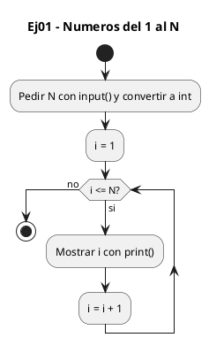
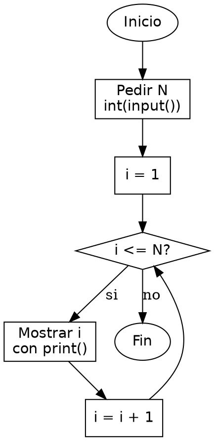

<!-- FICHERO GENERADO — NO EDITAR. Fuente de verdad: curso-python/practica/03-bucles/ej01.md (se regenera con gen_course.py). -->

# Ejercicio 01 — Pide un entero N e imprime los números del 1 al N, uno por línea

Dificultad: verde · Módulo 03 (Bucles)

## Enunciado

Pide un entero N e imprime los números del 1 al N, uno por línea

## Diagramas de flujo





## Cómo se resuelve

<!-- EXPLICACION -->
Recorrer los números del 1 al N con un `for range()` es la manera idiomática de Python de escribir un bucle contado: es la lección central del ejercicio.

1. `n = int(input("Introduce N: "))` — lee el límite y lo convierte a entero, porque `input()` siempre devuelve texto y `range()` necesita un número.
2. `for i in range(1, n + 1)` — genera los valores `1, 2, ..., n`. El primer argumento es el inicio (incluido) y el segundo el final (excluido), por eso ponemos `n + 1`: para que la última vuelta llegue hasta `n` y no se quede en `n - 1`.
3. `print(i)` — dentro del bucle, `i` va tomando cada valor de la secuencia, uno por línea.

En C escribirías `for (int i = 1; i <= n; i++)` gestionando tú el contador, la condición y el incremento. En Python no manejas un contador a mano: `range()` produce la secuencia y `for` la recorre; `i` no es una variable que tú incrementas, sino cada elemento que el bucle te entrega.

Trampa habitual: usar `range(1, n)` y perder el último número, o `range(n)` y empezar en 0. Recuerda que el final de `range()` NO se incluye.

## Para practicar — cópialo y complétalo

Pega este esqueleto y completa los `TODO`. Es la mejor forma de aprender: inténtalo antes de mirar la solución.

```python
# Curso de Python — Modulo 03: Bucles
# Ejercicio 01 — PRACTICA (rellena los TODO)
# Enunciado: Pide un entero N e imprime los números del 1 al N, uno por línea
# Dificultad: verde
# Ejecutar: python3 ej01_practica.py

# TODO 1: Lee N desde teclado y conviertelo a entero.
n = None  # reemplaza esto

# TODO 2: Usa un for con range para recorrer desde 1 hasta N (inclusive).
#         Recuerda: range(inicio, fin) excluye el fin.
for i in range(0):  # ajusta los argumentos de range
    # TODO 3: Imprime el valor de i.
    pass
```

## Solución — cópiala y ejecútala

```python
# Curso de Python — Modulo 03: Bucles
# Ejercicio 01 — MODELO (resuelto)
# Enunciado: Pide un entero N e imprime los números del 1 al N, uno por línea
# Dificultad: verde
# Ejecutar: python3 ej01_modelo.py

n = int(input("Introduce N: "))

for i in range(1, n + 1):
    print(i)
```

## Ejecútalo en el navegador

[▶ Visualízalo paso a paso en Python Tutor](https://pythontutor.com/visualize.html#code=%23+Curso+de+Python+%E2%80%94+Modulo+03%3A+Bucles%0A%23+Ejercicio+01+%E2%80%94+MODELO+%28resuelto%29%0A%23+Enunciado%3A+Pide+un+entero+N+e+imprime+los+n%C3%BAmeros+del+1+al+N%2C+uno+por+l%C3%ADnea%0A%23+Dificultad%3A+verde%0A%23+Ejecutar%3A+python3+ej01_modelo.py%0A%0An+%3D+int%28input%28%22Introduce+N%3A+%22%29%29%0A%0Afor+i+in+range%281%2C+n+%2B+1%29%3A%0A++++print%28i%29%0A&cumulative=false&curInstr=0&py=3&rawInputLstJSON=%5B%5D) — ve cómo cambian las variables línea a línea.

## Cómo usarlo

Pega el código en un fichero y ejecútalo con tu toolchain habitual (o el botón de Ejecutar de tu editor). Antes de mirar la solución, intenta completar tú el esqueleto: es la mejor forma de aprender.

## Conexiones

- [[Curso_Python/modelo/03-bucles|Teoría del módulo]]
- [[Curso_Python/practica/00_README|Índice del curso]]
