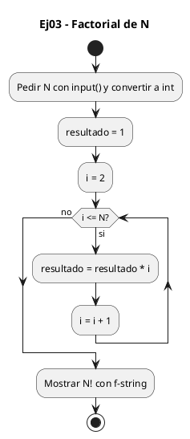
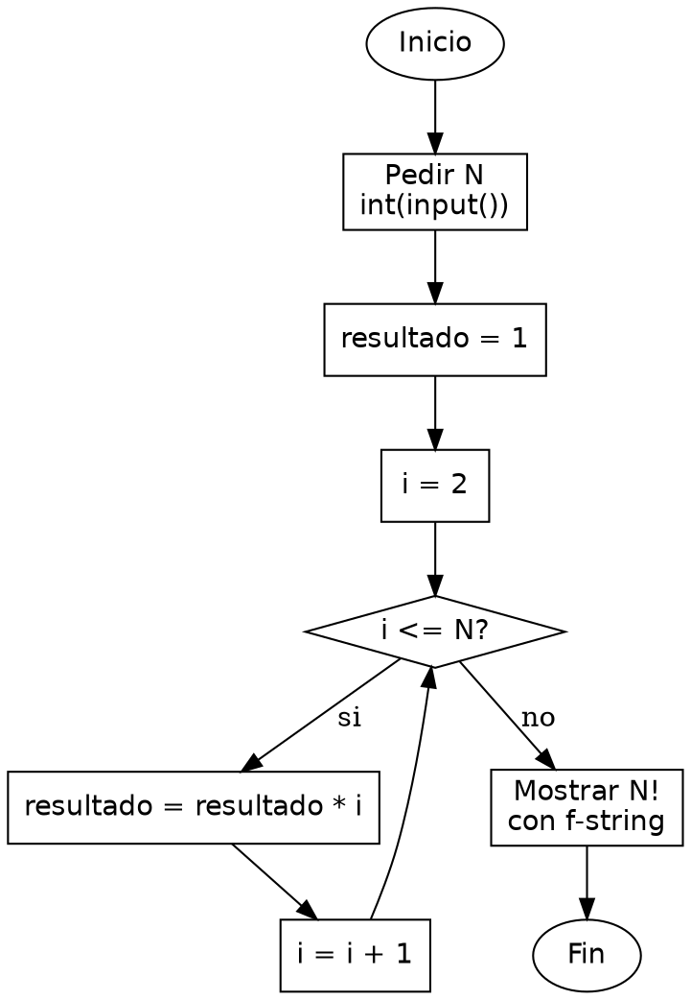

<!-- FICHERO GENERADO — NO EDITAR. Fuente de verdad: curso-python/practica/03-bucles/ej03.md (se regenera con gen_course.py). -->

# Ejercicio 03 — Pide N e imprime N! (factorial)

Dificultad: amarillo · Módulo 03 (Bucles)

## Enunciado

Pide N e imprime N! (factorial)

## Diagramas de flujo





## Cómo se resuelve

<!-- EXPLICACION -->
El factorial es un acumulador igual que la suma, pero multiplicando en vez de sumar, y ahí está el detalle que hay que cuidar: el valor inicial.

1. `resultado = 1` — el acumulador arranca en `1`, NO en `0`. Al multiplicar, el elemento neutro es el uno: si empezaras en `0`, cualquier producto daría `0` y el factorial sería siempre cero.
2. `for i in range(2, n + 1)` — recorre los factores desde `2` hasta `n`. Empezamos en `2` porque multiplicar por `1` no cambia nada; el `+ 1` incluye a `n`.
3. `resultado *= i` — forma corta de `resultado = resultado * i`: multiplica el acumulado por el factor de esta vuelta.
4. `print(f"{n}! = {resultado}")` — al terminar, `resultado` vale `n!`.

Un detalle bonito de Python: los enteros no se desbordan. `20!` en C con `int` daría basura por overflow; aquí Python amplía el número automáticamente y calcula el valor exacto por grande que sea.

Trampa habitual: inicializar `resultado = 0` (copiando el patrón de la suma). En una multiplicación el neutro es `1`; con `0` todo el producto se anula.

## Para practicar — cópialo y complétalo

Pega este esqueleto y completa los `TODO`. Es la mejor forma de aprender: inténtalo antes de mirar la solución.

```python
# Curso de Python — Modulo 03: Bucles
# Ejercicio 03 — PRACTICA (rellena los TODO)
# Enunciado: Pide N e imprime N! (factorial)
# Dificultad: amarillo
# Ejecutar: python3 ej03_practica.py

# TODO 1: Lee N desde teclado y conviertelo a entero.
n = None  # reemplaza esto

# TODO 2: El factorial es un producto acumulado. ¿Con que valor debes inicializar
#         el acumulador para que las multiplicaciones funcionen?
#         (Pista: no es 0, ese destroza el producto.)
resultado = None  # reemplaza esto

# TODO 3: Recorre los factores desde 2 hasta N (inclusive) y ve multiplicando.
#         (¿Por que empezamos en 2 y no en 1?)
for i in range(0):  # ajusta los argumentos
    pass  # TODO: multiplica resultado por i

# TODO 4: Imprime con formato "N! = <valor>".
```

## Solución — cópiala y ejecútala

```python
# Curso de Python — Modulo 03: Bucles
# Ejercicio 03 — MODELO (resuelto)
# Enunciado: Pide N e imprime N! (factorial)
# Dificultad: amarillo
# Ejecutar: python3 ej03_modelo.py

n = int(input("Introduce N: "))

resultado = 1
for i in range(2, n + 1):
    resultado *= i  # multiplica el acumulador por cada factor

print(f"{n}! = {resultado}")
```

## Ejecútalo en el navegador

[▶ Visualízalo paso a paso en Python Tutor](https://pythontutor.com/visualize.html#code=%23+Curso+de+Python+%E2%80%94+Modulo+03%3A+Bucles%0A%23+Ejercicio+03+%E2%80%94+MODELO+%28resuelto%29%0A%23+Enunciado%3A+Pide+N+e+imprime+N%21+%28factorial%29%0A%23+Dificultad%3A+amarillo%0A%23+Ejecutar%3A+python3+ej03_modelo.py%0A%0An+%3D+int%28input%28%22Introduce+N%3A+%22%29%29%0A%0Aresultado+%3D+1%0Afor+i+in+range%282%2C+n+%2B+1%29%3A%0A++++resultado+%2A%3D+i++%23+multiplica+el+acumulador+por+cada+factor%0A%0Aprint%28f%22%7Bn%7D%21+%3D+%7Bresultado%7D%22%29%0A&cumulative=false&curInstr=0&py=3&rawInputLstJSON=%5B%5D) — ve cómo cambian las variables línea a línea.

## Cómo usarlo

Pega el código en un fichero y ejecútalo con tu toolchain habitual (o el botón de Ejecutar de tu editor). Antes de mirar la solución, intenta completar tú el esqueleto: es la mejor forma de aprender.

## Conexiones

- [[Curso_Python/modelo/03-bucles|Teoría del módulo]]
- [[Curso_Python/practica/00_README|Índice del curso]]
