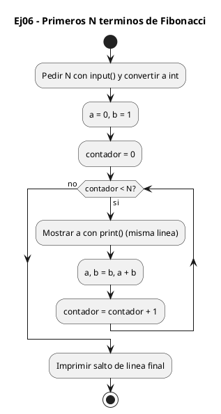
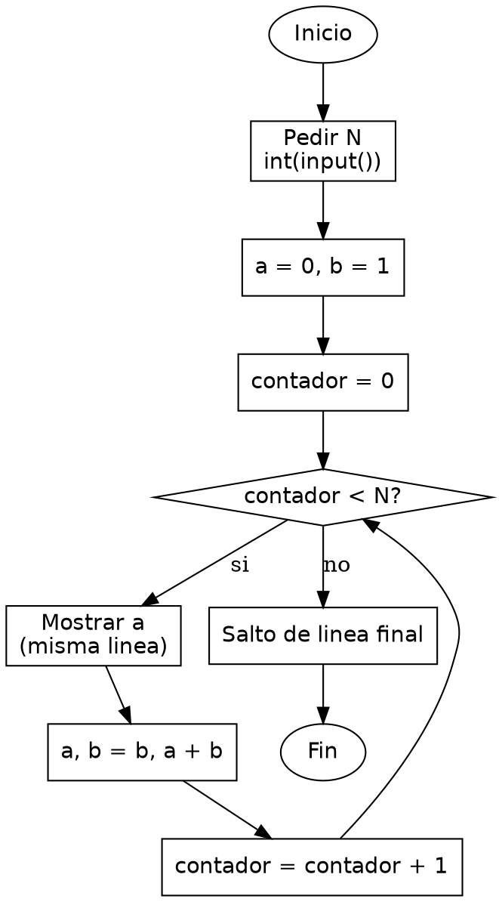

<!-- FICHERO GENERADO — NO EDITAR. Fuente de verdad: curso-python/practica/03-bucles/ej06.md (se regenera con gen_course.py). -->

# Ejercicio 06 — Pide N e imprime los primeros N terminos de Fibonacci

Dificultad: amarillo · Módulo 03 (Bucles)

## Enunciado

Pide N e imprime los primeros N terminos de Fibonacci

## Diagramas de flujo





## Cómo se resuelve

<!-- EXPLICACION -->
Generar los primeros N términos de Fibonacci apoya la sucesión en la asignación múltiple de Python, que avanza los dos últimos valores de golpe.

1. `a, b = 0, 1` — inicializamos los dos primeros términos de la sucesión en una sola línea: `a` es el término actual y `b` el siguiente.
2. `for _ in range(n)` — repetimos `n` veces. Usamos `_` como variable del bucle para dejar claro que el índice no nos importa: solo queremos contar iteraciones, no usar el número.
3. `print(a, end=" ")` — imprime el término actual. El `end=" "` cambia el salto de línea por defecto de `print` por un espacio, así todos los términos salen en la misma fila.
4. `a, b = b, a + b` — el corazón del ejercicio. Python evalúa primero todo el lado derecho (`b` y `a + b`) con los valores viejos, forma la pareja y luego la reparte: `a` pasa a ser el antiguo `b` y `b` la suma de ambos. Todo simultáneo, sin pisarse.
5. `print()` fuera del bucle — imprime el salto de línea final que faltaba.

En C harías el avance con una temporal: `tmp = a; a = b; b = tmp + b;`, porque la asignación es de uno en uno. La asignación múltiple `a, b = b, a + b` lo resuelve en una línea.

Trampa habitual: separar el avance en `a = b` y luego `b = a + b`. Tras `a = b` el valor original de `a` ya se ha perdido y la suma sale mal; hay que hacer las dos asignaciones a la vez.

## Para practicar — cópialo y complétalo

Pega este esqueleto y completa los `TODO`. Es la mejor forma de aprender: inténtalo antes de mirar la solución.

```python
# Curso de Python — Modulo 03: Bucles
# Ejercicio 06 — PRACTICA (rellena los TODO)
# Enunciado: Pide N e imprime los primeros N terminos de Fibonacci
# Dificultad: amarillo
# Ejecutar: python3 ej06_practica.py

# TODO 1: Lee N desde teclado y conviertelo a entero.
n = None  # reemplaza esto

# TODO 2: Inicializa los dos primeros terminos de la secuencia.
#         Fibonacci empieza: 0, 1, 1, 2, 3, 5, ...
#         Necesitas dos variables: el termino actual y el siguiente.
a = None  # reemplaza esto
b = None  # reemplaza esto

# TODO 3: Repite N veces. Usa _ como variable de bucle si no la necesitas.
for _ in range(0):  # ajusta los argumentos
    # TODO 4: Imprime a en la misma linea (pista: print(a, end=" ")).
    pass

    # TODO 5: Actualiza a y b para avanzar la secuencia.
    #         En C necesitarias una variable temporal. En Python puedes hacer
    #         la asignacion multiple en una sola linea: a, b = b, a + b
    #         ¿Por que esto funciona sin temp? Piensalo.

# TODO 6: Imprime un salto de linea al final con print().
```

## Solución — cópiala y ejecútala

```python
# Curso de Python — Modulo 03: Bucles
# Ejercicio 06 — MODELO (resuelto)
# Enunciado: Pide N e imprime los primeros N terminos de Fibonacci
# Dificultad: amarillo
# Ejecutar: python3 ej06_modelo.py

n = int(input("Cuantos terminos de Fibonacci: "))

a, b = 0, 1  # los dos primeros terminos

for _ in range(n):       # _ indica que el indice no nos importa
    print(a, end=" ")    # end=" " para imprimir en la misma linea
    a, b = b, a + b      # swap atomico: Python evalua la derecha antes de asignar

print()  # salto de linea final
```

## Ejecútalo en el navegador

[▶ Visualízalo paso a paso en Python Tutor](https://pythontutor.com/visualize.html#code=%23+Curso+de+Python+%E2%80%94+Modulo+03%3A+Bucles%0A%23+Ejercicio+06+%E2%80%94+MODELO+%28resuelto%29%0A%23+Enunciado%3A+Pide+N+e+imprime+los+primeros+N+terminos+de+Fibonacci%0A%23+Dificultad%3A+amarillo%0A%23+Ejecutar%3A+python3+ej06_modelo.py%0A%0An+%3D+int%28input%28%22Cuantos+terminos+de+Fibonacci%3A+%22%29%29%0A%0Aa%2C+b+%3D+0%2C+1++%23+los+dos+primeros+terminos%0A%0Afor+_+in+range%28n%29%3A+++++++%23+_+indica+que+el+indice+no+nos+importa%0A++++print%28a%2C+end%3D%22+%22%29++++%23+end%3D%22+%22+para+imprimir+en+la+misma+linea%0A++++a%2C+b+%3D+b%2C+a+%2B+b++++++%23+swap+atomico%3A+Python+evalua+la+derecha+antes+de+asignar%0A%0Aprint%28%29++%23+salto+de+linea+final%0A&cumulative=false&curInstr=0&py=3&rawInputLstJSON=%5B%5D) — ve cómo cambian las variables línea a línea.

## Cómo usarlo

Pega el código en un fichero y ejecútalo con tu toolchain habitual (o el botón de Ejecutar de tu editor). Antes de mirar la solución, intenta completar tú el esqueleto: es la mejor forma de aprender.

## Conexiones

- [[Curso_Python/modelo/03-bucles|Teoría del módulo]]
- [[Curso_Python/practica/00_README|Índice del curso]]
