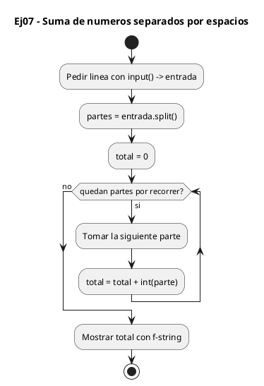
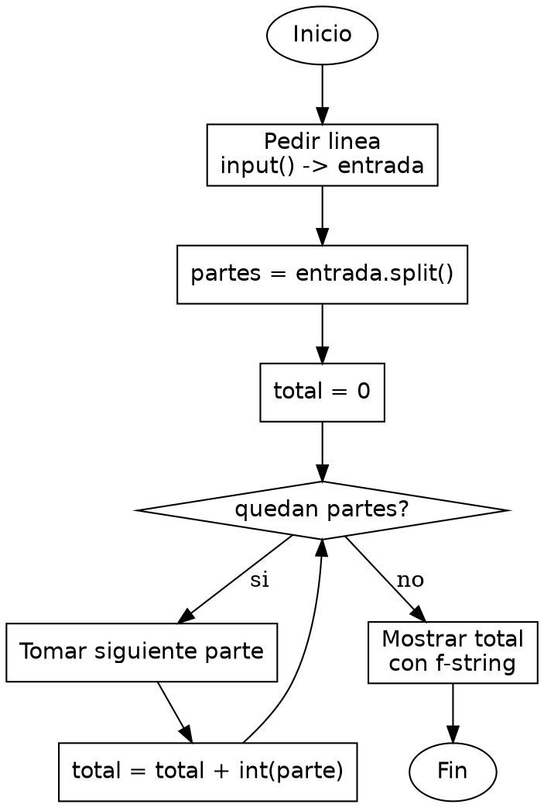

<!-- FICHERO GENERADO — NO EDITAR. Fuente de verdad: curso-python/practica/03-bucles/ej07.md (se regenera con gen_course.py). -->

# Ejercicio 07 — Dada una lista de numeros separados por espacios, imprime su suma

Dificultad: rojo · Módulo 03 (Bucles)

## Enunciado

Dada una lista de numeros separados por espacios, imprime su suma

## Diagramas de flujo





## Cómo se resuelve

<!-- EXPLICACION -->
Sumar los números de una línea escrita a mano junta tres ideas: partir un texto en trozos, iterar sobre esa lista y convertir cada trozo a número antes de operar.

1. `entrada = input("...")` — lee una línea entera de texto, por ejemplo `"3 7 2 8"`. Todo llega como una única cadena, no como números.
2. `partes = entrada.split()` — `split()` sin argumentos parte la cadena por los espacios y devuelve una lista de cadenas: `["3", "7", "2", "8"]`. Sigue siendo texto, no números.
3. `for parte in partes` — recorremos la lista directamente. En Python el `for` itera sobre los elementos de la secuencia, no sobre índices: `parte` toma cada cadena una a una, sin necesidad de un contador ni de acceder por posición.
4. `total += int(parte)` — cada trozo se convierte con `int()` y se suma al acumulador, que arrancamos en `total = 0` antes del bucle. La conversión aquí es clave: si sumaras las cadenas tal cual, `"3" + "7"` daría `"37"` (concatenación), no `10`.

El contraste con C es doble: allí recorrerías con índices (`for (i = 0; i < n; i++)`) y trocear la línea a mano exige `strtok` o parseo con `sscanf`; aquí `split()` y el `for` sobre la lista lo hacen en dos líneas.

Trampa habitual: olvidar el `int()` y sumar cadenas, que Python pega en vez de sumar. También, contar con que `split()` ignora los espacios de sobra: dos espacios seguidos no generan trozos vacíos.

## Para practicar — cópialo y complétalo

Pega este esqueleto y completa los `TODO`. Es la mejor forma de aprender: inténtalo antes de mirar la solución.

```python
# Curso de Python — Modulo 03: Bucles
# Ejercicio 07 — PRACTICA (rellena los TODO)
# Enunciado: Dada una lista de numeros separados por espacios, imprime su suma
# Dificultad: rojo
# Ejecutar: python3 ej07_practica.py

# TODO 1: Lee una linea completa de texto desde teclado (no int(), solo input()).
#         Ejemplo de entrada: "3 7 2 8"
entrada = None  # reemplaza esto

# TODO 2: Parte la cadena en trozos usando el metodo .split().
#         entrada.split() devuelve una lista de strings: ["3", "7", "2", "8"]
#         Guarda el resultado en una variable llamada partes.
partes = None  # reemplaza esto

# TODO 3: Inicializa un acumulador a 0.
total = None  # reemplaza esto

# TODO 4: Recorre cada elemento de partes con un for-each.
#         Atencion: cada elemento es un STRING, necesitas convertirlo a int.
for parte in []:  # cambia [] por la variable correcta
    pass  # TODO: convierte parte a int y acumula en total

# TODO 5: Imprime el resultado con formato "Suma = <valor>".
```

## Solución — cópiala y ejecútala

```python
# Curso de Python — Modulo 03: Bucles
# Ejercicio 07 — MODELO (resuelto)
# Enunciado: Dada una lista de numeros separados por espacios, imprime su suma
# Dificultad: rojo
# Ejecutar: python3 ej07_modelo.py

# Lee una linea con numeros separados por espacios, p.e. "3 7 2 8"
entrada = input("Introduce numeros separados por espacios: ")

# split() parte el string en una lista de strings: ["3", "7", "2", "8"]
partes = entrada.split()

total = 0
for parte in partes:
    total += int(parte)  # convierte cada string a int antes de sumar

print(f"Suma = {total}")
```

## Ejecútalo en el navegador

<div class="pyodide-run" data-code="IyBDdXJzbyBkZSBQeXRob24g4oCUIE1vZHVsbyAwMzogQnVjbGVzCiMgRWplcmNpY2lvIDA3IOKAlCBNT0RFTE8gKHJlc3VlbHRvKQojIEVudW5jaWFkbzogRGFkYSB1bmEgbGlzdGEgZGUgbnVtZXJvcyBzZXBhcmFkb3MgcG9yIGVzcGFjaW9zLCBpbXByaW1lIHN1IHN1bWEKIyBEaWZpY3VsdGFkOiByb2pvCiMgRWplY3V0YXI6IHB5dGhvbjMgZWowN19tb2RlbG8ucHkKCiMgTGVlIHVuYSBsaW5lYSBjb24gbnVtZXJvcyBzZXBhcmFkb3MgcG9yIGVzcGFjaW9zLCBwLmUuICIzIDcgMiA4IgplbnRyYWRhID0gaW5wdXQoIkludHJvZHVjZSBudW1lcm9zIHNlcGFyYWRvcyBwb3IgZXNwYWNpb3M6ICIpCgojIHNwbGl0KCkgcGFydGUgZWwgc3RyaW5nIGVuIHVuYSBsaXN0YSBkZSBzdHJpbmdzOiBbIjMiLCAiNyIsICIyIiwgIjgiXQpwYXJ0ZXMgPSBlbnRyYWRhLnNwbGl0KCkKCnRvdGFsID0gMApmb3IgcGFydGUgaW4gcGFydGVzOgogICAgdG90YWwgKz0gaW50KHBhcnRlKSAgIyBjb252aWVydGUgY2FkYSBzdHJpbmcgYSBpbnQgYW50ZXMgZGUgc3VtYXIKCnByaW50KGYiU3VtYSA9IHt0b3RhbH0iKQo=">
<button class="pyodide-btn" type="button">▶ Ejecutar aquí (Python en el navegador)</button>
<textarea class="pyodide-stdin" rows="2" placeholder="Si el programa pide datos por teclado, escríbelos aquí, uno por línea"></textarea>
<pre class="pyodide-out" hidden></pre>
</div>

[▶ Visualízalo paso a paso en Python Tutor](https://pythontutor.com/visualize.html#code=%23+Curso+de+Python+%E2%80%94+Modulo+03%3A+Bucles%0A%23+Ejercicio+07+%E2%80%94+MODELO+%28resuelto%29%0A%23+Enunciado%3A+Dada+una+lista+de+numeros+separados+por+espacios%2C+imprime+su+suma%0A%23+Dificultad%3A+rojo%0A%23+Ejecutar%3A+python3+ej07_modelo.py%0A%0A%23+Lee+una+linea+con+numeros+separados+por+espacios%2C+p.e.+%223+7+2+8%22%0Aentrada+%3D+input%28%22Introduce+numeros+separados+por+espacios%3A+%22%29%0A%0A%23+split%28%29+parte+el+string+en+una+lista+de+strings%3A+%5B%223%22%2C+%227%22%2C+%222%22%2C+%228%22%5D%0Apartes+%3D+entrada.split%28%29%0A%0Atotal+%3D+0%0Afor+parte+in+partes%3A%0A++++total+%2B%3D+int%28parte%29++%23+convierte+cada+string+a+int+antes+de+sumar%0A%0Aprint%28f%22Suma+%3D+%7Btotal%7D%22%29%0A&cumulative=false&curInstr=0&py=3&rawInputLstJSON=%5B%5D) — ve cómo cambian las variables línea a línea.

## Cómo usarlo

Pega el código en un fichero y ejecútalo con tu toolchain habitual (o el botón de Ejecutar de tu editor). Antes de mirar la solución, intenta completar tú el esqueleto: es la mejor forma de aprender.

## Conexiones

- [[Curso_Python/modelo/03-bucles|Teoría del módulo]]
- [[Curso_Python/practica/00_README|Índice del curso]]
