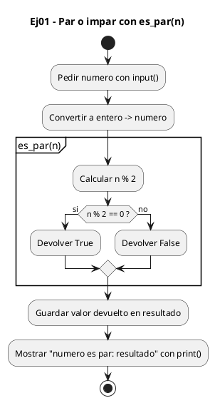
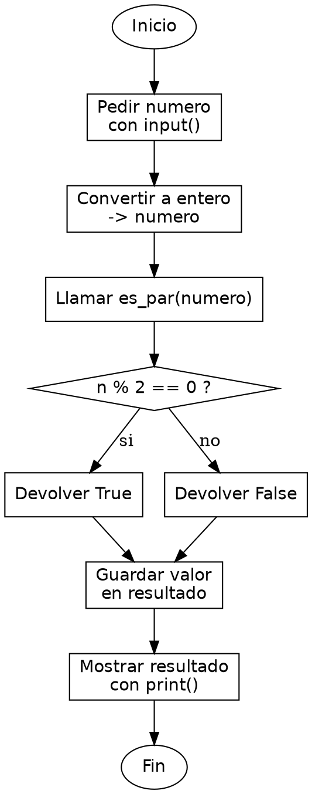

<!-- FICHERO GENERADO — NO EDITAR. Fuente de verdad: curso-python/practica/04-funciones/ej01.md (se regenera con gen_course.py). -->

# Ejercicio 01 — Escribe es_par(n) que devuelva True/False

Dificultad: verde · Módulo 04 (Funciones)

## Enunciado

Escribe es_par(n) que devuelva True/False. Pide un número e imprime si es par o impar.

## Diagramas de flujo





## Cómo se resuelve

<!-- EXPLICACION -->
Definir tu primera función con `def` y hacer que devuelva un booleano en lugar de imprimirlo es la lección central: separar el cálculo de la presentación.

1. `def es_par(n):` — la palabra clave `def` crea la función y `n` es su parámetro: un hueco que se rellena con el valor que le pases al llamarla. Dentro de la función `n` vale lo que le entregues desde fuera, sin tocar el resto del programa.
2. `return n % 2 == 0` — aquí pasan dos cosas. `n % 2` da el resto de dividir entre 2; comparar `== 0` produce directamente un valor booleano `True` o `False`. Ese booleano es lo que `return` entrega a quien llamó. No imprimimos nada dentro: la función solo responde una pregunta.
3. `resultado = es_par(numero)` — al llamar a la función, el `True`/`False` que devuelve queda guardado en `resultado`, que luego mostramos con la f-string. En C escribirías `int es_par(int n)` devolviendo 0 o 1, porque no había tipo `bool` nativo hasta C99; en Python `True` y `False` son valores de primera clase.

Trampa habitual: poner un `print` dentro de la función en vez de un `return`. Si la función imprime pero no devuelve nada, `es_par(numero)` vale `None` y no puedes reutilizar el resultado (guardarlo, negarlo, meterlo en un `if`). La regla: la función calcula y devuelve; quien la llama decide si lo imprime.

## Para practicar — cópialo y complétalo

Pega este esqueleto y completa los `TODO`. Es la mejor forma de aprender: inténtalo antes de mirar la solución.

```python
# Curso de Python — Modulo 04: Funciones
# Ejercicio 01 — PRACTICA (rellena los TODO)
# Enunciado: Escribe es_par(n) que devuelva True/False. Pide un número e imprime si es par o impar.
# Dificultad: verde
# Ejecutar: python3 ej01_practica.py


def es_par(n):
    """Devuelve True si n es par, False si es impar."""
    # TODO: usa el operador modulo (%) para comprobar si n es divisible entre 2
    # TODO: devuelve el resultado booleano directamente con return
    pass


# TODO: pide un numero al usuario con input() y conviertelo a int
numero = None  # reemplaza None

# TODO: llama a es_par() con el numero y guarda el resultado
resultado = None  # reemplaza None

# TODO: imprime con f-string: "<numero> es par: <resultado>"
```

## Solución — cópiala y ejecútala

```python
# Curso de Python — Modulo 04: Funciones
# Ejercicio 01 — MODELO (resuelto)
# Enunciado: Escribe es_par(n) que devuelva True/False. Pide un número e imprime si es par o impar.
# Dificultad: verde
# Ejecutar: python3 ej01_modelo.py


def es_par(n):
    """Devuelve True si n es par, False si es impar."""
    return n % 2 == 0


numero = int(input("Introduce un numero entero: "))
resultado = es_par(numero)
print(f"{numero} es par: {resultado}")
```

## Ejecútalo en el navegador

<div class="pyodide-run" data-code="IyBDdXJzbyBkZSBQeXRob24g4oCUIE1vZHVsbyAwNDogRnVuY2lvbmVzCiMgRWplcmNpY2lvIDAxIOKAlCBNT0RFTE8gKHJlc3VlbHRvKQojIEVudW5jaWFkbzogRXNjcmliZSBlc19wYXIobikgcXVlIGRldnVlbHZhIFRydWUvRmFsc2UuIFBpZGUgdW4gbsO6bWVybyBlIGltcHJpbWUgc2kgZXMgcGFyIG8gaW1wYXIuCiMgRGlmaWN1bHRhZDogdmVyZGUKIyBFamVjdXRhcjogcHl0aG9uMyBlajAxX21vZGVsby5weQoKCmRlZiBlc19wYXIobik6CiAgICAiIiJEZXZ1ZWx2ZSBUcnVlIHNpIG4gZXMgcGFyLCBGYWxzZSBzaSBlcyBpbXBhci4iIiIKICAgIHJldHVybiBuICUgMiA9PSAwCgoKbnVtZXJvID0gaW50KGlucHV0KCJJbnRyb2R1Y2UgdW4gbnVtZXJvIGVudGVybzogIikpCnJlc3VsdGFkbyA9IGVzX3BhcihudW1lcm8pCnByaW50KGYie251bWVyb30gZXMgcGFyOiB7cmVzdWx0YWRvfSIpCg==">
<button class="pyodide-btn" type="button">▶ Ejecutar aquí (Python en el navegador)</button>
<textarea class="pyodide-stdin" rows="2" placeholder="Si el programa pide datos por teclado, escríbelos aquí, uno por línea"></textarea>
<pre class="pyodide-out" hidden></pre>
</div>

[▶ Visualízalo paso a paso en Python Tutor](https://pythontutor.com/visualize.html#code=%23+Curso+de+Python+%E2%80%94+Modulo+04%3A+Funciones%0A%23+Ejercicio+01+%E2%80%94+MODELO+%28resuelto%29%0A%23+Enunciado%3A+Escribe+es_par%28n%29+que+devuelva+True%2FFalse.+Pide+un+n%C3%BAmero+e+imprime+si+es+par+o+impar.%0A%23+Dificultad%3A+verde%0A%23+Ejecutar%3A+python3+ej01_modelo.py%0A%0A%0Adef+es_par%28n%29%3A%0A++++%22%22%22Devuelve+True+si+n+es+par%2C+False+si+es+impar.%22%22%22%0A++++return+n+%25+2+%3D%3D+0%0A%0A%0Anumero+%3D+int%28input%28%22Introduce+un+numero+entero%3A+%22%29%29%0Aresultado+%3D+es_par%28numero%29%0Aprint%28f%22%7Bnumero%7D+es+par%3A+%7Bresultado%7D%22%29%0A&cumulative=false&curInstr=0&py=3&rawInputLstJSON=%5B%5D) — ve cómo cambian las variables línea a línea.

## Cómo usarlo

Pega el código en un fichero y ejecútalo con tu toolchain habitual (o el botón de Ejecutar de tu editor). Antes de mirar la solución, intenta completar tú el esqueleto: es la mejor forma de aprender.

## Conexiones

- [[Curso_Python/modelo/04-funciones|Teoría del módulo]]
- [[Curso_Python/practica/00_README|Índice del curso]]
