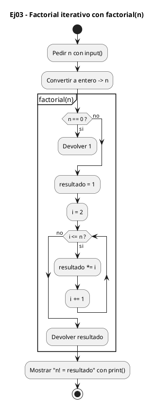
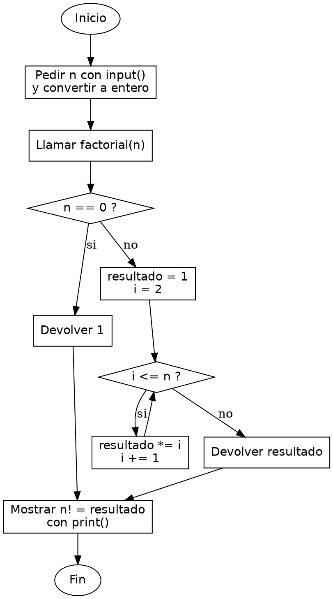

<!-- FICHERO GENERADO — NO EDITAR. Fuente de verdad: curso-python/practica/04-funciones/ej03.md (se regenera con gen_course.py). -->

# Ejercicio 03 — Escribe factorial(n) iterativo

Dificultad: amarillo · Módulo 04 (Funciones)

## Enunciado

Escribe factorial(n) iterativo. Pide n al usuario e imprime n!.

## Diagramas de flujo





## Cómo se resuelve

<!-- EXPLICACION -->
Calcular el factorial de forma iterativa mezcla dos ideas: un acumulador que arrastra el producto y un caso base que se trata aparte.

1. `if n == 0: return 1` — por definición matemática `0! = 1`. Lo resolvemos primero con un `return` temprano para que el bucle no tenga que preocuparse de ese caso raro.
2. `resultado = 1` — el acumulador arranca en 1, no en 0. Como vamos a multiplicar, empezar en 0 dejaría todo en 0; 1 es el elemento neutro del producto.
3. `for i in range(2, n + 1):` — recorre de 2 hasta `n` inclusive. `range` excluye el extremo derecho, por eso escribimos `n + 1`. Empezamos en 2 porque multiplicar por 1 no cambia nada.
4. `resultado *= i` — en cada vuelta multiplica el acumulador por el `i` actual; al salir del bucle, `resultado` contiene `2*3*...*n`. Ese valor lo entrega el `return` final.

Trampa habitual: en C tendrías que vigilar el desbordamiento (un `int` de 32 bits se pasa ya en `13!`); en Python los enteros crecen sin límite fijo, así que `factorial(100)` funciona tal cual. Otro fallo típico: iniciar `range` en 1 o el acumulador en 0, o olvidar el `+ 1` y quedarte corto un factor.

## Para practicar — cópialo y complétalo

Pega este esqueleto y completa los `TODO`. Es la mejor forma de aprender: inténtalo antes de mirar la solución.

```python
# Curso de Python — Modulo 04: Funciones
# Ejercicio 03 — PRACTICA (rellena los TODO)
# Enunciado: Escribe factorial(n) iterativo. Pide n al usuario e imprime n!.
# Dificultad: amarillo
# Ejecutar: python3 ej03_practica.py


def factorial(n):
    """Devuelve n! de forma iterativa. n debe ser un entero >= 0."""
    # TODO: trata el caso base: si n == 0, devuelve 1 directamente
    # TODO: inicializa una variable resultado a 1
    # TODO: recorre range(2, n + 1) con un for y multiplica resultado por cada i
    # TODO: devuelve resultado
    pass


# TODO: pide n al usuario con int(input(...))
n = None  # reemplaza None

# TODO: imprime con f-string: "<n>! = <factorial(n)>"
```

## Solución — cópiala y ejecútala

```python
# Curso de Python — Modulo 04: Funciones
# Ejercicio 03 — MODELO (resuelto)
# Enunciado: Escribe factorial(n) iterativo. Pide n al usuario e imprime n!.
# Dificultad: amarillo
# Ejecutar: python3 ej03_modelo.py


def factorial(n):
    """Devuelve n! de forma iterativa. n debe ser un entero >= 0."""
    if n == 0:
        return 1
    resultado = 1
    for i in range(2, n + 1):
        resultado *= i
    return resultado


n = int(input("Introduce un entero >= 0: "))
print(f"{n}! = {factorial(n)}")
```

## Ejecútalo en el navegador

[▶ Visualízalo paso a paso en Python Tutor](https://pythontutor.com/visualize.html#code=%23+Curso+de+Python+%E2%80%94+Modulo+04%3A+Funciones%0A%23+Ejercicio+03+%E2%80%94+MODELO+%28resuelto%29%0A%23+Enunciado%3A+Escribe+factorial%28n%29+iterativo.+Pide+n+al+usuario+e+imprime+n%21.%0A%23+Dificultad%3A+amarillo%0A%23+Ejecutar%3A+python3+ej03_modelo.py%0A%0A%0Adef+factorial%28n%29%3A%0A++++%22%22%22Devuelve+n%21+de+forma+iterativa.+n+debe+ser+un+entero+%3E%3D+0.%22%22%22%0A++++if+n+%3D%3D+0%3A%0A++++++++return+1%0A++++resultado+%3D+1%0A++++for+i+in+range%282%2C+n+%2B+1%29%3A%0A++++++++resultado+%2A%3D+i%0A++++return+resultado%0A%0A%0An+%3D+int%28input%28%22Introduce+un+entero+%3E%3D+0%3A+%22%29%29%0Aprint%28f%22%7Bn%7D%21+%3D+%7Bfactorial%28n%29%7D%22%29%0A&cumulative=false&curInstr=0&py=3&rawInputLstJSON=%5B%5D) — ve cómo cambian las variables línea a línea.

## Cómo usarlo

Pega el código en un fichero y ejecútalo con tu toolchain habitual (o el botón de Ejecutar de tu editor). Antes de mirar la solución, intenta completar tú el esqueleto: es la mejor forma de aprender.

## Conexiones

- [[Curso_Python/modelo/04-funciones|Teoría del módulo]]
- [[Curso_Python/practica/00_README|Índice del curso]]
