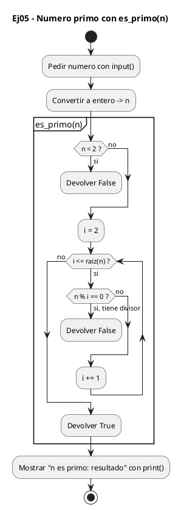
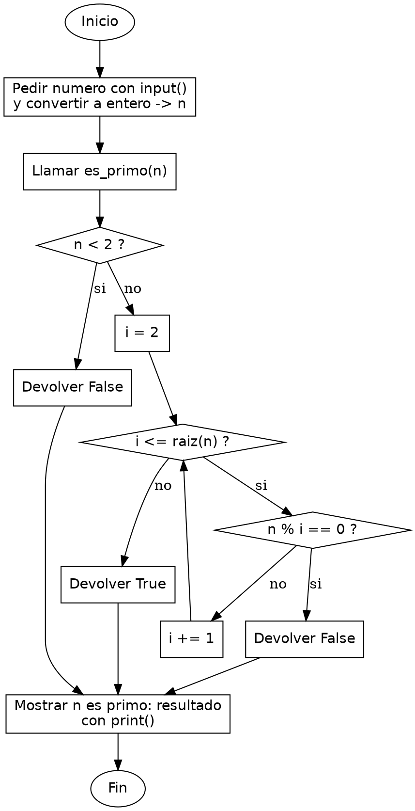

<!-- FICHERO GENERADO — NO EDITAR. Fuente de verdad: curso-python/practica/04-funciones/ej05.md (se regenera con gen_course.py). -->

# Ejercicio 05 — Escribe es_primo(n) que devuelva True/False

Dificultad: amarillo · Módulo 04 (Funciones)

## Enunciado

Escribe es_primo(n) que devuelva True/False. Pide un número e indica si es primo.

## Diagramas de flujo





## Cómo se resuelve

<!-- EXPLICACION -->
Comprobar si un número es primo enseña a combinar varios `return` con una optimización clave: basta probar divisores hasta la raíz cuadrada.

1. `if n < 2: return False` — 0, 1 y los negativos no son primos por definición. Lo despachamos primero con un `return` temprano para que el bucle solo trate números que tengan sentido.
2. `for i in range(2, int(n ** 0.5) + 1):` — probamos divisores desde 2 hasta la raíz cuadrada de `n`. Si `n` tuviera un divisor mayor que su raíz, su pareja sería menor, y ya la habríamos encontrado; por eso no hace falta ir hasta `n`. `n ** 0.5` es la raíz, `int(...)` la trunca y `+ 1` asegura incluir ese último candidato.
3. `if n % i == 0: return False` — en cuanto encontramos un divisor exacto, sabemos que no es primo y salimos de inmediato: no tiene sentido seguir buscando.
4. `return True` — este `return` solo se alcanza si el bucle terminó sin encontrar ningún divisor. Su posición importa: está fuera del bucle, así que se ejecuta solo cuando ninguna vuelta cortó antes con `False`.

Trampa habitual: colocar el `return True` dentro del bucle. Si lo metes en el `for`, la función respondería `True` en cuanto el primer divisor no divide, sin haber comprobado el resto. El `True` tiene que ir después del bucle completo, porque solo entonces sabes que ningún candidato dividía.

## Para practicar — cópialo y complétalo

Pega este esqueleto y completa los `TODO`. Es la mejor forma de aprender: inténtalo antes de mirar la solución.

```python
# Curso de Python — Modulo 04: Funciones
# Ejercicio 05 — PRACTICA (rellena los TODO)
# Enunciado: Escribe es_primo(n) que devuelva True/False. Pide un número e indica si es primo.
# Dificultad: amarillo
# Ejecutar: python3 ej05_practica.py


def es_primo(n):
    """Devuelve True si n es un numero primo, False en caso contrario."""
    # TODO: si n < 2, devuelve False directamente (0 y 1 no son primos)
    # TODO: recorre i desde 2 hasta int(n ** 0.5) + 1 (inclusive)
    #       Pista: range(2, int(n ** 0.5) + 1)
    #       Si n % i == 0, devuelve False (encontraste un divisor)
    # TODO: si el bucle termina sin encontrar divisor, devuelve True
    pass


# TODO: pide n con int(input(...))
n = None  # reemplaza None

# TODO: imprime con f-string: "<n> es primo: <es_primo(n)>"
```

## Solución — cópiala y ejecútala

```python
# Curso de Python — Modulo 04: Funciones
# Ejercicio 05 — MODELO (resuelto)
# Enunciado: Escribe es_primo(n) que devuelva True/False. Pide un número e indica si es primo.
# Dificultad: amarillo
# Ejecutar: python3 ej05_modelo.py


def es_primo(n):
    """Devuelve True si n es un numero primo, False en caso contrario."""
    if n < 2:
        return False
    for i in range(2, int(n ** 0.5) + 1):
        if n % i == 0:
            return False
    return True


n = int(input("Introduce un numero entero: "))
print(f"{n} es primo: {es_primo(n)}")
```

## Ejecútalo en el navegador

[▶ Visualízalo paso a paso en Python Tutor](https://pythontutor.com/visualize.html#code=%23+Curso+de+Python+%E2%80%94+Modulo+04%3A+Funciones%0A%23+Ejercicio+05+%E2%80%94+MODELO+%28resuelto%29%0A%23+Enunciado%3A+Escribe+es_primo%28n%29+que+devuelva+True%2FFalse.+Pide+un+n%C3%BAmero+e+indica+si+es+primo.%0A%23+Dificultad%3A+amarillo%0A%23+Ejecutar%3A+python3+ej05_modelo.py%0A%0A%0Adef+es_primo%28n%29%3A%0A++++%22%22%22Devuelve+True+si+n+es+un+numero+primo%2C+False+en+caso+contrario.%22%22%22%0A++++if+n+%3C+2%3A%0A++++++++return+False%0A++++for+i+in+range%282%2C+int%28n+%2A%2A+0.5%29+%2B+1%29%3A%0A++++++++if+n+%25+i+%3D%3D+0%3A%0A++++++++++++return+False%0A++++return+True%0A%0A%0An+%3D+int%28input%28%22Introduce+un+numero+entero%3A+%22%29%29%0Aprint%28f%22%7Bn%7D+es+primo%3A+%7Bes_primo%28n%29%7D%22%29%0A&cumulative=false&curInstr=0&py=3&rawInputLstJSON=%5B%5D) — ve cómo cambian las variables línea a línea.

## Cómo usarlo

Pega el código en un fichero y ejecútalo con tu toolchain habitual (o el botón de Ejecutar de tu editor). Antes de mirar la solución, intenta completar tú el esqueleto: es la mejor forma de aprender.

## Conexiones

- [[Curso_Python/modelo/04-funciones|Teoría del módulo]]
- [[Curso_Python/practica/00_README|Índice del curso]]
