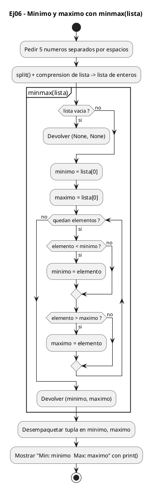
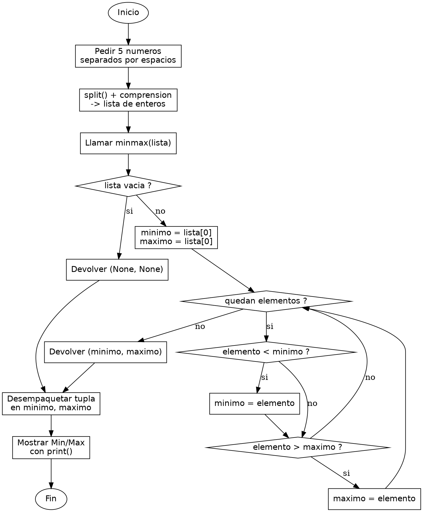

<!-- FICHERO GENERADO — NO EDITAR. Fuente de verdad: curso-python/practica/04-funciones/ej06.md (se regenera con gen_course.py). -->

# Ejercicio 06 — Escribe minmax(lista) que devuelva una tupla

Dificultad: rojo · Módulo 04 (Funciones)

## Enunciado

Escribe minmax(lista) que devuelva una tupla (mínimo, máximo). Pide 5 números e imprime el resultado.

## Diagramas de flujo





## Cómo se resuelve

<!-- EXPLICACION -->
Devolver mínimo y máximo de golpe muestra algo que en C es incómodo: una función Python puede devolver varios valores a la vez empaquetándolos en una tupla.

1. `if not lista: return None, None` — si la lista está vacía no hay mínimo ni máximo, así que devolvemos `None, None`. `not lista` es `True` cuando la lista no tiene elementos: en Python una lista vacía se considera "falsa" en un contexto booleano.
2. `minimo = lista[0]` y `maximo = lista[0]` — inicializamos ambos con el primer elemento real, no con 0 ni con un número inventado. Así el punto de partida siempre pertenece a la lista y las comparaciones son válidas aunque haya negativos.
3. `for elemento in lista[1:]:` — recorremos desde el segundo elemento (`lista[1:]` es la lista sin el primero, que ya usamos como referencia). Dentro, `if elemento < minimo` y `if elemento > maximo` actualizan cada extremo cuando encontramos algo más pequeño o más grande.
4. `return minimo, maximo` — la coma crea una tupla `(minimo, maximo)`. Al llamar, `minimo, maximo = minmax(numeros)` la desempaqueta en dos variables de una sola línea. En C tendrías que devolver un `struct` o pasar punteros de salida; aquí la tupla lo resuelve limpio.

Trampa habitual: inicializar `minimo`/`maximo` a 0. Si todos los números fueran positivos, el mínimo real nunca bajaría de 0 y darías un resultado falso; si fueran todos negativos, fallaría el máximo. Arrancar con `lista[0]` evita ese sesgo. Fíjate además en que `minmax` no usa `min()` ni `max()` a propósito: el objetivo es ver el patrón de recorrido a mano.

## Para practicar — cópialo y complétalo

Pega este esqueleto y completa los `TODO`. Es la mejor forma de aprender: inténtalo antes de mirar la solución.

```python
# Curso de Python — Modulo 04: Funciones
# Ejercicio 06 — PRACTICA (rellena los TODO)
# Enunciado: Escribe minmax(lista) que devuelva una tupla (mínimo, máximo). Pide 5 números e imprime el resultado.
# Dificultad: rojo
# Ejecutar: python3 ej06_practica.py


def minmax(lista):
    """Devuelve una tupla (minimo, maximo) de los elementos de lista."""
    # TODO: trata el caso de lista vacia: devuelve (None, None)
    # TODO: inicializa minimo y maximo con el primer elemento: lista[0]
    # TODO: recorre lista[1:] (desde el segundo elemento) con un for
    #       Si el elemento actual es menor que minimo, actualiza minimo
    #       Si el elemento actual es mayor que maximo, actualiza maximo
    # TODO: devuelve la tupla (minimo, maximo) — recuerda: return a, b crea una tupla
    pass


# TODO: pide una linea con input() que contenga 5 numeros separados por espacios
entrada = None  # reemplaza None: input("Introduce 5 numeros separados por espacios: ")

# TODO: usa entrada.split() para partir la cadena y convierte cada parte a int
#       Puedes usar una lista por comprension: [int(x) for x in entrada.split()]
numeros = None  # reemplaza None

# TODO: llama a minmax(numeros) y desempaqueta el resultado en dos variables: minimo, maximo
# TODO: imprime con f-string: "Min: <minimo>  Max: <maximo>"
```

## Solución — cópiala y ejecútala

```python
# Curso de Python — Modulo 04: Funciones
# Ejercicio 06 — MODELO (resuelto)
# Enunciado: Escribe minmax(lista) que devuelva una tupla (mínimo, máximo). Pide 5 números e imprime el resultado.
# Dificultad: rojo
# Ejecutar: python3 ej06_modelo.py


def minmax(lista):
    """Devuelve una tupla (minimo, maximo) de los elementos de lista.

    No usa las funciones built-in min() ni max() internamente:
    recorre la lista manualmente para ilustrar el patron.
    """
    if not lista:
        return None, None

    minimo = lista[0]
    maximo = lista[0]

    for elemento in lista[1:]:
        if elemento < minimo:
            minimo = elemento
        if elemento > maximo:
            maximo = elemento

    return minimo, maximo


entrada = input("Introduce 5 numeros separados por espacios: ")
# split() parte la cadena por espacios y devuelve una lista de strings
# La comprension de lista convierte cada string a int
numeros = [int(x) for x in entrada.split()]

minimo, maximo = minmax(numeros)
print(f"Min: {minimo}  Max: {maximo}")
```

## Ejecútalo en el navegador

<div class="pyodide-run" data-code="IyBDdXJzbyBkZSBQeXRob24g4oCUIE1vZHVsbyAwNDogRnVuY2lvbmVzCiMgRWplcmNpY2lvIDA2IOKAlCBNT0RFTE8gKHJlc3VlbHRvKQojIEVudW5jaWFkbzogRXNjcmliZSBtaW5tYXgobGlzdGEpIHF1ZSBkZXZ1ZWx2YSB1bmEgdHVwbGEgKG3DrW5pbW8sIG3DoXhpbW8pLiBQaWRlIDUgbsO6bWVyb3MgZSBpbXByaW1lIGVsIHJlc3VsdGFkby4KIyBEaWZpY3VsdGFkOiByb2pvCiMgRWplY3V0YXI6IHB5dGhvbjMgZWowNl9tb2RlbG8ucHkKCgpkZWYgbWlubWF4KGxpc3RhKToKICAgICIiIkRldnVlbHZlIHVuYSB0dXBsYSAobWluaW1vLCBtYXhpbW8pIGRlIGxvcyBlbGVtZW50b3MgZGUgbGlzdGEuCgogICAgTm8gdXNhIGxhcyBmdW5jaW9uZXMgYnVpbHQtaW4gbWluKCkgbmkgbWF4KCkgaW50ZXJuYW1lbnRlOgogICAgcmVjb3JyZSBsYSBsaXN0YSBtYW51YWxtZW50ZSBwYXJhIGlsdXN0cmFyIGVsIHBhdHJvbi4KICAgICIiIgogICAgaWYgbm90IGxpc3RhOgogICAgICAgIHJldHVybiBOb25lLCBOb25lCgogICAgbWluaW1vID0gbGlzdGFbMF0KICAgIG1heGltbyA9IGxpc3RhWzBdCgogICAgZm9yIGVsZW1lbnRvIGluIGxpc3RhWzE6XToKICAgICAgICBpZiBlbGVtZW50byA8IG1pbmltbzoKICAgICAgICAgICAgbWluaW1vID0gZWxlbWVudG8KICAgICAgICBpZiBlbGVtZW50byA+IG1heGltbzoKICAgICAgICAgICAgbWF4aW1vID0gZWxlbWVudG8KCiAgICByZXR1cm4gbWluaW1vLCBtYXhpbW8KCgplbnRyYWRhID0gaW5wdXQoIkludHJvZHVjZSA1IG51bWVyb3Mgc2VwYXJhZG9zIHBvciBlc3BhY2lvczogIikKIyBzcGxpdCgpIHBhcnRlIGxhIGNhZGVuYSBwb3IgZXNwYWNpb3MgeSBkZXZ1ZWx2ZSB1bmEgbGlzdGEgZGUgc3RyaW5ncwojIExhIGNvbXByZW5zaW9uIGRlIGxpc3RhIGNvbnZpZXJ0ZSBjYWRhIHN0cmluZyBhIGludApudW1lcm9zID0gW2ludCh4KSBmb3IgeCBpbiBlbnRyYWRhLnNwbGl0KCldCgptaW5pbW8sIG1heGltbyA9IG1pbm1heChudW1lcm9zKQpwcmludChmIk1pbjoge21pbmltb30gIE1heDoge21heGltb30iKQo=">
<button class="pyodide-btn" type="button">▶ Ejecutar aquí (Python en el navegador)</button>
<textarea class="pyodide-stdin" rows="2" placeholder="Si el programa pide datos por teclado, escríbelos aquí, uno por línea"></textarea>
<pre class="pyodide-out" hidden></pre>
</div>

[▶ Visualízalo paso a paso en Python Tutor](https://pythontutor.com/visualize.html#code=%23+Curso+de+Python+%E2%80%94+Modulo+04%3A+Funciones%0A%23+Ejercicio+06+%E2%80%94+MODELO+%28resuelto%29%0A%23+Enunciado%3A+Escribe+minmax%28lista%29+que+devuelva+una+tupla+%28m%C3%ADnimo%2C+m%C3%A1ximo%29.+Pide+5+n%C3%BAmeros+e+imprime+el+resultado.%0A%23+Dificultad%3A+rojo%0A%23+Ejecutar%3A+python3+ej06_modelo.py%0A%0A%0Adef+minmax%28lista%29%3A%0A++++%22%22%22Devuelve+una+tupla+%28minimo%2C+maximo%29+de+los+elementos+de+lista.%0A%0A++++No+usa+las+funciones+built-in+min%28%29+ni+max%28%29+internamente%3A%0A++++recorre+la+lista+manualmente+para+ilustrar+el+patron.%0A++++%22%22%22%0A++++if+not+lista%3A%0A++++++++return+None%2C+None%0A%0A++++minimo+%3D+lista%5B0%5D%0A++++maximo+%3D+lista%5B0%5D%0A%0A++++for+elemento+in+lista%5B1%3A%5D%3A%0A++++++++if+elemento+%3C+minimo%3A%0A++++++++++++minimo+%3D+elemento%0A++++++++if+elemento+%3E+maximo%3A%0A++++++++++++maximo+%3D+elemento%0A%0A++++return+minimo%2C+maximo%0A%0A%0Aentrada+%3D+input%28%22Introduce+5+numeros+separados+por+espacios%3A+%22%29%0A%23+split%28%29+parte+la+cadena+por+espacios+y+devuelve+una+lista+de+strings%0A%23+La+comprension+de+lista+convierte+cada+string+a+int%0Anumeros+%3D+%5Bint%28x%29+for+x+in+entrada.split%28%29%5D%0A%0Aminimo%2C+maximo+%3D+minmax%28numeros%29%0Aprint%28f%22Min%3A+%7Bminimo%7D++Max%3A+%7Bmaximo%7D%22%29%0A&cumulative=false&curInstr=0&py=3&rawInputLstJSON=%5B%5D) — ve cómo cambian las variables línea a línea.

## Cómo usarlo

Pega el código en un fichero y ejecútalo con tu toolchain habitual (o el botón de Ejecutar de tu editor). Antes de mirar la solución, intenta completar tú el esqueleto: es la mejor forma de aprender.

## Conexiones

- [[Curso_Python/modelo/04-funciones|Teoría del módulo]]
- [[Curso_Python/practica/00_README|Índice del curso]]
