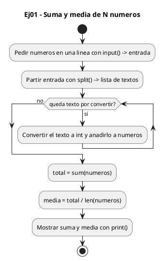
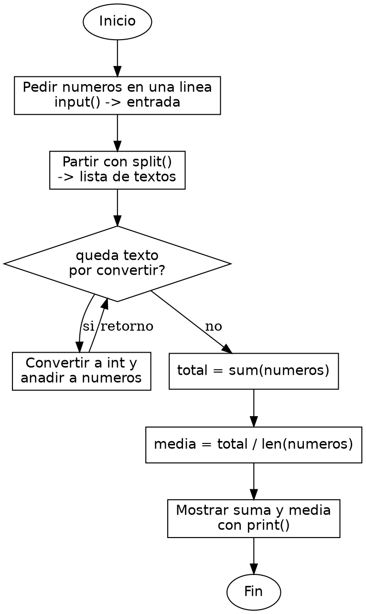

<!-- FICHERO GENERADO — NO EDITAR. Fuente de verdad: curso-python/practica/05-listas/ej01.md (se regenera con gen_course.py). -->

# Ejercicio 01 — Pide al usuario N números enteros y calcula su suma y media

Dificultad: verde · Módulo 05 (Listas y comprehensions)

## Enunciado

Pide al usuario N números enteros y calcula su suma y media

## Diagramas de flujo





## Cómo se resuelve

<!-- EXPLICACION -->
Leer varios números de una sola línea y sacar su suma y su media encadena tres piezas de Python: partir el texto, convertirlo en una lista de enteros y aplicarle funciones que operan sobre toda la lista a la vez.

1. `entrada = input(...)` — lee toda la línea como un único `str`, por ejemplo `"4 1 9"`. Todavía es texto, no números.
2. `entrada.split()` — parte esa cadena por los espacios y devuelve una lista de trozos de texto: `["4", "1", "9"]`. `.split()` sin argumentos separa por cualquier bloque de espacios, así que espacios de más no molestan.
3. `[int(x) for x in entrada.split()]` — esta es la clave: una list comprehension recorre cada trozo `x` y le aplica `int(x)`, produciendo una lista nueva de enteros `[4, 1, 9]` en una sola línea. En C tendrías que reservar el array de antemano y llenarlo con un bucle; aquí la lista crece sola y guarda ya el tipo que quieres.
4. `sum(numeros)` y `len(numeros)` — funciones builtin que trabajan sobre la lista entera: `sum` suma todos los elementos y `len` cuenta cuántos hay. La media es `total / len(...)`, y `:.2f` en la f-string la muestra con dos decimales.

Trampa habitual: si el usuario no escribe nada, `entrada.split()` devuelve una lista vacía y `total / len(numeros)` revienta con `ZeroDivisionError`. También, sin el `int(...)`, sumarías cadenas y `+` las pegaría en vez de sumarlas.

## Para practicar — cópialo y complétalo

Pega este esqueleto y completa los `TODO`. Es la mejor forma de aprender: inténtalo antes de mirar la solución.

```python
# Curso de Python — Modulo 05: Listas y comprehensions
# Ejercicio 01 — PRACTICA (rellena los TODO)
# Enunciado: Pide al usuario N números enteros y calcula su suma y media
# Dificultad: verde
# Ejecutar: python3 ej01_practica.py

# TODO: pide al usuario una linea de numeros separados por espacio
entrada = input("Introduce numeros separados por espacio: ")

# TODO: usa split() y una list comprehension para convertir cada elemento a int
numeros = []  # reemplaza esta lista vacia

# TODO: calcula la suma y la media
total = 0     # usa sum() y len()
media = 0.0

# TODO: imprime con f-string: "Suma: X  Media: Y.YY"
print()
```

## Solución — cópiala y ejecútala

```python
# Curso de Python — Modulo 05: Listas y comprehensions
# Ejercicio 01 — MODELO (resuelto)
# Enunciado: Pide al usuario N números enteros y calcula su suma y media
# Dificultad: verde
# Ejecutar: python3 ej01_modelo.py

# Pedimos los numeros en una sola linea separados por espacio
entrada = input("Introduce numeros separados por espacio: ")

# split() parte el string por espacios -> lista de strings
# La comprehension convierte cada elemento a int
numeros = [int(x) for x in entrada.split()]

# sum() y len() son funciones builtin de Python
total = sum(numeros)
media = total / len(numeros)

print(f"Suma: {total}  Media: {media:.2f}")
```

## Ejecútalo en el navegador

[▶ Visualízalo paso a paso en Python Tutor](https://pythontutor.com/visualize.html#code=%23+Curso+de+Python+%E2%80%94+Modulo+05%3A+Listas+y+comprehensions%0A%23+Ejercicio+01+%E2%80%94+MODELO+%28resuelto%29%0A%23+Enunciado%3A+Pide+al+usuario+N+n%C3%BAmeros+enteros+y+calcula+su+suma+y+media%0A%23+Dificultad%3A+verde%0A%23+Ejecutar%3A+python3+ej01_modelo.py%0A%0A%23+Pedimos+los+numeros+en+una+sola+linea+separados+por+espacio%0Aentrada+%3D+input%28%22Introduce+numeros+separados+por+espacio%3A+%22%29%0A%0A%23+split%28%29+parte+el+string+por+espacios+-%3E+lista+de+strings%0A%23+La+comprehension+convierte+cada+elemento+a+int%0Anumeros+%3D+%5Bint%28x%29+for+x+in+entrada.split%28%29%5D%0A%0A%23+sum%28%29+y+len%28%29+son+funciones+builtin+de+Python%0Atotal+%3D+sum%28numeros%29%0Amedia+%3D+total+%2F+len%28numeros%29%0A%0Aprint%28f%22Suma%3A+%7Btotal%7D++Media%3A+%7Bmedia%3A.2f%7D%22%29%0A&cumulative=false&curInstr=0&py=3&rawInputLstJSON=%5B%5D) — ve cómo cambian las variables línea a línea.

## Cómo usarlo

Pega el código en un fichero y ejecútalo con tu toolchain habitual (o el botón de Ejecutar de tu editor). Antes de mirar la solución, intenta completar tú el esqueleto: es la mejor forma de aprender.

## Conexiones

- [[Curso_Python/modelo/05-listas|Teoría del módulo]]
- [[Curso_Python/practica/00_README|Índice del curso]]
