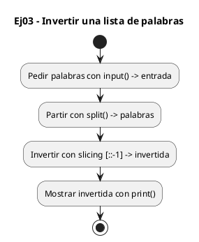
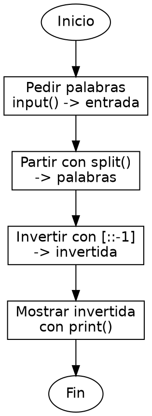

<!-- FICHERO GENERADO — NO EDITAR. Fuente de verdad: curso-python/practica/05-listas/ej03.md (se regenera con gen_course.py). -->

# Ejercicio 03 — Pide una lista de palabras separadas por espacio e imprimela al reves

Dificultad: verde · Módulo 05 (Listas y comprehensions)

## Enunciado

Pide una lista de palabras separadas por espacio e imprimela al reves

## Diagramas de flujo





## Cómo se resuelve

<!-- EXPLICACION -->
Invertir una lista de palabras es la excusa perfecta para ver el slicing con paso negativo, un atajo que en C exigiría un bucle que intercambia extremos.

1. `entrada.split()` — parte la línea tecleada en una lista de palabras: `"hola que tal"` se vuelve `["hola", "que", "tal"]`. Sin argumentos, `.split()` trocea por cualquier espacio en blanco.
2. `palabras[::-1]` — esta es la clave. El slicing tiene la forma `[inicio:fin:paso]`; al dejar `inicio` y `fin` vacíos y poner paso `-1`, Python recorre la lista de atrás hacia adelante y devuelve una lista nueva invertida.
3. Es importante que crea una copia: la lista original `palabras` queda intacta. Si en cambio quisieras invertir la lista en su sitio, usarías el método `palabras.reverse()`, que no devuelve nada y modifica la original.
4. `print(invertida)` — al imprimir una lista tal cual, Python muestra los corchetes y las comillas de cada string; no es texto seguido sino la representación de la lista.

Trampa habitual: confundir `[::-1]` (invierte) con `[-1]` (que es solo el último elemento). Un cambio de un carácter y el resultado es completamente distinto.

## Para practicar — cópialo y complétalo

Pega este esqueleto y completa los `TODO`. Es la mejor forma de aprender: inténtalo antes de mirar la solución.

```python
# Curso de Python — Modulo 05: Listas y comprehensions
# Ejercicio 03 — PRACTICA (rellena los TODO)
# Enunciado: Pide una lista de palabras separadas por espacio e imprimela al reves
# Dificultad: verde
# Ejecutar: python3 ej03_practica.py

entrada = input("Introduce palabras separadas por espacio: ")

# TODO: convierte 'entrada' en una lista de palabras con split()
palabras = []

# TODO: invierte la lista usando slicing [::-1]
invertida = []

# TODO: imprime la lista invertida
print()
```

## Solución — cópiala y ejecútala

```python
# Curso de Python — Modulo 05: Listas y comprehensions
# Ejercicio 03 — MODELO (resuelto)
# Enunciado: Pide una lista de palabras separadas por espacio e imprimela al reves
# Dificultad: verde
# Ejecutar: python3 ej03_modelo.py

entrada = input("Introduce palabras separadas por espacio: ")

# split() sin argumentos parte por cualquier espacio en blanco
palabras = entrada.split()

# Slicing [::-1] crea una nueva lista invertida — no modifica la original
invertida = palabras[::-1]

print(invertida)
```

## Ejecútalo en el navegador

[▶ Visualízalo paso a paso en Python Tutor](https://pythontutor.com/visualize.html#code=%23+Curso+de+Python+%E2%80%94+Modulo+05%3A+Listas+y+comprehensions%0A%23+Ejercicio+03+%E2%80%94+MODELO+%28resuelto%29%0A%23+Enunciado%3A+Pide+una+lista+de+palabras+separadas+por+espacio+e+imprimela+al+reves%0A%23+Dificultad%3A+verde%0A%23+Ejecutar%3A+python3+ej03_modelo.py%0A%0Aentrada+%3D+input%28%22Introduce+palabras+separadas+por+espacio%3A+%22%29%0A%0A%23+split%28%29+sin+argumentos+parte+por+cualquier+espacio+en+blanco%0Apalabras+%3D+entrada.split%28%29%0A%0A%23+Slicing+%5B%3A%3A-1%5D+crea+una+nueva+lista+invertida+%E2%80%94+no+modifica+la+original%0Ainvertida+%3D+palabras%5B%3A%3A-1%5D%0A%0Aprint%28invertida%29%0A&cumulative=false&curInstr=0&py=3&rawInputLstJSON=%5B%5D) — ve cómo cambian las variables línea a línea.

## Cómo usarlo

Pega el código en un fichero y ejecútalo con tu toolchain habitual (o el botón de Ejecutar de tu editor). Antes de mirar la solución, intenta completar tú el esqueleto: es la mejor forma de aprender.

## Conexiones

- [[Curso_Python/modelo/05-listas|Teoría del módulo]]
- [[Curso_Python/practica/00_README|Índice del curso]]
