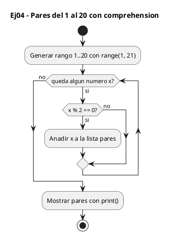
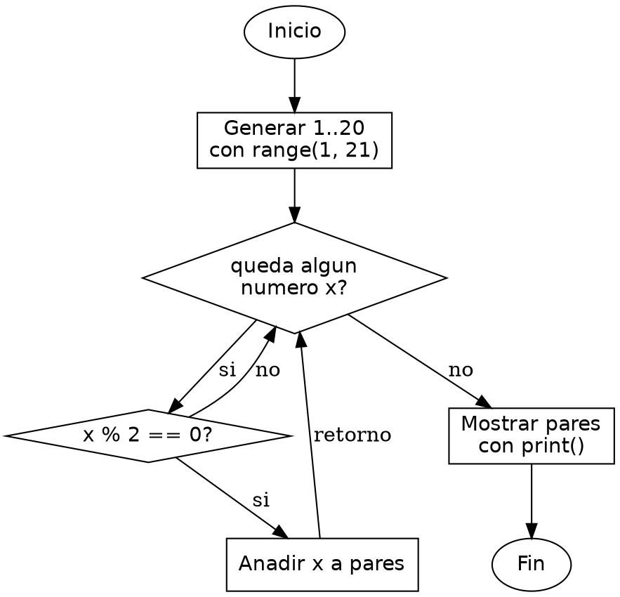

<!-- FICHERO GENERADO — NO EDITAR. Fuente de verdad: curso-python/practica/05-listas/ej04.md (se regenera con gen_course.py). -->

# Ejercicio 04 — Dada una lista de enteros del 1 al 20, extrae solo los pares con…

Dificultad: verde · Módulo 05 (Listas y comprehensions)

## Enunciado

Dada una lista de enteros del 1 al 20, extrae solo los pares con comprehension

## Diagramas de flujo





## Cómo se resuelve

<!-- EXPLICACION -->
Sacar solo los pares del 1 al 20 muestra la list comprehension con filtro: construir una lista nueva quedándote solo con los elementos que cumplen una condición, todo en una línea.

1. `range(1, 21)` — genera los números del 1 al 20. El límite superior es exclusivo, por eso ponemos `21` para incluir el 20. `range` no crea la lista en memoria, va produciendo los valores conforme se piden.
2. `[x for x in range(1, 21) if x % 2 == 0]` — la comprehension tiene dos partes: `for x in range(...)` recorre cada número y el `if x % 2 == 0` decide cuáles pasan. Solo los que dan resto 0 al dividir entre 2 (los pares) entran en la lista resultante.
3. `x % 2 == 0` es el módulo, igual que en C: el resto de dividir entre 2. Si vale 0, el número es par.
4. La ventaja frente a C: allí declararías un array, un contador y un bucle con un `if` que hace `array[j++] = x`. Aquí una sola expresión describe qué quieres (los pares) en vez de cómo construirlo paso a paso, y la lista se dimensiona sola.

Trampa habitual: olvidar que `range(1, 21)` no llega al 21. Si escribieras `range(1, 20)` te quedarías sin el 20, que es par y debería aparecer.

## Para practicar — cópialo y complétalo

Pega este esqueleto y completa los `TODO`. Es la mejor forma de aprender: inténtalo antes de mirar la solución.

```python
# Curso de Python — Modulo 05: Listas y comprehensions
# Ejercicio 04 — PRACTICA (rellena los TODO)
# Enunciado: Dada una lista de enteros del 1 al 20, extrae solo los pares con comprehension
# Dificultad: verde
# Ejecutar: python3 ej04_practica.py

# TODO: usa una list comprehension con range(1, 21) y la condicion de paridad
#       patron: [expresion for variable in iterable if condicion]
pares = []  # reemplaza con la comprehension

# TODO: imprime la lista de pares
print()
```

## Solución — cópiala y ejecútala

```python
# Curso de Python — Modulo 05: Listas y comprehensions
# Ejercicio 04 — MODELO (resuelto)
# Enunciado: Dada una lista de enteros del 1 al 20, extrae solo los pares con comprehension
# Dificultad: verde
# Ejecutar: python3 ej04_modelo.py

# range(1, 21) genera 1..20; la comprehension filtra los divisibles por 2
pares = [x for x in range(1, 21) if x % 2 == 0]

print(pares)
```

## Ejecútalo en el navegador

[▶ Visualízalo paso a paso en Python Tutor](https://pythontutor.com/visualize.html#code=%23+Curso+de+Python+%E2%80%94+Modulo+05%3A+Listas+y+comprehensions%0A%23+Ejercicio+04+%E2%80%94+MODELO+%28resuelto%29%0A%23+Enunciado%3A+Dada+una+lista+de+enteros+del+1+al+20%2C+extrae+solo+los+pares+con+comprehension%0A%23+Dificultad%3A+verde%0A%23+Ejecutar%3A+python3+ej04_modelo.py%0A%0A%23+range%281%2C+21%29+genera+1..20%3B+la+comprehension+filtra+los+divisibles+por+2%0Apares+%3D+%5Bx+for+x+in+range%281%2C+21%29+if+x+%25+2+%3D%3D+0%5D%0A%0Aprint%28pares%29%0A&cumulative=false&curInstr=0&py=3&rawInputLstJSON=%5B%5D) — ve cómo cambian las variables línea a línea.

## Cómo usarlo

Pega el código en un fichero y ejecútalo con tu toolchain habitual (o el botón de Ejecutar de tu editor). Antes de mirar la solución, intenta completar tú el esqueleto: es la mejor forma de aprender.

## Conexiones

- [[Curso_Python/modelo/05-listas|Teoría del módulo]]
- [[Curso_Python/practica/00_README|Índice del curso]]
