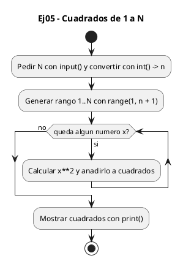
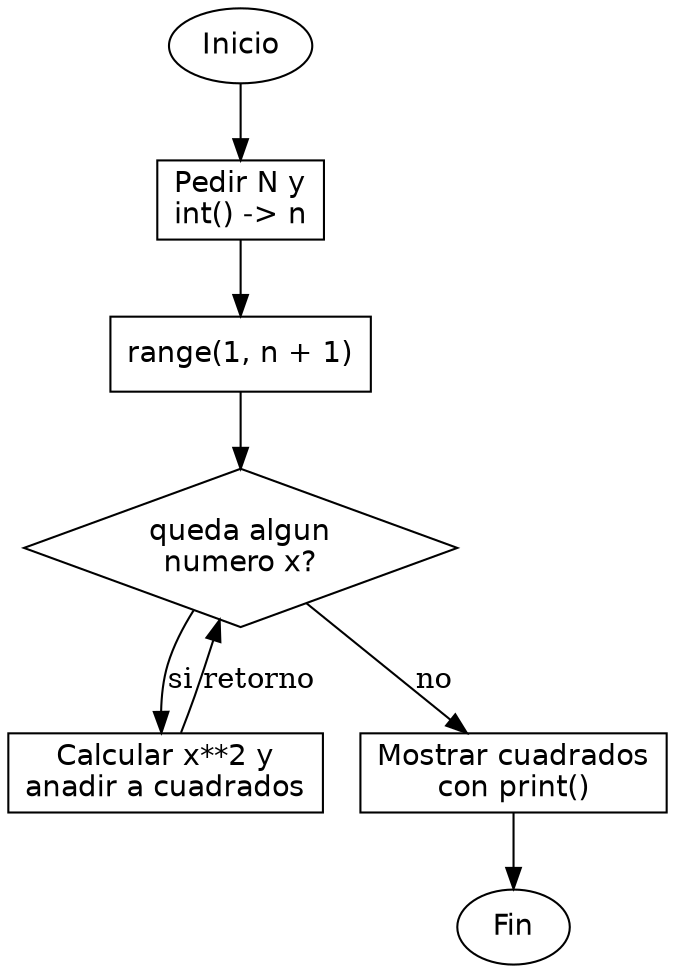

<!-- FICHERO GENERADO — NO EDITAR. Fuente de verdad: curso-python/practica/05-listas/ej05.md (se regenera con gen_course.py). -->

# Ejercicio 05 — El usuario introduce N

Dificultad: amarillo · Módulo 05 (Listas y comprehensions)

## Enunciado

El usuario introduce N; imprime la lista de cuadrados de 1 a N

## Diagramas de flujo





## Cómo se resuelve

<!-- EXPLICACION -->
Generar la lista de cuadrados de 1 a N combina leer un número del usuario con una comprehension que transforma cada elemento (aquí, elevándolo al cuadrado).

1. `n = int(input("Introduce N: "))` — `input()` siempre devuelve `str`, así que envolvemos con `int()` para tener un entero de verdad con el que construir el rango.
2. `range(1, n + 1)` — produce los números del 1 al N. Como el límite superior es exclusivo, sumamos 1 para que N quede incluido.
3. `[x**2 for x in range(1, n + 1)]` — la comprehension recorre cada `x` y guarda su transformación `x**2`. A diferencia del ejercicio de los pares, aquí no hay `if` que filtre: cada elemento produce un resultado, y la lista de salida tiene tantos elementos como el rango.
4. `x**2` es la potencia en Python (`base ** exponente`); equivale a `x*x`. En C no existe operador de potencia para enteros y usarías `x*x` o `pow()`.

Trampa habitual: escribir `range(1, n)`, que se queda en N-1 y te deja sin el último cuadrado. El `n + 1` es lo que garantiza incluir N.

## Para practicar — cópialo y complétalo

Pega este esqueleto y completa los `TODO`. Es la mejor forma de aprender: inténtalo antes de mirar la solución.

```python
# Curso de Python — Modulo 05: Listas y comprehensions
# Ejercicio 05 — PRACTICA (rellena los TODO)
# Enunciado: El usuario introduce N; imprime la lista de cuadrados de 1 a N
# Dificultad: amarillo
# Ejecutar: python3 ej05_practica.py

# TODO: pide N al usuario y conviertelo a entero (recuerda: input() devuelve str)
n = 0

# TODO: usa una list comprehension con range(1, n+1)
#       la expresion debe calcular x al cuadrado (x**2)
cuadrados = []

# TODO: imprime la lista de cuadrados
print()
```

## Solución — cópiala y ejecútala

```python
# Curso de Python — Modulo 05: Listas y comprehensions
# Ejercicio 05 — MODELO (resuelto)
# Enunciado: El usuario introduce N; imprime la lista de cuadrados de 1 a N
# Dificultad: amarillo
# Ejecutar: python3 ej05_modelo.py

# input() devuelve str -> hay que convertir a int
n = int(input("Introduce N: "))

# range(1, n+1) genera 1..N inclusive
# x**2 es la potencia en Python (equivalente a x*x en C)
cuadrados = [x**2 for x in range(1, n + 1)]

print(cuadrados)
```

## Ejecútalo en el navegador

[▶ Visualízalo paso a paso en Python Tutor](https://pythontutor.com/visualize.html#code=%23+Curso+de+Python+%E2%80%94+Modulo+05%3A+Listas+y+comprehensions%0A%23+Ejercicio+05+%E2%80%94+MODELO+%28resuelto%29%0A%23+Enunciado%3A+El+usuario+introduce+N%3B+imprime+la+lista+de+cuadrados+de+1+a+N%0A%23+Dificultad%3A+amarillo%0A%23+Ejecutar%3A+python3+ej05_modelo.py%0A%0A%23+input%28%29+devuelve+str+-%3E+hay+que+convertir+a+int%0An+%3D+int%28input%28%22Introduce+N%3A+%22%29%29%0A%0A%23+range%281%2C+n%2B1%29+genera+1..N+inclusive%0A%23+x%2A%2A2+es+la+potencia+en+Python+%28equivalente+a+x%2Ax+en+C%29%0Acuadrados+%3D+%5Bx%2A%2A2+for+x+in+range%281%2C+n+%2B+1%29%5D%0A%0Aprint%28cuadrados%29%0A&cumulative=false&curInstr=0&py=3&rawInputLstJSON=%5B%5D) — ve cómo cambian las variables línea a línea.

## Cómo usarlo

Pega el código en un fichero y ejecútalo con tu toolchain habitual (o el botón de Ejecutar de tu editor). Antes de mirar la solución, intenta completar tú el esqueleto: es la mejor forma de aprender.

## Conexiones

- [[Curso_Python/modelo/05-listas|Teoría del módulo]]
- [[Curso_Python/practica/00_README|Índice del curso]]
