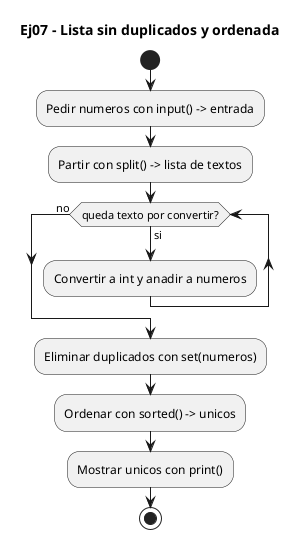
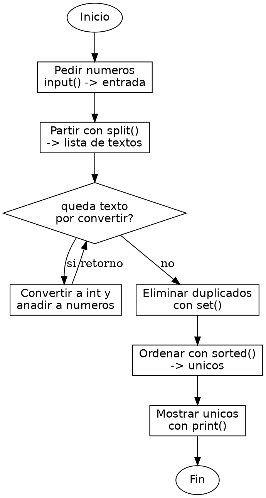

<!-- FICHERO GENERADO — NO EDITAR. Fuente de verdad: curso-python/practica/05-listas/ej07.md (se regenera con gen_course.py). -->

# Ejercicio 07 — El usuario ingresa enteros con repetidos

Dificultad: amarillo · Módulo 05 (Listas y comprehensions)

## Enunciado

El usuario ingresa enteros con repetidos; imprime la lista sin duplicados, ordenada

## Diagramas de flujo





## Cómo se resuelve

<!-- EXPLICACION -->
Quitar duplicados y ordenar una lista de enteros se resuelve en una sola expresión gracias a dos herramientas de Python: el tipo `set` (que no admite repetidos) y la función `sorted()`.

1. `[int(x) for x in entrada.split()]` — como en los ejercicios anteriores, partimos la línea y convertimos cada trozo a entero con una comprehension, obteniendo una lista que puede traer repetidos, por ejemplo `[3, 1, 3, 2, 1]`.
2. `set(numeros)` — un `set` es una colección sin orden que no permite elementos repetidos; al construirlo desde la lista, los duplicados desaparecen solos. Es la forma idiomática de "quitar repetidos" en Python, y lo hace en O(n) en vez de comparar todos contra todos.
3. `sorted(set(numeros))` — un `set` no tiene orden garantizado, así que `sorted()` lo recorre y devuelve una lista nueva ordenada de menor a mayor. Encadenamos ambas: primero eliminar duplicados, luego ordenar.
4. Ojo a la diferencia entre `sorted(x)`, que devuelve una lista nueva y deja el original intacto, y el método `lista.sort()`, que ordena la lista en su sitio y devuelve `None`. Aquí necesitamos la versión que devuelve, porque partimos de un `set`.

Trampa habitual: esperar que un `set` conserve el orden en que introdujiste los números. No lo hace; por eso hay que aplicar `sorted()` para tener una salida ordenada y predecible.

## Para practicar — cópialo y complétalo

Pega este esqueleto y completa los `TODO`. Es la mejor forma de aprender: inténtalo antes de mirar la solución.

```python
# Curso de Python — Modulo 05: Listas y comprehensions
# Ejercicio 07 — PRACTICA (rellena los TODO)
# Enunciado: El usuario ingresa enteros con repetidos; imprime la lista sin duplicados, ordenada
# Dificultad: amarillo
# Ejecutar: python3 ej07_practica.py

entrada = input("Introduce numeros enteros separados por espacio: ")

# TODO: convierte 'entrada' en una lista de enteros con split() y una comprehension
numeros = []

# TODO: elimina los duplicados convirtiendo la lista a set()
#       luego conviertela de nuevo a lista ordenada con sorted()
#       pista: sorted(set(numeros))
unicos = []

# TODO: imprime la lista resultante
print()
```

## Solución — cópiala y ejecútala

```python
# Curso de Python — Modulo 05: Listas y comprehensions
# Ejercicio 07 — MODELO (resuelto)
# Enunciado: El usuario ingresa enteros con repetidos; imprime la lista sin duplicados, ordenada
# Dificultad: amarillo
# Ejecutar: python3 ej07_modelo.py

entrada = input("Introduce numeros enteros separados por espacio: ")

# Convertimos a lista de enteros
numeros = [int(x) for x in entrada.split()]

# set() elimina duplicados (operacion O(n))
# sorted() devuelve una nueva lista ordenada ascendente
unicos = sorted(set(numeros))

print(unicos)
```

## Ejecútalo en el navegador

<div class="pyodide-run" data-code="IyBDdXJzbyBkZSBQeXRob24g4oCUIE1vZHVsbyAwNTogTGlzdGFzIHkgY29tcHJlaGVuc2lvbnMKIyBFamVyY2ljaW8gMDcg4oCUIE1PREVMTyAocmVzdWVsdG8pCiMgRW51bmNpYWRvOiBFbCB1c3VhcmlvIGluZ3Jlc2EgZW50ZXJvcyBjb24gcmVwZXRpZG9zOyBpbXByaW1lIGxhIGxpc3RhIHNpbiBkdXBsaWNhZG9zLCBvcmRlbmFkYQojIERpZmljdWx0YWQ6IGFtYXJpbGxvCiMgRWplY3V0YXI6IHB5dGhvbjMgZWowN19tb2RlbG8ucHkKCmVudHJhZGEgPSBpbnB1dCgiSW50cm9kdWNlIG51bWVyb3MgZW50ZXJvcyBzZXBhcmFkb3MgcG9yIGVzcGFjaW86ICIpCgojIENvbnZlcnRpbW9zIGEgbGlzdGEgZGUgZW50ZXJvcwpudW1lcm9zID0gW2ludCh4KSBmb3IgeCBpbiBlbnRyYWRhLnNwbGl0KCldCgojIHNldCgpIGVsaW1pbmEgZHVwbGljYWRvcyAob3BlcmFjaW9uIE8obikpCiMgc29ydGVkKCkgZGV2dWVsdmUgdW5hIG51ZXZhIGxpc3RhIG9yZGVuYWRhIGFzY2VuZGVudGUKdW5pY29zID0gc29ydGVkKHNldChudW1lcm9zKSkKCnByaW50KHVuaWNvcykK">
<button class="pyodide-btn" type="button">▶ Ejecutar aquí (Python en el navegador)</button>
<textarea class="pyodide-stdin" rows="2" placeholder="Si el programa pide datos por teclado, escríbelos aquí, uno por línea"></textarea>
<pre class="pyodide-out" hidden></pre>
</div>

[▶ Visualízalo paso a paso en Python Tutor](https://pythontutor.com/visualize.html#code=%23+Curso+de+Python+%E2%80%94+Modulo+05%3A+Listas+y+comprehensions%0A%23+Ejercicio+07+%E2%80%94+MODELO+%28resuelto%29%0A%23+Enunciado%3A+El+usuario+ingresa+enteros+con+repetidos%3B+imprime+la+lista+sin+duplicados%2C+ordenada%0A%23+Dificultad%3A+amarillo%0A%23+Ejecutar%3A+python3+ej07_modelo.py%0A%0Aentrada+%3D+input%28%22Introduce+numeros+enteros+separados+por+espacio%3A+%22%29%0A%0A%23+Convertimos+a+lista+de+enteros%0Anumeros+%3D+%5Bint%28x%29+for+x+in+entrada.split%28%29%5D%0A%0A%23+set%28%29+elimina+duplicados+%28operacion+O%28n%29%29%0A%23+sorted%28%29+devuelve+una+nueva+lista+ordenada+ascendente%0Aunicos+%3D+sorted%28set%28numeros%29%29%0A%0Aprint%28unicos%29%0A&cumulative=false&curInstr=0&py=3&rawInputLstJSON=%5B%5D) — ve cómo cambian las variables línea a línea.

## Cómo usarlo

Pega el código en un fichero y ejecútalo con tu toolchain habitual (o el botón de Ejecutar de tu editor). Antes de mirar la solución, intenta completar tú el esqueleto: es la mejor forma de aprender.

## Conexiones

- [[Curso_Python/modelo/05-listas|Teoría del módulo]]
- [[Curso_Python/practica/00_README|Índice del curso]]
