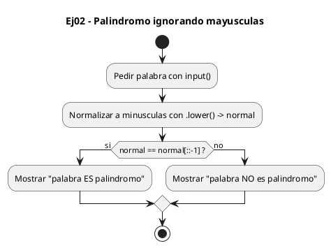
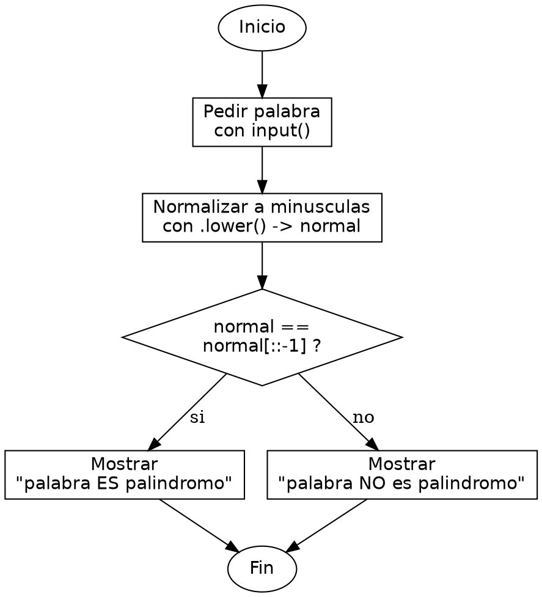

<!-- FICHERO GENERADO — NO EDITAR. Fuente de verdad: curso-python/practica/06-cadenas/ej02.md (se regenera con gen_course.py). -->

# Ejercicio 02 — Di si una palabra es palíndromo ignorando mayúsculas/minúsculas

Dificultad: verde · Módulo 06 (Cadenas)

## Enunciado

Di si una palabra es palíndromo ignorando mayúsculas/minúsculas

## Diagramas de flujo





## Cómo se resuelve

<!-- EXPLICACION -->
Detectar un palíndromo combina dos ideas de cadenas: normalizar antes de comparar y darle la vuelta con slicing.

1. `normal = palabra.lower()` — pasamos todo a minúsculas para que "Anita" y "anita" se traten igual. `.lower()` devuelve una cadena nueva (la original no cambia, porque `str` es inmutable); por eso guardamos el resultado en `normal`.
2. `normal == normal[::-1]` — una palabra es palíndromo si es idéntica a sí misma invertida. `normal[::-1]` genera la versión al revés con slicing de paso `-1`, y `==` compara las dos cadenas carácter a carácter.
3. Según el resultado del `if`, imprimimos el mensaje. Fíjate en que en el `print` mostramos `palabra` (la original, con sus mayúsculas), no `normal`: la normalización era solo para comparar, no para mostrar.

Trampa habitual: comparar directamente `palabra == palabra[::-1]` sin bajar a minúsculas. Entonces "Anita" fallaría, porque la 'A' inicial en mayúscula no coincide con la 'a' final. Normaliza siempre antes de comparar.

## Para practicar — cópialo y complétalo

Pega este esqueleto y completa los `TODO`. Es la mejor forma de aprender: inténtalo antes de mirar la solución.

```python
# Curso de Python — Modulo 06: Cadenas: transformar y formatear
# Ejercicio 02 — PRACTICA (rellena los TODO)
# Enunciado: Di si una palabra es palíndromo ignorando mayúsculas/minúsculas
# Dificultad: verde
# Ejecutar: python3 ej02_practica.py

palabra = input("Introduce una palabra: ")

# TODO: pasa la palabra a minusculas con .lower() para normalizar el caso
normal = ""

# TODO: una palabra es palindromo si es igual a si misma invertida (normal[::-1])
#       imprime "<palabra> ES palindromo" o "<palabra> NO es palindromo"
if True:  # reemplaza por la comparacion normal == normal[::-1]
    print()
else:
    print()
```

## Solución — cópiala y ejecútala

```python
# Curso de Python — Modulo 06: Cadenas: transformar y formatear
# Ejercicio 02 — MODELO (resuelto)
# Enunciado: Di si una palabra es palíndromo ignorando mayúsculas/minúsculas
# Dificultad: verde
# Ejecutar: python3 ej02_modelo.py

palabra = input("Introduce una palabra: ")

# Normalizamos a minusculas para que 'Anita' y 'anita' se comparen igual
normal = palabra.lower()

# Una palabra es palindromo si es igual a si misma invertida ([::-1])
if normal == normal[::-1]:
    print(f"{palabra} ES palindromo")
else:
    print(f"{palabra} NO es palindromo")
```

## Ejecútalo en el navegador

<div class="pyodide-run" data-code="IyBDdXJzbyBkZSBQeXRob24g4oCUIE1vZHVsbyAwNjogQ2FkZW5hczogdHJhbnNmb3JtYXIgeSBmb3JtYXRlYXIKIyBFamVyY2ljaW8gMDIg4oCUIE1PREVMTyAocmVzdWVsdG8pCiMgRW51bmNpYWRvOiBEaSBzaSB1bmEgcGFsYWJyYSBlcyBwYWzDrW5kcm9tbyBpZ25vcmFuZG8gbWF5w7pzY3VsYXMvbWluw7pzY3VsYXMKIyBEaWZpY3VsdGFkOiB2ZXJkZQojIEVqZWN1dGFyOiBweXRob24zIGVqMDJfbW9kZWxvLnB5CgpwYWxhYnJhID0gaW5wdXQoIkludHJvZHVjZSB1bmEgcGFsYWJyYTogIikKCiMgTm9ybWFsaXphbW9zIGEgbWludXNjdWxhcyBwYXJhIHF1ZSAnQW5pdGEnIHkgJ2FuaXRhJyBzZSBjb21wYXJlbiBpZ3VhbApub3JtYWwgPSBwYWxhYnJhLmxvd2VyKCkKCiMgVW5hIHBhbGFicmEgZXMgcGFsaW5kcm9tbyBzaSBlcyBpZ3VhbCBhIHNpIG1pc21hIGludmVydGlkYSAoWzo6LTFdKQppZiBub3JtYWwgPT0gbm9ybWFsWzo6LTFdOgogICAgcHJpbnQoZiJ7cGFsYWJyYX0gRVMgcGFsaW5kcm9tbyIpCmVsc2U6CiAgICBwcmludChmIntwYWxhYnJhfSBOTyBlcyBwYWxpbmRyb21vIikK">
<button class="pyodide-btn" type="button">▶ Ejecutar aquí (Python en el navegador)</button>
<textarea class="pyodide-stdin" rows="2" placeholder="Si el programa pide datos por teclado, escríbelos aquí, uno por línea"></textarea>
<pre class="pyodide-out" hidden></pre>
</div>

[▶ Visualízalo paso a paso en Python Tutor](https://pythontutor.com/visualize.html#code=%23+Curso+de+Python+%E2%80%94+Modulo+06%3A+Cadenas%3A+transformar+y+formatear%0A%23+Ejercicio+02+%E2%80%94+MODELO+%28resuelto%29%0A%23+Enunciado%3A+Di+si+una+palabra+es+pal%C3%ADndromo+ignorando+may%C3%BAsculas%2Fmin%C3%BAsculas%0A%23+Dificultad%3A+verde%0A%23+Ejecutar%3A+python3+ej02_modelo.py%0A%0Apalabra+%3D+input%28%22Introduce+una+palabra%3A+%22%29%0A%0A%23+Normalizamos+a+minusculas+para+que+%27Anita%27+y+%27anita%27+se+comparen+igual%0Anormal+%3D+palabra.lower%28%29%0A%0A%23+Una+palabra+es+palindromo+si+es+igual+a+si+misma+invertida+%28%5B%3A%3A-1%5D%29%0Aif+normal+%3D%3D+normal%5B%3A%3A-1%5D%3A%0A++++print%28f%22%7Bpalabra%7D+ES+palindromo%22%29%0Aelse%3A%0A++++print%28f%22%7Bpalabra%7D+NO+es+palindromo%22%29%0A&cumulative=false&curInstr=0&py=3&rawInputLstJSON=%5B%5D) — ve cómo cambian las variables línea a línea.

## Cómo usarlo

Pega el código en un fichero y ejecútalo con tu toolchain habitual (o el botón de Ejecutar de tu editor). Antes de mirar la solución, intenta completar tú el esqueleto: es la mejor forma de aprender.

## Conexiones

- [[Curso_Python/modelo/06-cadenas|Teoría del módulo]]
- [[Curso_Python/practica/00_README|Índice del curso]]
