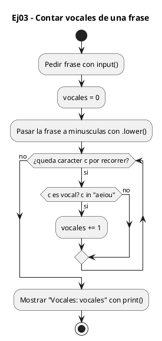
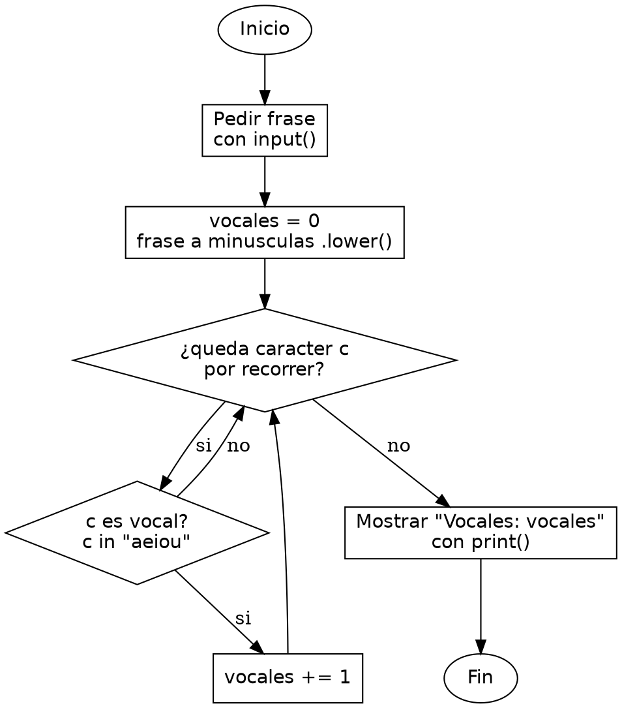

<!-- FICHERO GENERADO — NO EDITAR. Fuente de verdad: curso-python/practica/06-cadenas/ej03.md (se regenera con gen_course.py). -->

# Ejercicio 03 — Cuenta las vocales de una frase

Dificultad: verde · Módulo 06 (Cadenas)

## Enunciado

Cuenta las vocales de una frase (mayúsculas y minúsculas)

## Diagramas de flujo





## Cómo se resuelve

<!-- EXPLICACION -->
Contar vocales enseña dos cosas clave de las cadenas: que se pueden recorrer como una secuencia de caracteres y que `in` sirve para preguntar "¿pertenece a este conjunto?".

1. `vocales = 0` — un contador que arrancamos a cero antes del bucle.
2. `for c in frase.lower():` — en Python iteras la cadena directamente: en cada vuelta `c` es un carácter. Aplicamos `.lower()` sobre la frase para que 'A' y 'a' cuenten igual sin escribir dos condiciones.
3. `if c in "aeiou":` — el operador `in` comprueba si el carácter `c` está dentro de la cadena `"aeiou"`. Es una forma compacta de decir "es una vocal" sin encadenar cinco comparaciones con `==`.
4. `vocales += 1` — sumamos uno cada vez que la condición se cumple. Al terminar el bucle, `print(f"Vocales: {vocales}")` muestra el total.

Trampa habitual: en C recorrerías el `char[]` con un índice hasta el `\0` y compararías cada carácter una a una. En Python no hay `\0` ni necesitas el índice: `for c in cadena` te da los caracteres directamente y `in` sustituye la cadena de comparaciones.

## Para practicar — cópialo y complétalo

Pega este esqueleto y completa los `TODO`. Es la mejor forma de aprender: inténtalo antes de mirar la solución.

```python
# Curso de Python — Modulo 06: Cadenas: transformar y formatear
# Ejercicio 03 — PRACTICA (rellena los TODO)
# Enunciado: Cuenta las vocales de una frase (mayúsculas y minúsculas)
# Dificultad: verde
# Ejecutar: python3 ej03_practica.py

frase = input("Introduce una frase: ")

vocales = 0
# TODO: recorre la frase caracter a caracter (for c in frase.lower())
#       y suma 1 cada vez que el caracter este en "aeiou"
for c in frase.lower():
    pass  # reemplaza por el if que cuenta las vocales

# TODO: imprime con f-string "Vocales: X"
print()
```

## Solución — cópiala y ejecútala

```python
# Curso de Python — Modulo 06: Cadenas: transformar y formatear
# Ejercicio 03 — MODELO (resuelto)
# Enunciado: Cuenta las vocales de una frase (mayúsculas y minúsculas)
# Dificultad: verde
# Ejecutar: python3 ej03_modelo.py

frase = input("Introduce una frase: ")

# Recorremos caracter a caracter. Pasamos cada uno a minuscula
# para que 'A' y 'a' cuenten igual. 'in' comprueba si es vocal.
vocales = 0
for c in frase.lower():
    if c in "aeiou":
        vocales += 1

print(f"Vocales: {vocales}")
```

## Ejecútalo en el navegador

[▶ Visualízalo paso a paso en Python Tutor](https://pythontutor.com/visualize.html#code=%23+Curso+de+Python+%E2%80%94+Modulo+06%3A+Cadenas%3A+transformar+y+formatear%0A%23+Ejercicio+03+%E2%80%94+MODELO+%28resuelto%29%0A%23+Enunciado%3A+Cuenta+las+vocales+de+una+frase+%28may%C3%BAsculas+y+min%C3%BAsculas%29%0A%23+Dificultad%3A+verde%0A%23+Ejecutar%3A+python3+ej03_modelo.py%0A%0Afrase+%3D+input%28%22Introduce+una+frase%3A+%22%29%0A%0A%23+Recorremos+caracter+a+caracter.+Pasamos+cada+uno+a+minuscula%0A%23+para+que+%27A%27+y+%27a%27+cuenten+igual.+%27in%27+comprueba+si+es+vocal.%0Avocales+%3D+0%0Afor+c+in+frase.lower%28%29%3A%0A++++if+c+in+%22aeiou%22%3A%0A++++++++vocales+%2B%3D+1%0A%0Aprint%28f%22Vocales%3A+%7Bvocales%7D%22%29%0A&cumulative=false&curInstr=0&py=3&rawInputLstJSON=%5B%5D) — ve cómo cambian las variables línea a línea.

## Cómo usarlo

Pega el código en un fichero y ejecútalo con tu toolchain habitual (o el botón de Ejecutar de tu editor). Antes de mirar la solución, intenta completar tú el esqueleto: es la mejor forma de aprender.

## Conexiones

- [[Curso_Python/modelo/06-cadenas|Teoría del módulo]]
- [[Curso_Python/practica/00_README|Índice del curso]]
