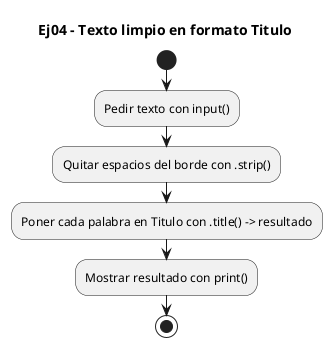
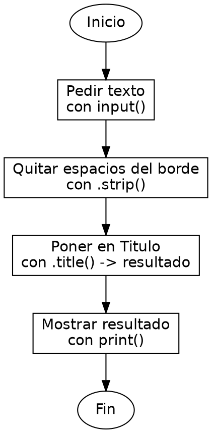

<!-- FICHERO GENERADO — NO EDITAR. Fuente de verdad: curso-python/practica/06-cadenas/ej04.md (se regenera con gen_course.py). -->

# Ejercicio 04 — Dado un texto con espacios sobrantes al borde, devuelvelo en formato…

Dificultad: amarillo · Módulo 06 (Cadenas)

## Enunciado

Dado un texto con espacios sobrantes al borde, devuelvelo en formato Titulo limpio

## Diagramas de flujo





## Cómo se resuelve

<!-- EXPLICACION -->
Limpiar un texto y ponerlo en formato título muestra cómo se encadenan los métodos de cadena, apoyándose en que cada uno devuelve una copia nueva.

1. `texto.strip()` — quita los espacios (y saltos de línea) que sobran al principio y al final. No toca los espacios internos entre palabras, solo los de los bordes.
2. `.title()` — sobre el resultado anterior, pone en mayúscula la primera letra de cada palabra y el resto en minúscula.
3. `texto.strip().title()` — el encadenamiento funciona porque `.strip()` devuelve una cadena nueva y sobre ESA se llama `.title()`. Cada método opera sobre la copia que le entrega el anterior; la variable `texto` original nunca cambia, porque las cadenas son inmutables.
4. Guardamos todo en `resultado` y lo imprimimos.

Trampa habitual: creer que `texto.strip()` modifica `texto`. No lo hace: devuelve una copia limpia, y si no la asignas a nada se pierde. Por eso el patrón es `resultado = texto.strip().title()` y no llamar a los métodos "a lo suelto" esperando que muten la variable.

## Para practicar — cópialo y complétalo

Pega este esqueleto y completa los `TODO`. Es la mejor forma de aprender: inténtalo antes de mirar la solución.

```python
# Curso de Python — Modulo 06: Cadenas: transformar y formatear
# Ejercicio 04 — PRACTICA (rellena los TODO)
# Enunciado: Dado un texto con espacios sobrantes al borde, devuelvelo en formato Titulo limpio
# Dificultad: amarillo
# Ejecutar: python3 ej04_practica.py

texto = input("Introduce un texto: ")

# TODO: usa .strip() para quitar espacios al borde y .title() para el formato titulo
#       puedes encadenarlos: texto.strip().title()
resultado = ""

# TODO: imprime el resultado
print()
```

## Solución — cópiala y ejecútala

```python
# Curso de Python — Modulo 06: Cadenas: transformar y formatear
# Ejercicio 04 — MODELO (resuelto)
# Enunciado: Dado un texto con espacios sobrantes al borde, devuelvelo en formato Titulo limpio
# Dificultad: amarillo
# Ejecutar: python3 ej04_modelo.py

texto = input("Introduce un texto: ")

# .strip() quita los espacios del principio y del final
# .title() pone en mayuscula la primera letra de cada palabra
# Encadenamos porque cada metodo devuelve un string nuevo
resultado = texto.strip().title()

print(resultado)
```

## Ejecútalo en el navegador

[▶ Visualízalo paso a paso en Python Tutor](https://pythontutor.com/visualize.html#code=%23+Curso+de+Python+%E2%80%94+Modulo+06%3A+Cadenas%3A+transformar+y+formatear%0A%23+Ejercicio+04+%E2%80%94+MODELO+%28resuelto%29%0A%23+Enunciado%3A+Dado+un+texto+con+espacios+sobrantes+al+borde%2C+devuelvelo+en+formato+Titulo+limpio%0A%23+Dificultad%3A+amarillo%0A%23+Ejecutar%3A+python3+ej04_modelo.py%0A%0Atexto+%3D+input%28%22Introduce+un+texto%3A+%22%29%0A%0A%23+.strip%28%29+quita+los+espacios+del+principio+y+del+final%0A%23+.title%28%29+pone+en+mayuscula+la+primera+letra+de+cada+palabra%0A%23+Encadenamos+porque+cada+metodo+devuelve+un+string+nuevo%0Aresultado+%3D+texto.strip%28%29.title%28%29%0A%0Aprint%28resultado%29%0A&cumulative=false&curInstr=0&py=3&rawInputLstJSON=%5B%5D) — ve cómo cambian las variables línea a línea.

## Cómo usarlo

Pega el código en un fichero y ejecútalo con tu toolchain habitual (o el botón de Ejecutar de tu editor). Antes de mirar la solución, intenta completar tú el esqueleto: es la mejor forma de aprender.

## Conexiones

- [[Curso_Python/modelo/06-cadenas|Teoría del módulo]]
- [[Curso_Python/practica/00_README|Índice del curso]]
