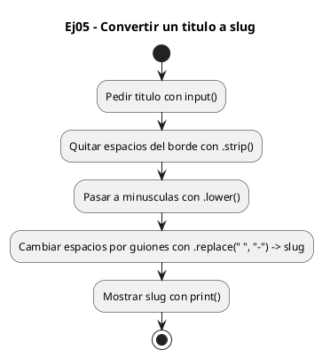
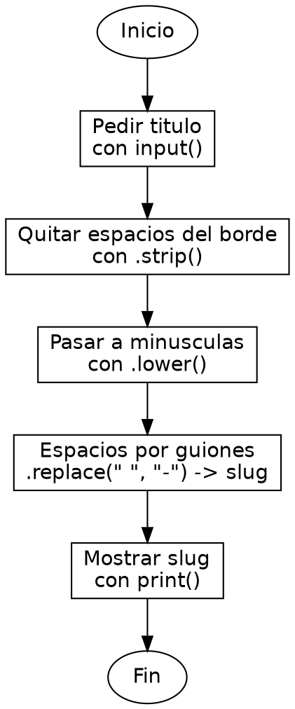

<!-- FICHERO GENERADO — NO EDITAR. Fuente de verdad: curso-python/practica/06-cadenas/ej05.md (se regenera con gen_course.py). -->

# Ejercicio 05 — Convierte un titulo a slug (minusculas, sin espacios al borde,…

Dificultad: amarillo · Módulo 06 (Cadenas)

## Enunciado

Convierte un titulo a slug (minusculas, sin espacios al borde, espacios por guiones)

## Diagramas de flujo





## Cómo se resuelve

<!-- EXPLICACION -->
Convertir un título en slug (el texto que va en una URL) es un caso real donde encadenar tres métodos de cadena resuelve el problema en una línea.

1. `titulo.strip()` — elimina los espacios sobrantes de los bordes, para que un título con espacios delante o detrás no genere guiones de más.
2. `.lower()` — pasa todo a minúsculas, porque los slugs de URL se escriben en minúscula por convención.
3. `.replace(" ", "-")` — sustituye cada espacio interno por un guion. `replace` cambia TODAS las apariciones, no solo la primera, y devuelve una copia nueva.
4. El orden importa: primero `strip` (limpia bordes), luego `lower`, y al final `replace`. Se encadena en una sola línea `titulo.strip().lower().replace(" ", "-")` porque cada método devuelve una cadena nueva sobre la que actúa el siguiente; el `titulo` original queda intacto (inmutabilidad).

Trampa habitual: hacer el `replace(" ", "-")` antes del `strip()`. Si el texto tenía espacios al borde, esos se convertirían en guiones al principio o al final del slug ("-mi-titulo-"). Limpia los bordes primero.

## Para practicar — cópialo y complétalo

Pega este esqueleto y completa los `TODO`. Es la mejor forma de aprender: inténtalo antes de mirar la solución.

```python
# Curso de Python — Modulo 06: Cadenas: transformar y formatear
# Ejercicio 05 — PRACTICA (rellena los TODO)
# Enunciado: Convierte un titulo a slug (minusculas, sin espacios al borde, espacios por guiones)
# Dificultad: amarillo
# Ejecutar: python3 ej05_practica.py

titulo = input("Introduce un titulo: ")

# TODO: encadena strip() (espacios al borde), lower() (minusculas)
#       y replace(" ", "-") (espacios internos por guiones)
slug = ""

# TODO: imprime el slug
print()
```

## Solución — cópiala y ejecútala

```python
# Curso de Python — Modulo 06: Cadenas: transformar y formatear
# Ejercicio 05 — MODELO (resuelto)
# Enunciado: Convierte un titulo a slug (minusculas, sin espacios al borde, espacios por guiones)
# Dificultad: amarillo
# Ejecutar: python3 ej05_modelo.py

titulo = input("Introduce un titulo: ")

# strip() quita espacios al borde, lower() pasa a minusculas,
# replace(" ", "-") cambia los espacios internos por guiones.
# Como cada metodo devuelve copia, los encadenamos en una linea.
slug = titulo.strip().lower().replace(" ", "-")

print(slug)
```

## Ejecútalo en el navegador

<div class="pyodide-run" data-code="IyBDdXJzbyBkZSBQeXRob24g4oCUIE1vZHVsbyAwNjogQ2FkZW5hczogdHJhbnNmb3JtYXIgeSBmb3JtYXRlYXIKIyBFamVyY2ljaW8gMDUg4oCUIE1PREVMTyAocmVzdWVsdG8pCiMgRW51bmNpYWRvOiBDb252aWVydGUgdW4gdGl0dWxvIGEgc2x1ZyAobWludXNjdWxhcywgc2luIGVzcGFjaW9zIGFsIGJvcmRlLCBlc3BhY2lvcyBwb3IgZ3Vpb25lcykKIyBEaWZpY3VsdGFkOiBhbWFyaWxsbwojIEVqZWN1dGFyOiBweXRob24zIGVqMDVfbW9kZWxvLnB5Cgp0aXR1bG8gPSBpbnB1dCgiSW50cm9kdWNlIHVuIHRpdHVsbzogIikKCiMgc3RyaXAoKSBxdWl0YSBlc3BhY2lvcyBhbCBib3JkZSwgbG93ZXIoKSBwYXNhIGEgbWludXNjdWxhcywKIyByZXBsYWNlKCIgIiwgIi0iKSBjYW1iaWEgbG9zIGVzcGFjaW9zIGludGVybm9zIHBvciBndWlvbmVzLgojIENvbW8gY2FkYSBtZXRvZG8gZGV2dWVsdmUgY29waWEsIGxvcyBlbmNhZGVuYW1vcyBlbiB1bmEgbGluZWEuCnNsdWcgPSB0aXR1bG8uc3RyaXAoKS5sb3dlcigpLnJlcGxhY2UoIiAiLCAiLSIpCgpwcmludChzbHVnKQo=">
<button class="pyodide-btn" type="button">▶ Ejecutar aquí (Python en el navegador)</button>
<textarea class="pyodide-stdin" rows="2" placeholder="Si el programa pide datos por teclado, escríbelos aquí, uno por línea"></textarea>
<pre class="pyodide-out" hidden></pre>
</div>

[▶ Visualízalo paso a paso en Python Tutor](https://pythontutor.com/visualize.html#code=%23+Curso+de+Python+%E2%80%94+Modulo+06%3A+Cadenas%3A+transformar+y+formatear%0A%23+Ejercicio+05+%E2%80%94+MODELO+%28resuelto%29%0A%23+Enunciado%3A+Convierte+un+titulo+a+slug+%28minusculas%2C+sin+espacios+al+borde%2C+espacios+por+guiones%29%0A%23+Dificultad%3A+amarillo%0A%23+Ejecutar%3A+python3+ej05_modelo.py%0A%0Atitulo+%3D+input%28%22Introduce+un+titulo%3A+%22%29%0A%0A%23+strip%28%29+quita+espacios+al+borde%2C+lower%28%29+pasa+a+minusculas%2C%0A%23+replace%28%22+%22%2C+%22-%22%29+cambia+los+espacios+internos+por+guiones.%0A%23+Como+cada+metodo+devuelve+copia%2C+los+encadenamos+en+una+linea.%0Aslug+%3D+titulo.strip%28%29.lower%28%29.replace%28%22+%22%2C+%22-%22%29%0A%0Aprint%28slug%29%0A&cumulative=false&curInstr=0&py=3&rawInputLstJSON=%5B%5D) — ve cómo cambian las variables línea a línea.

## Cómo usarlo

Pega el código en un fichero y ejecútalo con tu toolchain habitual (o el botón de Ejecutar de tu editor). Antes de mirar la solución, intenta completar tú el esqueleto: es la mejor forma de aprender.

## Conexiones

- [[Curso_Python/modelo/06-cadenas|Teoría del módulo]]
- [[Curso_Python/practica/00_README|Índice del curso]]
