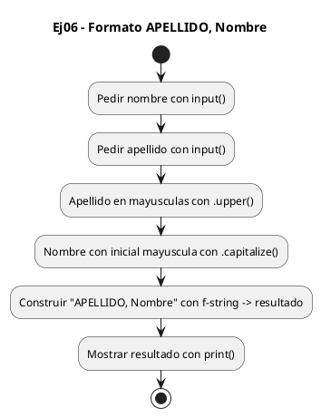
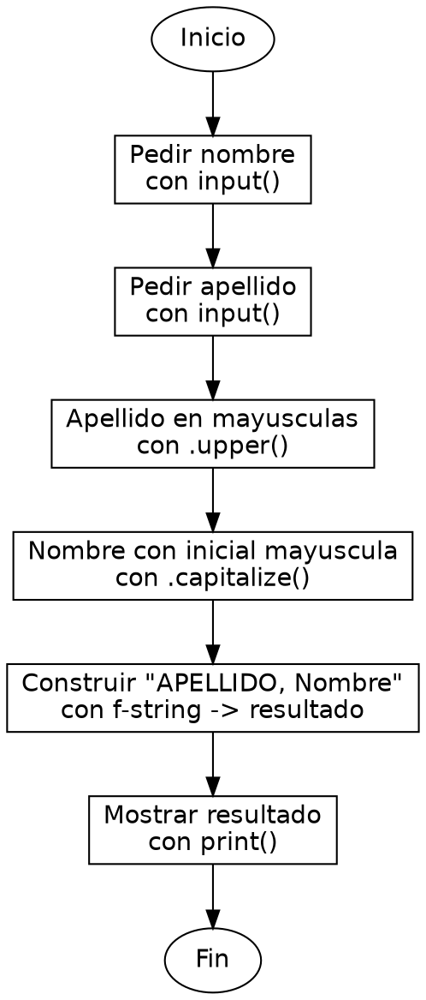

<!-- FICHERO GENERADO — NO EDITAR. Fuente de verdad: curso-python/practica/06-cadenas/ej06.md (se regenera con gen_course.py). -->

# Ejercicio 06 — Pide nombre y apellido y devuelve APELLIDO, Nombre

Dificultad: amarillo · Módulo 06 (Cadenas)

## Enunciado

Pide nombre y apellido y devuelve APELLIDO, Nombre

## Diagramas de flujo





## Cómo se resuelve

<!-- EXPLICACION -->
Formatear "APELLIDO, Nombre" enseña que hay varios métodos para cambiar mayúsculas, cada uno con su matiz, y que se combinan dentro de una f-string.

1. `apellido.upper()` — pone la cadena entera en mayúsculas ("perez" se convierte en "PEREZ").
2. `nombre.capitalize()` — pone en mayúscula solo la primera letra y el resto en minúscula ("jUAN" se convierte en "Juan"). Es distinto de `.title()`: `capitalize` afecta a toda la cadena como una sola palabra, mientras que `title` capitalizaría cada palabra por separado.
3. `f"{apellido.upper()}, {nombre.capitalize()}"` — la f-string permite llamar a los métodos directamente dentro de las llaves. Python evalúa cada expresión, la convierte a texto y la inserta en su hueco. Como siempre, esos métodos devuelven copias; `nombre` y `apellido` no cambian.

Trampa habitual: usar `.title()` cuando quieres `.capitalize()`. Con un nombre compuesto como "juan pablo", `capitalize` daría "Juan pablo" (solo la primera letra global) y `title` daría "Juan Pablo". Elige según si tratas el dato como una palabra o como varias.

## Para practicar — cópialo y complétalo

Pega este esqueleto y completa los `TODO`. Es la mejor forma de aprender: inténtalo antes de mirar la solución.

```python
# Curso de Python — Modulo 06: Cadenas: transformar y formatear
# Ejercicio 06 — PRACTICA (rellena los TODO)
# Enunciado: Pide nombre y apellido y devuelve APELLIDO, Nombre
# Dificultad: amarillo
# Ejecutar: python3 ej06_practica.py

nombre = input("Nombre: ")
apellido = input("Apellido: ")

# TODO: construye un f-string "APELLIDO, Nombre"
#       usa apellido.upper() y nombre.capitalize()
resultado = ""

# TODO: imprime el resultado
print()
```

## Solución — cópiala y ejecútala

```python
# Curso de Python — Modulo 06: Cadenas: transformar y formatear
# Ejercicio 06 — MODELO (resuelto)
# Enunciado: Pide nombre y apellido y devuelve APELLIDO, Nombre
# Dificultad: amarillo
# Ejecutar: python3 ej06_modelo.py

nombre = input("Nombre: ")
apellido = input("Apellido: ")

# .upper() pone el apellido entero en mayusculas
# .capitalize() pone solo la primera letra del nombre en mayuscula
resultado = f"{apellido.upper()}, {nombre.capitalize()}"

print(resultado)
```

## Ejecútalo en el navegador

<div class="pyodide-run" data-code="IyBDdXJzbyBkZSBQeXRob24g4oCUIE1vZHVsbyAwNjogQ2FkZW5hczogdHJhbnNmb3JtYXIgeSBmb3JtYXRlYXIKIyBFamVyY2ljaW8gMDYg4oCUIE1PREVMTyAocmVzdWVsdG8pCiMgRW51bmNpYWRvOiBQaWRlIG5vbWJyZSB5IGFwZWxsaWRvIHkgZGV2dWVsdmUgQVBFTExJRE8sIE5vbWJyZQojIERpZmljdWx0YWQ6IGFtYXJpbGxvCiMgRWplY3V0YXI6IHB5dGhvbjMgZWowNl9tb2RlbG8ucHkKCm5vbWJyZSA9IGlucHV0KCJOb21icmU6ICIpCmFwZWxsaWRvID0gaW5wdXQoIkFwZWxsaWRvOiAiKQoKIyAudXBwZXIoKSBwb25lIGVsIGFwZWxsaWRvIGVudGVybyBlbiBtYXl1c2N1bGFzCiMgLmNhcGl0YWxpemUoKSBwb25lIHNvbG8gbGEgcHJpbWVyYSBsZXRyYSBkZWwgbm9tYnJlIGVuIG1heXVzY3VsYQpyZXN1bHRhZG8gPSBmInthcGVsbGlkby51cHBlcigpfSwge25vbWJyZS5jYXBpdGFsaXplKCl9IgoKcHJpbnQocmVzdWx0YWRvKQo=">
<button class="pyodide-btn" type="button">▶ Ejecutar aquí (Python en el navegador)</button>
<textarea class="pyodide-stdin" rows="2" placeholder="Si el programa pide datos por teclado, escríbelos aquí, uno por línea"></textarea>
<pre class="pyodide-out" hidden></pre>
</div>

[▶ Visualízalo paso a paso en Python Tutor](https://pythontutor.com/visualize.html#code=%23+Curso+de+Python+%E2%80%94+Modulo+06%3A+Cadenas%3A+transformar+y+formatear%0A%23+Ejercicio+06+%E2%80%94+MODELO+%28resuelto%29%0A%23+Enunciado%3A+Pide+nombre+y+apellido+y+devuelve+APELLIDO%2C+Nombre%0A%23+Dificultad%3A+amarillo%0A%23+Ejecutar%3A+python3+ej06_modelo.py%0A%0Anombre+%3D+input%28%22Nombre%3A+%22%29%0Aapellido+%3D+input%28%22Apellido%3A+%22%29%0A%0A%23+.upper%28%29+pone+el+apellido+entero+en+mayusculas%0A%23+.capitalize%28%29+pone+solo+la+primera+letra+del+nombre+en+mayuscula%0Aresultado+%3D+f%22%7Bapellido.upper%28%29%7D%2C+%7Bnombre.capitalize%28%29%7D%22%0A%0Aprint%28resultado%29%0A&cumulative=false&curInstr=0&py=3&rawInputLstJSON=%5B%5D) — ve cómo cambian las variables línea a línea.

## Cómo usarlo

Pega el código en un fichero y ejecútalo con tu toolchain habitual (o el botón de Ejecutar de tu editor). Antes de mirar la solución, intenta completar tú el esqueleto: es la mejor forma de aprender.

## Conexiones

- [[Curso_Python/modelo/06-cadenas|Teoría del módulo]]
- [[Curso_Python/practica/00_README|Índice del curso]]
