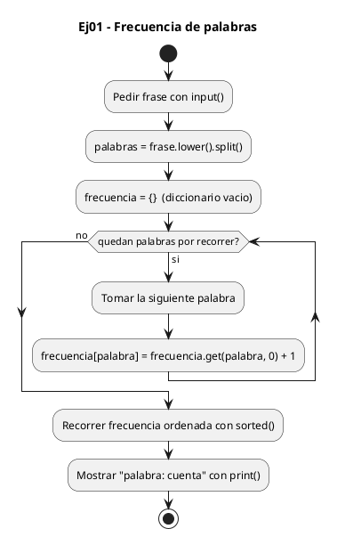
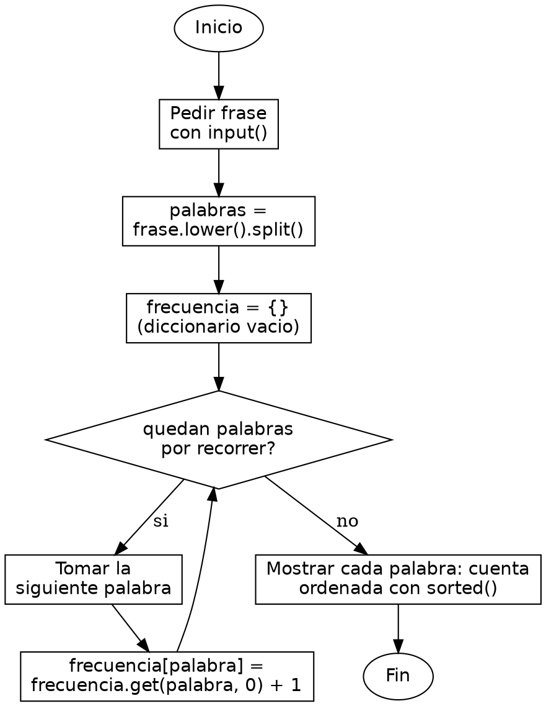

<!-- FICHERO GENERADO — NO EDITAR. Fuente de verdad: curso-python/practica/07-diccionarios-sets/ej01.md (se regenera con gen_course.py). -->

# Ejercicio 01 — Cuenta la frecuencia de cada palabra en una frase introducida por el…

Dificultad: verde · Módulo 07 (Diccionarios y sets)

## Enunciado

Cuenta la frecuencia de cada palabra en una frase introducida por el usuario

## Diagramas de flujo





## Cómo se resuelve

<!-- EXPLICACION -->
Contar cuántas veces aparece cada palabra es el ejemplo clásico del diccionario como contador: la palabra es la clave y su frecuencia el valor.

1. `frase.lower().split()` — pasamos todo a minúsculas para que "El" y "el" cuenten como la misma palabra, y `split()` parte la frase por espacios en una lista de palabras.
2. `frecuencia = {}` — arrancamos con un diccionario vacío. La idea es que cada palabra distinta sea una clave y su cuenta el valor asociado.
3. `frecuencia[palabra] = frecuencia.get(palabra, 0) + 1` — este es el corazón. `.get(palabra, 0)` pide la cuenta actual de esa palabra, pero si aún no existe como clave devuelve `0` en vez de reventar. Le sumamos 1 y guardamos: la primera vez pasa de 0 a 1, las siguientes va creciendo.
4. El acceso `frecuencia[palabra]` es rápido (tiempo constante en promedio) porque el diccionario usa hashing: convierte la clave en un número que apunta directo a su hueco, sin recorrer todo el diccionario buscándola.
5. `for palabra, cuenta in sorted(frecuencia.items())` — `.items()` da los pares (clave, valor) y `sorted` los ordena alfabéticamente para una salida estable.

Trampa habitual: escribir `frecuencia[palabra] = frecuencia[palabra] + 1` sin el `.get()`. La primera vez que aparece una palabra esa clave todavía no existe, y acceder a una clave inexistente con `[]` lanza `KeyError`. Por eso `.get(palabra, 0)` es la forma segura: da un valor por defecto cuando la clave aún no está.

## Para practicar — cópialo y complétalo

Pega este esqueleto y completa los `TODO`. Es la mejor forma de aprender: inténtalo antes de mirar la solución.

```python
# Curso de Python — Modulo 07: Diccionarios y Sets
# Ejercicio 01 — PRACTICA (rellena los TODO)
# Enunciado: Cuenta la frecuencia de cada palabra en una frase introducida por el usuario
# Dificultad: verde
# Ejecutar: python3 ej01_practica.py

# TODO: pide una frase al usuario con input()
frase = None

# TODO: convierte la frase a minusculas y dividela en palabras con .split()
#       guarda el resultado en la variable "palabras"
palabras = None

# TODO: crea un dict vacio llamado "frecuencia"
frecuencia = None

# TODO: recorre cada palabra en "palabras" con un bucle for
#       para cada palabra, actualiza su cuenta en "frecuencia"
#       pista: usa .get(palabra, 0) + 1 para no lanzar KeyError
for palabra in (palabras or []):
    pass  # TODO: reemplaza este pass con la logica de conteo

# TODO: imprime el titulo "Frecuencia de palabras:"
# TODO: recorre los pares (palabra, cuenta) de frecuencia.items() ordenados
#       e imprime cada uno con f-string: "  {palabra}: {cuenta}"
```

## Solución — cópiala y ejecútala

```python
# Curso de Python — Modulo 07: Diccionarios y Sets
# Ejercicio 01 — MODELO (resuelto)
# Enunciado: Cuenta la frecuencia de cada palabra en una frase introducida por el usuario
# Dificultad: verde
# Ejecutar: python3 ej01_modelo.py

frase = input("Introduce una frase: ")

palabras = frase.lower().split()

frecuencia = {}
for palabra in palabras:
    frecuencia[palabra] = frecuencia.get(palabra, 0) + 1

print("\nFrecuencia de palabras:")
for palabra, cuenta in sorted(frecuencia.items()):
    print(f"  {palabra}: {cuenta}")
```

## Ejecútalo en el navegador

[▶ Visualízalo paso a paso en Python Tutor](https://pythontutor.com/visualize.html#code=%23+Curso+de+Python+%E2%80%94+Modulo+07%3A+Diccionarios+y+Sets%0A%23+Ejercicio+01+%E2%80%94+MODELO+%28resuelto%29%0A%23+Enunciado%3A+Cuenta+la+frecuencia+de+cada+palabra+en+una+frase+introducida+por+el+usuario%0A%23+Dificultad%3A+verde%0A%23+Ejecutar%3A+python3+ej01_modelo.py%0A%0Afrase+%3D+input%28%22Introduce+una+frase%3A+%22%29%0A%0Apalabras+%3D+frase.lower%28%29.split%28%29%0A%0Afrecuencia+%3D+%7B%7D%0Afor+palabra+in+palabras%3A%0A++++frecuencia%5Bpalabra%5D+%3D+frecuencia.get%28palabra%2C+0%29+%2B+1%0A%0Aprint%28%22%5CnFrecuencia+de+palabras%3A%22%29%0Afor+palabra%2C+cuenta+in+sorted%28frecuencia.items%28%29%29%3A%0A++++print%28f%22++%7Bpalabra%7D%3A+%7Bcuenta%7D%22%29%0A&cumulative=false&curInstr=0&py=3&rawInputLstJSON=%5B%5D) — ve cómo cambian las variables línea a línea.

## Cómo usarlo

Pega el código en un fichero y ejecútalo con tu toolchain habitual (o el botón de Ejecutar de tu editor). Antes de mirar la solución, intenta completar tú el esqueleto: es la mejor forma de aprender.

## Conexiones

- [[Curso_Python/modelo/07-diccionarios-sets|Teoría del módulo]]
- [[Curso_Python/practica/00_README|Índice del curso]]
