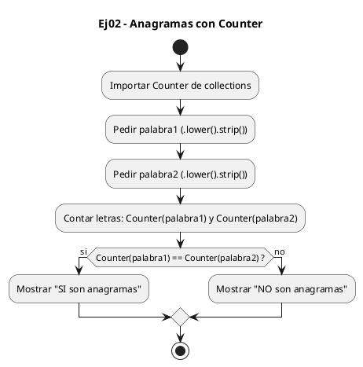
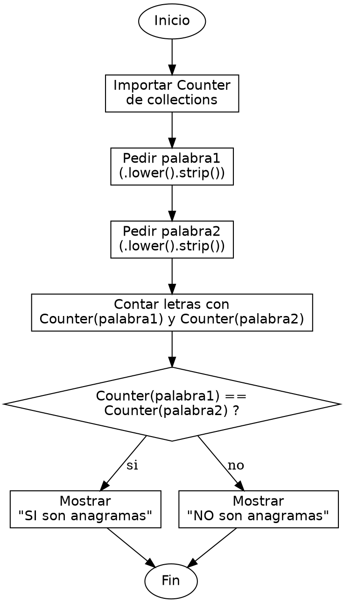

<!-- FICHERO GENERADO — NO EDITAR. Fuente de verdad: curso-python/practica/07-diccionarios-sets/ej02.md (se regenera con gen_course.py). -->

# Ejercicio 02 — Comprueba si dos palabras son anagramas comparando sus frecuencias de…

Dificultad: amarillo · Módulo 07 (Diccionarios y sets)

## Enunciado

Comprueba si dos palabras son anagramas comparando sus frecuencias de letras

## Diagramas de flujo





## Cómo se resuelve

<!-- EXPLICACION -->
Dos palabras son anagramas si tienen exactamente las mismas letras con las mismas repeticiones; la lección es que basta comparar sus recuentos de letras, no su orden.

1. `.lower().strip()` — normalizamos: minúsculas para que no distinga mayúsculas y `strip()` para quitar espacios sobrantes en los extremos que falsearían la comparación.
2. `from collections import Counter` — `Counter` es un diccionario especializado en contar: `Counter("amor")` produce un dict como `{'a':1, 'm':1, 'o':1, 'r':1}` donde cada letra es la clave y su número de apariciones el valor. Lo hace en una sola pasada.
3. `Counter(palabra1) == Counter(palabra2)` — dos diccionarios son iguales si tienen las mismas claves con los mismos valores, sin importar el orden en que se crearon. Por eso `Counter("amor") == Counter("roma")` da `True`: mismas letras, mismas cuentas.
4. La comparación de recuentos es más robusta que ordenar y comparar letra a letra, y aprovecha que buscar cada letra en el `Counter` es rápido gracias al hashing interno del diccionario.

Trampa habitual: intentar comparar las palabras ordenando sus letras (`sorted(p1) == sorted(p2)`) funciona, pero mucha gente cae en comparar solo la longitud o el conjunto de letras con `set`. Un `set` pierde las repeticiones: "casa" y "casas" tendrían el mismo set `{c,a,s}` y parecerían anagramas sin serlo. El `Counter` sí conserva cuántas veces aparece cada letra.

## Para practicar — cópialo y complétalo

Pega este esqueleto y completa los `TODO`. Es la mejor forma de aprender: inténtalo antes de mirar la solución.

```python
# Curso de Python — Modulo 07: Diccionarios y Sets
# Ejercicio 02 — PRACTICA (rellena los TODO)
# Enunciado: Comprueba si dos palabras son anagramas comparando sus frecuencias de letras
# Dificultad: amarillo
# Ejecutar: python3 ej02_practica.py

# TODO: importa Counter desde collections
# from collections import Counter

# TODO: pide dos palabras al usuario, conviertelas a minusculas y elimina espacios (.strip())
palabra1 = None
palabra2 = None

# OPCION A — con Counter (una linea):
# TODO: compara Counter(palabra1) con Counter(palabra2) y guarda True/False en "es_anagrama"
es_anagrama = None

# OPCION B — sin Counter (version manual, mas instructiva):
# def contar_letras(palabra):
#     TODO: crea un dict vacio
#     TODO: recorre cada letra en palabra y actualiza su cuenta con .get
#     TODO: devuelve el dict
# es_anagrama = contar_letras(palabra1) == contar_letras(palabra2)

# TODO: imprime el resultado con f-string:
#       '"<p1>" y "<p2>" -> SI son anagramas'  o  '... -> NO son anagramas'
```

## Solución — cópiala y ejecútala

```python
# Curso de Python — Modulo 07: Diccionarios y Sets
# Ejercicio 02 — MODELO (resuelto)
# Enunciado: Comprueba si dos palabras son anagramas comparando sus frecuencias de letras
# Dificultad: amarillo
# Ejecutar: python3 ej02_modelo.py

from collections import Counter

palabra1 = input("Primera palabra: ").lower().strip()
palabra2 = input("Segunda palabra: ").lower().strip()

# Counter cuenta las letras de cada palabra y permite comparar directamente
# Counter("amor") == Counter("roma") -> True
if Counter(palabra1) == Counter(palabra2):
    print(f'"{palabra1}" y "{palabra2}" -> SI son anagramas')
else:
    print(f'"{palabra1}" y "{palabra2}" -> NO son anagramas')

# Version sin Counter (equivalente manual):
# def contar_letras(palabra):
#     freq = {}
#     for letra in palabra:
#         freq[letra] = freq.get(letra, 0) + 1
#     return freq
# if contar_letras(palabra1) == contar_letras(palabra2): ...
```

## Ejecútalo en el navegador

<div class="pyodide-run" data-code="IyBDdXJzbyBkZSBQeXRob24g4oCUIE1vZHVsbyAwNzogRGljY2lvbmFyaW9zIHkgU2V0cwojIEVqZXJjaWNpbyAwMiDigJQgTU9ERUxPIChyZXN1ZWx0bykKIyBFbnVuY2lhZG86IENvbXBydWViYSBzaSBkb3MgcGFsYWJyYXMgc29uIGFuYWdyYW1hcyBjb21wYXJhbmRvIHN1cyBmcmVjdWVuY2lhcyBkZSBsZXRyYXMKIyBEaWZpY3VsdGFkOiBhbWFyaWxsbwojIEVqZWN1dGFyOiBweXRob24zIGVqMDJfbW9kZWxvLnB5Cgpmcm9tIGNvbGxlY3Rpb25zIGltcG9ydCBDb3VudGVyCgpwYWxhYnJhMSA9IGlucHV0KCJQcmltZXJhIHBhbGFicmE6ICIpLmxvd2VyKCkuc3RyaXAoKQpwYWxhYnJhMiA9IGlucHV0KCJTZWd1bmRhIHBhbGFicmE6ICIpLmxvd2VyKCkuc3RyaXAoKQoKIyBDb3VudGVyIGN1ZW50YSBsYXMgbGV0cmFzIGRlIGNhZGEgcGFsYWJyYSB5IHBlcm1pdGUgY29tcGFyYXIgZGlyZWN0YW1lbnRlCiMgQ291bnRlcigiYW1vciIpID09IENvdW50ZXIoInJvbWEiKSAtPiBUcnVlCmlmIENvdW50ZXIocGFsYWJyYTEpID09IENvdW50ZXIocGFsYWJyYTIpOgogICAgcHJpbnQoZicie3BhbGFicmExfSIgeSAie3BhbGFicmEyfSIgLT4gU0kgc29uIGFuYWdyYW1hcycpCmVsc2U6CiAgICBwcmludChmJyJ7cGFsYWJyYTF9IiB5ICJ7cGFsYWJyYTJ9IiAtPiBOTyBzb24gYW5hZ3JhbWFzJykKCiMgVmVyc2lvbiBzaW4gQ291bnRlciAoZXF1aXZhbGVudGUgbWFudWFsKToKIyBkZWYgY29udGFyX2xldHJhcyhwYWxhYnJhKToKIyAgICAgZnJlcSA9IHt9CiMgICAgIGZvciBsZXRyYSBpbiBwYWxhYnJhOgojICAgICAgICAgZnJlcVtsZXRyYV0gPSBmcmVxLmdldChsZXRyYSwgMCkgKyAxCiMgICAgIHJldHVybiBmcmVxCiMgaWYgY29udGFyX2xldHJhcyhwYWxhYnJhMSkgPT0gY29udGFyX2xldHJhcyhwYWxhYnJhMik6IC4uLgo=">
<button class="pyodide-btn" type="button">▶ Ejecutar aquí (Python en el navegador)</button>
<textarea class="pyodide-stdin" rows="2" placeholder="Si el programa pide datos por teclado, escríbelos aquí, uno por línea"></textarea>
<pre class="pyodide-out" hidden></pre>
</div>

[▶ Visualízalo paso a paso en Python Tutor](https://pythontutor.com/visualize.html#code=%23+Curso+de+Python+%E2%80%94+Modulo+07%3A+Diccionarios+y+Sets%0A%23+Ejercicio+02+%E2%80%94+MODELO+%28resuelto%29%0A%23+Enunciado%3A+Comprueba+si+dos+palabras+son+anagramas+comparando+sus+frecuencias+de+letras%0A%23+Dificultad%3A+amarillo%0A%23+Ejecutar%3A+python3+ej02_modelo.py%0A%0Afrom+collections+import+Counter%0A%0Apalabra1+%3D+input%28%22Primera+palabra%3A+%22%29.lower%28%29.strip%28%29%0Apalabra2+%3D+input%28%22Segunda+palabra%3A+%22%29.lower%28%29.strip%28%29%0A%0A%23+Counter+cuenta+las+letras+de+cada+palabra+y+permite+comparar+directamente%0A%23+Counter%28%22amor%22%29+%3D%3D+Counter%28%22roma%22%29+-%3E+True%0Aif+Counter%28palabra1%29+%3D%3D+Counter%28palabra2%29%3A%0A++++print%28f%27%22%7Bpalabra1%7D%22+y+%22%7Bpalabra2%7D%22+-%3E+SI+son+anagramas%27%29%0Aelse%3A%0A++++print%28f%27%22%7Bpalabra1%7D%22+y+%22%7Bpalabra2%7D%22+-%3E+NO+son+anagramas%27%29%0A%0A%23+Version+sin+Counter+%28equivalente+manual%29%3A%0A%23+def+contar_letras%28palabra%29%3A%0A%23+++++freq+%3D+%7B%7D%0A%23+++++for+letra+in+palabra%3A%0A%23+++++++++freq%5Bletra%5D+%3D+freq.get%28letra%2C+0%29+%2B+1%0A%23+++++return+freq%0A%23+if+contar_letras%28palabra1%29+%3D%3D+contar_letras%28palabra2%29%3A+...%0A&cumulative=false&curInstr=0&py=3&rawInputLstJSON=%5B%5D) — ve cómo cambian las variables línea a línea.

## Cómo usarlo

Pega el código en un fichero y ejecútalo con tu toolchain habitual (o el botón de Ejecutar de tu editor). Antes de mirar la solución, intenta completar tú el esqueleto: es la mejor forma de aprender.

## Conexiones

- [[Curso_Python/modelo/07-diccionarios-sets|Teoría del módulo]]
- [[Curso_Python/practica/00_README|Índice del curso]]
