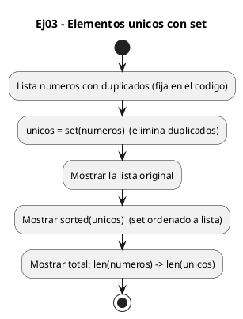
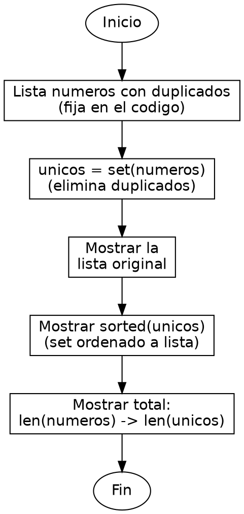

<!-- FICHERO GENERADO — NO EDITAR. Fuente de verdad: curso-python/practica/07-diccionarios-sets/ej03.md (se regenera con gen_course.py). -->

# Ejercicio 03 — Dada una lista con duplicados, devuelve los elementos unicos usando…

Dificultad: verde · Módulo 07 (Diccionarios y sets)

## Enunciado

Dada una lista con duplicados, devuelve los elementos unicos usando set

## Diagramas de flujo





## Cómo se resuelve

<!-- EXPLICACION -->
Eliminar duplicados de una lista es el uso más directo del `set`: un conjunto no admite elementos repetidos, así que convertir la lista en set los borra solos.

1. `unicos = set(numeros)` — al construir un conjunto a partir de la lista, Python descarta automáticamente las repeticiones. De `[3, 1, 2, 5, 1, 3, 2, 5, 5, 1]` quedan solo `{1, 2, 3, 5}`.
2. Funciona porque el `set` usa hashing igual que el diccionario: antes de meter un elemento calcula su hash y comprueba en tiempo constante si ya está. Si está, no lo añade. Esa comprobación O(1) por elemento es lo que hace todo el proceso eficiente, sin comparar cada número con todos los anteriores.
3. `sorted(unicos)` — un `set` no tiene orden garantizado, así que para mostrarlo de forma legible lo convertimos en una lista ordenada. `sorted` acepta el set y devuelve una lista.
4. `len(numeros)` frente a `len(unicos)` — comparar ambos tamaños nos dice cuántos duplicados había: 10 elementos originales, 4 únicos.

Trampa habitual: esperar que el `set` conserve el orden de aparición original. No lo hace; su orden es interno e impredecible. Si necesitas quitar duplicados manteniendo el orden, la vía es `dict.fromkeys(numeros)`, que sí respeta el primer orden de inserción.

## Para practicar — cópialo y complétalo

Pega este esqueleto y completa los `TODO`. Es la mejor forma de aprender: inténtalo antes de mirar la solución.

```python
# Curso de Python — Modulo 07: Diccionarios y Sets
# Ejercicio 03 — PRACTICA (rellena los TODO)
# Enunciado: Dada una lista con duplicados, devuelve los elementos unicos usando set
# Dificultad: verde
# Ejecutar: python3 ej03_practica.py

# Lista con duplicados (no la modifiques)
numeros = [3, 1, 2, 5, 1, 3, 2, 5, 5, 1]

# TODO: convierte la lista "numeros" a un set y guardalo en "unicos"
unicos = None

# TODO: imprime la lista original con f-string
# TODO: imprime los unicos ORDENADOS con f-string
#       pista: sorted(unicos) devuelve una lista ordenada a partir del set
# TODO: imprime cuantos elementos totales hay vs cuantos unicos
```

## Solución — cópiala y ejecútala

```python
# Curso de Python — Modulo 07: Diccionarios y Sets
# Ejercicio 03 — MODELO (resuelto)
# Enunciado: Dada una lista con duplicados, devuelve los elementos unicos usando set
# Dificultad: verde
# Ejecutar: python3 ej03_modelo.py

# Lista con duplicados (hardcoded)
numeros = [3, 1, 2, 5, 1, 3, 2, 5, 5, 1]

# set() elimina duplicados automaticamente — O(1) por insercion
unicos = set(numeros)

print(f"Lista original: {numeros}")
print(f"Unicos: {sorted(unicos)}")   # sorted convierte el set a lista ordenada
print(f"Total elementos: {len(numeros)} -> {len(unicos)} unicos")
```

## Ejecútalo en el navegador

<div class="pyodide-run" data-code="IyBDdXJzbyBkZSBQeXRob24g4oCUIE1vZHVsbyAwNzogRGljY2lvbmFyaW9zIHkgU2V0cwojIEVqZXJjaWNpbyAwMyDigJQgTU9ERUxPIChyZXN1ZWx0bykKIyBFbnVuY2lhZG86IERhZGEgdW5hIGxpc3RhIGNvbiBkdXBsaWNhZG9zLCBkZXZ1ZWx2ZSBsb3MgZWxlbWVudG9zIHVuaWNvcyB1c2FuZG8gc2V0CiMgRGlmaWN1bHRhZDogdmVyZGUKIyBFamVjdXRhcjogcHl0aG9uMyBlajAzX21vZGVsby5weQoKIyBMaXN0YSBjb24gZHVwbGljYWRvcyAoaGFyZGNvZGVkKQpudW1lcm9zID0gWzMsIDEsIDIsIDUsIDEsIDMsIDIsIDUsIDUsIDFdCgojIHNldCgpIGVsaW1pbmEgZHVwbGljYWRvcyBhdXRvbWF0aWNhbWVudGUg4oCUIE8oMSkgcG9yIGluc2VyY2lvbgp1bmljb3MgPSBzZXQobnVtZXJvcykKCnByaW50KGYiTGlzdGEgb3JpZ2luYWw6IHtudW1lcm9zfSIpCnByaW50KGYiVW5pY29zOiB7c29ydGVkKHVuaWNvcyl9IikgICAjIHNvcnRlZCBjb252aWVydGUgZWwgc2V0IGEgbGlzdGEgb3JkZW5hZGEKcHJpbnQoZiJUb3RhbCBlbGVtZW50b3M6IHtsZW4obnVtZXJvcyl9IC0+IHtsZW4odW5pY29zKX0gdW5pY29zIikK">
<button class="pyodide-btn" type="button">▶ Ejecutar aquí (Python en el navegador)</button>
<textarea class="pyodide-stdin" rows="2" placeholder="Si el programa pide datos por teclado, escríbelos aquí, uno por línea"></textarea>
<pre class="pyodide-out" hidden></pre>
</div>

[▶ Visualízalo paso a paso en Python Tutor](https://pythontutor.com/visualize.html#code=%23+Curso+de+Python+%E2%80%94+Modulo+07%3A+Diccionarios+y+Sets%0A%23+Ejercicio+03+%E2%80%94+MODELO+%28resuelto%29%0A%23+Enunciado%3A+Dada+una+lista+con+duplicados%2C+devuelve+los+elementos+unicos+usando+set%0A%23+Dificultad%3A+verde%0A%23+Ejecutar%3A+python3+ej03_modelo.py%0A%0A%23+Lista+con+duplicados+%28hardcoded%29%0Anumeros+%3D+%5B3%2C+1%2C+2%2C+5%2C+1%2C+3%2C+2%2C+5%2C+5%2C+1%5D%0A%0A%23+set%28%29+elimina+duplicados+automaticamente+%E2%80%94+O%281%29+por+insercion%0Aunicos+%3D+set%28numeros%29%0A%0Aprint%28f%22Lista+original%3A+%7Bnumeros%7D%22%29%0Aprint%28f%22Unicos%3A+%7Bsorted%28unicos%29%7D%22%29+++%23+sorted+convierte+el+set+a+lista+ordenada%0Aprint%28f%22Total+elementos%3A+%7Blen%28numeros%29%7D+-%3E+%7Blen%28unicos%29%7D+unicos%22%29%0A&cumulative=false&curInstr=0&py=3&rawInputLstJSON=%5B%5D) — ve cómo cambian las variables línea a línea.

## Cómo usarlo

Pega el código en un fichero y ejecútalo con tu toolchain habitual (o el botón de Ejecutar de tu editor). Antes de mirar la solución, intenta completar tú el esqueleto: es la mejor forma de aprender.

## Conexiones

- [[Curso_Python/modelo/07-diccionarios-sets|Teoría del módulo]]
- [[Curso_Python/practica/00_README|Índice del curso]]
