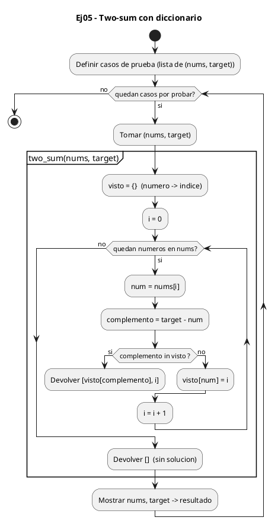
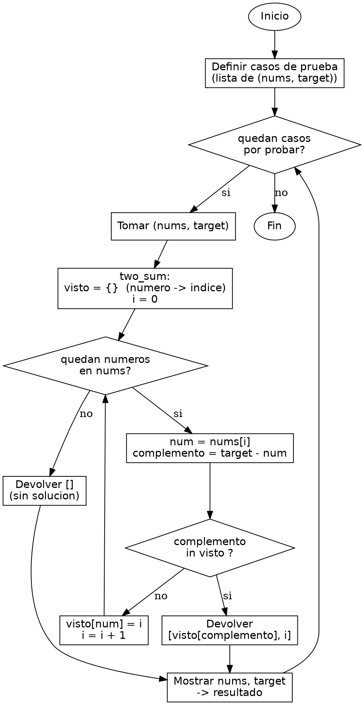

<!-- FICHERO GENERADO — NO EDITAR. Fuente de verdad: curso-python/practica/07-diccionarios-sets/ej05.md (se regenera con gen_course.py). -->

# Ejercicio 05 — Two-sum basico

Dificultad: rojo · Módulo 07 (Diccionarios y sets)

## Enunciado

Two-sum basico: encuentra los dos indices cuya suma es target usando dict

## Diagramas de flujo





## Cómo se resuelve

<!-- EXPLICACION -->
El "two-sum" es el ejercicio que enseña por qué un diccionario convierte una búsqueda lenta en una rápida: en vez de probar todas las parejas, recordamos lo que ya vimos y preguntamos al dict en tiempo constante.

1. `visto = {}` — un diccionario donde la clave es un número de la lista y el valor su índice. Es nuestra "memoria" de lo que ya hemos recorrido.
2. `for i, num in enumerate(nums)` — `enumerate` nos da a la vez el índice `i` y el valor `num`, que necesitamos para poder devolver posiciones.
3. `complemento = target - num` — para cada número calculamos qué otro número haría falta para llegar al `target`. Si tenemos `num` y buscamos que sumen `target`, el que falta es `target - num`.
4. `if complemento in visto:` — aquí está la clave. Preguntar si el complemento ya apareció es una búsqueda en el diccionario, que gracias al hashing es O(1): no recorre todo lo visto, va directo. Si está, ya tenemos la pareja y devolvemos `[visto[complemento], i]`.
5. `visto[num] = i` — si el complemento aún no estaba, guardamos el número actual con su índice para que futuros números puedan encontrarlo a él como su complemento. Así una sola pasada O(n) resuelve el problema.

Trampa habitual: hacerlo con dos bucles anidados que prueban todas las parejas (O(n^2)). Funciona en listas pequeñas pero se dispara con muchas. El truco del dict es cambiar tiempo por memoria: gastamos algo de espacio guardando lo visto a cambio de que cada búsqueda sea instantánea. Ojo también con guardar el número en el dict ANTES de comprobar su complemento: si lo haces al revés, un caso como `[3, 3]` con target 6 podría emparejar un número consigo mismo por error.

## Para practicar — cópialo y complétalo

Pega este esqueleto y completa los `TODO`. Es la mejor forma de aprender: inténtalo antes de mirar la solución.

```python
# Curso de Python — Modulo 07: Diccionarios y Sets
# Ejercicio 05 — PRACTICA (rellena los TODO)
# Enunciado: Two-sum basico: encuentra los dos indices cuya suma es target usando dict
# Dificultad: rojo
# Ejecutar: python3 ej05_practica.py

def two_sum(nums, target):
    # TODO: crea un dict vacio llamado "visto"
    #       guardara { numero: indice } para los numeros ya procesados
    visto = None

    # TODO: recorre nums con enumerate() para obtener (indice i, numero num)
    for i, num in enumerate(nums):
        # TODO: calcula el complemento: target - num
        complemento = None

        # TODO: comprueba si el complemento ya esta en "visto"
        #       si SI: devuelve [visto[complemento], i]  (los dos indices)
        #       si NO: guarda visto[num] = i  (este numero puede ser complemento futuro)
        pass

    return []  # no se encontro solucion


# Casos de prueba — no modifiques esta parte
casos = [
    ([2, 7, 11, 15], 9),    # esperado: [0, 1]
    ([3, 2, 4], 6),          # esperado: [1, 2]
    ([3, 3], 6),             # esperado: [0, 1]
]

for nums, target in casos:
    resultado = two_sum(nums, target)
    print(f"nums={nums}, target={target} -> {resultado}")
```

## Solución — cópiala y ejecútala

```python
# Curso de Python — Modulo 07: Diccionarios y Sets
# Ejercicio 05 — MODELO (resuelto)
# Enunciado: Two-sum basico: encuentra los dos indices cuya suma es target usando dict
# Dificultad: rojo
# Ejecutar: python3 ej05_modelo.py

def two_sum(nums, target):
    """
    Para cada numero, calcula su complemento (target - num).
    Si el complemento ya esta en el dict, encontramos la pareja.
    Si no, guardamos el numero actual y su indice en el dict.
    Complejidad: O(n) tiempo, O(n) espacio.
    """
    visto = {}  # clave: numero, valor: indice donde aparecio

    for i, num in enumerate(nums):
        complemento = target - num
        if complemento in visto:
            return [visto[complemento], i]
        visto[num] = i

    return []  # no se encontro solucion

# Casos de prueba
casos = [
    ([2, 7, 11, 15], 9),    # esperado: [0, 1]
    ([3, 2, 4], 6),          # esperado: [1, 2]
    ([3, 3], 6),             # esperado: [0, 1]
]

for nums, target in casos:
    resultado = two_sum(nums, target)
    print(f"nums={nums}, target={target} -> {resultado}")
```

## Ejecútalo en el navegador

<div class="pyodide-run" data-code="IyBDdXJzbyBkZSBQeXRob24g4oCUIE1vZHVsbyAwNzogRGljY2lvbmFyaW9zIHkgU2V0cwojIEVqZXJjaWNpbyAwNSDigJQgTU9ERUxPIChyZXN1ZWx0bykKIyBFbnVuY2lhZG86IFR3by1zdW0gYmFzaWNvOiBlbmN1ZW50cmEgbG9zIGRvcyBpbmRpY2VzIGN1eWEgc3VtYSBlcyB0YXJnZXQgdXNhbmRvIGRpY3QKIyBEaWZpY3VsdGFkOiByb2pvCiMgRWplY3V0YXI6IHB5dGhvbjMgZWowNV9tb2RlbG8ucHkKCmRlZiB0d29fc3VtKG51bXMsIHRhcmdldCk6CiAgICAiIiIKICAgIFBhcmEgY2FkYSBudW1lcm8sIGNhbGN1bGEgc3UgY29tcGxlbWVudG8gKHRhcmdldCAtIG51bSkuCiAgICBTaSBlbCBjb21wbGVtZW50byB5YSBlc3RhIGVuIGVsIGRpY3QsIGVuY29udHJhbW9zIGxhIHBhcmVqYS4KICAgIFNpIG5vLCBndWFyZGFtb3MgZWwgbnVtZXJvIGFjdHVhbCB5IHN1IGluZGljZSBlbiBlbCBkaWN0LgogICAgQ29tcGxlamlkYWQ6IE8obikgdGllbXBvLCBPKG4pIGVzcGFjaW8uCiAgICAiIiIKICAgIHZpc3RvID0ge30gICMgY2xhdmU6IG51bWVybywgdmFsb3I6IGluZGljZSBkb25kZSBhcGFyZWNpbwoKICAgIGZvciBpLCBudW0gaW4gZW51bWVyYXRlKG51bXMpOgogICAgICAgIGNvbXBsZW1lbnRvID0gdGFyZ2V0IC0gbnVtCiAgICAgICAgaWYgY29tcGxlbWVudG8gaW4gdmlzdG86CiAgICAgICAgICAgIHJldHVybiBbdmlzdG9bY29tcGxlbWVudG9dLCBpXQogICAgICAgIHZpc3RvW251bV0gPSBpCgogICAgcmV0dXJuIFtdICAjIG5vIHNlIGVuY29udHJvIHNvbHVjaW9uCgojIENhc29zIGRlIHBydWViYQpjYXNvcyA9IFsKICAgIChbMiwgNywgMTEsIDE1XSwgOSksICAgICMgZXNwZXJhZG86IFswLCAxXQogICAgKFszLCAyLCA0XSwgNiksICAgICAgICAgICMgZXNwZXJhZG86IFsxLCAyXQogICAgKFszLCAzXSwgNiksICAgICAgICAgICAgICMgZXNwZXJhZG86IFswLCAxXQpdCgpmb3IgbnVtcywgdGFyZ2V0IGluIGNhc29zOgogICAgcmVzdWx0YWRvID0gdHdvX3N1bShudW1zLCB0YXJnZXQpCiAgICBwcmludChmIm51bXM9e251bXN9LCB0YXJnZXQ9e3RhcmdldH0gLT4ge3Jlc3VsdGFkb30iKQo=">
<button class="pyodide-btn" type="button">▶ Ejecutar aquí (Python en el navegador)</button>
<textarea class="pyodide-stdin" rows="2" placeholder="Si el programa pide datos por teclado, escríbelos aquí, uno por línea"></textarea>
<pre class="pyodide-out" hidden></pre>
</div>

[▶ Visualízalo paso a paso en Python Tutor](https://pythontutor.com/visualize.html#code=%23+Curso+de+Python+%E2%80%94+Modulo+07%3A+Diccionarios+y+Sets%0A%23+Ejercicio+05+%E2%80%94+MODELO+%28resuelto%29%0A%23+Enunciado%3A+Two-sum+basico%3A+encuentra+los+dos+indices+cuya+suma+es+target+usando+dict%0A%23+Dificultad%3A+rojo%0A%23+Ejecutar%3A+python3+ej05_modelo.py%0A%0Adef+two_sum%28nums%2C+target%29%3A%0A++++%22%22%22%0A++++Para+cada+numero%2C+calcula+su+complemento+%28target+-+num%29.%0A++++Si+el+complemento+ya+esta+en+el+dict%2C+encontramos+la+pareja.%0A++++Si+no%2C+guardamos+el+numero+actual+y+su+indice+en+el+dict.%0A++++Complejidad%3A+O%28n%29+tiempo%2C+O%28n%29+espacio.%0A++++%22%22%22%0A++++visto+%3D+%7B%7D++%23+clave%3A+numero%2C+valor%3A+indice+donde+aparecio%0A%0A++++for+i%2C+num+in+enumerate%28nums%29%3A%0A++++++++complemento+%3D+target+-+num%0A++++++++if+complemento+in+visto%3A%0A++++++++++++return+%5Bvisto%5Bcomplemento%5D%2C+i%5D%0A++++++++visto%5Bnum%5D+%3D+i%0A%0A++++return+%5B%5D++%23+no+se+encontro+solucion%0A%0A%23+Casos+de+prueba%0Acasos+%3D+%5B%0A++++%28%5B2%2C+7%2C+11%2C+15%5D%2C+9%29%2C++++%23+esperado%3A+%5B0%2C+1%5D%0A++++%28%5B3%2C+2%2C+4%5D%2C+6%29%2C++++++++++%23+esperado%3A+%5B1%2C+2%5D%0A++++%28%5B3%2C+3%5D%2C+6%29%2C+++++++++++++%23+esperado%3A+%5B0%2C+1%5D%0A%5D%0A%0Afor+nums%2C+target+in+casos%3A%0A++++resultado+%3D+two_sum%28nums%2C+target%29%0A++++print%28f%22nums%3D%7Bnums%7D%2C+target%3D%7Btarget%7D+-%3E+%7Bresultado%7D%22%29%0A&cumulative=false&curInstr=0&py=3&rawInputLstJSON=%5B%5D) — ve cómo cambian las variables línea a línea.

## Cómo usarlo

Pega el código en un fichero y ejecútalo con tu toolchain habitual (o el botón de Ejecutar de tu editor). Antes de mirar la solución, intenta completar tú el esqueleto: es la mejor forma de aprender.

## Conexiones

- [[Curso_Python/modelo/07-diccionarios-sets|Teoría del módulo]]
- [[Curso_Python/practica/00_README|Índice del curso]]
