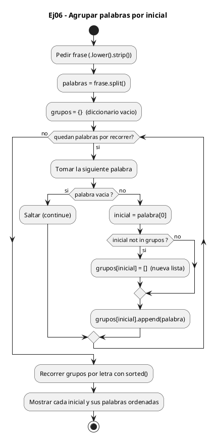
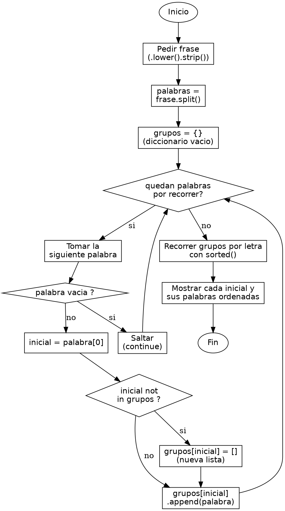

<!-- FICHERO GENERADO — NO EDITAR. Fuente de verdad: curso-python/practica/07-diccionarios-sets/ej06.md (se regenera con gen_course.py). -->

# Ejercicio 06 — Agrupa palabras de una frase por su primera letra y muestralas…

Dificultad: amarillo · Módulo 07 (Diccionarios y sets)

## Enunciado

Agrupa palabras de una frase por su primera letra y muestralas ordenadas

## Diagramas de flujo





## Cómo se resuelve

<!-- EXPLICACION -->
Agrupar palabras por su primera letra enseña el diccionario como "cajón de listas": cada clave (la inicial) guarda una lista de todas las palabras que empiezan por ella.

1. `frase.lower().strip()` y `frase.split()` — normalizamos y partimos la frase en palabras, igual que en los ejercicios anteriores.
2. `if not palabra: continue` — si aparece una cadena vacía (por dobles espacios), la saltamos para no intentar leer su primera letra y fallar.
3. `inicial = palabra[0]` — cogemos el primer carácter de la palabra, que será la clave del grupo.
4. `if inicial not in grupos: grupos[inicial] = []` — la primera vez que aparece una inicial, todavía no tiene lista asociada, así que le creamos una lista vacía. Sin este paso, el siguiente `append` fallaría porque la clave no existiría.
5. `grupos[inicial].append(palabra)` — añadimos la palabra a la lista de su inicial. Como el acceso a la clave del dict es O(1) por hashing, agrupar todas las palabras es una única pasada eficiente.
6. `for letra in sorted(grupos):` y `sorted(grupos[letra])` — ordenamos las iniciales y, dentro de cada grupo, las palabras, para una salida limpia y predecible.

Trampa habitual: hacer directamente `grupos[inicial].append(palabra)` sin inicializar la lista antes. La primera palabra de cada inicial encuentra una clave que aún no existe y el `.append` lanza `KeyError`. La solución idiomática es o bien el patrón `if inicial not in grupos` de aquí, o usar `grupos.setdefault(inicial, []).append(palabra)`, o un `defaultdict(list)` de `collections`, que crean la lista automáticamente.

## Para practicar — cópialo y complétalo

Pega este esqueleto y completa los `TODO`. Es la mejor forma de aprender: inténtalo antes de mirar la solución.

```python
# Curso de Python — Modulo 07: Diccionarios y Sets
# Ejercicio 06 — PRACTICA (rellena los TODO)
# Enunciado: Agrupa palabras de una frase por su primera letra y muestralas ordenadas
# Dificultad: amarillo
# Ejecutar: python3 ej06_practica.py

# TODO: pide una frase al usuario, conviertela a minusculas y elimina espacios extremos
frase = None

# TODO: divide la frase en palabras con .split()
palabras = None

# TODO: crea un dict vacio llamado "grupos"
grupos = None

# TODO: recorre cada palabra en "palabras" con un bucle for
for palabra in (palabras or []):
    # TODO: ignora palabras vacias (if not palabra: continue)

    # TODO: extrae la inicial (primera letra) de la palabra
    inicial = None

    # TODO: si la inicial NO esta en grupos, crea una lista vacia para esa clave
    # TODO: agrega la palabra a grupos[inicial]
    pass

# TODO: imprime el titulo "Palabras agrupadas por inicial:"
# TODO: recorre las letras de grupos en orden SORTED
#       para cada letra, imprime sus palabras tambien ordenadas con sorted()
#       formato:  "  {letra}: {', '.join(palabras_ordenadas)}"
```

## Solución — cópiala y ejecútala

```python
# Curso de Python — Modulo 07: Diccionarios y Sets
# Ejercicio 06 — MODELO (resuelto)
# Enunciado: Agrupa palabras de una frase por su primera letra y muestralas ordenadas
# Dificultad: amarillo
# Ejecutar: python3 ej06_modelo.py

frase = input("Introduce una frase: ").lower().strip()
palabras = frase.split()

grupos = {}
for palabra in palabras:
    if not palabra:          # ignorar cadenas vacias por si hay dobles espacios
        continue
    inicial = palabra[0]
    if inicial not in grupos:
        grupos[inicial] = []
    grupos[inicial].append(palabra)

print("\nPalabras agrupadas por inicial:")
for letra in sorted(grupos):
    palabras_ordenadas = sorted(grupos[letra])
    print(f"  {letra}: {', '.join(palabras_ordenadas)}")
```

## Ejecútalo en el navegador

[▶ Visualízalo paso a paso en Python Tutor](https://pythontutor.com/visualize.html#code=%23+Curso+de+Python+%E2%80%94+Modulo+07%3A+Diccionarios+y+Sets%0A%23+Ejercicio+06+%E2%80%94+MODELO+%28resuelto%29%0A%23+Enunciado%3A+Agrupa+palabras+de+una+frase+por+su+primera+letra+y+muestralas+ordenadas%0A%23+Dificultad%3A+amarillo%0A%23+Ejecutar%3A+python3+ej06_modelo.py%0A%0Afrase+%3D+input%28%22Introduce+una+frase%3A+%22%29.lower%28%29.strip%28%29%0Apalabras+%3D+frase.split%28%29%0A%0Agrupos+%3D+%7B%7D%0Afor+palabra+in+palabras%3A%0A++++if+not+palabra%3A++++++++++%23+ignorar+cadenas+vacias+por+si+hay+dobles+espacios%0A++++++++continue%0A++++inicial+%3D+palabra%5B0%5D%0A++++if+inicial+not+in+grupos%3A%0A++++++++grupos%5Binicial%5D+%3D+%5B%5D%0A++++grupos%5Binicial%5D.append%28palabra%29%0A%0Aprint%28%22%5CnPalabras+agrupadas+por+inicial%3A%22%29%0Afor+letra+in+sorted%28grupos%29%3A%0A++++palabras_ordenadas+%3D+sorted%28grupos%5Bletra%5D%29%0A++++print%28f%22++%7Bletra%7D%3A+%7B%27%2C+%27.join%28palabras_ordenadas%29%7D%22%29%0A&cumulative=false&curInstr=0&py=3&rawInputLstJSON=%5B%5D) — ve cómo cambian las variables línea a línea.

## Cómo usarlo

Pega el código en un fichero y ejecútalo con tu toolchain habitual (o el botón de Ejecutar de tu editor). Antes de mirar la solución, intenta completar tú el esqueleto: es la mejor forma de aprender.

## Conexiones

- [[Curso_Python/modelo/07-diccionarios-sets|Teoría del módulo]]
- [[Curso_Python/practica/00_README|Índice del curso]]
