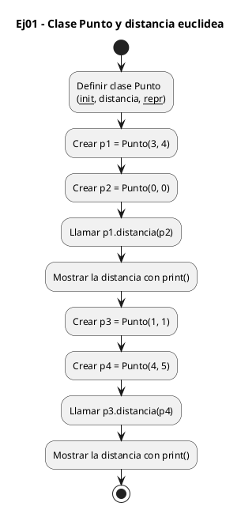
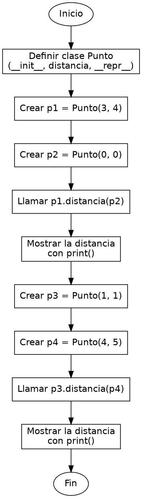

<!-- FICHERO GENERADO — NO EDITAR. Fuente de verdad: curso-python/practica/08-clases-archivos/ej01.md (se regenera con gen_course.py). -->

# Ejercicio 01 — Define una clase Punto(x, y) con un metodo distancia(otro) que…

Dificultad: verde · Módulo 08 (Clases y archivos)

## Enunciado

Define una clase Punto(x, y) con un metodo distancia(otro) que devuelva la distancia euclidea.

## Diagramas de flujo





## Cómo se resuelve

<!-- EXPLICACION -->
Una clase es un molde: describe qué datos guarda cada objeto y qué sabe hacer. Aquí `Punto` agrupa una coordenada `x` y una `y`, y sabe medir su distancia a otro punto.

1. `class Punto:` abre la definición del molde. Todo lo indentado debajo pertenece a la clase, no se ejecuta al definirla: solo describe cómo serán los objetos.
2. `def __init__(self, x, y):` es el constructor. Python lo llama solo cada vez que escribes `Punto(3, 4)`. `self` es el objeto que se está creando; `self.x = x` y `self.y = y` guardan los valores recibidos dentro del objeto para que sobrevivan después de crear el punto.
3. `def distancia(self, otro):` es un método (una función que vive dentro de la clase). Recibe `self` (el propio punto) y `otro` (un segundo `Punto`), y usa `self.x - otro.x` para restar sus coordenadas. `math.sqrt(dx**2 + dy**2)` aplica el teorema de Pitágoras, que es la distancia euclídea.
4. `p1 = Punto(3, 4)` crea un objeto concreto a partir del molde. Con `p1.distancia(p2)` se llama al método sobre `p1`: ese `p1` entra como `self` de forma automática, por eso solo pasas `p2`.
5. `__repr__` define cómo se ve el objeto al imprimirlo: por eso `print(f"...{p1}...")` muestra `(3,4)` en vez de algo ilegible como `<Punto object at 0x...>`.

Trampa habitual: olvidar `self` al leer o escribir atributos dentro de un método. Si escribes `x` a secas en vez de `self.x`, Python busca una variable local que no existe; el atributo del objeto siempre se accede con `self.`.

## Para practicar — cópialo y complétalo

Pega este esqueleto y completa los `TODO`. Es la mejor forma de aprender: inténtalo antes de mirar la solución.

```python
# Curso de Python — Modulo 08: Clases, dataclasses y archivos
# Ejercicio 01 — PRACTICA (rellena los TODO)
# Enunciado: Define una clase Punto(x, y) con un metodo distancia(otro) que devuelva la distancia euclidea.
# Dificultad: verde
# Ejecutar: python3 ej01_practica.py

import math


class Punto:
    """Representa un punto en el plano 2D."""

    def __init__(self, x, y):
        # TODO: guarda x e y como atributos del objeto (usa self.x = x, etc.)
        pass

    def distancia(self, otro):
        """Calcula la distancia euclidea a otro Punto."""
        # TODO: calcula dx = self.x - otro.x, dy = self.y - otro.y
        # TODO: devuelve math.sqrt(dx**2 + dy**2)
        pass

    def __repr__(self):
        # TODO: devuelve un string del tipo "(x,y)"
        pass


# --- Programa principal ---
p1 = Punto(3, 4)
p2 = Punto(0, 0)
# TODO: imprime la distancia entre p1 y p2 con 2 decimales
# Salida esperada: Distancia entre (3,4) y (0,0): 5.00

p3 = Punto(1, 1)
p4 = Punto(4, 5)
# TODO: imprime la distancia entre p3 y p4 con 2 decimales
# Salida esperada: Distancia entre (1,1) y (4,5): 5.00
```

## Solución — cópiala y ejecútala

```python
# Curso de Python — Modulo 08: Clases, dataclasses y archivos
# Ejercicio 01 — MODELO (resuelto)
# Enunciado: Define una clase Punto(x, y) con un metodo distancia(otro) que devuelva la distancia euclidea.
# Dificultad: verde
# Ejecutar: python3 ej01_modelo.py

import math


class Punto:
    """Representa un punto en el plano 2D."""

    def __init__(self, x, y):
        # self.x y self.y son los atributos del objeto
        self.x = x
        self.y = y

    def distancia(self, otro):
        """Calcula la distancia euclidea a otro Punto."""
        dx = self.x - otro.x
        dy = self.y - otro.y
        return math.sqrt(dx**2 + dy**2)

    def __repr__(self):
        """Representacion legible del punto."""
        return f"({self.x},{self.y})"


# --- Programa principal ---
p1 = Punto(3, 4)
p2 = Punto(0, 0)
print(f"Distancia entre {p1} y {p2}: {p1.distancia(p2):.2f}")

p3 = Punto(1, 1)
p4 = Punto(4, 5)
print(f"Distancia entre {p3} y {p4}: {p3.distancia(p4):.2f}")
```

## Ejecútalo en el navegador

<div class="pyodide-run" data-code="IyBDdXJzbyBkZSBQeXRob24g4oCUIE1vZHVsbyAwODogQ2xhc2VzLCBkYXRhY2xhc3NlcyB5IGFyY2hpdm9zCiMgRWplcmNpY2lvIDAxIOKAlCBNT0RFTE8gKHJlc3VlbHRvKQojIEVudW5jaWFkbzogRGVmaW5lIHVuYSBjbGFzZSBQdW50byh4LCB5KSBjb24gdW4gbWV0b2RvIGRpc3RhbmNpYShvdHJvKSBxdWUgZGV2dWVsdmEgbGEgZGlzdGFuY2lhIGV1Y2xpZGVhLgojIERpZmljdWx0YWQ6IHZlcmRlCiMgRWplY3V0YXI6IHB5dGhvbjMgZWowMV9tb2RlbG8ucHkKCmltcG9ydCBtYXRoCgoKY2xhc3MgUHVudG86CiAgICAiIiJSZXByZXNlbnRhIHVuIHB1bnRvIGVuIGVsIHBsYW5vIDJELiIiIgoKICAgIGRlZiBfX2luaXRfXyhzZWxmLCB4LCB5KToKICAgICAgICAjIHNlbGYueCB5IHNlbGYueSBzb24gbG9zIGF0cmlidXRvcyBkZWwgb2JqZXRvCiAgICAgICAgc2VsZi54ID0geAogICAgICAgIHNlbGYueSA9IHkKCiAgICBkZWYgZGlzdGFuY2lhKHNlbGYsIG90cm8pOgogICAgICAgICIiIkNhbGN1bGEgbGEgZGlzdGFuY2lhIGV1Y2xpZGVhIGEgb3RybyBQdW50by4iIiIKICAgICAgICBkeCA9IHNlbGYueCAtIG90cm8ueAogICAgICAgIGR5ID0gc2VsZi55IC0gb3Ryby55CiAgICAgICAgcmV0dXJuIG1hdGguc3FydChkeCoqMiArIGR5KioyKQoKICAgIGRlZiBfX3JlcHJfXyhzZWxmKToKICAgICAgICAiIiJSZXByZXNlbnRhY2lvbiBsZWdpYmxlIGRlbCBwdW50by4iIiIKICAgICAgICByZXR1cm4gZiIoe3NlbGYueH0se3NlbGYueX0pIgoKCiMgLS0tIFByb2dyYW1hIHByaW5jaXBhbCAtLS0KcDEgPSBQdW50bygzLCA0KQpwMiA9IFB1bnRvKDAsIDApCnByaW50KGYiRGlzdGFuY2lhIGVudHJlIHtwMX0geSB7cDJ9OiB7cDEuZGlzdGFuY2lhKHAyKTouMmZ9IikKCnAzID0gUHVudG8oMSwgMSkKcDQgPSBQdW50byg0LCA1KQpwcmludChmIkRpc3RhbmNpYSBlbnRyZSB7cDN9IHkge3A0fToge3AzLmRpc3RhbmNpYShwNCk6LjJmfSIpCg==">
<button class="pyodide-btn" type="button">▶ Ejecutar aquí (Python en el navegador)</button>
<textarea class="pyodide-stdin" rows="2" placeholder="Si el programa pide datos por teclado, escríbelos aquí, uno por línea"></textarea>
<pre class="pyodide-out" hidden></pre>
</div>

[▶ Visualízalo paso a paso en Python Tutor](https://pythontutor.com/visualize.html#code=%23+Curso+de+Python+%E2%80%94+Modulo+08%3A+Clases%2C+dataclasses+y+archivos%0A%23+Ejercicio+01+%E2%80%94+MODELO+%28resuelto%29%0A%23+Enunciado%3A+Define+una+clase+Punto%28x%2C+y%29+con+un+metodo+distancia%28otro%29+que+devuelva+la+distancia+euclidea.%0A%23+Dificultad%3A+verde%0A%23+Ejecutar%3A+python3+ej01_modelo.py%0A%0Aimport+math%0A%0A%0Aclass+Punto%3A%0A++++%22%22%22Representa+un+punto+en+el+plano+2D.%22%22%22%0A%0A++++def+__init__%28self%2C+x%2C+y%29%3A%0A++++++++%23+self.x+y+self.y+son+los+atributos+del+objeto%0A++++++++self.x+%3D+x%0A++++++++self.y+%3D+y%0A%0A++++def+distancia%28self%2C+otro%29%3A%0A++++++++%22%22%22Calcula+la+distancia+euclidea+a+otro+Punto.%22%22%22%0A++++++++dx+%3D+self.x+-+otro.x%0A++++++++dy+%3D+self.y+-+otro.y%0A++++++++return+math.sqrt%28dx%2A%2A2+%2B+dy%2A%2A2%29%0A%0A++++def+__repr__%28self%29%3A%0A++++++++%22%22%22Representacion+legible+del+punto.%22%22%22%0A++++++++return+f%22%28%7Bself.x%7D%2C%7Bself.y%7D%29%22%0A%0A%0A%23+---+Programa+principal+---%0Ap1+%3D+Punto%283%2C+4%29%0Ap2+%3D+Punto%280%2C+0%29%0Aprint%28f%22Distancia+entre+%7Bp1%7D+y+%7Bp2%7D%3A+%7Bp1.distancia%28p2%29%3A.2f%7D%22%29%0A%0Ap3+%3D+Punto%281%2C+1%29%0Ap4+%3D+Punto%284%2C+5%29%0Aprint%28f%22Distancia+entre+%7Bp3%7D+y+%7Bp4%7D%3A+%7Bp3.distancia%28p4%29%3A.2f%7D%22%29%0A&cumulative=false&curInstr=0&py=3&rawInputLstJSON=%5B%5D) — ve cómo cambian las variables línea a línea.

## Cómo usarlo

Pega el código en un fichero y ejecútalo con tu toolchain habitual (o el botón de Ejecutar de tu editor). Antes de mirar la solución, intenta completar tú el esqueleto: es la mejor forma de aprender.

## Conexiones

- [[Curso_Python/modelo/08-clases-archivos|Teoría del módulo]]
- [[Curso_Python/practica/00_README|Índice del curso]]
