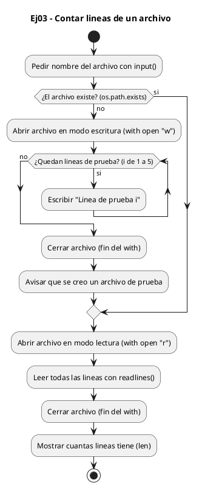
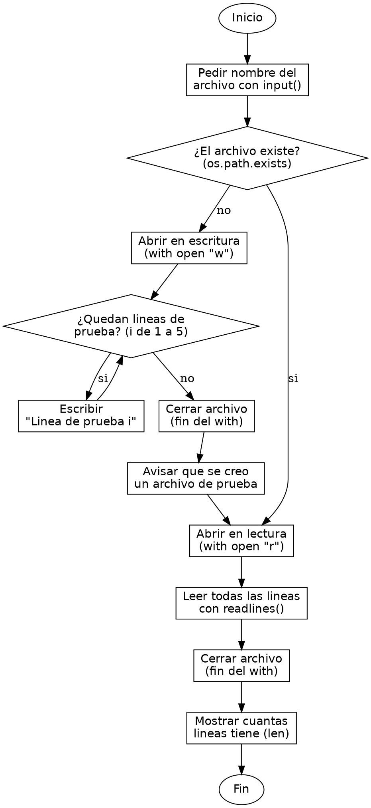

<!-- FICHERO GENERADO — NO EDITAR. Fuente de verdad: curso-python/practica/08-clases-archivos/ej03.md (se regenera con gen_course.py). -->

# Ejercicio 03 — Pide el nombre de un archivo al usuario, leelo y muestra cuantas…

Dificultad: amarillo · Módulo 08 (Clases y archivos)

## Enunciado

Pide el nombre de un archivo al usuario, leelo y muestra cuantas lineas tiene.

## Diagramas de flujo





## Cómo se resuelve

<!-- EXPLICACION -->
Leer un archivo y contar sus líneas es el primer contacto con la entrada/salida de ficheros: el patrón central es `with open(...) as f`.

1. `input("Nombre del archivo: ")` pide al usuario el nombre del fichero que quiere abrir.
2. `os.path.exists(nombre)` comprueba si ese archivo existe antes de intentar leerlo. Si no existe, el ejercicio crea uno de prueba con `with open(nombre, "w") as f` y `f.write(...)` en un bucle, para que el programa siempre tenga algo que leer y sea autocontenido. El modo `"w"` (write) crea el archivo si no está y lo deja listo para escribir.
3. `with open(nombre, "r") as f:` abre el archivo en modo `"r"` (read, lectura). La palabra clave `with` es la clave: crea un contexto que cierra el archivo automáticamente al salir del bloque, incluso si ocurre un error a mitad. Así nunca dejas un fichero abierto consumiendo recursos.
4. `f.readlines()` lee todas las líneas de golpe y devuelve una lista donde cada elemento es una línea. `len(lineas)` cuenta cuántos elementos tiene esa lista, es decir, cuántas líneas hay.

Trampa habitual: abrir con `open()` sin `with` y olvidar `f.close()`. Si no cierras el archivo, los cambios pueden no guardarse y el fichero queda bloqueado; `with` te libra de acordarte porque lo cierra solo.

## Para practicar — cópialo y complétalo

Pega este esqueleto y completa los `TODO`. Es la mejor forma de aprender: inténtalo antes de mirar la solución.

```python
# Curso de Python — Modulo 08: Clases, dataclasses y archivos
# Ejercicio 03 — PRACTICA (rellena los TODO)
# Enunciado: Pide el nombre de un archivo al usuario, leelo y muestra cuantas lineas tiene.
# Dificultad: amarillo
# Ejecutar: python3 ej03_practica.py

import os

# TODO: pide al usuario el nombre del archivo con input()
nombre = None

# Bloque opcional: crea el archivo si no existe (para poder probar sin tener un archivo previo)
if not os.path.exists(nombre):
    with open(nombre, "w") as f:
        for i in range(1, 6):
            f.write(f"Linea de prueba {i}\n")
    print("(El archivo no existia; se creo uno de prueba con 5 lineas.)")

# TODO: abre el archivo en modo lectura con open() y with
# TODO: usa readlines() para obtener la lista de lineas
# TODO: imprime cuantas lineas tiene el archivo
# Salida esperada: El archivo tiene 5 lineas.
```

## Solución — cópiala y ejecútala

```python
# Curso de Python — Modulo 08: Clases, dataclasses y archivos
# Ejercicio 03 — MODELO (resuelto)
# Enunciado: Pide el nombre de un archivo al usuario, leelo y muestra cuantas lineas tiene.
# Dificultad: amarillo
# Ejecutar: python3 ej03_modelo.py

import os

nombre = input("Nombre del archivo: ")

# Verifica que el archivo existe antes de abrirlo
if not os.path.exists(nombre):
    # Crea un archivo de prueba automaticamente para que el ejercicio sea ejecutable
    with open(nombre, "w") as f:
        for i in range(1, 6):
            f.write(f"Linea de prueba {i}\n")
    print(f"(El archivo no existia; se creo uno de prueba con 5 lineas.)")

with open(nombre, "r") as f:
    lineas = f.readlines()

print(f"El archivo tiene {len(lineas)} lineas.")
```

## Ejecútalo en el navegador

<div class="pyodide-run" data-code="IyBDdXJzbyBkZSBQeXRob24g4oCUIE1vZHVsbyAwODogQ2xhc2VzLCBkYXRhY2xhc3NlcyB5IGFyY2hpdm9zCiMgRWplcmNpY2lvIDAzIOKAlCBNT0RFTE8gKHJlc3VlbHRvKQojIEVudW5jaWFkbzogUGlkZSBlbCBub21icmUgZGUgdW4gYXJjaGl2byBhbCB1c3VhcmlvLCBsZWVsbyB5IG11ZXN0cmEgY3VhbnRhcyBsaW5lYXMgdGllbmUuCiMgRGlmaWN1bHRhZDogYW1hcmlsbG8KIyBFamVjdXRhcjogcHl0aG9uMyBlajAzX21vZGVsby5weQoKaW1wb3J0IG9zCgpub21icmUgPSBpbnB1dCgiTm9tYnJlIGRlbCBhcmNoaXZvOiAiKQoKIyBWZXJpZmljYSBxdWUgZWwgYXJjaGl2byBleGlzdGUgYW50ZXMgZGUgYWJyaXJsbwppZiBub3Qgb3MucGF0aC5leGlzdHMobm9tYnJlKToKICAgICMgQ3JlYSB1biBhcmNoaXZvIGRlIHBydWViYSBhdXRvbWF0aWNhbWVudGUgcGFyYSBxdWUgZWwgZWplcmNpY2lvIHNlYSBlamVjdXRhYmxlCiAgICB3aXRoIG9wZW4obm9tYnJlLCAidyIpIGFzIGY6CiAgICAgICAgZm9yIGkgaW4gcmFuZ2UoMSwgNik6CiAgICAgICAgICAgIGYud3JpdGUoZiJMaW5lYSBkZSBwcnVlYmEge2l9XG4iKQogICAgcHJpbnQoZiIoRWwgYXJjaGl2byBubyBleGlzdGlhOyBzZSBjcmVvIHVubyBkZSBwcnVlYmEgY29uIDUgbGluZWFzLikiKQoKd2l0aCBvcGVuKG5vbWJyZSwgInIiKSBhcyBmOgogICAgbGluZWFzID0gZi5yZWFkbGluZXMoKQoKcHJpbnQoZiJFbCBhcmNoaXZvIHRpZW5lIHtsZW4obGluZWFzKX0gbGluZWFzLiIpCg==">
<button class="pyodide-btn" type="button">▶ Ejecutar aquí (Python en el navegador)</button>
<textarea class="pyodide-stdin" rows="2" placeholder="Si el programa pide datos por teclado, escríbelos aquí, uno por línea"></textarea>
<pre class="pyodide-out" hidden></pre>
</div>

[▶ Visualízalo paso a paso en Python Tutor](https://pythontutor.com/visualize.html#code=%23+Curso+de+Python+%E2%80%94+Modulo+08%3A+Clases%2C+dataclasses+y+archivos%0A%23+Ejercicio+03+%E2%80%94+MODELO+%28resuelto%29%0A%23+Enunciado%3A+Pide+el+nombre+de+un+archivo+al+usuario%2C+leelo+y+muestra+cuantas+lineas+tiene.%0A%23+Dificultad%3A+amarillo%0A%23+Ejecutar%3A+python3+ej03_modelo.py%0A%0Aimport+os%0A%0Anombre+%3D+input%28%22Nombre+del+archivo%3A+%22%29%0A%0A%23+Verifica+que+el+archivo+existe+antes+de+abrirlo%0Aif+not+os.path.exists%28nombre%29%3A%0A++++%23+Crea+un+archivo+de+prueba+automaticamente+para+que+el+ejercicio+sea+ejecutable%0A++++with+open%28nombre%2C+%22w%22%29+as+f%3A%0A++++++++for+i+in+range%281%2C+6%29%3A%0A++++++++++++f.write%28f%22Linea+de+prueba+%7Bi%7D%5Cn%22%29%0A++++print%28f%22%28El+archivo+no+existia%3B+se+creo+uno+de+prueba+con+5+lineas.%29%22%29%0A%0Awith+open%28nombre%2C+%22r%22%29+as+f%3A%0A++++lineas+%3D+f.readlines%28%29%0A%0Aprint%28f%22El+archivo+tiene+%7Blen%28lineas%29%7D+lineas.%22%29%0A&cumulative=false&curInstr=0&py=3&rawInputLstJSON=%5B%5D) — ve cómo cambian las variables línea a línea.

## Cómo usarlo

Pega el código en un fichero y ejecútalo con tu toolchain habitual (o el botón de Ejecutar de tu editor). Antes de mirar la solución, intenta completar tú el esqueleto: es la mejor forma de aprender.

## Conexiones

- [[Curso_Python/modelo/08-clases-archivos|Teoría del módulo]]
- [[Curso_Python/practica/00_README|Índice del curso]]
