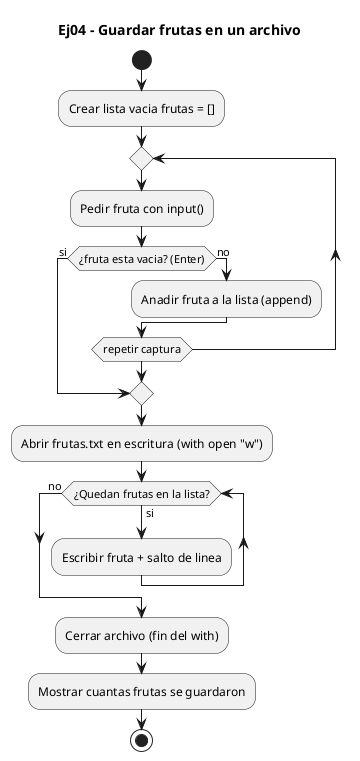
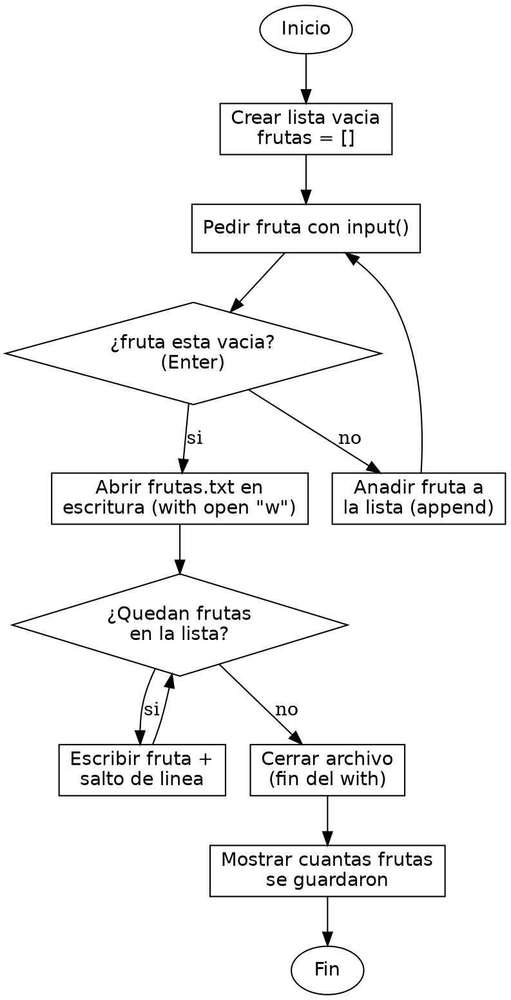

<!-- FICHERO GENERADO — NO EDITAR. Fuente de verdad: curso-python/practica/08-clases-archivos/ej04.md (se regenera con gen_course.py). -->

# Ejercicio 04 — Pide frutas al usuario (línea vacía para terminar) y guárdalas en…

Dificultad: amarillo · Módulo 08 (Clases y archivos)

## Enunciado

Pide frutas al usuario (línea vacía para terminar) y guárdalas en frutas.txt.

## Diagramas de flujo





## Cómo se resuelve

<!-- EXPLICACION -->
Recoger datos hasta una señal de fin y volcarlos a un archivo combina un bucle abierto con la escritura de ficheros.

1. `frutas = []` prepara una lista vacía donde ir acumulando lo que teclea el usuario antes de guardarlo.
2. `while True:` es un bucle infinito a propósito: no sabemos cuántas frutas va a introducir. La condición de salida está dentro: `if fruta == "": break` corta el bucle cuando el usuario pulsa Enter sin escribir nada, porque `input()` devuelve una cadena vacía `""` en ese caso.
3. `frutas.append(fruta)` añade cada fruta válida al final de la lista. Solo se llega aquí si la línea no estaba vacía, gracias al `break` anterior.
4. `with open("frutas.txt", "w") as f:` abre el archivo en modo `"w"` (write): lo crea si no existe y, ojo, borra su contenido previo si ya existía. Dentro, `for fruta in frutas: f.write(fruta + "\n")` escribe cada fruta en su propia línea. El `"\n"` es el salto de línea manual: `write()` no lo añade solo, a diferencia de `print()`.
5. Al salir del bloque `with`, el archivo se cierra automáticamente y los datos quedan guardados en disco.

Trampa habitual: usar el modo `"w"` cuando querías añadir a lo ya existente. `"w"` machaca el archivo entero; si quieres conservar lo anterior y sumar al final, el modo es `"a"` (append).

## Para practicar — cópialo y complétalo

Pega este esqueleto y completa los `TODO`. Es la mejor forma de aprender: inténtalo antes de mirar la solución.

```python
# Curso de Python — Modulo 08: Clases, dataclasses y archivos
# Ejercicio 04 — PRACTICA (rellena los TODO)
# Enunciado: Pide frutas al usuario (línea vacía para terminar) y guárdalas en frutas.txt.
# Dificultad: amarillo
# Ejecutar: python3 ej04_practica.py

# TODO: crea una lista vacia para guardar las frutas

# TODO: escribe un bucle while True que:
#   - pida una fruta con input("Fruta (Enter para terminar): ")
#   - si la entrada es una cadena vacia, salga del bucle con break
#   - si no, anada la fruta a la lista

# TODO: abre "frutas.txt" en modo escritura ("w") con open() y with
#   - escribe cada fruta en una linea (fruta + "\n")

# TODO: imprime cuantas frutas se guardaron y en que archivo
# Salida esperada (ejemplo con manzana y pera):
# Guardadas 2 frutas en frutas.txt.
```

## Solución — cópiala y ejecútala

```python
# Curso de Python — Modulo 08: Clases, dataclasses y archivos
# Ejercicio 04 — MODELO (resuelto)
# Enunciado: Pide frutas al usuario (línea vacía para terminar) y guárdalas en frutas.txt.
# Dificultad: amarillo
# Ejecutar: python3 ej04_modelo.py

frutas = []

# Bucle de captura: termina cuando el usuario pulsa Enter sin escribir nada
while True:
    fruta = input("Fruta (Enter para terminar): ")
    if fruta == "":
        break
    frutas.append(fruta)

# Escribe cada fruta en una linea del archivo
with open("frutas.txt", "w") as f:
    for fruta in frutas:
        f.write(fruta + "\n")

print(f"Guardadas {len(frutas)} frutas en frutas.txt.")
```

## Ejecútalo en el navegador

[▶ Visualízalo paso a paso en Python Tutor](https://pythontutor.com/visualize.html#code=%23+Curso+de+Python+%E2%80%94+Modulo+08%3A+Clases%2C+dataclasses+y+archivos%0A%23+Ejercicio+04+%E2%80%94+MODELO+%28resuelto%29%0A%23+Enunciado%3A+Pide+frutas+al+usuario+%28l%C3%ADnea+vac%C3%ADa+para+terminar%29+y+gu%C3%A1rdalas+en+frutas.txt.%0A%23+Dificultad%3A+amarillo%0A%23+Ejecutar%3A+python3+ej04_modelo.py%0A%0Afrutas+%3D+%5B%5D%0A%0A%23+Bucle+de+captura%3A+termina+cuando+el+usuario+pulsa+Enter+sin+escribir+nada%0Awhile+True%3A%0A++++fruta+%3D+input%28%22Fruta+%28Enter+para+terminar%29%3A+%22%29%0A++++if+fruta+%3D%3D+%22%22%3A%0A++++++++break%0A++++frutas.append%28fruta%29%0A%0A%23+Escribe+cada+fruta+en+una+linea+del+archivo%0Awith+open%28%22frutas.txt%22%2C+%22w%22%29+as+f%3A%0A++++for+fruta+in+frutas%3A%0A++++++++f.write%28fruta+%2B+%22%5Cn%22%29%0A%0Aprint%28f%22Guardadas+%7Blen%28frutas%29%7D+frutas+en+frutas.txt.%22%29%0A&cumulative=false&curInstr=0&py=3&rawInputLstJSON=%5B%5D) — ve cómo cambian las variables línea a línea.

## Cómo usarlo

Pega el código en un fichero y ejecútalo con tu toolchain habitual (o el botón de Ejecutar de tu editor). Antes de mirar la solución, intenta completar tú el esqueleto: es la mejor forma de aprender.

## Conexiones

- [[Curso_Python/modelo/08-clases-archivos|Teoría del módulo]]
- [[Curso_Python/practica/00_README|Índice del curso]]
